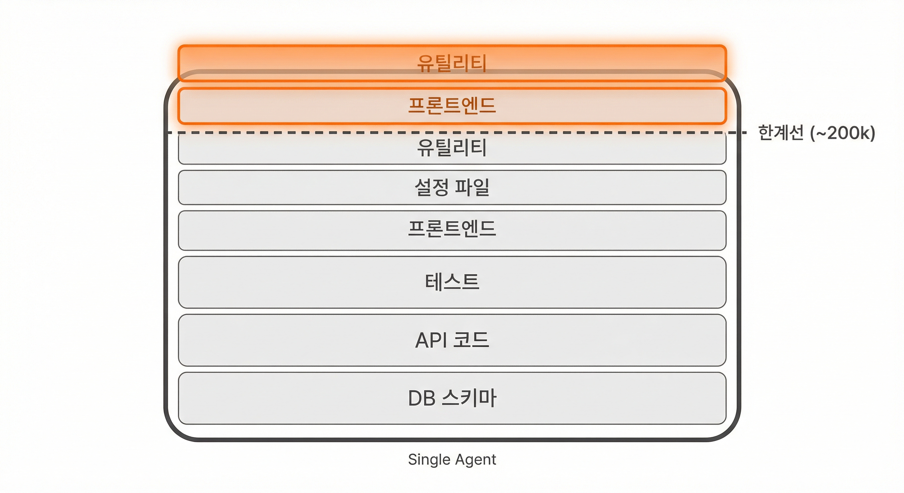
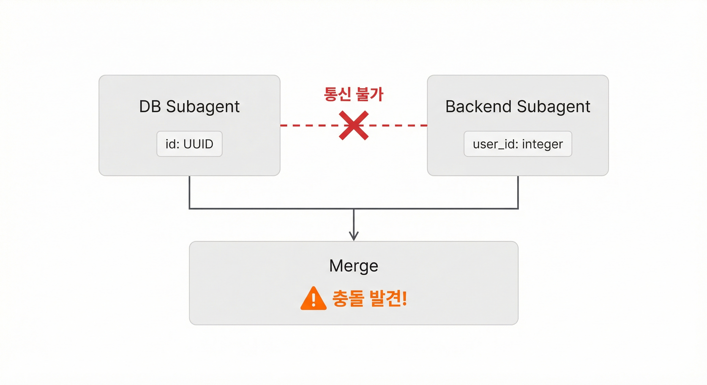
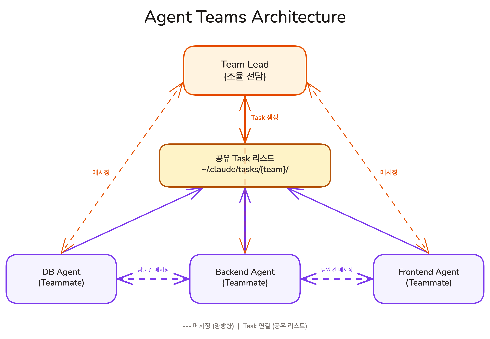
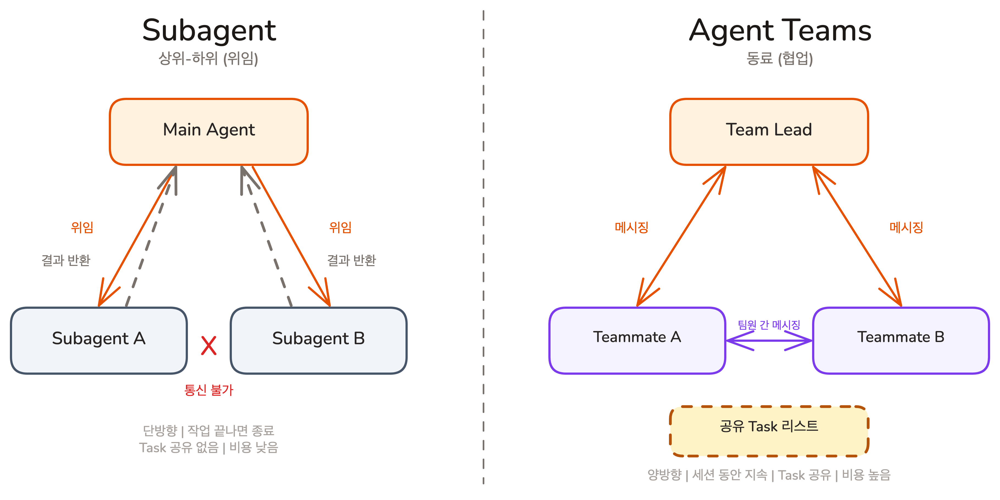

## Overview

Chapter 09에서 SDD 사이클을 완주했습니다. 하지만 Claude 하나가 DB 설계, API 구현, 프론트엔드 연결을 동시에 처리하면 Context가 채워지면서 품질이 떨어집니다. Subagent로 나눠도 조율 수단이 없으면 인터페이스 충돌을 끝날 때까지 발견할 수 없습니다. 이번 레슨에서는 Single Agent의 구조적 한계를 정의하고, 그 한계를 넘는 Agent Teams의 두 핵심 요소인 공유 Task 리스트와 메시징을 살펴봅니다.

### 학습 목표

- Single Agent의 한계와 Agent Teams가 필요한 상황을 설명할 수 있습니다
- Agent Teams의 두 가지 핵심 요소(공유 Task 리스트, 메시징)를 설명할 수 있습니다
- Subagent와 Agent Teams의 차이를 이해하고, 적합한 상황을 판단할 수 있습니다

## Single Agent는 어디까지 할 수 있는가

지금까지 배운 모든 것은 **Claude 하나**와 효과적으로 협업하는 방법이었습니다.

하나의 Claude는 놀라울 만큼 많은 일을 합니다. 하지만 프로젝트가 커지면, 구조적으로 넘을 수 없는 두 가지 벽에 부딪힙니다.

### 벽 1: Context Window의 천장

Context Window는 AI가 한 번에 볼 수 있는 범위입니다. 한 Agent가 DB 스키마 설계, API 구현, 프론트엔드 연결을 모두 처리하려면 관련 파일을 전부 읽어야 합니다. 작업이 진행될수록 Context가 쌓이고, 200k~300k 토큰에 도달하면 품질이 급격히 떨어집니다.

Task Sizing으로 대화를 끊고 새 세션을 시작하면 Context는 깨끗해지지만, 매번 프로젝트를 다시 파악하는 시간이 필요합니다. 작업의 복잡도가 일정 수준을 넘으면, 한 Agent가 아무리 세션을 나눠도 감당하기 어렵습니다.



### 벽 2: 병렬은 되지만, 조율은 안 된다

Subagent로 독립적인 작업을 병렬 처리할 수 있습니다. 100개 파일 리팩토링을 10개 Subagent에 나눠주면 속도는 10배 빨라집니다.

하지만 작업이 서로 독립적이지 않으면 문제가 생깁니다.

> DB Subagent가 users 테이블의 id를 UUID로 설계했습니다. 동시에 Backend Subagent는 user_id를 integer로 가정하고 API를 구현하고 있습니다. 두 Subagent는 서로의 존재를 모릅니다. 작업이 끝나고 결과를 합쳐야 충돌을 발견합니다.

Subagent는 결과만 반환하고 종료됩니다. 작업 도중에 "user_id 타입이 뭐야?"라고 옆 Subagent에게 물어볼 수 없습니다. 독립적인 작업(코드 리뷰, 탐색, 분석)에는 Subagent가 효과적이지만, **구현 도중에 인터페이스를 맞춰야 하는 작업**에는 조율 수단이 필요합니다.



## Agent Teams란: 공유 Task 리스트 + 메시징

**Agent Teams**는 여러 Claude Code 인스턴스가 하나의 팀으로 협업하는 기능입니다. 핵심은 두 가지입니다.

### 공유 Task 리스트

Single Agent의 Task 시스템이 기반입니다. 차이는, Task 리스트를 **여러 Agent가 함께 본다**는 것입니다.

팀이 생성되면 `~/.claude/tasks/{team-name}/` 디렉토리에 Task 파일이 저장됩니다. 팀의 모든 Agent가 이 디렉토리를 공유합니다. Agent A가 Task 1을 완료로 표시하면, Agent B는 즉시 그 변경을 확인하고, blockedBy가 해소된 다음 Task를 시작합니다.

한 Agent가 혼자 쓰던 Task 시스템이, 여러 Agent의 **조율 레이어**가 됩니다.

### 메시징

Task 리스트만으로는 부족한 경우가 있습니다.

벽 2의 UUID/integer 충돌처럼, Task 상태만 봐서는 인터페이스 불일치를 잡을 수 없습니다. **메시징**은 Agent 간에 직접 메시지를 주고받는 기능입니다. DB Agent가 스키마를 확정하면 Backend Agent에게 "user_id는 UUID입니다. 타입 수정해주세요"라고 직접 알립니다.

- **Direct Message**: 특정 Agent에게 메시지를 보냅니다
- **Broadcast**: 팀 전체에 메시지를 보냅니다. "API 응답 형식이 변경되었습니다."

메시지는 `~/.claude/teams/{team-name}/inbox/` 에 저장되고, 수신 Agent의 대화에 자동으로 전달됩니다. Agent가 작업 중이면 현재 턴이 끝난 후 전달됩니다.

### 팀의 구조: 리더와 팀원

공유 Task 리스트와 메시징이 실제로 어떤 구조에서 작동하는지 봅니다.



Agent Teams는 **팀 리더(Team Lead)**와 **팀원(Teammate)**으로 구성됩니다.

- **팀 리더**: 팀을 생성하고, Task를 만들고, 팀원에게 할당합니다. 직접 구현하지 않고 조율에 집중합니다
- **팀원**: 할당된 Task를 수행합니다. 다른 팀원에게 메시지를 보낼 수 있고, 작업이 끝나면 리더에게 보고합니다

팀 리더가 여러분의 메인 Claude Code 세션이고, 팀원은 별도의 Claude Code 인스턴스로 실행됩니다. tmux나 iTerm2의 분할 화면으로 각 Agent의 작업을 실시간으로 볼 수 있습니다.

<Callout type="info" title="팀은 세션 단위">
Agent Teams는 현재 세션 동안만 유지됩니다. 세션을 종료하면 팀원도 함께 종료됩니다. Task 파일은 남아 있으므로, 다음 세션에서 새 팀을 구성하고 이전 Task를 이어서 처리할 수 있습니다.
</Callout>

### 실제로 어떻게 만드나: Quick Demo

Agent Teams를 사용하려면 환경 변수 하나만 설정하면 됩니다.

```bash
export CLAUDE_AGENT_TEAMS=1
```

또는 `.claude/settings.json`에 환경 변수를 추가하는 방법도 있습니다.

```json
{
  "env": {
    "CLAUDE_CODE_EXPERIMENTAL_AGENT_TEAMS": "1"
  }
}
```

설정 후, Claude Code 세션에서 자연어로 팀을 만들 수 있습니다. 두 Agent가 각각 다른 접근법으로 리팩토링하고, 서로 토론한 뒤 리더가 최종 선택하는 상황을 예시로 봅니다.

```
> 상태관리 개선을 위한 에이전트 팀을 구성해줘.

팀원:
- zustand-agent: Zustand로 마이그레이션
- context-agent: React Context + useReducer 패턴으로 변환

각 팀원은 반드시 별도 worktree에서 독립적으로 구현하고,
서로간의 영향이 없도록 환경을 구성해.
구현이 끝나면 팀원끼리 서로 메시지를 주고받으며 장단점을 토론해줘.
테스트가 통과하는 구현만 유효한 것으로 판단하고,
리드가 최종 선택해줘.
```

Claude가 팀 리더 역할을 맡아 Task를 생성하고, 팀원 2명을 각각 별도 worktree에 spawn합니다. 두 Agent는 격리된 환경에서 동시에 구현하고, 완료 후 메시징으로 장단점을 토론합니다. 리더는 테스트 통과 여부와 토론 내용을 종합해 최종 접근법을 선택합니다.

### 다른 활용 방식

Agent Teams는 리팩토링 외에도 다양하게 활용할 수 있습니다.

**Devil's Advocate 추가**

위 상태관리 예시를 발전시켜 봅니다. 두 Agent가 구현하고 토론하는 구조에서, **Devil's Advocate(악마의 변호인)** 역할을 추가합니다. Devil's Advocate는 직접 구현하지 않고, 다른 팀원의 설계를 의도적으로 비판하는 역할입니다. "이 접근법이 정말 최선인가?"를 끊임없이 질문해서, 구현자가 스스로 발견하기 어려운 약점을 드러냅니다.

```
> 상태관리 개선을 위한 에이전트 팀을 구성해줘.

  팀원:
    - zustand-agent: Zustand로 마이그레이션
    - context-agent: React Context + useReducer 패턴으로 변환
    - devils-advocate: 두 구현의 설계를 비판. 엣지 케이스, 성능 병목,
      팀 컨벤션과의 충돌을 지적. 직접 구현하지 않음.

  각 팀원은 별도 worktree에서 독립적으로 구현하고,
  구현이 끝나면 devils-advocate가 양쪽 구현을 검토해서
  약점을 지적해줘.
  각 팀원은 반론을 반영해 수정한 뒤, 리드가 최종 선택해줘.
```

구현자는 자기 접근법의 장점에 집중하기 쉽습니다. Devil's Advocate가 있으면 "왜 Zustand인가? Context로도 충분하지 않나?"처럼 전제 자체를 흔드는 질문이 나옵니다. 코드가 작성된 후가 아니라, **설계 단계에서 약점을 잡는 것**이 핵심입니다.

<Callout type="info" title="Claude 공식 문서의 Devil's Advocate">
Anthropic의 [Agent Teams 문서](https://code.claude.com/docs/en/agent-teams)에서도 Devil's Advocate를 팀 구성 패턴으로 소개합니다. UX, 기술 아키텍처, Devil's Advocate 세 역할로 팀을 구성해 설계의 위험 요소를 사전에 발견하는 예시를 다룹니다.
</Callout>

**병렬 기능 구현**

```
> Todo 앱에 두 기능을 병렬로 추가하는 에이전트 팀을 구성해줘.

  팀원:
    - deadline-agent: 마감일(due date) 기능 추가. 입력 UI와 목록 표시 모두 구현.
    - priority-agent: 우선순위(high/medium/low) 기능 추가. 입력 UI와 배지 표시 구현.
    - test-agent: 위 두 팀원이 완료되면 추가된 기능에 대한 테스트 작성 및 실행.

  팀메이트는 Sonnet 모델을 사용해줘.
```

**다각도 코드 리뷰**

```
> Todo 앱을 다각도로 리뷰하는 에이전트 팀을 구성해줘.

  팀원:
    - security-reviewer: 인증 로직과 사용자 입력 처리에서 보안 취약점 확인.
    - perf-reviewer: 불필요한 리렌더링, 메모이제이션 누락, 상태관리 비효율 분석.
    - a11y-reviewer: ARIA 속성, 키보드 내비게이션, 스크린리더 지원 확인.

  각 리뷰어가 이슈를 리포트하고, 리드가 종합해서 우선순위를 매겨줘.
```

## Subagent vs Agent Teams: 언제 무엇을 쓰는가

Subagent와 Agent Teams는 모두 "여러 AI를 쓰는 것"이지만, 근본적으로 다른 구조입니다.



| 기준 | Subagent | Agent Teams |
|------|----------|-------------|
| **관계** | 상위-하위 (위임) | 동료 (협업) |
| **통신** | 결과만 반환 (단방향) | 메시지 주고받기 (양방향) |
| **수명** | 작업 끝나면 종료 | 세션 동안 지속 |
| **Context** | 별도 (격리) | 별도 (독립) |
| **Task 공유** | 없음 | 공유 Task 리스트 |
| **팀원 간 소통** | 불가 | 가능 |
| **비용** | 낮음 (단일 작업) | 높음 (Agent당 독립 Context) |

핵심 판단 기준은 하나입니다.

> **"팀원끼리 대화해야 하는가?"**

"아니요"라면 Subagent로 충분합니다. 코드 리뷰, 코드베이스 탐색, 테스트 결과 분석처럼 결과만 받으면 되는 작업입니다.

"예"라면 Agent Teams가 필요합니다. DB 스키마가 바뀌면 Backend Agent에게 즉시 알려야 하고, API 응답 형식이 정해지면 Frontend Agent가 그에 맞춰 구현해야 합니다. **구현 도중에 인터페이스를 조율해야 하는 작업**입니다.

### Subagent가 맞는 경우

- 코드 리뷰: 변경 사항을 읽고 피드백 반환
- 코드베이스 탐색: 특정 패턴이나 의존성 조사
- 독립적인 분석: 테스트 결과, 로그, 성능 분석
- 단발성 코드 생성: 유틸 함수, 설정 파일

### Agent Teams가 맞는 경우

- **크로스 레이어 구현**: DB + Backend + Frontend를 동시에 개발할 때. 한 레이어의 변경이 다른 레이어에 즉시 영향
- **대규모 리팩토링**: 100개 이상의 파일을 일관된 패턴으로 수정할 때. 각 Agent가 파일 묶음을 나눠서 처리
- **경쟁 가설 디버깅**: 원인을 모르는 버그를 여러 Agent가 서로 다른 가설로 동시에 조사. 한 Agent의 발견이 다른 Agent의 가설을 검증하거나 반증
- **조사 + 구현 병렬화**: 한 Agent가 기술 조사를 하는 동안, 다른 Agent가 확정된 부분부터 구현 시작

<Callout type="info" title="비용 고려">
Agent Teams는 Single Agent 대비 2~4배 더 많은 토큰을 소비합니다. 각 Agent가 독립적인 Context Window를 갖기 때문입니다. "혼자서도 충분한 작업"에 Teams를 쓰면 비용만 늘어납니다. Teams는 Single Agent로는 구조적으로 어려운 작업에 사용합니다.
</Callout>

## 핵심 포인트 정리

1. **Single Agent의 두 가지 벽**: Context Window 천장(~200-300k 토큰)과 조율 없는 병렬(통신 없이 독립 실행)이 프로젝트 규모가 커질수록 명확해집니다
2. **Agent Teams의 두 축이 두 벽을 넘는다**: 공유 Task 리스트가 Context를 분산하고(벽 1), 메시징이 구현 도중 조율을 가능하게 합니다(벽 2)
3. **Subagent vs Teams 판단 기준**: "팀원끼리 대화해야 하는가?"가 핵심입니다. 결과만 받으면 되면 Subagent, 구현 도중에 인터페이스를 조율해야 하면 Agent Teams입니다

## FAQ

- **Q: Agent Teams를 사용하면 Task 시스템이 달라지나요?**
  - A: Task 시스템 자체는 동일합니다. 차이는 여러 Agent가 같은 Task 디렉토리를 공유한다는 것입니다

- **Q: 팀원끼리 충돌하면 어떻게 되나요? 같은 파일을 동시에 수정하면?**
  - A: Git이 보호합니다. 두 Agent가 같은 파일을 수정하면 merge conflict가 발생합니다. 이를 방지하려면 Task 분해 단계에서 파일 경계를 명확히 나누거나, 이전 레슨에서 배운 worktree로 각 Agent를 격리합니다

- **Q: 왜 Subagent에 메시징을 추가하지 않고, 별도의 Agent Teams를 만들었나요?**
  - A: Subagent는 작업이 끝나면 종료되어 메시지를 받을 주체가 사라집니다. 지속적인 소통에는 세션 동안 살아 있는 Agent가 필요합니다

- **Q: Agent Teams에 몇 명까지 넣을 수 있나요?**
  - A: 기술적인 제한은 없지만, 실용적으로는 2~4명이 적합합니다. Agent 수가 늘어나면 조율 비용이 비례해서 증가합니다. 리더가 각 팀원의 상태를 파악하고 메시지를 중계하는 데 더 많은 Context를 소비하게 됩니다. 연구 수준에서는 16개 Agent를 동시에 운용한 사례도 있지만, 일반적인 개발 작업에서는 3~4명 이내가 효율적입니다

## 다음 단계

Agent Teams의 구조와 Subagent와의 차이를 이해했습니다. 다음 챕터에서는 지금까지 배운 모든 도구를 결합해 개인 프로젝트를 기획하고 구현합니다.

다음 레슨 보기: [개인 프로젝트 실습](../personal-project/personal-project)
