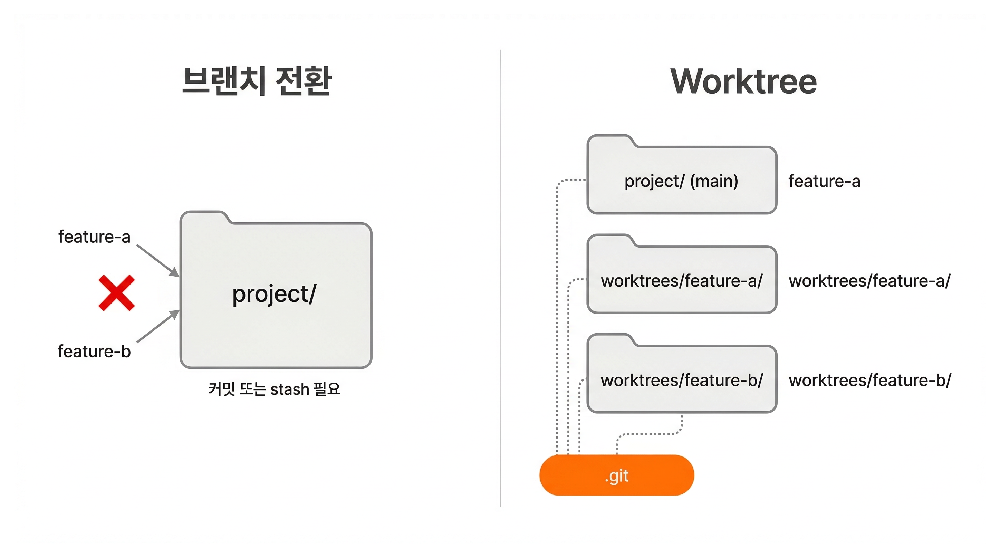
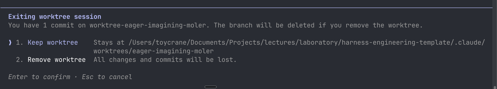

# 병렬 작업을 안전하게 격리하기 | Git Worktree

## Overview

여러 Claude를 동시에 쓰면 같은 디렉토리에서 같은 파일을 수정할 때 충돌이 발생합니다. 이번 레슨에서는 각 Agent에게 **독립된 작업 디렉토리**를 주는 격리 방식을 배웁니다. git worktree의 기본 원리를 이해하고, `claude -w`로 생명주기를 자동화하며, PR 기반 병합까지의 전체 워크플로우를 확인합니다.

### 학습 목표

- git worktree가 무엇인지, 일반 브랜치 전환과 어떻게 다른지 설명할 수 있습니다
- `claude -w`로 격리된 에이전트 세션을 생성하고, PR 기반 병합까지 수행할 수 있습니다

### 시작하기 전 확인사항

- Git 기본 명령어 (commit, branch, push) 사용 가능
- Claude Code 설치 및 인증 완료
- VS Code 설치 (Source Control 패널 확인용)
- GitHub CLI (`gh`) 설치 및 인증 완료
- Git 클린 상태 (`git status` -> 커밋되지 않은 변경사항 없음)

실습 프로젝트의 시작 브랜치로 전환합니다.

```shell
git checkout ch10-02
```

`ch10-02` 브랜치는 이 레슨의 시작점입니다.

## git worktree: 하나의 저장소, 여러 작업 공간

### Step 1: 브랜치 전환의 한계 체험

feature-a 브랜치를 만들고 파일을 수정합니다.

> ```bash
> git checkout -b feature-a
> ```

`src/components/todo-item.tsx`를 열고 아무 줄이나 수정합니다. 커밋하지 않은 채로 둡니다.

급하게 다른 기능을 작업해야 하는 상황을 가정합니다. main 브랜치로 돌아가봅니다.

> ```bash
> git checkout main
> ```

Git이 전환을 거부합니다.

```
error: Your local changes to the following files would be overwritten by checkout:
        src/components/todo-item.tsx
Please commit your changes or stash them before you switch branches.
```

미완성 코드를 억지로 커밋하거나 stash에 넣어야 합니다. Agent 두 개가 각각 다른 기능을 작업하려면, 한쪽이 끝날 때까지 다른 쪽은 대기해야 합니다.

### Step 2: Worktree로 같은 시나리오 해결



**git worktree**는 하나의 저장소에서 여러 브랜치를 **별도의 디렉토리에 동시에 체크아웃**하는 Git 기능입니다. 각 디렉토리는 독립적인 파일 상태를 가지면서, `.git` 저장소 히스토리는 공유합니다.

Step 1의 변경을 되돌리고 worktree로 다시 시도합니다.

> ```bash
> git checkout -- .
> git checkout main
> git branch -D feature-a
> ```

feature-a와 feature-b를 각각 별도의 worktree로 생성합니다.

> ```bash
> git worktree add worktrees/feature-a -b feature-a
> git worktree add worktrees/feature-b -b feature-b
> ```

`-b`는 새 브랜치를 생성하는 옵션입니다. 이미 존재하는 브랜치를 체크아웃하려면 `-b` 없이 `git worktree add <경로> <브랜치>`로 실행합니다.

`worktrees/feature-a/`를 VS Code에서 열고 파일을 수정합니다. 원래 디렉토리의 Source Control 패널(Cmd+Shift+G)과 `worktrees/feature-b/`에는 변경사항이 보이지 않습니다. **에러도 stash도 없이**, 두 기능을 동시에 작업할 수 있습니다.

### Step 3: Worktree 정리

사용이 끝난 worktree를 목록에서 확인하고 제거합니다.

> ```bash
> git worktree list
> git worktree remove worktrees/feature-a
> git worktree remove worktrees/feature-b
> ```

worktree를 수동으로 만들고, 작업하고, 정리하는 과정을 확인했습니다. 매번 이 과정을 반복하는 것은 번거롭습니다. `claude -w`는 이 전체 생명주기를 자동화합니다.

## claude -w: 격리된 에이전트 세션

`claude -w`를 실행하면 세 가지가 자동으로 일어납니다. `.claude/worktrees/` 아래에 worktree가 생성되고, 그 디렉토리에서 Claude 세션이 시작되고, 세션 종료 시 변경 유무에 따라 자동 정리되거나 Keep/Remove를 선택합니다.

### Step 4: claude -w 실행

격리된 Claude 세션을 시작합니다. `-w`는 `--worktree`의 축약형입니다.

> ```bash
> claude -w deadline
> #         ────────
> #         worktree 이름
> ```

이름을 지정하면 **경로와 브랜치가 예측 가능**합니다. `.claude/worktrees/deadline/` 디렉토리가 생성되고, `worktree-deadline` 브랜치에서 작업이 시작됩니다.

이름을 생략하면(`claude -w`) Claude가 자동으로 이름을 생성합니다.

### Step 5: 작업 수행 및 push

Claude에게 기능을 구현하고 push하도록 지시합니다.

> "Todo 목록에 마감일 표시 기능을 추가해줘. 기한이 지난 항목은 빨간색으로 표시. 작업이 끝나면 커밋하고 push해줘."

> [!NOTE] push 시 브랜치 이름에 주의
> worktree의 브랜치는 기본적으로 `origin/main`을 추적합니다. 브랜치 이름을 명시하지 않고 `git push`를 실행하면 main에 직접 push될 수 있습니다. main 브랜치가 보호되어 있으면 push가 거부되지만, 보호되지 않은 저장소에서는 의도치 않은 커밋이 main에 들어갑니다. Claude에게 "브랜치 이름을 명시해서 push해줘"라고 지시하거나, 저장소의 main 브랜치 보호 설정을 확인합니다.

### Step 6: PR 생성 및 병합

push가 완료되면 Claude에게 PR 생성을 요청합니다.

> "PR 만들어줘"

Claude가 `gh pr create`를 실행하여 PR을 생성합니다. GitHub에서 PR을 리뷰한 후 Merge합니다.

### 세션 종료 시 정리 동작

Claude 세션을 종료하면(Ctrl+C), worktree의 상태에 따라 동작이 달라집니다.

**변경 없이 종료한 경우**, Claude가 worktree와 브랜치를 자동으로 삭제합니다. 프롬프트 없이 깨끗하게 정리됩니다.

**커밋이나 변경이 있는 경우**, Keep/Remove 선택 프롬프트가 표시됩니다.



- **Keep worktree**: `.claude/worktrees/<name>/`에 디렉토리와 브랜치가 유지됩니다
- **Remove worktree**: 모든 변경과 커밋이 삭제됩니다

push나 PR을 완료한 작업은 Remove를 선택해도 원격 저장소에 이미 반영되어 있으므로 안전합니다.

### 중단된 작업 이어하기

세션 종료 시 Keep을 선택했다면, 나중에 같은 worktree에서 작업을 이어갈 수 있습니다.

> ```bash
> claude -w deadline --resume
> #                  ────────
> #                  이전 세션 목록에서 선택
> ```

`--resume` 대신 `--continue`를 사용하면 가장 최근 세션을 바로 이어서 시작합니다.

## 핵심 포인트 정리

1. **git worktree는 같은 저장소에서 여러 브랜치를 동시에 체크아웃하는 Git 기능입니다**: 각 worktree는 독립적인 파일 상태를 가지며, 한 worktree의 변경이 다른 worktree에 영향을 주지 않습니다
2. **`claude -w <name>`은 worktree의 전체 생명주기를 자동화합니다**: 이름을 지정하면 경로와 브랜치가 예측 가능하고, 세션 종료 시 변경 유무에 따라 자동 정리 또는 Keep/Remove를 선택합니다. Keep한 worktree는 `claude -w <name> --resume`으로 이어서 작업할 수 있습니다

## FAQ

- **Q: git worktree를 만들면 디스크 공간이 두 배가 되나요?**
  - A: `.git` 디렉토리(저장소 히스토리)는 공유합니다. 파일 복사본만 추가되므로 node_modules를 제외하면 수십 MB 수준입니다. 다만 worktree마다 `bun install`이 필요하므로 node_modules 크기가 누적될 수 있습니다. 사용이 끝난 worktree는 `git worktree remove`로 즉시 정리합니다

- **Q: `claude -w`와 Agent Teams를 동시에 쓸 수 있나요?**
  - A: 가능합니다. Agent Teams의 팀원이 각각 worktree에서 작업하는 패턴입니다. 다음 레슨에서 자세히 다룹니다

- **Q: worktree에서 push 없이 세션을 종료하면 어떻게 되나요?**
  - A: 커밋이나 변경이 있으면 Keep/Remove 프롬프트가 표시됩니다. Keep을 선택하면 `claude -w <name> --resume`으로 이어서 작업할 수 있습니다. Remove를 선택하면 모든 변경이 사라집니다. 중요한 작업은 반드시 push하거나 PR을 만든 후 종료합니다

## 다음 단계

각 Agent에게 독립된 작업 공간을 주는 방법을 배웠습니다. 하지만 worktree만으로는 Agent끼리 진행 상황을 공유하거나 인터페이스를 맞출 수 없습니다. 다음 레슨에서는 여러 Agent가 공유 Task 리스트와 메시징으로 협업하는 Agent Teams를 배웁니다.

다음 레슨 보기: [혼자 vs 같이](./agent-teams-basics)
