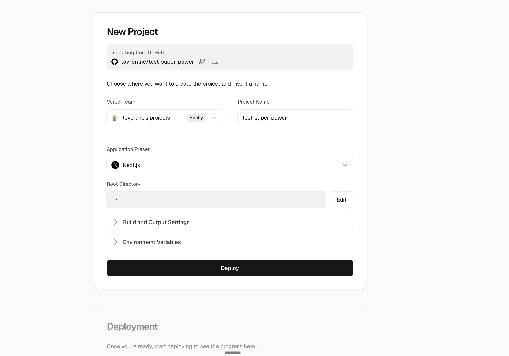
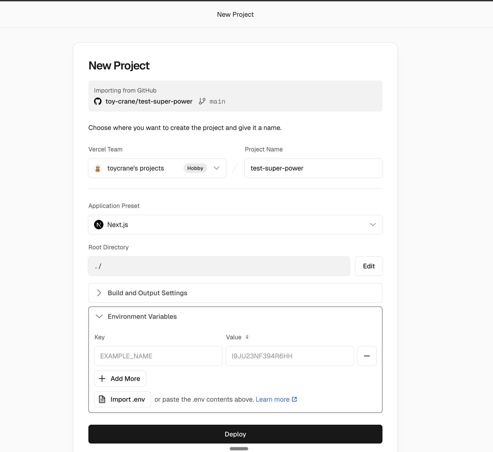

## Overview

Chapter 09에서 칸반 보드로 SDD 전체 사이클을 경험했습니다. Chapter 10에서 Agent Teams와 Worktree를 배웠습니다. 이제는 **본인이 만들고 싶은 프로젝트**에 같은 워크플로우를 적용합니다.

어떤 프로젝트를 선택하고, 3시간 안에 닫을 수 있는 크기인지 판단하는 것이 이번 실습의 핵심입니다.

### 학습 목표

- /make-something 스킬로 프로젝트 아이디어를 구체화할 수 있습니다
- SDD 사이클을 처음부터 끝까지 독립적으로 완주합니다
- Part 3에서 배운 도구의 역할을 정리합니다

## /make-something으로 아이디어 찾기

아이디어가 바로 떠오르지 않아도 됩니다. Claude Code에서 `/make-something`을 실행하면, **소크라테스식 질문으로 관심사를 탐색하고 적절한 프로젝트를 제안합니다.**

> `/make-something`

AI가 평소 불편한 점, 관심 있는 분야, 기술적 호기심을 질문합니다. 대화를 통해 프로젝트 아이디어가 구체화되면, 무료 도구를 매핑하고 `idea.md`를 생성합니다.

만들 수 있는 프로젝트 예시:

- 습관 트래커: 매일 체크하는 습관 목록 + 연속 달성 표시
- 날씨 대시보드: Open-Meteo API + 위치별 날씨 카드
- 북마크 관리자: URL 저장 + 태그 분류 + 검색
- 식단 기록기: 날짜별 식사 기록 + 칼로리 요약

## 적절한 크기

**"멋진 프로젝트를 만드는 것"보다 "SDD 사이클을 완주하는 것"이 이 실습의 목적입니다.**

- 페이지 2-3개
- 핵심 기능 1-2개
- 시나리오 5-7개

<Callout type="info" title="프로젝트 크기 조절이 가장 중요합니다">
3시간 안에 Spec부터 배포까지 한 사이클을 닫을 수 있는 크기를 선택하세요.
</Callout>

## 실습 워크플로우

Chapter 09에서 칸반 보드로 경험한 것과 같은 SDD 사이클을 따릅니다.

1. **Spec**: `/writing-spec`으로 요구사항 정의
2. **Wireframe**: `/sketching-wireframe`으로 화면 구조 정의
3. **Plan**: `/writing-plan`으로 구현 계획 수립
4. **Implementation**: Task 순서대로 구현
5. **Verification**: Spec Test 통과 + 브라우저 확인
6. **Deploy**: Vercel에 배포

## 실습 규칙

1. **SDD 사이클을 따릅니다**: Spec → Wireframe → Plan → Task → Implementation → Verification. 단계를 건너뛰지 않습니다
2. **작업 단위를 작게 유지합니다**: Task 하나가 끝나면 커밋하고 새 대화를 시작합니다
3. **막히면 이전 단계로 돌아갑니다**: 코드를 고치기 전에 문서를 고치는 것이 더 저렴합니다
4. **새 도구는 하나씩 추가합니다**: Supabase를 연동하고 동작을 확인한 후에 Vercel 배포를 시도합니다. 동시에 여러 도구를 추가하면 문제가 생겼을 때 원인을 찾기 어렵습니다

## 배포 시 환경 변수 설정

프로젝트에 외부 API 키(Supabase URL 등)가 있다면 환경 변수 설정이 필요합니다.

**로컬**: Next.js는 프로젝트 루트의 `.env.local` 파일에서 환경 변수를 읽습니다. `NEXT_PUBLIC_` 접두사가 붙은 변수만 브라우저에서 접근할 수 있습니다. **API 키처럼 노출되면 안 되는 값에는 이 접두사를 붙이지 않습니다.**

**Vercel**: Import 화면의 **Environment Variables** 섹션에서 Key/Value를 등록합니다.

`.env.local` 파일이 있다면 **Import .env** 버튼으로 한 번에 등록할 수 있습니다.

<Callout type="info" title="로컬과 Vercel 양쪽에 등록해야 합니다">
`.env.local`에 있는 값을 Vercel에도 동일하게 등록해야 프로덕션에서 동작합니다.
</Callout>

## FAQ

- **Q: Agent Teams를 이 실습에서 꼭 사용해야 하나요?**
  - A: 아닙니다. Agent Teams는 6개 이상의 독립적인 Task가 있을 때 효과적입니다. 3시간 실습에서 만드는 기능은 보통 4-5개 Task 규모이므로, 단일 Agent가 더 안전하고 빠릅니다

- **Q: shadcn preset은 나중에 바꿀 수 있나요?**
  - A: 가능합니다. `shadcn preset을 {다른-preset-id}로 바꿔줘`를 입력하면 색상과 스타일이 모든 컴포넌트에 반영됩니다

## 다음 단계

개인 프로젝트 실습이 끝나면 Part 3 전체를 정리합니다.

다음 레슨 보기: [Part 3 Wrap-up](./part-3-wrap-up)
