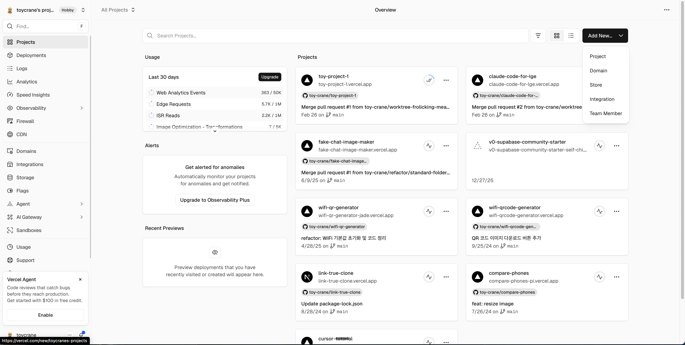
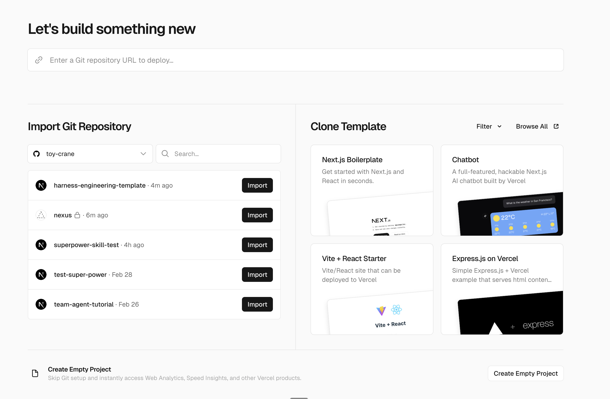
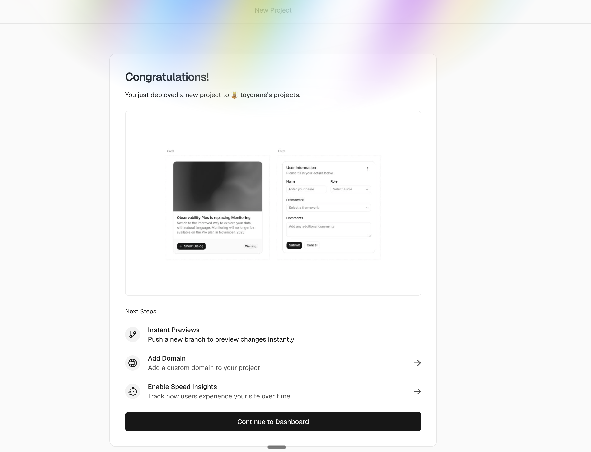

## Overview

Spec, Wireframe, Plan이 완성되었습니다. 이번 레슨에서는 Plan의 Task를 실행하여 칸반 보드를 구현하고, Spec Test로 최종 검증한 뒤, Vercel에 배포합니다.

### 학습 목표

- Task 순서대로 구현을 실행하고, Hook의 자동 검증 흐름을 이해합니다
- Spec Test 전부 통과를 기준으로 구현 완료를 판단할 수 있습니다
- Vercel에 프로젝트를 배포하고 자동 배포 동작을 이해합니다

## Implementation

Plan을 승인하면 AI가 Task 순서대로 구현을 시작합니다.

**Task 1에서 AI가 Spec의 성공 기준을 `*.spec.test.tsx` 파일로 변환합니다.** 이후 Task들에서는 CLAUDE.md의 TDD 순서에 따라 구현 테스트 작성, 최소 코드 구현, 리팩터링을 반복합니다.

파일이 수정될 때마다 `lint.sh` Hook이 ESLint를 실행하여 코드 스타일을 자동 수정합니다. AI가 작업을 마치려 할 때는 Stop Hook이 현재 TDD 단계의 완료 조건을 확인하여, 테스트가 통과하지 않으면 작업을 계속하도록 합니다.

AI가 구현 중에 Spec Test를 수정하려 하면, CLAUDE.md의 불변 계약 규칙이 이를 차단합니다. AI는 테스트 대신 구현 코드를 수정하여 테스트를 통과시킵니다.

## 최종 검증


모든 Task가 완료되면, 세 가지를 확인합니다.

**1. Spec Test 전부 통과**

```shell
bun test
```

`*.spec.test.tsx` 파일의 모든 테스트가 통과하면, Spec의 성공 기준이 코드로 충족된 것입니다.

**2. 브라우저에서 직접 확인**

드래그 앤 드롭의 반응, 컬럼 레이아웃, 카드 편집 같은 UI 동작은 테스트로 잡기 어렵습니다. 직접 브라우저에서 시나리오별로 실행합니다.

**3. Spec 성공 기준 대조**

Spec의 성공 기준 목록을 하나씩 대조하고, 체크되지 않은 항목이 있으면 추가 구현을 지시합니다. **Spec의 모든 성공 기준이 충족되면 SDD 사이클이 닫힌 것입니다.**

## 서비스 배포하기

로컬에서 동작하는 프로젝트를 누구나 접속할 수 있는 URL로 배포합니다. **Vercel**은 Next.js를 만든 회사의 배포 플랫폼으로, GitHub 저장소를 연결하면 자동으로 빌드하고 배포합니다.

### 시작하기 전 확인사항

- Vercel 계정이 필요합니다. https://vercel.com 에서 GitHub 계정으로 가입합니다
- 프로젝트가 GitHub 저장소에 push되어 있어야 합니다

### 프로젝트 Import

Vercel 대시보드에서 **Add New... > Project**를 클릭합니다.



GitHub 저장소 목록에서 프로젝트를 찾아 **Import**를 클릭합니다.



### 배포 실행

**Deploy** 버튼을 클릭합니다. Framework Preset이 **Next.js**로 자동 감지되므로 별도 설정은 필요 없습니다.

### 배포 확인

빌드가 완료되면 `.vercel.app` 도메인의 고유 URL이 생성됩니다. 이 URL로 접속하여 로컬과 동일하게 동작하는지 확인합니다.



### 자동 배포

GitHub에 push하면 Vercel이 자동으로 새 빌드를 만들고 배포합니다. PR을 만들면 **Preview URL**도 생성되므로, 병합 전에 배포 결과를 미리 확인할 수 있습니다.

### 배포 문제 해결

배포가 실패하면 Vercel 대시보드에서 빌드 로그를 확인합니다. 로컬에서 `bun run build`를 실행하면 같은 에러를 재현할 수 있습니다.

## 이어서 배울 내용

SDD 사이클을 처음부터 끝까지 실행하고, 완성된 프로젝트를 배포했습니다. 다음 챕터에서는 Claude 하나의 한계를 넘어, 여러 Agent가 동시에 협업하는 Agent Teams를 배웁니다.
