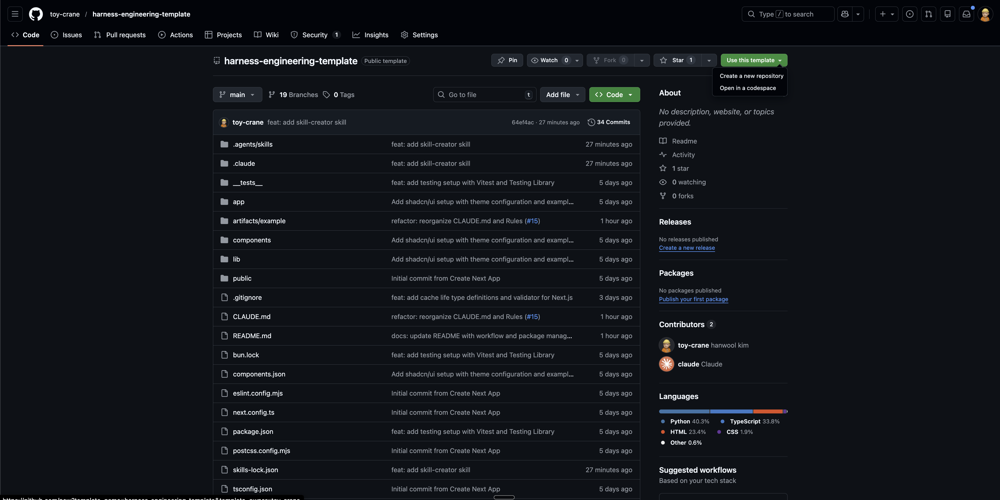
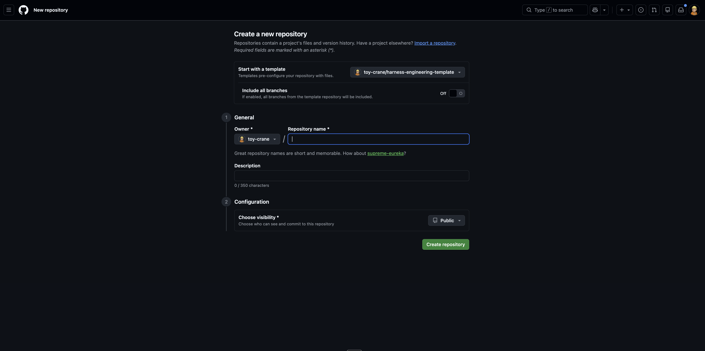
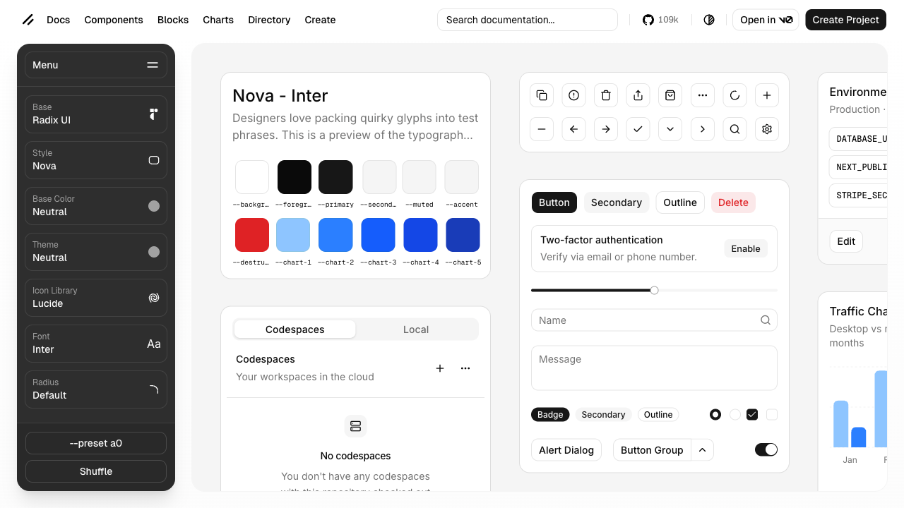
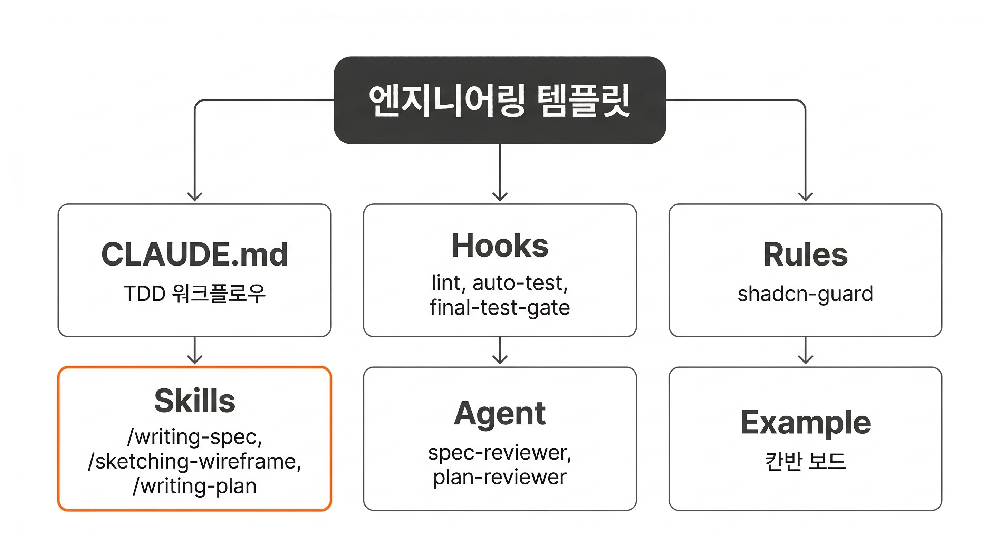

## Overview

SDD의 5단계 사이클을 이해했습니다. Part 2에서 배운 Skills, Hooks, Rules, Agent는 각각 독립적으로 동작했습니다. **SDD에서는 이 도구들이 하나의 시스템으로 연결되어야 합니다.**

이번 레슨에서는 이 연결이 미리 구성된 **엔지니어링 템플릿**을 클론하고, 각 도구가 SDD의 어떤 단계를 담당하는지 확인합니다.

### 학습 목표

- 엔지니어링 템플릿을 GitHub에서 클론하고 실행할 수 있습니다
- 템플릿에 포함된 도구(CLAUDE.md, Hooks, Rules, Skills, Agent)의 역할을 설명할 수 있습니다
- Spec Test 워크플로우의 전체 흐름을 이해합니다

## Step 1: GitHub에서 템플릿 클론

템플릿 저장소에서 새 프로젝트를 생성합니다. https://github.com/toy-crane/harness-engineering-template 에 접속한 뒤, **Use this template** 버튼을 클릭합니다.



**Create a new repository**를 선택하고, 저장소 이름을 입력한 뒤 생성합니다.



생성된 저장소를 로컬에 클론하고 의존성을 설치합니다.

```shell
git clone https://github.com/<username>/<repo-name>.git
cd <repo-name>
bun install
bun dev
```

`http://localhost:3000`에서 초기 화면이 나타나면 셋업이 완료된 것입니다.

## Step 2: shadcn preset 적용

템플릿은 기본 shadcn 스타일을 사용합니다. 프로젝트의 색상, 폰트, 테마를 바꾸고 싶다면 **preset**을 적용합니다.

https://ui.shadcn.com/create 에 접속하면 다양한 스타일 preset을 확인할 수 있습니다.



Claude Code에서 다음과 같이 입력하면 preset이 프로젝트에 적용됩니다.

```
shadcn preset을 {preset-id}로 바꿔줘
```

<Callout type="info" title="preset 적용은 선택사항입니다">
기본 스타일로도 충분합니다. 디자인을 커스텀하고 싶을 때만 적용하세요.
</Callout>

## Step 3: 템플릿 도구 확인



템플릿에는 SDD 워크플로우에 필요한 도구가 미리 구성되어 있습니다.

| 구분 | 이름 | 역할 |
|------|------|------|
| CLAUDE.md | - | TDD 워크플로우 정의, 불변 계약(spec.yaml) 규칙, 테스트 파일 컨벤션 |
| Hooks | lint.sh (PostToolUse) | 파일 수정 후 ESLint 자동 수정 |
| Hooks | 완료 검증 (Stop) | AI 작업 완료 시 TDD 단계별 완료 조건 확인 |
| Rules | shadcn-guard | shadcn 컴포넌트 수정 차단 |
| Skills | /writing-spec | 요구사항 문서 생성 (대화형) |
| Skills | /sketching-wireframe | HTML 와이어프레임 생성 |
| Skills | /writing-plan | 구현 계획 생성 (Spec Test 포함) |
| Skills | /make-something | 프로젝트 아이디어 탐색 |
| Agent | spec-reviewer | Spec 문서 품질 검토 |
| Agent | plan-reviewer | Plan 문서 품질 검토 |
| Example | artifacts/example/requirements.md | 칸반 보드 요구사항 예시 |

**CLAUDE.md**에는 TDD 워크플로우가 정의되어 있습니다. Spec Test(`*.spec.test.tsx`)를 먼저 작성하고, 구현 테스트(`*.test.tsx`)와 최소 코드를 작성하는 순서입니다.

**Hooks**는 두 시점에 자동으로 실행됩니다. AI가 파일을 수정하면 lint.sh가 ESLint를 실행하여 코드 스타일을 자동 수정합니다. AI가 작업을 마치려 할 때는 Stop Hook이 현재 TDD 단계(Red/Green)를 판별하고, 테스트 상태가 해당 단계의 완료 조건을 충족하는지 확인합니다.

**Skills**는 SDD의 각 단계를 구조화합니다. `/writing-spec`이 Spec 단계를, `/sketching-wireframe`이 Wireframe 단계를, `/writing-plan`이 Plan 단계를 담당합니다.

`artifacts/example/requirements.md`에 칸반 보드 프로젝트의 요구사항 예시가 포함되어 있습니다. 다음 레슨부터 이 예시를 기반으로 SDD 사이클을 진행합니다.

## 핵심 포인트 정리

1. **템플릿은 환경을 제공합니다**: CLAUDE.md, Hooks, Rules, Skills, Agent가 미리 구성되어 있으므로, SDD 사이클 자체에 집중할 수 있습니다
2. **각 도구가 SDD의 특정 단계를 담당합니다**: Skills가 Spec/Wireframe/Plan 단계를 구조화하고, Hooks가 Implementation 단계에서 자동 검증을 제공합니다

## 이어서 배울 내용

프로젝트 셋업이 완료되었습니다. 다음 레슨에서는 SDD의 첫 번째 단계인 Spec 작성을 배웁니다. 칸반 보드 예시를 사용하여 `/writing-spec` 스킬의 동작을 확인합니다.

다음 레슨 보기: [수동 요구사항을 Spec 문서로 자동화하기](./writing-spec)
