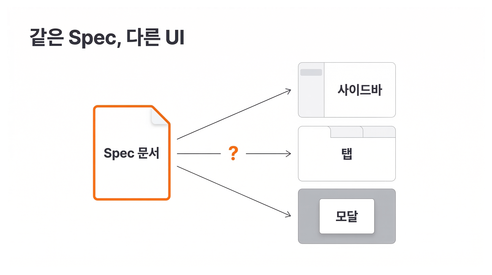

## Overview

Spec의 성공 기준은 "이 입력이면 이 출력"입니다. 하지만 **화면에 어떻게 배치되는지는 알려주지 않습니다.**



같은 Spec으로도 전혀 다른 UI가 나올 수 있습니다. 칸반 컬럼을 수평으로 배치할 수도 있고, 수직 리스트로 쌓을 수도 있고, 탭으로 분리할 수도 있습니다. **Wireframe은 코드 작성 전에 레이아웃을 검증하는 중간 단계입니다.**

`/sketching-wireframe`은 Tailwind CSS와 monospace 폰트를 사용한 HTML 파일을 생성합니다. 텍스트 기반이므로 AI가 직접 생성/수정할 수 있고, **브라우저에서 바로 확인할 수 있습니다.**

| 단계 | 하는 일 | 산출물 |
|------|---------|--------|
| Step 1 | 시나리오를 화면 단위로 분류 | 화면 구성 목록 |
| Step 2 | 기본 화면 생성 + 피드백 | `wireframe.html` (기본 레이아웃) |
| Step 3 | 시나리오별 화면 추가 | `wireframe.html` (전체 화면) |

### 학습 목표

- Spec과 Wireframe의 역할 차이를 설명할 수 있습니다
- `/sketching-wireframe` 스킬의 3단계 워크플로우를 이해합니다
- Wireframe 검토 기준을 적용하여 생성된 화면을 평가할 수 있습니다

## Step 1: 시나리오를 화면 단위로 분류

> `/sketching-wireframe` @`artifacts/kanban/spec.md`

AI가 Spec의 시나리오를 분석하고, **시각적으로 구분되는 화면 단위로 분류합니다.** 첫 번째 화면은 항상 시나리오에 매핑되지 않는 기본 화면입니다.

```
3개 화면으로 구성합니다:
1. 기본 화면 — (시나리오 없음)
2. 카드 드래그 — KANBAN-001, KANBAN-002
3. 카드 상세 모달 — KANBAN-003, KANBAN-004
```

사용자가 화면 구성을 확인하고 승인하면 다음 단계로 넘어갑니다.

## Step 2: 기본 화면 생성

AI가 기본 화면의 HTML 와이어프레임을 생성합니다. 드래그, 모달 같은 인터랙션 상태 없이 **대표 데이터가 채워진 기본 레이아웃**입니다.

```
Screen: 칸반 보드 [row]
├── Sidebar [col] — 검색, 필터
├── Board [row] — 컬럼 목록
│   └── Column [col] — 컬럼 헤더, 카드 목록
│       └── Card [col] — 제목, 라벨, 액션
└── Modal [overlay] — 카드 상세/편집
```

AI가 Vite 개발 서버를 실행하고 브라우저를 엽니다. **사용자는 브라우저에서 레이아웃을 확인하고, 자연어로 수정을 요청합니다.**

> "사이드바가 너무 넓어. 보드 영역을 더 넓게 잡아줘"

AI가 수정하면 브라우저에 즉시 반영됩니다. 레이아웃이 확정될 때까지 이 피드백 루프를 반복합니다.

## Step 3: 시나리오별 화면 추가

기본 레이아웃이 확정되면, AI가 나머지 시나리오 화면을 추가합니다. **각 화면은 Spec의 시나리오 ID를 참조합니다.**

카드 드래그 화면(KANBAN-001)에는 카드가 컬럼 사이를 이동하는 상태가, 카드 상세 모달(KANBAN-003)에는 모달이 열린 상태가 표현됩니다. Step 2와 동일한 피드백 루프로 각 화면을 다듬습니다.

확정된 와이어프레임은 `artifacts/kanban/wireframe.html`에 저장됩니다.

### Wireframe 검토 기준

1. **모든 Spec 시나리오의 UI가 반영되어 있는가?** 드래그 앤 드롭, 카드 추가, 검색/필터 등 Spec의 시나리오가 Wireframe의 어딘가에 표현되어 있어야 합니다
2. **컴포넌트 구조가 명확한가?** 각 컴포넌트의 역할과 위치가 구분되어야 합니다
3. **구체적 예시 데이터가 사용되었는가?** "카드 항목"이 아니라 Spec의 성공 기준에서 가져온 실제 데이터가 표시되어야 합니다

## Wireframe이 Plan의 추측을 줄인다

**Wireframe 없이 Plan을 세우면, AI가 레이아웃을 추측합니다.** 컬럼을 수평으로 배치할지 수직으로 쌓을지를 AI가 임의로 결정하고, 그 결정이 코드에 바로 반영됩니다.

Wireframe이 있으면 레이아웃이 확정된 상태에서 구현 계획을 세우므로 추측이 줄어듭니다. Spec이 "무엇을"을, Wireframe이 "어떻게 보이는가"를 정의하고, 두 문서가 합쳐져야 Plan의 입력이 완성됩니다.

## 핵심 포인트 정리

1. **3단계 워크플로우**: 화면 분류 -> 기본 화면 생성 -> 시나리오별 화면 추가. 기본 레이아웃을 먼저 확정하고, 그 위에 시나리오를 쌓습니다
2. **브라우저에서 실시간 피드백**: Vite 개발 서버로 수정 사항을 즉시 확인하고, 자연어로 수정을 요청합니다

## FAQ

- **Q: 모든 기능에 Wireframe이 필요한가요?**
  - A: 아닙니다. API 엔드포인트나 비즈니스 로직처럼 UI가 없는 기능은 Spec만으로 충분합니다. Wireframe은 새 화면이나 기존 화면의 구조가 크게 바뀌는 기능에서 효과적입니다

- **Q: 디자이너가 Figma로 디자인을 주면 Wireframe이 필요 없지 않나요?**
  - A: Figma 디자인이 있다면 Wireframe 단계를 건너뛸 수 있습니다. Wireframe은 디자이너 없이 개발자가 직접 레이아웃을 결정해야 할 때 유용합니다

- **Q: HTML 와이어프레임보다 더 완성도 높은 결과물을 만들 수 있나요?**
  - A: Stitch MCP나 Pencil MCP를 연결하면 가능합니다. Stitch MCP는 텍스트 프롬프트로 고품질 UI 디자인을 AI가 생성하는 Google 도구이고, Pencil MCP는 Figma 같은 디자인 도구의 캔버스 정보(색상, 간격, 컴포넌트 스타일)를 AI에게 전달해서 디자인에 맞는 코드를 생성합니다. 이 레슨의 HTML 와이어프레임은 외부 도구 없이 레이아웃을 빠르게 검증하는 방법이고, MCP를 연결하면 같은 워크플로우에서 더 높은 완성도를 얻을 수 있습니다

## 이어서 배울 내용

Spec과 Wireframe을 완성했습니다. 다음 레슨에서는 이 두 문서를 바탕으로 구현 계획을 수립하는 Plan 단계를 배웁니다.
