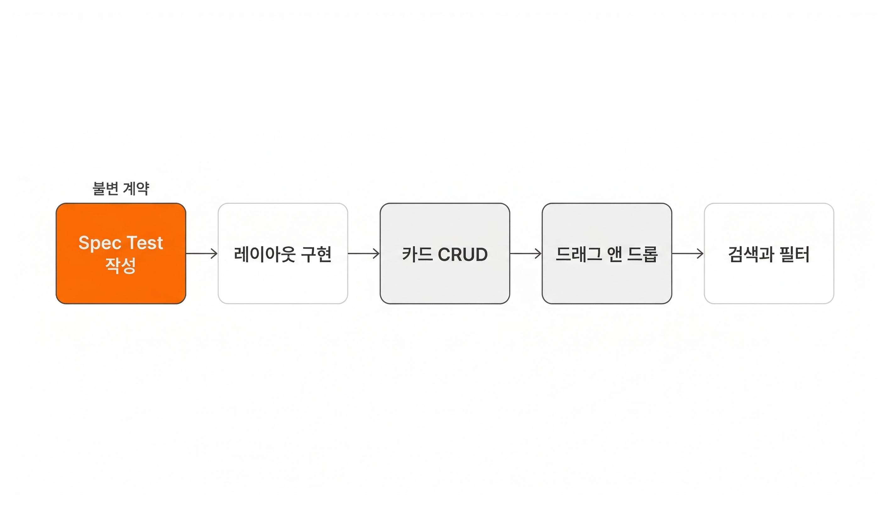

# 계획에 검증을 심는 법 | Plan 작성

## Overview

Shift+Tab의 내장 Plan Mode는 가벼운 수정에 적합합니다. SDD에서는 spec.md, wireframe.html, spec.yaml, 코딩 규칙까지 참조해야 하므로, **매번 프롬프트에 이 목록을 적는 대신 `/writing-plan` 스킬에 담아두면 한 번의 호출로 적용됩니다.**

| 단계 | 하는 일 | 산출물 |
|------|---------|--------|
| Step 1 | 미결정 사항 해결 | 확정된 구현 방향 |
| Step 2 | UI 컴포넌트 탐색 | 사용할 컴포넌트 목록 |
| Step 3 | Plan 문서 생성 | `artifacts/<feature>/plan.md` |

### 학습 목표

- `/writing-plan` 스킬의 3단계 워크플로우를 이해합니다
- Spec Test(불변 계약)와 구현 테스트의 차이를 이해합니다
- Plan 검토 기준을 적용하여 생성된 문서를 평가할 수 있습니다

## Step 1: 미결정 사항 해결

> `/writing-plan` @`artifacts/kanban/spec.md` @`artifacts/kanban/wireframe.html`

AI가 spec.md, spec.yaml, wireframe.html을 읽고, **구현에 필요한 미결정 사항을 질문합니다.** 변경 비용이 높은 결정만 질문하고, 낮은 것은 건너뜁니다.

> "상태 관리를 어떻게 하시겠습니까?"
> 1. useState + Context (간단, 소규모)
> 2. Zustand (중규모, 미들웨어)
> 3. Jotai (원자적 상태 관리)

한 번에 하나씩 질문하고, 선택지를 2-4개 제시합니다.

## Step 2: UI 컴포넌트 탐색

AI가 wireframe.html의 UI 요소를 분석하고, **shadcn 레지스트리(공식 + 커뮤니티)에서 적합한 컴포넌트를 검색합니다.**

> "카드 드래그 앤 드롭에 @dnd-kit 기반 Sortable 컴포넌트를 추천합니다. 사용하시겠습니까?"

사용자가 선택한 컴포넌트가 Plan의 각 Task에 반영됩니다. 레지스트리에 적합한 컴포넌트가 없을 때만 커스텀 컴포넌트를 만듭니다.

## Step 3: Plan 문서 생성

AI가 다음 구조의 Plan을 생성하고 `artifacts/kanban/plan.md`에 저장합니다.

```markdown
## Task 1: Spec Test 작성
- spec.yaml의 성공 기준을 *.spec.test.tsx로 변환
- 카드 이동, 추가, 삭제, 검색 시나리오 테스트

## Task 2: 기본 레이아웃 구현
- Wireframe의 Board, Column, Card 컴포넌트 구조
- Tailwind CSS 레이아웃

## Task 3: 카드 CRUD
- 카드 추가, 수정, 삭제 기능
- localStorage 연동

## Task 4: 드래그 앤 드롭
- 컬럼 간 카드 이동
- 카드 순서 변경

## Task 5: 검색과 필터
- 카드 제목/설명 검색
- 라벨별 필터링
```

**첫 번째 Task가 항상 Spec Test 작성입니다.** 각 Task는 spec.yaml의 시나리오 ID를 참조하고, 구현 대상(What)과 완료 기준(Acceptance Criteria)을 포함합니다.

### 왜 Spec Test가 첫 번째인가

Spec Test가 먼저 있으면, 구현 코드가 올바른 방향으로 가고 있는지 매 단계마다 확인할 수 있습니다. **정답지를 먼저 만들고 구현을 시작하는 것**입니다.



## Spec Test: 불변 계약


건물을 짓는 방법은 바뀔 수 있지만, 계약서에 적힌 "방 3개, 화장실 2개"는 바뀌지 않습니다. **Spec Test는 계약서이고, 구현 테스트는 작업 일지입니다.**

Spec의 성공 기준을 테스트 코드로 변환한 것이 **Spec Test**입니다.

```tsx
test("카드를 다른 컬럼으로 드래그하면 이동한다", async () => {
  await dragCard("Buy groceries", "Todo", "In Progress");
  expect(getColumnCards("In Progress")).toContain("Buy groceries");
  expect(getColumnCards("Todo")).not.toContain("Buy groceries");
});
```

|          | Spec Test (`*.spec.test.tsx`) | 구현 테스트 (`*.test.tsx`) |
| -------- | ----------------------------- | --------------------- |
| 질문       | "이 기능이 정상인가?"                 | "이 코드가 정상인가?"         |
| 출처       | Spec 문서의 성공 기준                | 구현 과정에서 작성            |
| 수정 가능 여부 | 요구사항 변경 시에만 가능                | 리팩토링 시 변경 가능          |

Spec Test가 실패하면, 테스트가 아니라 구현 코드를 수정합니다.

## Plan 검토 기준

1. **Spec의 모든 시나리오가 Plan에 반영되어 있는가?** 빠진 시나리오가 있으면 추가를 요청합니다
2. **Wireframe의 컴포넌트가 Plan의 구조에 반영되어 있는가?** Wireframe에서 정의한 컴포넌트(Board, Column, Card 등)가 Plan에 등장하는지 확인합니다
3. **구현 순서가 합리적인가?** 기반 UI를 먼저 만들고, 그 위에 상호작용을 얹는 순서가 자연스럽습니다
4. **Spec Test가 첫 번째 Task인가?** Spec Test 없이 구현을 시작하면, 방향이 맞는지 확인할 수 없습니다

## 핵심 포인트 정리

1. **3단계 자동화**: 미결정 사항 해결 -> 컴포넌트 탐색 -> Plan 생성. Spec, Wireframe, spec.yaml을 자동으로 참조하고 Spec Test를 첫 Task로 배치합니다
2. **Spec Test는 불변 계약입니다**: Spec의 성공 기준이 `*.spec.test.tsx`로 변환되고, 구현이 바뀌어도 이 테스트는 변하지 않습니다. 실패 시 구현 코드를 수정합니다

## FAQ

- **Q: Spec Test가 실패했는데 Spec 자체가 잘못된 것 같으면 어떻게 하나요?**
  - A: Spec 문서를 먼저 수정한 뒤, 수정된 성공 기준에 맞춰 Spec Test를 새로 작성합니다. Spec Test를 직접 수정하는 것이 아니라, Spec → Spec Test 순서를 유지합니다

- **Q: 내장 Plan Mode로도 artifacts를 직접 참조하면 되지 않나요?**
  - A: 가능합니다. 하지만 매번 "spec.md를 읽고, wireframe.html을 읽고, Spec Test를 첫 Task로 배치해줘"를 반복해야 합니다. writing-plan 스킬은 이 절차를 한 번의 호출로 자동화합니다

## 다음 단계

Spec, Wireframe, Plan이 완성되었습니다. 다음 레슨에서는 Plan의 Task를 실행하고, 완성된 프로젝트를 배포합니다.

다음 레슨 보기: [Lesson 06: 구현에서 배포까지 | 구현과 배포](./implementation-deploy)
