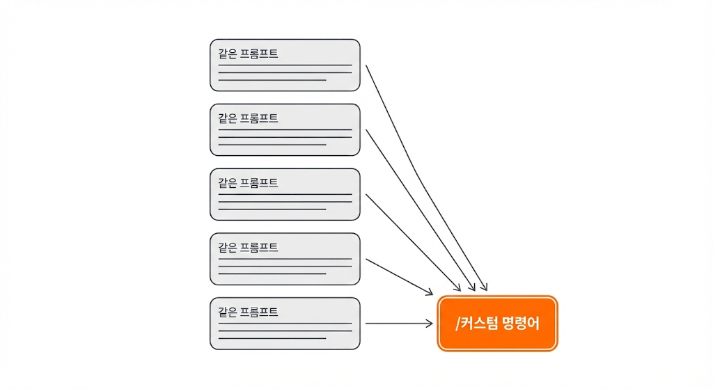

## Overview

Chapter 05에서 Plan과 Task로 계획과 실행의 흐름을 완성했습니다. 그런데 실제로 작업하다 보면 코드 리뷰, 커밋 등 같은 프롬프트를 매번 입력하는 마찰이 생깁니다. 이번 레슨에서는 반복 프롬프트를 마크다운 파일 하나로 저장하고 슬래시 한 단어로 호출하는 **Custom Command**를 배웁니다.

### 학습 목표

- 반복 프롬프트 문제를 Custom Command로 해결하는 방법을 설명할 수 있습니다
- `.claude/commands/` 폴더에 마크다운 파일을 작성하여 Custom Command를 만들 수 있습니다
- `$ARGUMENTS`와 frontmatter 옵션을 활용하여 재사용 가능한 Command를 설계할 수 있습니다

### 시작하기 전 확인사항

- Chapter 04에서 만든 Todo 앱 프로젝트가 준비되어 있습니다
- Claude Code가 설치되어 정상 작동합니다
- 실습 프로젝트의 시작 브랜치로 전환합니다 (`git checkout ch06-02`)

`ch06-02` 브랜치는 이 레슨의 시작점입니다.

## 반복되는 프롬프트, 반복되는 낭비



Claude Code에 코드 리뷰를 요청할 때마다 같은 말을 반복하고 있다면, 그 시간은 누적됩니다.

> 이 PR의 변경사항을 리뷰해줘. 보안 이슈, 성능 문제, 타입 안정성을 중점적으로 봐줘. 변경 파일별로 구체적인 피드백을 주고, 심각도를 상/중/하로 분류해줘.

처음에는 괜찮습니다. 하지만 하루에 5번, 일주일이면 25번 같은 프롬프트를 입력하게 됩니다.

복사해서 붙여넣으면 해결할 수 있지만, 매번 어디에 저장해뒀는지 찾아야 합니다. 팀원에게 공유하려면 또 메신저로 보내야 합니다.

**Custom Command**는 이 반복을 없앱니다. 자주 쓰는 프롬프트를 마크다운 파일 하나에 저장하고, `/review`처럼 슬래시 한 단어로 호출합니다. 파일이 `.claude/commands/` 폴더에 있으므로 git으로 팀 전체가 공유할 수 있습니다.

## Custom Command의 구조

Custom Command는 `.claude/commands/` 폴더 안의 마크다운 파일입니다. 파일 이름이 곧 Command 이름이 됩니다. `commit.md`를 만들면 `/commit`으로 호출합니다.

```plain text
.claude/
  commands/
    commit.md       -> /commit
    doc.md          -> /doc
```

### 가장 간단한 Command

`commit.md` 파일 하나만으로 커밋 Command를 만들어 보겠습니다.

`.claude/commands/commit.md`를 다음과 같이 작성합니다.

```markdown
변경사항을 확인하고 Conventional Commit 형식으로 커밋해줘.

커밋 메시지 규칙:
- 형식: <type>(<scope>): <description>
- type: feat, fix, refactor, test, docs, chore
```

이제 Claude Code에서 `/commit`을 입력하면 이 내용이 프롬프트로 전달됩니다. 매번 같은 말을 타이핑할 필요가 없습니다.

### $ARGUMENTS로 입력 받기

Command를 호출할 때 추가 입력을 전달할 수 있습니다. `$ARGUMENTS` 변수가 사용자의 입력을 받습니다.

위에서 만든 `commit.md`에 `$ARGUMENTS`를 추가해 보겠습니다.

```markdown
변경사항을 확인하고 Conventional Commit 형식으로 커밋해줘.

$ARGUMENTS가 있으면 커밋 메시지에 반영해줘.

커밋 메시지 규칙:
- 형식: <type>(<scope>): <description>
- type: feat, fix, refactor, test, docs, chore
```

`/commit 필터 탭 추가`를 입력하면, `$ARGUMENTS` 자리에 `필터 탭 추가`가 들어갑니다. Claude가 변경사항과 함께 이 힌트를 참고하여 커밋 메시지를 작성합니다. 인자 없이 `/commit`만 입력해도 Claude가 변경사항을 보고 직접 메시지를 만듭니다.

### Frontmatter로 옵션 설정

Command 파일 상단에 YAML frontmatter를 추가하면 동작을 세밀하게 제어할 수 있습니다.

같은 `commit.md`에 frontmatter를 추가해 보겠습니다.

```markdown
---
description: "Conventional Commit 형식으로 커밋"
allowed-tools: Bash(git status:*), Bash(git diff:*), Bash(git add:*), Bash(git commit:*)
---

변경사항을 확인하고 Conventional Commit 형식으로 커밋해줘.

$ARGUMENTS가 있으면 커밋 메시지에 반영해줘.

커밋 메시지 규칙:
- 형식: <type>(<scope>): <description>
- type: feat, fix, refactor, test, docs, chore
```

기본 → `$ARGUMENTS` 추가 → frontmatter 추가, 세 단계에 걸쳐 같은 파일이 진화했습니다. 처음부터 완성본을 만들 필요 없이, 필요에 따라 기능을 덧붙이면 됩니다.

| 필드 | 역할 | 예시 |
|------|------|------|
| `description` | Command 설명. `/help`에 표시됨 | `"코드 리뷰 수행"` |
| `argument-hint` | 사용자에게 입력 형식을 안내 | `[file-path]` |
| `allowed-tools` | 승인 없이 실행할 도구 지정 | `Bash(git diff:*)` |
| `model` | 특정 모델 강제 | `haiku`, `sonnet` |

<Callout type="info" title="frontmatter는 선택사항입니다">
frontmatter 없이도 Command는 정상 작동합니다. 이 경우 설명이 표시되지 않고, 도구 실행 시 매번 승인이 필요하며, 기본 모델이 사용됩니다.
</Callout>

자주 쓰는 필드를 정리하면 다음과 같습니다.

- **`allowed-tools`**: 지정한 도구는 승인 없이 자동 실행됩니다. 처음에는 이 필드 없이 Command를 실행하고, 반복적으로 승인을 요청하는 도구를 확인한 뒤 추가하면 됩니다. `Bash(git diff:*)`는 "git diff로 시작하는 명령만 허용"이라는 뜻입니다. 콜론(`:`) 뒤의 `*`가 와일드카드로, `git diff HEAD`, `git diff --staged` 등 인자에 관계없이 허용하되 `git push` 같은 다른 명령은 차단합니다. `Read`, `Grep`처럼 도구 이름만 적으면 해당 도구 전체를 허용합니다
- **`model`**: 단순한 포맷 변환은 `haiku`로 빠르게, 복잡한 아키텍처 리뷰는 `sonnet`으로 정확하게 처리할 수 있습니다

## 실습: Todo 앱을 위한 Custom Command 만들기

지금까지 배운 내용을 적용해서, Todo 앱 프로젝트에서 실제로 쓸 수 있는 Custom Command를 만들어 보겠습니다.

### Step 1: commands 폴더 생성

프로젝트 루트에 `.claude/commands/` 폴더를 만듭니다. `.claude/` 폴더가 이미 있다면 `commands/`만 추가합니다.

```shell
mkdir -p .claude/commands
```

### Step 2: commit Command 저장하기

앞에서 단계별로 만든 `commit.md`의 최종본을 `.claude/commands/commit.md`에 저장합니다.

```markdown
---
description: "Conventional Commit 형식으로 커밋"
allowed-tools: Bash(git status:*), Bash(git diff:*), Bash(git add:*), Bash(git commit:*)
---

변경사항을 확인하고 Conventional Commit 형식으로 커밋해줘.

$ARGUMENTS가 있으면 커밋 메시지에 반영해줘.

커밋 메시지 규칙:
- 형식: <type>(<scope>): <description>
- type: feat, fix, refactor, test, docs, chore
```

### Step 3: doc Command 만들기

두 번째 Command를 직접 만들어 봅니다. 코드 파일에 주석을 자동으로 추가하는 `/doc` Command입니다.

`.claude/commands/doc.md`를 다음과 같이 작성합니다.

```markdown
---
description: "파일의 코드 문서화"
argument-hint: "<file-path>"
model: haiku
---

$ARGUMENTS 파일을 읽고 다음을 추가해줘:

- 파일 상단에 역할 설명 주석
- 각 함수/컴포넌트에 JSDoc 주석
- 복잡한 로직에 인라인 주석
```

`model: haiku`를 지정했으므로 빠르고 가볍게 처리됩니다. 주석 추가처럼 단순한 작업에는 작은 모델이 효율적입니다.

### Step 4: Command 사용해보기

만든 Command를 실제로 실행해봅니다.

먼저 코드에 주석을 추가합니다.

```
/doc src/components/todo-item.tsx
```

코드를 수정한 뒤 커밋합니다.

```
/commit 컴포넌트 문서화
```

`allowed-tools`에 git 명령을 지정해뒀으므로, 별도 승인 없이 변경사항 확인부터 커밋까지 한 번에 진행됩니다.

<Callout type="info" title="Command가 보이지 않을 때">
`/` 을 입력했을 때 Command 목록이 나타나지 않으면, 파일 경로를 확인합니다. Command 파일은 반드시 `.claude/commands/` 아래에 있어야 합니다. 하위 폴더를 만들어 정리할 수도 있습니다. `.claude/commands/git/commit.md`는 `/git:commit`으로 호출합니다.
</Callout>

## 핵심 포인트 정리

1. **Custom Command는 마크다운 파일 하나입니다**: `.claude/commands/`에 `commit.md`를 넣으면 `/commit`으로 호출합니다. 복잡한 설정이 필요 없습니다
2. **`$ARGUMENTS`로 유연하게 입력을 받습니다**: 같은 Command 구조에 다른 대상을 전달할 수 있어 재사용성이 높습니다
3. **프로젝트 Command는 팀의 워크플로우를 코드로 관리합니다**: git에 포함되므로, 팀 전체가 같은 기준으로 작업하고 PR 하나로 워크플로우를 업데이트할 수 있습니다

## FAQ

- **Q: Command 파일 안에서 다른 파일을 참조할 수 있나요?**
  - A: `@` 문법으로 파일을 참조할 수 있습니다. 예를 들어, Command 안에 `@./STYLE_GUIDE.md`를 넣으면 해당 파일 내용이 프롬프트에 포함됩니다. 스타일 가이드나 규칙 문서를 참조할 때 유용합니다

- **Q: Command와 CLAUDE.md에 같은 내용을 넣으면 어떤 차이가 있나요?**
  - A: CLAUDE.md는 **매 대화마다** 자동으로 로드됩니다. Command는 **호출할 때만** 로드됩니다. 항상 적용되어야 하는 규칙은 CLAUDE.md에, 특정 작업에서만 필요한 프롬프트는 Command에 넣는 것이 컨텍스트를 효율적으로 사용하는 방법입니다

- **Q: Command를 중첩해서 호출할 수 있나요?**
  - A: Command 안에서 다른 Command를 직접 호출하는 기능은 지원되지 않습니다. 여러 단계를 하나로 묶고 싶다면, 하나의 Command 파일에 전체 워크플로우를 작성하는 것이 현재로서는 가장 좋은 방법입니다

- **Q: 반복 프롬프트를 텍스트 파일로 저장해두고 복사-붙여넣기하면 안 되나요?**
  - A: 기술적으로는 가능하지만 Custom Command가 더 효율적입니다. 텍스트 파일은 어디에 저장했는지 찾아야 하고, 팀 공유 시 메신저로 별도 전달해야 하며, 버전 관리가 어렵습니다. Command는 프로젝트 폴더 안에서 git으로 관리되고, `/` 한 번으로 즉시 호출되며, `$ARGUMENTS`로 재사용 가능합니다

## 이어서 배울 내용

Custom Command로 반복 프롬프트를 제거했지만, 프로젝트가 커지면 또 다른 문제가 생깁니다. 코드 리뷰 규칙, 배포 절차, 테스트 전략처럼 필요한 지침이 늘어나면서 CLAUDE.md가 점점 비대해지는 것입니다. Chapter 03에서 배운 **지침의 저주**가 현실이 됩니다. 지침이 많아질수록 각 지침의 준수율이 떨어지는 현상입니다.

다음 Lesson에서 배울 **Skill**은 이 딜레마를 해결합니다. 전문 지침을 별도 파일로 분리하고, 해당 작업을 할 때만 로드하는 구조입니다. CLAUDE.md에는 핵심 규칙만 남기고, 나머지는 필요할 때 꺼내 보는 매뉴얼처럼 관리할 수 있습니다.

- CLAUDE.md 과부하 문제와 Skill의 지연 로드가 이를 해결하는 원리
- Command와 Skill의 역할 차이
