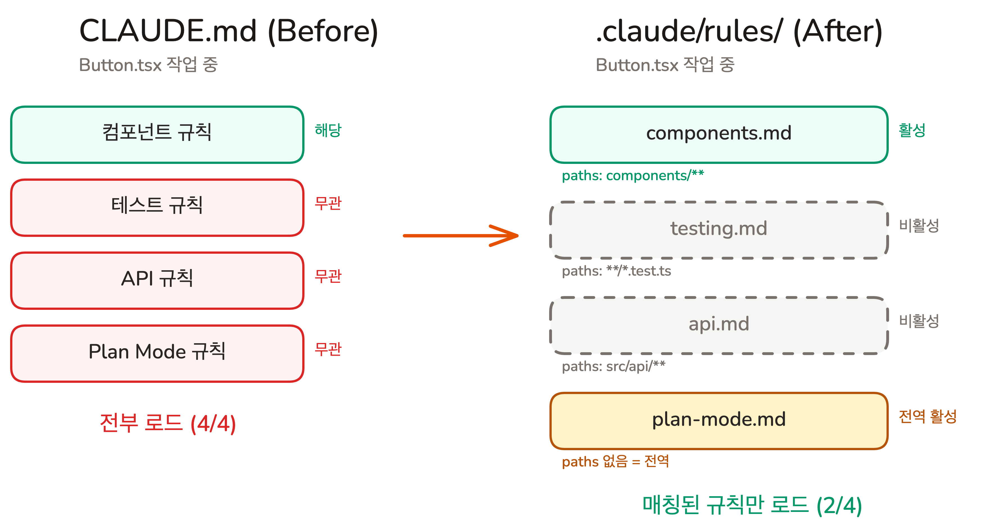

## Overview

Chapter 03에서 CLAUDE.md의 Rules 섹션에 프로젝트 제약사항을 넣는 방법을 배웠습니다. 그런데 프로젝트가 커지면 프론트엔드 규칙, 백엔드 규칙, 테스트 규칙이 한 파일에 쌓이고, 지금 작업과 무관한 규칙까지 매번 로드됩니다. 이번 레슨에서는 규칙을 주제별 파일로 나누고, 특정 경로에서만 활성화하는 `.claude/rules/`를 배웁니다.

### 학습 목표

- `.claude/rules/` 파일이 CLAUDE.md의 Rules 섹션과 어떻게 다른지 설명할 수 있습니다
- `paths` frontmatter로 경로별 규칙을 설정할 수 있습니다

### 시작하기 전 확인사항

- 실습 프로젝트의 시작 브랜치로 전환합니다 (`git checkout ch06-01`)

`ch06-01` 브랜치는 이 레슨의 시작점입니다. CLAUDE.md에 여러 규칙이 한꺼번에 들어있는 상태입니다.

> [!TIP] Claude Code 문법이 궁금하면 Claude Code에게 물어보세요
> 이번 Chapter부터 `.claude/rules/`, `.claude/commands/` 같은 Claude Code 고유 설정이 등장합니다. 문법이나 옵션이 궁금할 때 외부에서 검색하지 않아도 됩니다. Claude Code에서 "rules 파일에 쓸 수 있는 옵션이 뭐야?" 같이 질문하면, 내부의 `claude-code-guide` 서브에이전트가 자동으로 호출되어 정확하게 답변합니다. 자동 호출이 안 될 때는 "claude-code-guide 사용해서 알려줘"라고 명시하면 됩니다.

## CLAUDE.md가 커지면 생기는 문제

Chapter 03에서 CLAUDE.md의 Rules 섹션에 "`.env` 파일 커밋 금지", "한글 사용" 같은 규칙을 넣었습니다. 규칙이 5개일 때는 문제가 없습니다. 하지만 프로젝트가 성장하면서 규칙도 함께 늘어납니다.

```markdown
## Rules
- **NEVER** .env 파일 커밋
- 컴포넌트는 components/ 아래에만 생성
- Shadcn UI 컴포넌트를 우선 사용
- 테스트에서 실제 API 호출 금지, mock 사용
- API 응답은 표준 에러 형식 사용
- 데이터베이스 쿼리는 ORM만 사용
- Plan Mode에서 계획은 간결하게 작성
- ...
```

API 파일을 수정할 때 "Shadcn UI 컴포넌트를 우선 사용" 규칙이 같이 로드됩니다. 테스트를 작성할 때 "데이터베이스 쿼리는 ORM만 사용" 규칙이 함께 들어옵니다. Chapter 03 Lesson 01에서 배운 **지침의 저주**가 다시 발생합니다. 규칙이 많아질수록 AI의 주의력이 분산되어, 정작 지금 필요한 규칙을 놓치기 쉬워집니다.

핵심 문제는 명확합니다. **CLAUDE.md의 규칙은 경로와 무관하게 항상 전부 로드됩니다.**

## Rules: 주제별로 나누고, 경로별로 적용하기



`.claude/rules/` 폴더 안에 마크다운 파일을 넣으면, 각 파일이 독립된 규칙으로 자동 로드됩니다. CLAUDE.md 한 곳에 모든 규칙을 모으는 대신, 주제별로 파일을 나눕니다.

```
.claude/
  rules/
    components.md     # 컴포넌트 작성 규칙
    testing.md        # 테스트 작성 규칙
    shadcn.md         # Shadcn UI 규칙
```

### paths로 규칙의 적용 범위 제한하기

규칙 파일 상단에 `paths` frontmatter를 추가하면, 해당 경로의 파일을 작업할 때만 규칙이 활성화됩니다.

```markdown
---
paths:
  - "components/**"
---

# Component Rules

- Shadcn UI 컴포넌트를 우선 사용
- 새 컴포넌트는 components/ 아래에만 생성
```

이 규칙은 `components/` 아래의 파일을 작업할 때만 로드됩니다. API 파일을 수정할 때는 로드되지 않습니다.

`paths` 필드는 glob 패턴을 지원합니다.

| 패턴 | 매칭 대상 |
|------|-----------|
| `**/*.ts` | 모든 디렉토리의 TypeScript 파일 |
| `components/**` | components/ 아래 모든 파일 |
| `**/*.test.ts` | 모든 테스트 파일 |
| `**/*.{ts,tsx}` | .ts와 .tsx 파일 모두 |

`paths`가 **없는** 규칙 파일은 모든 작업에 전역으로 적용됩니다. 경로와 무관하게 항상 적용되어야 하는 규칙에 적합합니다.

### CLAUDE.md, 하위 폴더 CLAUDE.md, Rules: 언제 무엇을 쓰는가

Chapter 03에서 배운 CLAUDE.md도 하위 폴더에 배치하면 해당 폴더 작업 시 추가 로드됩니다. `.claude/rules/`와 비슷해 보이지만, 용도가 다릅니다.

| | CLAUDE.md | 하위 폴더 CLAUDE.md | `.claude/rules/` |
|---|---|---|---|
| **역할** | 프로젝트 맥락 (아키텍처 결정, 워크플로우) | 폴더별 맥락 ("이 폴더는 ~하는 곳") | 제약사항/규칙 (MUST/NEVER) |
| **로드 시점** | 항상 전체 | 해당 폴더 파일 접근 시 | 항상 또는 `paths` 매칭 시 |
| **적합한 내용** | 아키텍처 결정 이유, 팀 워크플로우 | 서브프로젝트 배경, 도메인 역할 | 코딩 규칙, 테스트 규칙, 린트 규칙 |

판단 기준은 간단합니다. **맥락 정보**("이건 뭐하는 곳이야")는 CLAUDE.md에, **제약사항**("이건 하지 마")은 Rules에 넣습니다. 예를 들어 "이 폴더는 Next.js API 라우트를 관리하는 곳이다"는 하위 폴더 CLAUDE.md에, "API 응답은 표준 에러 형식을 사용해야 한다"는 `.claude/rules/api.md`에 넣습니다.

## [데모] paths 규칙이 실제로 적용되는 순간

`paths`가 있는 규칙이 정말 경로에 따라 켜지고 꺼지는지 눈으로 확인합니다.

### 준비: 규칙 파일 하나 만들기

`.claude/rules/components.md`를 만들고, 눈에 띄는 규칙을 하나 넣습니다.

```markdown
---
paths:
  - "components/**"
---

# Component Rules

- 컴포넌트 파일에는 반드시 한글 주석을 포함할 것
```

### 테스트 1: 컴포넌트 파일 수정 요청

Claude Code에 컴포넌트 파일 수정을 요청합니다.

```
components/todo-item.tsx의 체크박스 스타일을 수정해줘
```

AI의 응답에 한글 주석이 포함됩니다. 규칙이 로드된 것입니다.

### 테스트 2: API 파일 수정 요청

같은 세션에서 이번에는 컴포넌트가 아닌 파일 수정을 요청합니다.

```
lib/todo-store.ts에 할 일 정렬 함수를 추가해줘
```

AI의 응답에 한글 주석이 없습니다. `components/` 밖이므로 규칙이 로드되지 않은 것입니다.

**같은 프로젝트, 같은 세션인데 작업 파일의 경로만 달라졌을 뿐 적용되는 규칙이 달라집니다.** 이것이 `paths`의 핵심입니다.

## 직접 만들어보기: Shadcn UI 규칙 분리

CLAUDE.md에 있는 Shadcn UI 관련 규칙을 `.claude/rules/`로 분리하고, `paths`로 적용 범위를 제한해 보겠습니다.

### Step 1: rules 폴더 생성

프로젝트 루트에 `.claude/rules/` 폴더를 만듭니다. `.claude/` 폴더가 이미 있다면 `rules/`만 추가합니다.

```shell
mkdir -p .claude/rules
```

### Step 2: Shadcn UI 규칙 파일 작성

`.claude/rules/shadcn.md`를 다음과 같이 작성합니다.

```markdown
---
paths:
  - "components/ui/**"
---

# Shadcn UI

- Shadcn UI 컴포넌트(`components/ui/`)는 직접 수정하지 않는다
- 스타일이나 동작을 변경하려면 래퍼 컴포넌트를 만들어 사용한다
```

`paths`가 `components/ui/**`로 설정되어 있으므로, 이 규칙은 `components/ui/` 아래 파일을 작업할 때만 활성화됩니다. API 파일이나 다른 컴포넌트를 수정할 때는 로드되지 않습니다.

### Step 3: CLAUDE.md 정리

`.claude/rules/shadcn.md`로 옮긴 Shadcn UI 관련 규칙을 CLAUDE.md에서 삭제합니다.

> [!NOTE] 중복 금지
> 같은 내용이 CLAUDE.md와 Rules에 동시에 있으면 둘 다 로드되어 Context만 낭비됩니다. 분리한 규칙은 반드시 원본에서 삭제하세요.

## 핵심 포인트 정리

1. **Rules = 모듈형 규칙 파일**: CLAUDE.md 한 곳에 넣는 대신, `.claude/rules/`에 주제별 파일로 분리합니다. 파일명이 곧 주제입니다
2. **paths로 경로 제한**: `paths` frontmatter가 있으면 해당 파일 작업 시에만 활성화됩니다. 없으면 전역으로 적용됩니다
3. **CLAUDE.md vs Rules 판단 기준**: 맥락 정보("이건 뭐하는 곳")는 CLAUDE.md에, 제약사항("이건 하지 마")은 Rules에 넣습니다

## FAQ

- **Q: 하위 폴더 CLAUDE.md와 `.claude/rules/`에 경로별 규칙, 뭐가 다른가요?**
  - A: 하위 폴더 CLAUDE.md는 그 폴더의 **맥락**(배경, 역할)을 설명합니다. Rules는 **제약사항**(~하지 마, ~해야 함)을 정의합니다. 예를 들어 "이 폴더는 API 라우트를 관리하는 곳"은 하위 폴더 CLAUDE.md에, "API 응답은 표준 에러 형식 사용"은 Rules에 넣습니다

- **Q: CLAUDE.md의 Rules 섹션과 `.claude/rules/`에 같은 내용이 있으면 어떻게 되나요?**
  - A: 둘 다 로드됩니다. 같은 규칙이 두 번 Context를 차지할 뿐 장점은 없습니다. CLAUDE.md에는 전역 핵심 규칙만 남기고, 나머지는 `.claude/rules/`로 분리하세요

- **Q: 규칙 파일을 몇 개까지 만들 수 있나요?**
  - A: 개수 제한은 없습니다. 다만 `paths`가 없는 파일이 많으면 전부 상시 로드되어 CLAUDE.md에 넣는 것과 다를 바 없습니다. 전역 규칙은 최소화하고, 가능하면 `paths`로 범위를 좁히세요

## 다음 단계

Rules로 규칙을 주제별로 분리하고 경로별로 적용할 수 있게 되었습니다. 하지만 규칙 외에도 반복되는 것이 있습니다. 코드 리뷰를 요청할 때마다 같은 형식의 프롬프트를 매번 타이핑하고, 커밋할 때마다 같은 규칙을 반복 입력하고 있다면, 그 시간은 누적됩니다.

- 반복 프롬프트를 마크다운 파일 하나로 저장하고 슬래시 한 단어로 호출하기
- `$ARGUMENTS`와 frontmatter로 재사용 가능한 프롬프트 설계

다음 레슨 보기: [반복 프롬프트를 한 단어로](./custom-commands)
