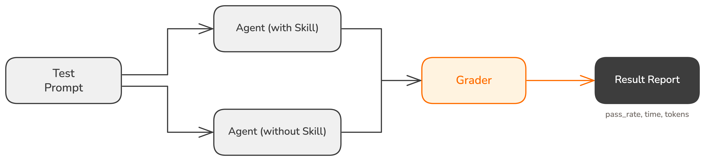

# Skill 만들고 검증하기 | Skill Creator

## Overview

Skill을 만드는 것은 어렵지 않습니다. 어려운 것은 만든 Skill이 의도대로 동작하는지 확인하는 것입니다.

"잘 되는 것 같은데?"라는 감과, "10개 시나리오 중 10개 통과"라는 확인은 다릅니다. 이번 레슨에서는 **Skill Creator** 플러그인으로 Skill을 생성하고, **Eval(평가 테스트)**로 품질을 검증하는 방법을 배웁니다.

### 학습 목표

- Skill Creator를 사용해 Skill을 생성할 수 있습니다
- Eval을 작성해 Skill의 품질을 검증할 수 있습니다
- Skill 유형(능력 보강 vs 절차 기록)에 따라 Eval의 목적이 달라지는 이유를 설명할 수 있습니다

### 시작하기 전 확인사항

- Skill Creator 플러그인이 설치되어 있어야 합니다 (`/plugin`에서 `skill-creator` 설치)

## Skill Creator란

**Skill Creator**는 Anthropic 공식 플러그인으로, Skill의 생성과 검증을 도와주는 도구입니다. `/skill-creator` 뒤에 원하는 작업을 자연어로 요청하면 세 가지 기능을 사용할 수 있습니다.

- **Create**: 대화를 통해 Skill을 생성합니다
- **Eval**: Skill이 기대대로 동작하는지 확인하는 테스트를 작성하고 실행합니다
- **Improve**: Eval 결과를 바탕으로 Skill을 개선합니다

이 레슨에서는 Create와 Eval에 집중합니다.

## Skill 생성하기

commit Skill의 SKILL.md를 직접 작성하는 대신, Skill Creator에게 맡기면 어떻게 다를까요?

```
/skill-creator Conventional Commit 형식으로 커밋하는 Skill을 만들어줘
```

Skill Creator가 대화를 통해 요구사항을 정리하고 SKILL.md를 자동 생성합니다. `/skill-creator` 뒤에 원하는 작업을 자연어로 요청하면 됩니다.

직접 작성할 때와의 차이는 두 가지입니다.

**description 최적화**: Skill Creator는 Claude가 자동 로드를 판단할 때 사용하는 `description`을 다양한 프롬프트로 테스트하고 튜닝합니다. 직접 작성할 때는 감으로 적어야 했던 긍정/부정 트리거를 데이터 기반으로 조정합니다.

**구조 설계**: Skill Creator는 워크플로우의 단계를 분석해 참조 파일 분리, 조건부 로드 같은 구조를 제안합니다. 직접 작성할 때 놓치기 쉬운 Progressive Disclosure 최적화를 자동으로 처리합니다.

## Eval이란: Skill의 정답지

**Eval(평가)**은 Skill이 기대한 대로 동작하는지 확인하는 테스트입니다. 소프트웨어 테스트와 같은 개념이지만, 테스트 대상이 코드가 아니라 **Skill의 출력**입니다.

Eval의 구조는 세 단계입니다.

1. **테스트 프롬프트**: Skill에 보내는 입력입니다. "이 변경사항을 커밋해줘"
2. **기대 결과**: 좋은 결과가 어떤 모습인지 설명합니다. "Conventional Commit 형식이어야 하고, scope가 포함되어야 한다"
3. **판정**: Skill이 만든 결과가 기준을 충족하는지 자동으로 확인합니다

여러 Eval을 만들어두면, Skill을 수정하거나 모델이 업데이트될 때마다 한 번에 실행해서 "다 통과하네, 괜찮다" 또는 "3번이 깨졌네, 뭐가 달라졌지?"를 확인할 수 있습니다.

## 왜 Eval이 필요한가: 유형별 차이

Skill에는 두 가지 유형이 있습니다. 각 유형은 Eval로 확인하는 것이 다릅니다.

**능력 보강 스킬**(Capability Uplift)은 Claude가 아직 잘 못하는 작업을 돕습니다. Eval은 "아직 이 Skill이 필요한가?"를 확인합니다. 모델이 발전하면 Skill 없이도 같은 품질을 낼 수 있습니다. Skill을 로드하지 않은 상태에서 Eval을 실행해서 통과하기 시작하면, 그 Skill은 더 이상 필요하지 않다는 신호입니다.

**절차 기록 스킬**(Encoded Preference)은 팀의 프로세스를 Claude에게 알려줍니다. Eval은 "우리 방식대로 하고 있는가?"를 확인합니다. Claude가 아무리 발전해도 우리 팀의 커밋 규칙을 스스로 알 수는 없습니다. Eval은 Skill이 팀의 워크플로우를 정확히 따르는지 검증합니다.

| | 능력 보강 스킬 | 절차 기록 스킬 |
|---|---|---|
| **Eval의 목적** | Skill이 아직 필요한지 확인 | 우리 방식을 지키는지 확인 |
| **Skill 없이 Eval 실행** | 통과하면 Skill 제거 가능 | 통과할 수 없음 (팀 규칙은 모델이 모름) |
| **재실행 시점** | 모델 업데이트 후 | 팀 프로세스 변경 시 |

## Eval 작성하기

commit Skill에 대한 Eval을 작성해 봅니다.

```
/skill-creator commit Skill에 대한 Eval을 작성해줘. 정상 커밋, 여러 파일 수정, 부정 트리거 시나리오를 포함해줘.
```

Skill Creator가 commit Skill의 SKILL.md를 분석하고 테스트 시나리오를 제안합니다. 예를 들어 다음과 같은 Eval이 생성됩니다.

- **시나리오 1**: 단일 파일 수정 후 커밋 요청 -> type과 scope가 포함된 Conventional Commit 형식인가?
- **시나리오 2**: 여러 파일 수정 후 커밋 요청 -> 변경 범위에 맞는 scope를 선택했는가?
- **시나리오 3**: "git rebase가 뭐야?" 질문 -> Skill이 트리거되지 않는가? (부정 트리거 테스트)

Eval을 실행하면 각 시나리오의 통과/실패 여부와 함께, 소요 시간과 토큰 사용량이 표시됩니다.

## 더 깊이: Eval의 A/B 비교

Eval은 단순히 "Skill이 잘 동작하는가?"만 확인하지 않습니다. 핵심은 **두 조건을 나란히 비교**하는 것입니다. Skill Creator는 같은 프롬프트를 두 개의 독립된 에이전트에 동시에 보내고, Grader가 두 결과의 **통과율, 소요 시간, 토큰 사용량**을 측정합니다.



commit Skill로 두 가지 비교 방식을 모두 실습해 봅니다.

### 1단계: Skill vs No Skill

commit Skill을 로드한 에이전트와 Skill 없이 실행하는 에이전트를 비교합니다. "Skill을 넣으니 통과율이 60%에서 100%로 올랐다"는 Skill을 유지할 근거가 됩니다. 반대로 "Skill 없이도 100% 통과한다"면 Skill을 제거할 수 있다는 신호입니다.

이 비교는 **능력 보강 스킬**에 특히 유용합니다. 모델이 업데이트될 때마다 다시 실행하면, Skill이 아직 필요한지 판단할 수 있습니다.

### 2단계: Old Skill vs New Skill

1단계 테스트를 진행하다 보면 commit Skill의 동작을 개선하고 싶은 지점이 보입니다. 예를 들어 현재 commit Skill은 이미 staging된 파일만 커밋하고, modified나 untracked 파일은 무시합니다.

> [!TIP] Git 파일 상태
> - **staged**: `git add`로 커밋 대기열에 올린 파일
> - **modified**: 수정했지만 아직 `git add`하지 않은 파일
> - **untracked**: Git이 아직 추적하지 않는 새 파일

이 동작을 바꾸고 싶다면 이렇게 요청합니다.

```
/skill-creator commit Skill을 수정하고 테스트해줘. 현재는 이미 staging된 파일만 커밋하는데, modified 파일과 untracked 파일도 자동으로 staging해서 커밋하도록 바꾸고 싶어. 수정 전후를 비교해서 실제로 개선되었는지 확인해줘.
```

Skill Creator가 수정 전 Skill을 스냅샷으로 저장한 뒤 SKILL.md를 수정하고, 같은 테스트 프롬프트로 old skill과 new skill을 동시에 실행합니다. 결과가 나빠졌으면 수정을 되돌리고, 좋아졌으면 반영합니다.

이 비교는 **절차 기록 스킬**의 테스트 방법입니다. Skill 없이 실행하면 Claude가 팀 규칙을 모르니 당연히 실패합니다. 비교 대상이 "Skill 없음"이 아니라 "이전 버전 Skill"이 되는 것입니다.

## 핵심 포인트 정리

1. **Skill Creator**: Skill의 생성, 평가, 개선을 한 도구에서 처리합니다. description 튜닝과 구조 설계를 자동으로 처리하는 것이 직접 작성과의 차이입니다
2. **Eval**: Skill이 기대대로 동작하는지 확인하는 테스트입니다. "잘 되는 것 같은데?"를 "확실히 동작한다"로 바꿔줍니다
3. **유형별 A/B 비교**: 능력 보강 스킬은 skill vs no skill로 "아직 필요한가?"를, 절차 기록 스킬은 old skill vs new skill로 "수정이 개선인가?"를 확인합니다

## 다음 단계

이 Chapter에서 Rules로 규칙을 경로별로 분리하고, Custom Command로 반복 입력을 줄이고, Skills로 전문 지침을 필요할 때만 로드하고, Skill Creator로 Skill의 품질을 검증하는 방법을 배웠습니다. 네 도구 모두 Claude의 **지식**을 확장합니다.

하지만 Claude가 접근할 수 있는 범위는 여전히 로컬 파일과 내장 도구에 묶여 있습니다. 다음 Chapter에서는 Notion, Slack, DB 같은 외부 시스템에 접근하는 MCP를 배웁니다.

다음 레슨 보기: [Lesson 01: Claude에게 새 능력 부여하기 | MCP](../external-connection/mcp-introduction)
