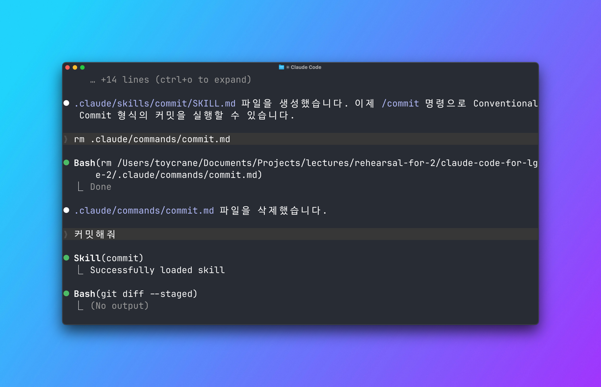
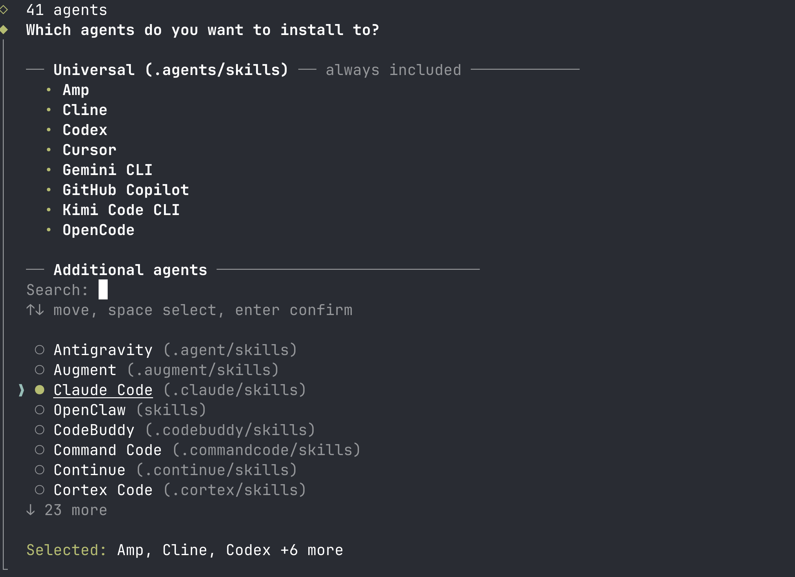
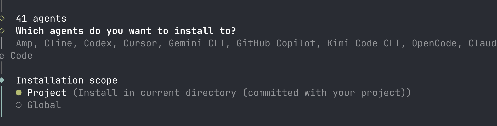
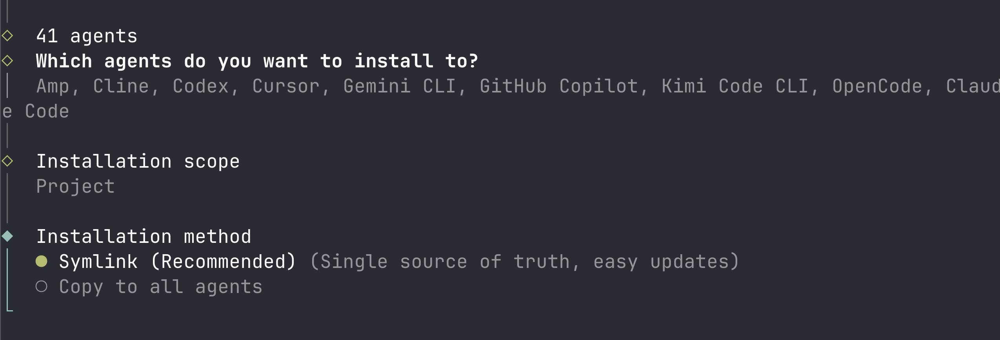

# Skill 만들고 설치하기 | Skills 실습

## Overview

Skill이 Context를 절약하는 원리를 이해했으니, 이번 레슨에서는 기존 Custom Command를 Skill로 전환하고 커뮤니티 Skill을 설치해 봅니다.

### 학습 목표

- Custom Command를 Skill로 전환하여 자동 호출되는 Skill을 만들 수 있습니다
- 커뮤니티 Skill을 검색하고 설치할 수 있습니다

### 시작하기 전 확인사항

- 실습 프로젝트의 시작 브랜치로 전환합니다 (`git checkout ch06-04`)

`ch06-04` 브랜치는 이 레슨의 시작점입니다. `.claude/commands/commit.md`에 Conventional Commit Custom Command가 만들어져 있는 상태입니다.

## Skill 만들기: Command를 Skill로 전환하기

`.claude/commands/commit.md`에 Conventional Commit 형식으로 커밋하는 Custom Command가 있습니다. `/commit`을 입력하면 잘 동작하지만, 매번 수동으로 호출해야 합니다.

이 Command를 Skill로 전환하면 **"커밋해줘"라고 말하기만 해도 Claude가 자동으로 커밋 절차를 실행**합니다.

### Step 1: Skill 폴더 생성

프로젝트의 `.claude/skills/` 디렉토리에 Skill 전용 폴더를 만듭니다.

```shell
mkdir -p .claude/skills/commit
```

### Step 2: SKILL.md 작성

`.claude/skills/commit/SKILL.md`를 다음과 같이 작성합니다.

```markdown
---
name: commit
description: Conventional Commit 형식으로 변경사항을 커밋합니다. 코드 변경 후 커밋 요청, "커밋해줘", "변경사항 정리해줘" 요청 시 사용. 단순 git 명령어 질문에는 사용하지 않음.
---

# Commit Skill

## 커밋 절차

1. `git status`와 `git diff --staged`를 실행하여 전체 상태를 파악합니다
2. 스테이징된 변경이 없으면 `git diff`와 `git status`를 기반으로 수정된 파일 및 untracked 파일을 확인하고 관련 파일을 스테이징합니다
3. 변경 내용을 분석하여 Conventional Commit 형식으로 커밋 메시지를 작성하고 자동으로 커밋합니다

## 커밋 메시지 규칙

- 형식: <type>(<scope>): <description>
- type: feat, fix, refactor, test, docs, chore
- scope: 변경된 주요 모듈/컴포넌트 이름
- description: 영어, 소문자, 현재형, 50자 이내

## 예시

- feat(todo): add filter tabs for completion status
- fix(todo-item): resolve checkbox toggle not persisting
```

Command와 달리, Skill에는 `name`과 `description` frontmatter가 있습니다. `description`이 **Claude가 자동으로 Skill을 로드할지 판단하는 기준**입니다.

> [!TIP] 좋은 description 작성법
> `[하는 일] + [사용 시점]` 구조로 작성합니다. "~할 때 사용" 패턴으로 트리거 조건을 명시하면 Claude의 자동 판단 정확도가 높아집니다. 원치 않는 상황에서 로드되면 부정 트리거를 추가합니다: `"단순 git 명령어 질문에는 사용하지 않음"`

위 예시의 `description`을 세 부분으로 분해할 수 있습니다.

- **하는 일**: "Conventional Commit 형식으로 변경사항을 커밋합니다"
- **긍정 트리거**: "커밋 요청, '커밋해줘', '변경사항 정리해줘' 요청 시 사용"
- **부정 트리거**: "단순 git 명령어 질문에는 사용하지 않음"

사용자가 "git rebase가 뭐야?"라고 물으면 Claude는 이 Skill을 로드하지 않습니다. "작업 끝났으니 커밋해줘"라고 요청하면 Claude가 자동으로 Skill을 로드합니다.

### Step 3: 테스트

Skill이 정상적으로 동작하는지 두 가지 방법으로 확인합니다.

**수동 호출:**

```shell
/commit
```

> `/commit`을 입력하면 Skill이 로드되고, Claude가 커밋 절차에 따라 작업을 시작합니다.

**자동 호출:**

> 변경사항 커밋해줘

`description`에 매칭되는 요청을 자연어로 입력하면, Claude가 자동으로 Skill을 로드합니다.



"커밋해줘"라고 입력하자 `Skill(commit) Successfully loaded skill`이 표시되고, Claude가 커밋 절차를 자동으로 시작합니다.

두 가지 호출 방식이 모두 동작하면, 기존 Custom Command는 삭제합니다. Skill이 Command의 기능을 포함하므로 **같은 이름의 파일을 두 곳에 유지할 필요가 없습니다.**

```shell
rm .claude/commands/commit.md
```

### Step 4: 참조 파일 추가 (선택)

커밋에 필요한 추가 자료가 있다면 같은 폴더에 넣습니다. 이 파일들은 Progressive Disclosure 3단계(필요 시)에만 로드됩니다.

```shell
.claude/skills/commit/
  SKILL.md                    # 핵심 지침 (2단계에서 로드)
  references/                 # 참조 문서 (3단계에서 필요 시 로드)
    commit-conventions.md
    breaking-change-guide.md
```

SKILL.md에서 이 파일들을 참조하면, Claude는 breaking change가 포함된 경우에만 `breaking-change-guide.md`를 읽습니다. 매번 읽지 않습니다.

## 커뮤니티 Skill 활용하기

모든 Skill을 직접 만들 필요는 없습니다. 이미 만들어진 Skill을 가져다 쓸 수 있습니다.

### Anthropic 공식 Skill -- Plugin으로 설치

**Plugin(플러그인)**은 Claude Code 전용 확장 패키지입니다. Skill뿐 아니라 Commands, MCP 서버, Hooks까지 하나의 번들로 묶어 배포합니다.

Anthropic이 관리하는 공식 마켓플레이스(`claude-plugins-official`)가 기본으로 등록되어 있습니다. 공식 마켓플레이스 외에도 누구나 GitHub 저장소로 마켓플레이스를 만들어 배포할 수 있습니다.

```shell
/plugin
```

`/plugin`을 입력하면 플러그인 관리 화면이 열립니다. **Marketplaces** 탭으로 이동하면 등록된 마켓플레이스 목록이 나타납니다.

다음 레슨에서 사용할 **skill-creator**를 설치해 봅니다. Skill 생성, 평가, 개선을 도와주는 Anthropic 공식 플러그인입니다.

마켓플레이스에서 `skill-creator`를 찾아 설치합니다. 설치 후 `/skill-creator`를 호출하면 Skill을 만들고 테스트하는 워크플로우가 시작됩니다. PDF 생성, 스프레드시트 처리, 문서 작성 등 다양한 범용 Skill도 같은 방식으로 설치할 수 있습니다.

### 커뮤니티 Skill -- skills.sh에서 설치

[skills.sh](https://skills.sh)는 Vercel에서 운영하는 Skill 디렉토리입니다. Anthropic 공식 Skill부터 커뮤니티가 만든 Skill까지 검색하고 설치할 수 있습니다.

예를 들어 shadcn/ui 컴포넌트를 프로젝트에 맞게 활용하는 Skill을 설치해 봅니다.

> [!INFO] shadcn/ui registry란?
> shadcn/ui는 복사해서 쓰는 UI 컴포넌트 모음입니다. **Registry**는 이 컴포넌트들이 등록된 저장소로, shadcn 공식 registry 외에도 커뮤니티가 만든 다양한 registry가 있습니다. 커뮤니티 registry를 사용하려면 `components.json`에 별도로 등록해야 합니다.

```shell
bunx skills add https://github.com/shadcn-ui/ui --skill shadcn
```

명령어를 실행하면 세 가지 선택지가 순서대로 나타납니다.

**1. 에이전트 선택**



설치할 에이전트를 고르는 화면입니다. 화살표 키로 이동하고, **스페이스바**로 선택한 뒤 Enter로 확인합니다. Claude Code를 사용하므로 `Claude Code (.claude/skills)`에 스페이스바를 눌러 선택합니다.

> [!TIP] 스페이스바로 선택
> Enter만 누르면 선택 없이 넘어갑니다. 반드시 스페이스바로 원하는 에이전트를 먼저 선택하세요.

**2. 설치 범위 -- Project vs Global**



실습에서는 **Project**를 선택합니다.

**3. 설치 방법 -- Symlink vs Copy**



Symlink는 원본 파일을 바로가기로 참조하고, Copy는 개별 복사합니다. Claude Code만 사용하는 환경에서는 **어느 쪽을 선택해도 동일하게 동작**합니다.

설치 후 Claude에게 다음과 같이 요청하면, shadcn Skill이 자동으로 로드됩니다.

> 1. Shadcn Best Practice 참고해서 UI 개선해줘
> 2. registry를 탐색해서 이 프로젝트에 맞는 컴포넌트를 찾고, UI 전체를 개선해줘.

추가하면 좋은 registry
```
bunx --bun shadcn@latest registry add @magicui
bunx --bun shadcn@latest registry add @aceternity
bunx --bun shadcn@latest registry add @tailark
```


shadcn 외에도 다양한 커뮤니티 Skill을 같은 방식으로 설치할 수 있습니다.

- **vercel-react-best-practices**: Vercel이 관리하는 React/Next.js 모범 사례입니다. 컴포넌트 구조, 데이터 페칭, 성능 최적화 지침을 제공합니다. 추천 프롬프트: "React Best Practice 참고해서 컴포넌트 구조 개선해줘"
- **agent-browser**: Claude가 브라우저를 직접 조작하여 웹 테스트, 폼 입력, 스크린샷 촬영을 수행합니다. 추천 프롬프트: "localhost:3000 열어서 Todo 추가/삭제 기능 테스트해줘"
- **web-design-guidelines**: 타이포그래피, 색상, 레이아웃 등 웹 디자인 원칙 가이드라인입니다. 추천 프롬프트: "웹 디자인 가이드라인 참고해서 랜딩 페이지 만들어줘"
- **defuddle**: 웹 페이지에서 광고, 네비게이션, 불필요한 요소를 제거하고 깨끗한 본문만 Markdown으로 추출합니다. 추천 프롬프트: "이 URL 내용 정리해줘"
- **dogfood**: 웹 앱을 체계적으로 탐색하면서 버그를 찾고, 스크린샷과 재현 경로가 포함된 QA 리포트를 자동으로 생성합니다. 추천 프롬프트: "localhost:3000 전체 QA 테스트해줘"

### Plugin vs skills.sh: 무엇이 다른가?

두 설치 방법은 구조가 다릅니다.

| | Plugin (`/plugin`) | skills.sh (`npx skills add`) |
|---|---|---|
| **운영** | Anthropic (공식 마켓플레이스) | Vercel |
| **대상 에이전트** | Claude Code 전용 | Claude Code, Cursor, Copilot 등 38+ 에이전트 |
| **설치 단위** | 번들 (Skills + Commands + MCP + Hooks) | SKILL.md 파일 1개 |
| **설치 방식** | Claude Code 안에서 `/plugin` | 터미널에서 `npx skills add` |
| **등록** | GitHub repo에 `.claude-plugin/` 구조 생성 | GitHub repo에 SKILL.md 작성 후 설치 시 자동 인덱싱 |
| **업데이트** | `/plugin`의 Updates 탭 | `npx skills add` 재실행 |

**Plugin**은 여러 기능을 하나의 패키지로 묶어 배포합니다. skill-creator처럼 Skill, Command, 설정 파일이 함께 필요한 도구에 적합합니다.

**skills.sh**는 SKILL.md 하나만 설치합니다. shadcn처럼 특정 프레임워크의 모범 사례를 담은 단일 지침에 적합합니다.

### 직접 만들기 vs 가져다 쓰기

| 상황 | 선택 |
|------|------|
| 프로젝트 고유의 규칙 (배포 절차, 코드 컨벤션) | 직접 만들기 |
| 범용 기능 (PDF 처리, 문서 생성) | 가져다 쓰기 |
| 팀 내부 워크플로우 (리뷰 절차) | 직접 만들기 |

프로젝트에 특화된 지식은 직접 만들 수밖에 없습니다. 범용 기능은 공식 Skill이나 커뮤니티 Skill을 먼저 확인한 후, 없으면 직접 만드는 방식이 효율적입니다.

팀 내부 워크플로우를 Skill로 만들어 git에 커밋하면, 팀원 전체가 같은 워크플로우를 실행할 수 있습니다. 이 관점은 Chapter 07 Lesson 02(MCP와 Skills의 차이)에서 더 자세히 다룹니다.

## 핵심 포인트 정리

1. **Skill 구조**: `.claude/skills/폴더명/SKILL.md`로 만듭니다. `name`과 `description` frontmatter가 Claude의 자동 판단 기준이 됩니다
2. **커뮤니티 활용**: 프로젝트 고유 규칙은 직접 만들고, 범용 기능은 Anthropic 공식 Plugin이나 skills.sh에서 가져다 씁니다
3. **팀 공유**: `.claude/skills/`를 git에 커밋하면 팀 전체가 같은 Skill을 사용할 수 있습니다

## FAQ

- **Q: Skill을 몇 개까지 만들 수 있나요?**
  - A: 개수 제한은 없습니다. Skill 하나당 이름표에 30~50 토큰만 소비하므로, 100개를 만들어도 3,000~5,000 토큰입니다. 다만 Skill이 너무 많으면 Claude가 어떤 Skill을 선택할지 판단하는 데 혼란이 생길 수 있으므로, `description`을 명확하게 작성하는 것이 중요합니다

- **Q: 팀원과 Skill을 공유할 수 있나요?**
  - A: `.claude/skills/` 폴더를 git에 커밋하면 팀 전체가 같은 Skill을 사용할 수 있습니다

- **Q: Skill이 자동으로 로드되는 걸 막을 수 있나요?**
  - A: SKILL.md의 frontmatter에 `disable-model-invocation: true`를 추가하면, 사용자가 직접 `/skill-name`으로 호출할 때만 로드됩니다. 민감한 작업(배포, 데이터 삭제 등)에는 이 설정을 권장합니다

- **Q: Skill이 원치 않는 상황에서 자동 로드되면 어떻게 하나요?**
  - A: `description`에 부정 트리거를 추가합니다. 예를 들어 `"단순 코드 질문에는 사용하지 않음"`처럼 제외 조건을 명시하면, Claude가 해당 상황에서는 Skill을 로드하지 않습니다

- **Q: CLAUDE.md에 "배포 요청이면 이 섹션을 읽어라" 조건문을 넣는 방식은 왜 안 되나요?**
  - A: Claude는 조건을 판단하기 전에 이미 CLAUDE.md 전체를 읽습니다. 조건문은 어떤 지침을 '따를지'만 결정하지, Context에 로드되는 것을 막지는 못합니다. Skill은 Progressive Disclosure로 조건에 맞을 때만 지침 본문을 로드하므로, Context 소비를 근본적으로 줄입니다

## 다음 단계

Skill을 직접 만들고 설치하는 방법을 배웠습니다. 하지만 만든 Skill이 의도대로 동작하는지 어떻게 확신할 수 있을까요? 다음 레슨에서 Skill Creator를 사용해 Skill을 생성하고, Eval로 품질을 검증하는 방법을 배웁니다.

다음 레슨 보기: [Skill 만들고 검증하기](./skill-creator)
