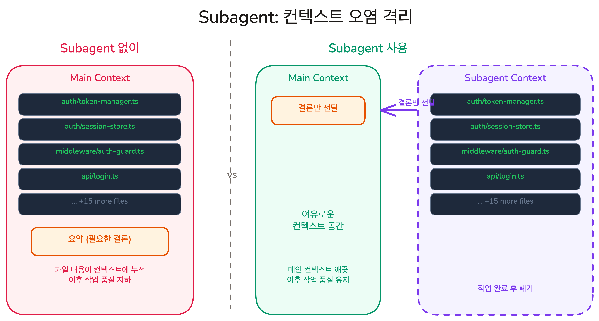

# 역할 분담이 아니라 컨텍스트 제어 | Custom Agent

## Overview

서브 에이전트를 "프론트엔드 담당", "백엔드 담당"처럼 역할별로 나누는 것은 자연스러워 보이지만, 서브 에이전트에서는 잘못된 접근입니다. 인간 팀에서 역할 분리가 작동하는 이유는 각 사람이 수년간의 경험이라는 영구적 컨텍스트를 갖고 있기 때문입니다. LLM은 상태가 없어서, 이름을 붙여도 매번 처음부터 파일을 찾아야 합니다.

서브 에이전트의 올바른 용도는 **컨텍스트 오염 제어**입니다. "이 프로젝트의 인증 코드를 전부 찾아줘"라고 하면, 수십 개의 파일 내용이 메인 컨텍스트에 고스란히 누적됩니다. 조사에 필요했던 코드는 이미 역할을 다했지만 사라지지 않고, 이후 작업의 품질을 떨어뜨립니다. **Custom Agent(커스텀 에이전트)**는 이런 오염을 별도 컨텍스트에서 격리하고, 메인에는 결론만 돌려보냅니다.

### 학습 목표

- Subagent의 컨텍스트 격리가 메인 컨텍스트를 보호하는 원리를 설명할 수 있습니다
- Subagent가 효과적인 작업과 메인 컨텍스트가 적합한 작업을 구분할 수 있습니다
- `.claude/agents/`에 Custom Agent를 정의할 수 있습니다
- 테스트 계획 전문 Custom Agent를 만들고 실행할 수 있습니다

### 시작하기 전 확인사항

- Claude Code가 설치되어 있고 실행 가능한 상태 (`claude --version`)
- 프로젝트 디렉토리에 `.claude/` 폴더가 존재합니다
- 실습 프로젝트의 시작 브랜치로 전환합니다 (`git checkout ch08-02`)

`ch08-02` 브랜치는 이 레슨의 시작점입니다.

## 오염의 패턴: 많이 읽지만 결론은 짧다


"프론트엔드 에이전트", "백엔드 에이전트"처럼 역할을 나눠도, 각 에이전트는 프로젝트를 처음 보는 상태에서 시작합니다. 이름을 붙여도 `src/components/`를 기억하고 있지 않아서, 매번 파일을 처음부터 찾아 읽습니다.

**문제는 역할이 아니라, 탐색 과정에서 쌓이는 컨텍스트입니다.** AI에게 코드를 분석하거나 버그를 조사하라고 요청하면, AI는 단서를 찾기 위해 파일을 하나씩 읽어 나갑니다.

> "이 프로젝트에서 인증 관련 코드를 전부 찾아서 정리해줘"

이 요청 하나에 AI는 10~20개 파일을 읽습니다. 각 파일의 내용이 컨텍스트에 누적되어, 탐색이 끝날 때쯤 수천 줄의 코드가 쌓여 있습니다. 하지만 여러분이 필요한 것은 "인증은 `src/auth/token-manager.ts`에서 JWT로 처리되고, 갱신 로직은 142번째 줄에 있다"는 한 문단 요약뿐입니다. **입력은 방대하지만 결론은 짧은** -- 이것이 컨텍스트를 오염시키는 작업의 공통 패턴입니다.
## Subagent: 오염을 격리하고 결론만 받기



여러분이 새 프로젝트에 합류했습니다. 팀 리더가 말합니다.

> "다음 주까지 결제 모듈 리팩토링을 시작해야 해. 먼저 현재 구조부터 파악해줘."

직접 파일을 열어 수십 개를 읽고, import를 따라가고, 테스트 코드까지 확인합니다. 3시간 뒤, 책상 위에는 읽은 파일의 메모가 수북이 쌓여 있습니다.

이제 다른 방식을 생각해봅니다. 동료에게 조사를 맡깁니다.

> "결제 모듈 구조를 파악해서, A4 한 장으로 정리해줘."

동료가 같은 3시간을 들여 조사합니다. 하지만 여러분의 책상에 오는 것은 A4 한 장짜리 요약뿐입니다. 조사 과정에서 펼쳤던 수십 개의 파일은 동료의 책상에 남습니다.

**Subagent(서브에이전트)** — 메인과 완전히 분리된 자체 컨텍스트 윈도우에서 작업하고, 완료되면 결론만 돌려보내는 AI 에이전트입니다. 탐색 과정에서 읽은 수십 개 파일의 내용은 Subagent의 컨텍스트에 남고, 메인 컨텍스트에는 **결론만 추가**됩니다.

Subagent 안에서 파일을 20개 읽든 100개 읽든, 메인 컨텍스트에는 아무 영향이 없습니다. Subagent의 컨텍스트는 작업이 끝나면 폐기되고, 메인에는 결론 텍스트만 남습니다.

> [!NOTE] 작은 질문에는 Subagent가 비효율적
> Subagent를 띄우면 별도의 AI 세션을 새로 시작하는 것이므로 준비 시간이 듭니다. "이 함수 뭐하는 거야?" 같은 단순한 질문은 메인 컨텍스트에서 바로 처리하는 것이 빠릅니다.

### Claude Code의 내장 Subagent

Claude Code에는 용도별로 미리 정의된 Subagent가 있습니다.

| Subagent | 용도 | 특징 |
|----------|------|------|
| **Explore** | 코드베이스 검색, 파일 구조 파악 | 읽기 전용, 빠른 모델(Haiku) 사용 |
| **Plan** | 구현 계획 수립을 위한 조사 | 읽기 전용, 코드를 수정하지 않음 |
| **general-purpose** | 복잡한 다단계 작업 | 모든 도구 사용 가능 |
| **Bash** | 터미널 명령 실행 | 별도 컨텍스트에서 명령 실행, 파일 쓰기 가능 |

Claude Code는 요청의 성격에 따라 적합한 Subagent를 자동으로 선택합니다. "이 프로젝트의 폴더 구조를 알려줘"라고 하면 Explore가, "리팩토링 계획을 세워줘"라고 하면 Plan이 활성화됩니다.

Subagent는 중첩 실행이 불가능합니다. Subagent 안에서 또 다른 Subagent를 띄울 수 없습니다.

#### 언제 Subagent를 사용하는가?

기준은 간단합니다. **그 작업이 부모 컨텍스트를 얼마나 오염시키는가**입니다. 서브 에이전트로 분리할 작업에는 공통점이 있습니다 -- 입력(읽는 양)은 방대하지만 출력(결론)은 짧습니다.

| 작업 | 하는 일 | 부모에게 반환하는 것 |
|------|---------|---------------------|
| 리서치 | 코드베이스에서 특정 기능의 동작 방식 추적 | 관련 파일 경로, 줄 번호, 호출 체인 요약 |
| 테스트 실행 | 테스트 돌리고 결과 분석 | 실패한 테스트명, 에러 핵심, 관련 파일 |
| 빌드 검증 | 빌드 돌리고 에러 분석 | 에러 원인 요약과 수정 필요 파일 |
| 의존성 조사 | 특정 함수/모듈의 사용처 추적 | 사용처 목록과 영향 범위 |

**메인 컨텍스트가 더 나은 작업:**

- 단순한 질문 ("이 함수 뭐하는 거야?")
- 단일 파일 수정
- 직전 대화 맥락이 필요한 이어지는 작업

이런 작업은 오염 범위가 작고, 오히려 Subagent를 띄우는 오버헤드가 더 큽니다.

내장 Subagent로 컨텍스트 격리 문제는 해결됩니다. 하지만 테스트 분석처럼 같은 기준으로 반복하는 작업이라면, 매번 분석 기준과 출력 형식을 처음부터 설명해야 할까요?

## Custom Agent: 전문 Subagent를 정의하기

내장 Subagent는 범용 도구라서, 매번 분석 기준과 출력 형식을 프롬프트에 직접 설명해야 합니다. **Custom Agent**는 `.claude/agents/` 디렉토리에 마크다운 파일 하나로 이런 지침을 미리 정의한 **전문 Subagent**입니다.

Custom Agent `test-planner`를 만들어 두면:

> "테스트 계획 세워줘"

Claude가 `test-planner` Agent의 `description`을 보고 이 작업에 적합하다고 판단하면, 자동으로 Subagent를 띄워 실행합니다.

```plain text
.claude/
├── agents/
│   ├── test-planner.md       # 테스트 계획 전문
│   ├── explorer.md           # 코드베이스 탐색 전문
│   └── bug-investigator.md   # 버그 원인 추적 전문
├── commands/
└── settings.json
```

파일 이름이 Agent의 호출 이름이 됩니다. `test-planner.md`를 만들면 Agent 목록에서 `test-planner`로 나타납니다.

## 직접 만들어보기: 테스트 계획 전문 Agent

테스트 커버리지 분석은 Subagent의 대표적인 활용 사례입니다. 소스 코드 파일을 하나씩 읽고, 테스트 파일과 대조하고, 빠진 부분을 정리하는 과정에서 대량의 코드가 컨텍스트에 쌓입니다.

Custom Agent로 이 작업을 격리하면, 메인 컨텍스트에는 테스트 계획만 남습니다.

### Step 1: Agent 파일 작성

`.claude/agents/test-planner.md`를 다음과 같이 작성합니다.

```markdown
---
name: test-planner
description: "소스 코드와 테스트 파일을 대조하여 테스트가 부족한 영역을 찾고 테스트 계획을 수립합니다. 테스트 계획, 테스트 분석, 테스트가 부족한 부분 찾기, 어떤 테스트가 필요한지 요청 시 사용합니다."
model: sonnet
tools: Read, Grep, Glob, Bash
---

# Test Planner

소스 코드와 기존 테스트를 대조 분석하여, 테스트가 부족한 영역을 찾고 우선순위별 테스트 계획을 제공합니다.

## 분석 프로세스

1. 소스 코드 파일과 테스트 파일 목록을 각각 수집합니다
2. 함수/컴포넌트별로 대응하는 테스트 존재 여부를 대조합니다
3. 테스트가 없는 항목을 아래 기준에 따라 분류합니다

## 분류 기준

- **High**: 상태를 변경하는 핵심 로직 (생성, 수정, 삭제)
- **Medium**: 조건 분기가 있는 로직 (필터링, 정렬, 검증)
- **Low**: 단순 표시 로직 (포맷팅, UI 렌더링)

## 출력 형식

다음 구조로 분석 결과를 작성합니다.

**커버리지 현황**: 소스 파일 수, 테스트가 있는 파일 수, 비율

**우선순위별 테스트 필요 항목**:
- High: [파일:함수] 이유
- Medium: [파일:함수] 이유
- Low: [파일:함수] 이유

**추천 테스트 케이스**: 가장 시급한 항목 3개의 구체적 시나리오

## 규칙

- 테스트 코드를 직접 작성하지 않습니다 -- 계획만 제공합니다
- 유틸리티보다 비즈니스 로직 테스트를 우선합니다
- 테스트가 충분하면 "추가 테스트 불필요"라고 명확히 표시합니다
```

Agent 마크다운 파일은 **YAML frontmatter + 본문**으로 구성됩니다. frontmatter 필드는 다음과 같습니다.

| 필드 | 필수 | 설명 |
|------|------|------|
| `name` | O | Agent의 고유 식별자 (파일명과 일치) |
| `description` | O | Claude가 자동 위임 시 참고하는 설명. Claude가 이 값을 보고 작업에 맞는 Agent를 선택합니다 |
| `model` | X | 사용할 모델 (`sonnet`, `opus`, `haiku`). 생략하면 메인과 동일 모델 사용 |
| `tools` | X | Agent가 사용할 수 있는 도구 제한. 생략하면 모든 도구 사용 가능 |

본문은 Agent의 시스템 프롬프트가 됩니다. 역할, 작업 방식, 출력 형식, 규칙을 정의합니다.

### Step 2: Claude Code 재시작

`.claude/agents/` 디렉토리에 새 파일을 추가하면, Claude Code를 재시작해야 인식합니다. `/exit`으로 종료한 뒤 `claude`로 다시 시작합니다.

### Step 3: Agent 실행

Claude Code에서 Agent를 호출하는 방법은 두 가지입니다.

- **자연어 요청**: "테스트가 부족한 부분을 분석해줘" -- Claude Code가 적합한 Agent를 자동으로 선택합니다
- **명시적 지정**: "test-planner 에이전트로 테스트 계획을 세워줘"

실행이 시작되면 터미널에 Subagent가 활성화되었다는 표시가 나타나고, 작업이 완료될 때까지 Agent가 자율적으로 파일을 읽고 분석합니다.

### Step 4: 결과 확인

Agent가 작업을 마치면, Step 1에서 정의한 출력 형식에 따라 구조화된 테스트 계획이 메인 컨텍스트에 추가됩니다. 예를 들어 다음과 같은 형태입니다.

```
**커버리지 현황**: 소스 파일 8개 중 테스트가 있는 파일 3개 (37%)

**우선순위별 테스트 필요 항목**:
- High: [todoService.ts:deleteTodo] 삭제 후 상태 갱신 로직에 테스트 없음
- High: [todoService.ts:toggleTodo] 완료 상태 토글의 엣지 케이스 미검증
- Medium: [TodoFilter.tsx:filterTodos] 빈 목록, 전체 완료 등 경계 조건 미검증

**추천 테스트 케이스**:
1. deleteTodo 호출 후 목록에서 실제 제거 확인
2. toggleTodo로 완료/미완료 반복 전환 시 상태 일관성
3. 할 일이 0개일 때 필터 동작
```

소스 파일이 8개라면, Subagent 없이 분석을 요청했을 때와 비교해 보세요. Subagent 없이는 8개 소스 파일과 3개 테스트 파일의 전체 코드가 메인 컨텍스트에 남습니다. Custom Agent를 사용하면 **테스트 계획 요약만** 남습니다.

이후 계획을 바탕으로 테스트를 작성할 때, 메인 컨텍스트가 깨끗하기 때문에 AI가 테스트 작성에 더 집중할 수 있습니다.

## 핵심 포인트 정리

1. **컨텍스트 오염 제어**: Subagent는 역할을 나누기 위한 도구가 아니라 컨텍스트 오염을 격리하기 위한 도구입니다. 판단 기준은 "그 작업이 부모 컨텍스트를 얼마나 오염시키는가"이고, 서브 에이전트에 적합한 작업의 공통점은 "입력은 방대하지만 결론은 짧다"입니다
2. **Custom Agent 정의**: `.claude/agents/`에 마크다운 파일 하나로 전문 Subagent를 정의합니다. 역할, 지침, 제약을 미리 설정해두면 매번 설명할 필요 없이 일관된 결과를 받습니다
3. **실행과 활용**: `.claude/agents/test-planner.md`처럼 전문 Agent를 만들면, "테스트 계획 세워줘" 한 마디로 Subagent가 실행되어 구조화된 결과를 받을 수 있습니다. 오염 범위가 큰 작업에 효과적이고, 단순한 질문에는 오히려 오버헤드가 됩니다

## FAQ

- **Q: Custom Agent가 메인 컨텍스트의 대화 내용을 볼 수 있나요?**
  - A: Subagent는 생성 시점에 작업 요청과 CLAUDE.md 등 일부 정보를 받지만, 이전 대화 전체를 볼 수는 없습니다. 필요한 맥락은 Agent 호출 시 명시적으로 전달해야 합니다.

- **Q: Custom Agent와 Custom Command는 어떻게 다른가요?**
  - A: Custom Command는 메인 컨텍스트에서 실행되는 프롬프트 단축키입니다. Custom Agent는 별도 컨텍스트에서 실행되는 전문 Subagent입니다. 컨텍스트를 많이 소비하는 작업은 Agent로, 간단한 반복 작업은 Command로 구분합니다.

- **Q: Agent 파일을 수정하면 바로 반영되나요?**
  - A: 네, Agent 파일은 Subagent가 생성될 때마다 새로 읽힙니다. 수정하면 다음 호출부터 바로 반영되며, 별도의 재시작이 필요 없습니다.

- **Q: 왜 Hook으로 필터링하지 않고 Subagent를 사용하나요?**
  - A: Hook은 출력 패턴이 정해진 데이터를 걸러냅니다. 하지만 코드 탐색은 어떤 파일을 읽을지 미리 알 수 없어서 패턴을 정할 수 없습니다. Subagent는 탐색 과정 전체를 별도 컨텍스트에서 격리하므로, 예측 불가능한 탐색 작업에 적합합니다.

## 한 발짝 더: 팀의 기본기를 높이는 도구

Chapter 06-08에서 배운 도구들을 다시 한번 떠올려 보세요. Rules, Custom Command, Skill, Hook, Custom Agent -- 모두 **개인의 Context 품질**을 지키기 위한 도구였습니다.

그런데 시선을 팀으로 넓혀보면, 이 도구들의 의미가 달라집니다.

팀에 새 개발자가 합류하면 ESLint 설정, 에디터 설정, Git 훅을 공유합니다. "이 프로젝트에서는 이렇게 작업해"라는 규율을 코드로 전달하는 것입니다. `.claude/` 폴더도 같은 역할을 합니다. **git에 커밋하면 팀 전체가 같은 AI 워크플로우를 실행할 수 있습니다.**

| 도구 | 개인 관점 | 팀 관점 |
|------|----------|---------|
| Rules | 내 작업에 맞는 규칙만 로드 | 팀 코딩 컨벤션을 AI가 자동으로 따름 |
| Skills | 내 전문 지침을 필요할 때만 로드 | 팀 워크플로우를 누구나 `/skill-name` 하나로 실행 |
| Hooks | 내 Context에 불필요한 데이터 차단 | 팀 전체에 동일한 품질 게이트 적용 |
| Custom Agent | 내 컨텍스트 오염 방지 | 팀 전문 분석 도구를 누구나 사용 |

같은 팀이 같은 모델을 써도, LLM 활용 능력의 편차는 큽니다. 컨텍스트를 잘 설계하는 사람은 10분 만에 끝내는 작업을, 그렇지 않은 사람은 1시간 걸리기도 합니다. 이 차이를 개인의 센스에 맡겨두면, 팀 전체의 생산성은 들쭉날쭉합니다.

`.claude/` 폴더에 팀의 노하우를 패키징하면, **누가 작업하든 일정한 수준의 결과를 기대할 수 있습니다.** LLM 활용 능력이 개인의 센스가 아닌 팀의 시스템이 되는 것입니다.

## 다음 단계

이 Chapter에서 Hook으로 AI의 데이터를 필터링하고, Custom Agent로 탐색을 별도 컨텍스트에서 격리하는 방법을 배웠습니다. Chapter 06-08에 걸쳐 Claude의 환경을 프로그래밍하는 여섯 가지 도구 -- Rules, Commands, Skills, MCP, Hooks, Custom Agent -- 를 모두 배웠습니다. 이 도구들을 git에 커밋하면, 팀 전체의 AI 워크플로우를 표준화할 수 있습니다.

Part 2에서 배운 모든 도구를 정리합니다. 다음 레슨에서는 Plan Mode, Task, 테스트, Rules, Skills, MCP, Hooks, Custom Agent가 어떻게 하나의 워크플로우로 연결되는지 조망합니다.

다음 레슨 보기: [Part 2 Wrap-up](./part-2-wrap-up)
