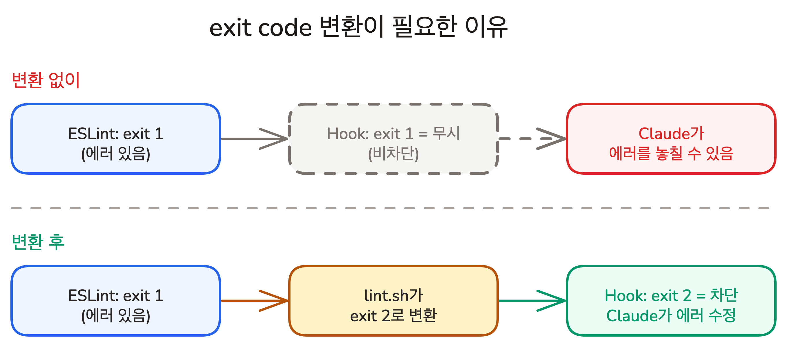
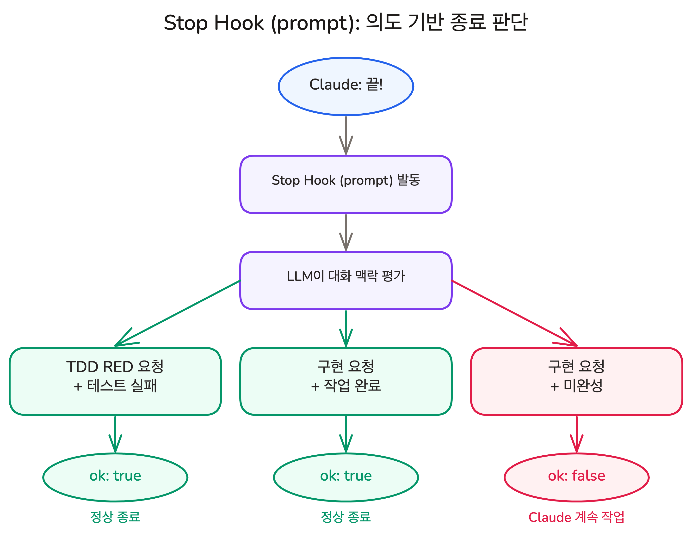

# AI가 코드 고칠 때마다 자동 검증 | Hooks

## Overview

VS Code에서 파일을 저장하면 ESLint 플러그인이 자동으로 실행됩니다. Claude Code에서도 같은 자동 검증을 만들 수 있습니다.

**Hook(훅)**은 AI가 도구를 사용하거나 작업을 마칠 때, 지정된 스크립트를 자동으로 실행하는 장치입니다. 이 레슨에서는 파일 수정 직후 lint를 실행하는 PostToolUse Hook과, 작업 완료 시 의도를 검증하는 Stop Hook을 직접 만듭니다.

### 학습 목표

- CLAUDE.md 지침(권고)과 Hook(자동 실행)의 차이를 설명할 수 있습니다
- Hook의 exit code(0, 2, 기타)로 Claude에게 피드백을 전달하는 방법을 이해합니다
- PostToolUse Hook(command)과 Stop Hook(prompt)을 직접 작성할 수 있습니다

### 시작하기 전 확인사항

- Claude Code가 설치되어 있고 실행 가능한 상태 (`claude --version`)
- 프로젝트 디렉토리에 `.claude/` 폴더가 존재합니다
- ESLint가 프로젝트에 설치되어 있습니다 (`bunx eslint --version`)
- jq가 설치되어 있습니다 (`jq --version`). 없다면 `brew install jq` (macOS) 또는 `apt install jq` (Linux)로 설치합니다
- 실습 프로젝트의 시작 브랜치로 전환합니다 (`git checkout ch08-01`)

`ch08-01` 브랜치는 이 레슨의 시작점입니다.

## VS Code에서는 되는 게 왜 Claude Code에서는 안 되나

VS Code에서 코드를 저장하면 ESLint 플러그인이 자동으로 실행됩니다. 개발자가 "ESLint 돌려야지" 하고 기억할 필요가 없습니다.

Claude Code는 VS Code 안에서 코딩하는 게 아닙니다. Write, Edit 같은 도구로 파일을 직접 수정하므로, ESLint 플러그인이 개입할 수 없습니다.

CLAUDE.md에 "파일 수정 후 ESLint를 실행하라"고 써두면 어떨까요? CLAUDE.md 지침은 AI가 읽고 판단하는 **권고(Advisory)**입니다. 컨텍스트가 길어지거나 빠른 수정이 필요할 때, AI가 "이번엔 괜찮겠지"하고 건너뛸 수 있습니다.


Hook은 AI의 판단을 거치지 않고, **지정된 시점에 자동 실행**됩니다. CLAUDE.md가 메모라면, Hook은 그 메모를 실행으로 보장하는 장치입니다.

| | CLAUDE.md 지침 | Hook |
|---|---|---|
| **실행 보장** | AI가 무시할 수 있습니다 (권고) | 매번 100% 실행됩니다 |
| **실행 주체** | AI가 스스로 판단하여 실행합니다 | 셸 스크립트가 자동으로 실행됩니다 |

> [!NOTE] Lint(린트)란?
> 코드의 문법 오류, 스타일 위반, 잠재적 버그를 자동으로 찾아주는 도구입니다. 맞춤법 검사기가 글의 오타를 찾듯, Lint는 코드의 문제를 찾습니다. ESLint는 JavaScript/TypeScript용 Lint 도구입니다.

## Hook의 구조

Hook은 세 단계로 구성됩니다. **언제** 발동할지, **어떤 조건**에서 발동할지, **무엇을** 실행할지입니다.

```
① Hook Event (언제?)  →  ② Matcher (어떤 조건?)  →  ③ Handler (뭘 실행?)
```

settings.json으로 보면 각 단계가 어디에 해당하는지 명확합니다.

```json
{
  "hooks": {
    "PostToolUse": [        // ① 이벤트: 도구 실행 직후
      {
        "matcher": "Write|Edit",  // ② 매처: Write 또는 Edit 도구일 때만
        "hooks": [
          {
            "type": "command",         // ③ 핸들러 타입
            "command": "lint.sh"       // ③ 실행할 명령
          }
        ]
      }
    ]
  }
}
```

- **Hook Event**: 언제 발동할지입니다. PostToolUse(도구 실행 직후), Stop(작업 완료 시), PreToolUse(도구 실행 전) 등이 있습니다
- **Matcher**: 어떤 조건에서 발동할지입니다. `"Write|Edit"`은 Write 또는 Edit 도구에만 반응합니다. 생략하면 모든 경우에 발동합니다
- **Handler**: 무엇을 실행할지입니다. 타입에 따라 셸 스크립트 실행, LLM 호출 등 방식이 달라집니다

핸들러는 네 가지 타입이 있습니다.

| 타입 | 실행 방식 | 적합한 상황 |
|------|-----------|------------|
| **command** | 셸 스크립트 실행 | lint, 빌드, 테스트 등 코드로 판단 가능한 검증 |
| **http** | HTTP POST 전송 | 외부 서비스 연동 (Slack 알림, 감사 로그) |
| **prompt** | LLM에게 1회 질의 | 의도 파악, 의미적 판단 등 코드로 판단하기 어려운 검증 |
| **agent** | 서브에이전트 (도구 사용) | 파일을 직접 읽고 확인해야 하는 검증 |

이 레슨에서는 가장 많이 쓰는 command 타입으로 실습 1을, 의미적 판단이 필요한 prompt 타입으로 실습 2를 진행합니다.

## 실습 1: 파일 수정 후 자동 Lint (PostToolUse)

PostToolUse는 AI가 도구를 사용한 직후에 실행되는 Hook입니다. Write나 Edit으로 파일을 수정하면 바로 발동하므로, 수정된 파일을 즉시 검증하는 데 적합합니다.

### Step 1: lint 오류가 있는 코드 직접 작성

`app/page.tsx`를 열고 다음 코드를 직접 입력합니다.

```typescript
let a = 1;
```

`a`는 선언만 되고 재할당되지 않으므로, ESLint의 `prefer-const` 규칙을 위반합니다.

### Step 2: 수동으로 ESLint 실행

터미널에서 직접 ESLint를 실행합니다.

```shell
bunx eslint app/page.tsx
```

ESLint가 `prefer-const` 에러를 출력합니다. 지금은 개발자가 직접 명령어를 입력해서 lint를 실행했습니다.

이 과정을 AI가 코드를 수정할 때마다 매번 기억하고 실행해야 한다면 어떨까요?

### Step 3: 기본 Hook 스크립트 작성

가장 단순한 형태의 Hook 스크립트부터 시작합니다. `.claude/hooks/lint.sh`를 생성합니다.

```bash
#!/bin/bash
FILE_PATH=$(jq -r '.tool_input.file_path')
bunx eslint --fix "$FILE_PATH"
```

- **`jq -r '.tool_input.file_path'`**: Hook은 도구가 사용한 정보를 JSON 형식으로 stdin에 전달합니다. **jq**는 JSON에서 원하는 값을 꺼내는 CLI 도구입니다. 여기서는 수정된 파일의 경로를 추출합니다
- **`--fix`**: 자동 수정 가능한 문제(세미콜론, import 순서 등)를 ESLint가 직접 고칩니다

스크립트에 실행 권한을 부여합니다.

```shell
chmod +x .claude/hooks/lint.sh
```

### Step 4: settings.json에 Hook 등록

`.claude/settings.json`에 다음 내용을 추가합니다.

```json
{
  "hooks": {
    "PostToolUse": [
      {
        "matcher": "Write|Edit",
        "hooks": [
          {
            "type": "command",
            "command": "\"$(git rev-parse --show-toplevel)\"/.claude/hooks/lint.sh"
          }
        ]
      }
    ]
  }
}
```

설정의 각 부분이 의미하는 바는 다음과 같습니다.

- **`"PostToolUse"`**: 도구 실행 직후에 이 Hook을 발동합니다
- **`"matcher": "Write|Edit"`**: Write 또는 Edit 도구가 사용된 직후에만 실행합니다. Bash, Read 등 다른 도구에는 반응하지 않습니다
- **`git rev-parse --show-toplevel`**: 프로젝트 루트 경로를 자동으로 찾습니다. 어떤 디렉토리에서 실행하든 정확한 스크립트 경로를 보장합니다
- **외부 스크립트 참조**: 인라인 명령 대신 별도 스크립트로 분리하면, 나중에 조건을 추가할 때 깔끔하게 관리할 수 있습니다

> [!NOTE] 기존 settings.json이 있다면?
> 이미 `settings.json`에 다른 설정이 있다면, `hooks` 키만 추가하세요. 기존 설정을 덮어쓰지 않도록 주의합니다.

### Step 5: AI에게 코드 수정 요청 -- Hook 자동 실행 확인


Claude Code를 실행한 뒤 코드 수정을 요청합니다.

> "app/page.tsx에 제목을 변수로 분리해줘"

AI가 `var title = "Todo"`로 변수를 선언하는 순간, Hook이 자동으로 ESLint를 실행합니다. ESLint의 `prefer-const` 규칙은 재할당되지 않는 변수에 `const` 사용을 강제합니다. 이 규칙은 `--fix`로 자동 수정이 가능하므로, Hook이 `var`를 `const`로 즉시 수정합니다.

AI가 작성한 코드가 Hook에 의해 자동으로 교정된 것입니다. **"lint 돌려줘"라고 지시한 적이 없는데도**, Hook이 파일 수정을 감지하고 자동으로 실행했습니다.

`--fix`로 자동 수정 가능한 문제는 잘 처리됩니다. 하지만 자동 수정이 불가능한 에러는 어떨까요? 이어서 다음과 같이 요청합니다.

> "title 변수에 any 타입을 지정해줘"

AI가 `const title: any = "Todo"`로 수정합니다. ESLint의 `no-explicit-any` 규칙은 `any` 타입 사용을 금지합니다. 이 규칙은 `--fix`로 자동 수정이 불가능하므로, ESLint가 에러를 출력하고 exit 1을 반환합니다.

그런데 AI가 이 에러를 무시하고 넘어갑니다. 왜일까요?

### Step 6: exit code로 에러를 확실히 전달하기

Hook은 exit code로 결과를 판단합니다. **exit 0**은 성공, **exit 2**는 차단(Claude에게 에러를 피드백), 그 외는 무시입니다. 문제는 ESLint가 에러를 발견하면 exit 1을 반환한다는 점입니다. Hook은 exit 1을 "무시"로 처리하므로, Claude에게 에러가 전달되지 않습니다.



스크립트에서 ESLint의 exit 1을 Hook의 exit 2로 변환하면, Claude가 에러를 확실히 인식하고 수정합니다. 확장자 필터링도 함께 추가한 완성 스크립트입니다.

```bash
#!/bin/bash
FILE_PATH=$(jq -r '.tool_input.file_path')

if [[ ! "$FILE_PATH" =~ \.(js|jsx|ts|tsx|mjs)$ ]]; then
  exit 0
fi

RESULT=$(bunx eslint --fix "$FILE_PATH" 2>&1)
ESLINT_EXIT=$?

if [ $ESLINT_EXIT -eq 0 ]; then
  exit 0
elif [ $ESLINT_EXIT -eq 1 ]; then
  echo "$RESULT" >&2
  exit 2
else
  exit 1
fi
```

- **`RESULT=$(bunx eslint --fix "$FILE_PATH" 2>&1)`**: ESLint를 실행하고 결과를 변수에 저장합니다. `2>&1`은 에러 출력도 함께 캡처합니다
- **`ESLINT_EXIT=$?`**: 직전 명령의 exit code입니다. ESLint는 0(문제없음), 1(에러), 2(설정 오류)를 반환합니다
- **`echo "$RESULT" >&2`**: ESLint 결과를 stderr로 출력합니다. Hook에서 stderr 내용이 Claude에게 피드백됩니다
- **`exit 2`**: Hook의 "차단" 신호입니다. Claude에게 "에러를 수정하라"는 메시지가 전달됩니다

`lint.sh`를 위 스크립트로 교체한 뒤, 같은 요청을 다시 보냅니다.

> "title 변수에 any 타입을 지정해줘"

이번에는 Hook이 ESLint의 exit 1을 exit 2로 변환하여 Claude에게 `no-explicit-any` 에러를 피드백합니다. Claude는 이 피드백을 읽고, `any`를 `string`으로 수정합니다.

## 실습 2: 테스트 통과해야 끝 (Stop)

실습 1의 PostToolUse는 command 타입으로, 코드 로직(exit code)으로 판단했습니다. 모든 판단을 코드로 할 수 있을까요?

TDD에서는 RED 단계에서 실패하는 테스트를 먼저 작성합니다. "테스트만 작성해줘"라고 요청하면, 테스트 실패가 정상입니다.

command 타입으로 `bun run test`를 실행하면 어떻게 될까요? 테스트 실패 = exit 1 → 무조건 차단됩니다. 사용자의 의도와 반대입니다. **command는 "테스트 실패"만 볼 수 있고, "사용자의 의도"는 볼 수 없습니다.**

**prompt** 타입은 LLM에게 대화 맥락을 보여주고 판단을 맡깁니다. "사용자가 테스트만 요청했으니 실패는 정상" → 통과. "사용자가 구현을 요청했는데 테스트가 실패" → 차단.



### Step 1: settings.json에 Stop prompt Hook 등록

기존 PostToolUse 아래에 Stop Hook을 추가합니다.

```json
{
  "hooks": {
    "PostToolUse": [
      {
        "matcher": "Write|Edit",
        "hooks": [
          {
            "type": "command",
            "command": "\"$(git rev-parse --show-toplevel)\"/.claude/hooks/lint.sh"
          }
        ]
      }
    ],
    "Stop": [
      {
        "hooks": [
          {
            "type": "prompt",
            "prompt": "Claude가 작업을 끝내려 한다: $ARGUMENTS\n\n판단 기준:\n- TDD RED 단계(테스트만 작성)를 요청했다면 테스트 실패는 정상이다 → {\"ok\": true}\n- 구현을 요청했는데 작업이 미완성이라면 → {\"ok\": false, \"reason\": \"미완성 항목\"}\n- 의도가 불명확하면 → {\"ok\": true}",
            "timeout": 30
          }
        ]
      }
    ]
  }
}
```

- **`"type": "prompt"`**: 셸 스크립트 대신 LLM에게 판단을 맡깁니다
- **`$ARGUMENTS`**: Hook이 받은 입력 JSON(대화 맥락 포함)이 이 자리에 들어갑니다
- LLM은 `{"ok": true}` 또는 `{"ok": false, "reason": "..."}`로 응답합니다
- `"ok": false`이면 reason이 Claude에게 전달되어 작업을 계속합니다

command 타입과 prompt 타입의 차이입니다.

| | command (실습 1) | prompt (실습 2) |
|---|---|---|
| 판단 방식 | exit code (코드 로직) | LLM이 대화 맥락을 읽고 판단 |
| 스크립트 필요 | 필요 (.sh 파일) | 불필요 (프롬프트만) |
| 응답 형식 | exit 0/2 | \{"ok": true/false\} |
| 적합한 상황 | 결과가 명확 (lint 통과/실패) | 의도 파악 필요 (TDD 단계 구분) |

### Step 2: TDD RED 요청 -- 허용 확인

Claude Code에 다음과 같이 요청합니다.

> "app/utils/auth.ts에 validateEmail과 hashPassword 함수에 대한 실패하는 테스트만 작성해줘"

Claude가 두 함수에 대한 테스트를 작성하고 작업을 마칩니다. Stop Hook이 발동하여 LLM이 대화 맥락을 평가합니다. "TDD RED 요청이므로 테스트 실패는 정상" → `{"ok": true}` → 종료를 허용합니다.

### Step 3: 구현 요청 -- 미완성이면 차단

이어서 다음과 같이 요청합니다.

> "이제 테스트가 통과하도록 구현해줘. hashPassword부터 시작해"

"hashPassword부터 시작해"라는 힌트 때문에, Claude가 `hashPassword`만 구현하고 작업을 마치려 할 수 있습니다. Stop Hook이 발동하여 LLM이 대화 맥락을 평가합니다. "구현을 요청했는데 `validateEmail`이 미완성" → `{"ok": false, "reason": "validateEmail 함수가 미완성입니다"}` → **종료를 차단**합니다.

Claude는 이 피드백을 받고 자동으로 `validateEmail`을 구현합니다. 구현을 마치고 다시 멈추려 하면, Stop Hook이 다시 발동합니다. 이번에는 모든 테스트가 통과하므로 "구현 요청이고 작업이 완료됨" → `{"ok": true}` → 종료를 허용합니다.

사용자가 개입하지 않았는데도, Stop Hook이 미완성을 감지하고 AI에게 피드백하여 작업을 완료시킨 것입니다.

> [!NOTE] 더 많은 Hook 이벤트
> 이 레슨에서는 PostToolUse와 Stop을 실습했지만, 도구 실행 **전에** 발동하는 PreToolUse도 있습니다. Claude Code는 SessionStart, UserPromptSubmit, Notification 등 더 많은 Hook 이벤트를 지원합니다. 전체 목록은 [공식 문서](https://docs.anthropic.com/en/docs/claude-code/hooks)를 참고하세요.

## 핵심 포인트 정리

1. **CLAUDE.md는 권고, Hook은 강제**: CLAUDE.md 지침은 AI가 무시할 수 있지만, Hook은 매번 100% 실행됩니다
2. **타이밍과 타입 선택**: PostToolUse + command로 파일 단위 즉시 검증, Stop + prompt로 의도 기반 최종 관문입니다. 코드로 판단 가능하면 command, 의도 파악이 필요하면 prompt를 선택합니다
3. **exit code는 소통 언어**: exit 0은 통과, exit 2는 차단+피드백, 그 외는 무시입니다. 외부 도구의 exit code를 Hook의 exit code로 매핑해야 합니다

## 더 해볼 것들

**PostToolUse** -- 파일 수정 직후 검증:

- AI가 코드를 수정할 때마다 Prettier로 자동 포맷팅합니다
- AI가 JSON 파일을 수정하면 스키마 유효성을 검증합니다

**Stop** -- AI 작업 완료 시 전체 검증:

- AI가 모든 작업을 마치면 전체 빌드(`bun run build`)를 실행합니다
- agent 타입으로 파일을 직접 읽어 검증합니다 (prompt보다 정확, 비용 높음)

**PreToolUse** -- 도구 실행 전 제어:

- 테스트 출력을 필터링합니다 (2,000줄 → FAIL/ERROR만 50줄)
- 특정 디렉토리 수정을 차단합니다

## FAQ

- **Q: Hook을 너무 많이 설정하면 오히려 느려지지 않나요?**
  - A: Hook은 셸 스크립트이므로 대부분 밀리초 단위로 실행됩니다. 다만 무거운 빌드나 전체 테스트를 Hook에 넣으면 매 도구 호출마다 지연이 생길 수 있습니다. 가벼운 검증(lint, grep 필터링)은 부담이 거의 없고, 무거운 검증(전체 빌드)은 Stop Hook에만 넣는 것을 권장합니다.

- **Q: Hook 스크립트에서 에러가 나면 AI 작업이 중단되나요?**
  - A: exit code에 따라 동작이 달라집니다. exit 0은 성공, exit 2는 차단 에러로 stderr가 AI에게 피드백됩니다. 그 외(exit 1 등)는 비차단 에러로, AI에게 직접 피드백되지 않습니다. 자세한 매핑은 실습 1의 Step 6을 참고하세요.

- **Q: CLAUDE.md 지침이 잘 동작하는데도 Hook으로 바꿔야 하나요?**
  - A: 아닙니다. CLAUDE.md 지침으로 충분한 경우가 많습니다. Hook은 "한 번이라도 빠지면 문제가 생기는 작업"에 사용합니다. 코드 스타일 권장은 CLAUDE.md로, 보안 파일 수정 차단은 Hook으로 구분하세요.

- **Q: lint 검증을 CLAUDE.md에 "파일 수정 후 eslint 실행해줘"라고 쓰면 안 되나요?**
  - A: CLAUDE.md 지침은 AI가 상황에 따라 건너뛸 수 있습니다. 빠른 수정이 필요하거나 컨텍스트가 길어지면 AI가 "이번엔 괜찮겠지"하고 lint를 생략할 수 있습니다. PostToolUse Hook은 예외 없이 매번 실행되므로, lint 오류가 누적되지 않고 즉시 수정됩니다.

- **Q: prompt 타입 Hook은 LLM을 호출하니까 비용이 발생하나요?**
  - A: 네, 기본적으로 빠른 모델(Haiku)을 사용하므로 비용은 낮습니다. Stop Hook은 Claude가 응답을 끝낼 때만 발동하므로 호출 횟수도 적습니다. 반면 PostToolUse에 prompt 타입을 넣으면 파일 수정마다 LLM을 호출하므로 command 타입이 적합합니다.

## 다음 단계

Hook으로 AI의 코드 수정을 자동 검증하는 방법을 배웠습니다. 다음 레슨에서는 **별도의 컨텍스트에서 작업하는 Custom Agent**를 만듭니다.

- Subagent의 컨텍스트 격리 원리
- `.claude/agents/`에 전문 에이전트 정의하기

다음 레슨 보기: [역할 분담이 아니라 컨텍스트 제어](./custom-agent)
