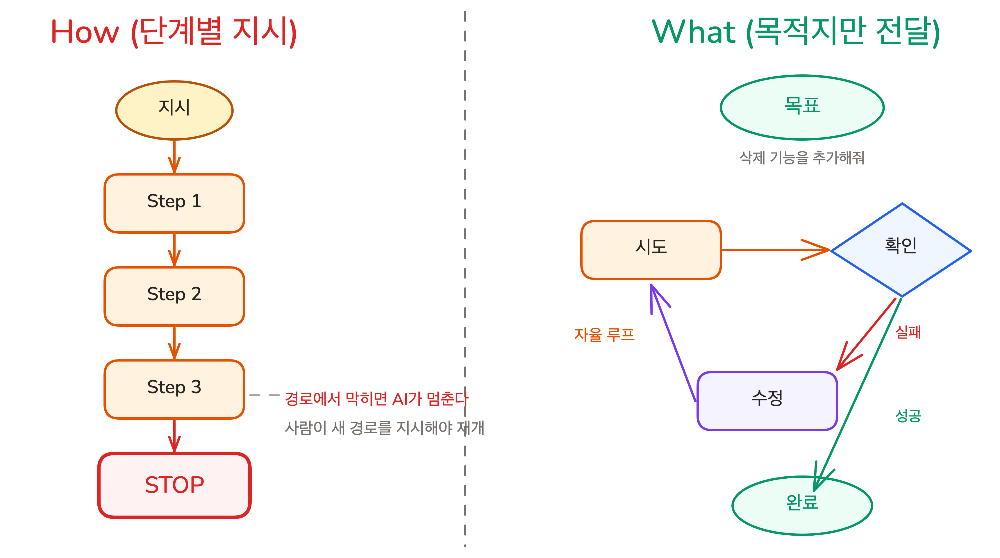
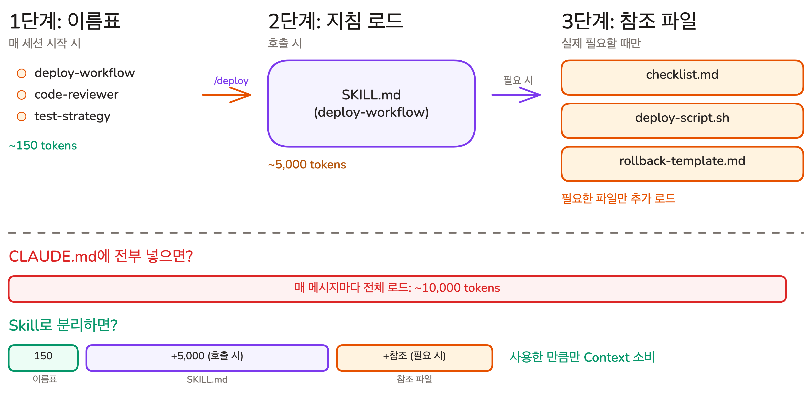
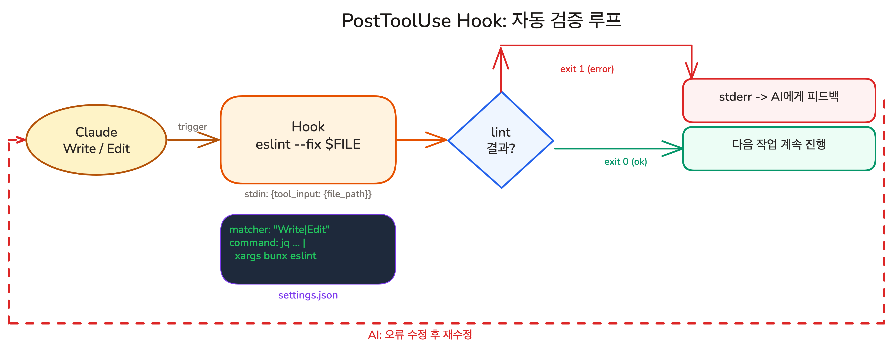

## AI에게 일을 맡기는 구조

### What vs How, 그리고 자율 루프

Part 1의 수동 체크리스트를 코드로 바꾸면서 Part 2가 시작되었습니다. 핵심 전환은 "어떻게 하라"에서 "무엇이 되어야 하라"로의 전환입니다.

- **What vs How**: How는 단계를 하나하나 지시합니다. What은 목적지만 알려줍니다. AI가 막혔을 때 스스로 다른 방법을 시도할 수 있으려면 What이어야 합니다
- **테스트 기반 검증**: 수동 체크리스트를 테스트 코드로 변환하면, AI가 코드 변경 후에도 기존 기능이 정상인지 자동으로 확인합니다. `bun test` 한 번이 브라우저 수동 클릭을 대체합니다
- **성공 기준**: "잘 동작해야 한다"가 아니라 "이 입력이면 이 출력"입니다. 구체적 입출력이 있어야 AI가 스스로 검증할 수 있습니다
- **자율 루프**: 테스트가 있으면 AI가 시도 -> 확인 -> 수정을 스스로 반복합니다. 코드는 실행하면 맞다/틀리다가 즉시 나오는 매체이기 때문에 가능합니다

### 계획과 작업의 연결

성공 기준은 테스트 코드뿐 아니라 계획에도 적용됩니다. 계획은 context overflow와 auto-compact를 거쳐도 유지되어야 합니다.

- **성공 기준과 Red Green Refactor**: 요구사항 + 성공 기준 + 범위 제한으로 계획을 세우고, 성공 기준을 테스트로 먼저 변환한 뒤 한 번에 하나씩 구현합니다. Plan -> 실행 -> 발견 -> 다시 Plan 사이클로 기능을 정교하게 다듬습니다
- **Task 시스템**: 작업 목록을 `~/.claude/tasks/`에 JSON으로 저장합니다. auto-compact가 대화를 요약해도 파일의 진행 상황은 그대로 남습니다. blockedBy/blocks로 의존성을 설정하면 독립 작업의 병렬 실행이 가능해집니다

## Context 품질을 지키는 도구

### 입력을 줄이는 도구: Rules, Commands, Skills

CLAUDE.md에 모든 규칙을 넣으면 작업과 무관한 규칙까지 매번 로드됩니다. 반복되는 프롬프트도 Context를 낭비합니다. 세 도구가 이를 해결합니다.

- **Rules**: `.claude/rules/`에 주제별 파일로 규칙을 분리합니다. `paths` frontmatter로 특정 경로에서만 활성화할 수 있어서, 프론트엔드 규칙이 백엔드 작업 중에 로드되지 않습니다
- **Custom Commands**: `.claude/commands/`에 마크다운 파일 하나 = 슬래시 한 단어로 호출. `$ARGUMENTS`로 입력을 받고, `allowed-tools`로 승인을 생략할 수 있습니다
- **Skills**: 호출할 때만 로드되는 전문 지침입니다. Progressive Disclosure -- 이름표(30토큰) -> 지침 -> 참조 파일 순서로, 필요한 만큼만 단계적으로 로드합니다
- **Command vs Skill**: Command는 사용자가 수동 호출하는 프롬프트 단축키, Skill은 Claude가 상황을 판단해 자동 로드할 수 있는 다단계 워크플로우입니다
- **Skill 만들기와 설치**: SKILL.md에 `name`과 `description`을 정의하면 Skill이 됩니다. `description`이 Claude의 자동 로드 판단 기준입니다. 직접 만들 수도 있고, Anthropic 공식 Plugin이나 skills.sh에서 커뮤니티 Skill을 설치할 수도 있습니다

### Claude의 범위를 확장하는 외부 도구

Commands와 Skills는 Claude의 지식을 확장합니다. 하지만 Claude가 접근할 수 있는 범위 자체는 로컬 파일과 내장 도구에 묶여 있습니다. **CLI와 MCP**는 외부 시스템에 대한 접근권을 부여합니다.

- **MCP**: 외부 시스템을 Claude에 연결하는 표준 프로토콜입니다. MCP Server가 Tool을 정의하면, Claude(Host)가 이를 호출합니다. GitHub MCP처럼 공개 서버를 설치하거나, 내부 시스템용 서버를 직접 만들 수 있습니다
- **CLI**: 개발자도 AI도 같은 명령어를 쓸 수 있고, 결과를 파일로 저장해 필요한 만큼만 읽을 수 있습니다. CLI가 있는 서비스는 MCP보다 CLI가 더 효율적입니다
- **MCP 서버 직접 만들기**: CLI도 공개 MCP 서버도 없는 내부 시스템은 MCP 서버를 직접 만들어 연결합니다. Tool 이름, 설명, 입력 스키마를 등록하면 Claude가 즉시 사용할 수 있습니다. 복잡한 API 호출은 서버 안에 감추고, Claude에게는 단순한 인터페이스만 노출합니다
- **도구와 절차의 분리**: CLI/MCP는 도구 접근권(Capability Layer)을, Skill은 사용 절차(Procedure Layer)를 담당합니다. 도구와 절차를 분리하면, 같은 도구에 다른 Skill을 조합해 다양한 워크플로우를 만들 수 있습니다

### 실행을 제어하는 도구: Hooks와 Custom Agent

CLAUDE.md 지침은 AI가 읽고 판단하는 권고이므로 건너뛸 수 있습니다. Hook은 이 권고를 자동 실행으로 보장합니다. 탐색처럼 대량의 코드를 읽는 작업은 Custom Agent로 별도 컨텍스트에서 격리합니다.

- **Hooks**: AI가 파일을 수정할 때마다 셸 스크립트가 자동으로 실행됩니다. AI의 판단을 거치지 않으므로 **예외 없이 매번 검증**됩니다. 세 가지 타이밍 -- PreToolUse(실행 전 수정/차단), PostToolUse(실행 후 단일 파일 검증), Stop(작업 완료 시 통합 검증)
- **Custom Agent**: `.claude/agents/`에 정의한 전문 Subagent입니다. 핵심은 역할 분담이 아니라 **컨텍스트 격리**입니다. 입력은 방대하지만 결론은 짧은 작업 -- 코드 조사, 테스트 분석 등 -- 을 별도 컨텍스트에서 처리하고, 메인에는 요약만 반환합니다

## 이어서 배울 내용

Part 2에서 개별 도구를 모두 배웠습니다. Part 3에서는 이 도구들을 하나의 사이클로 연결하는 SDD 프레임워크를 배우고, Agent Teams로 확장하고, 개인 프로젝트를 완성합니다.
