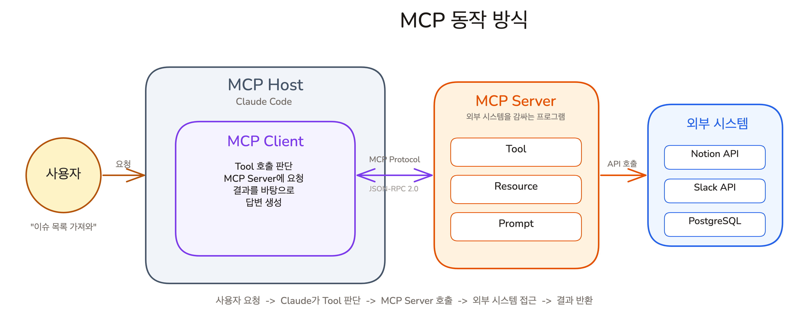
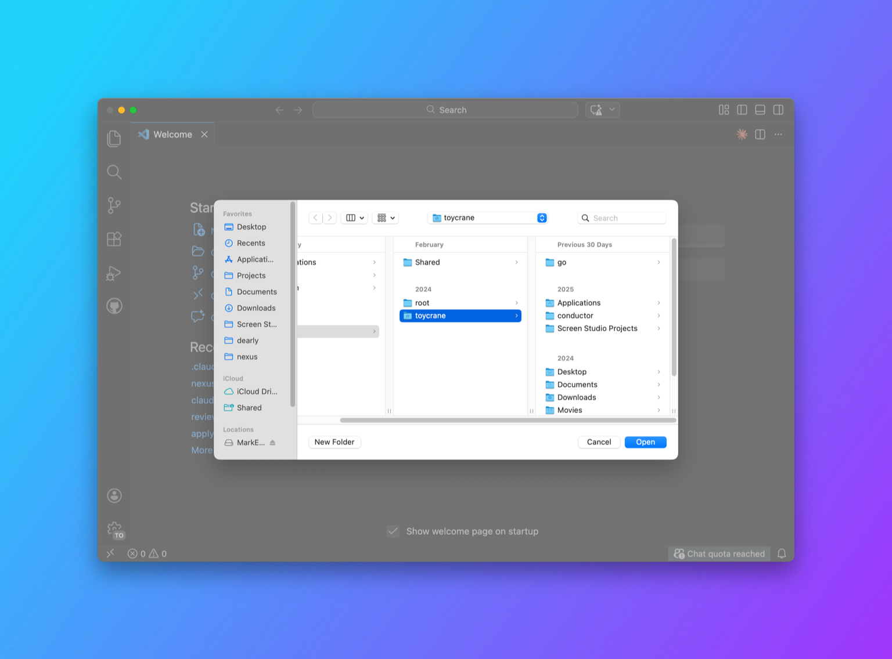

# 내 시스템을 Claude에 연결하기 | Custom MCP 서버 만들기

## Overview

이전 레슨에서 CLI가 있는 서비스는 CLI를 우선한다는 것을 배웠습니다. 하지만 사내 API나 자체 데이터베이스처럼 CLI도, 공개 MCP 서버도 없는 내부 시스템은 어떻게 Claude에 연결할까요? 이런 경우에 MCP 서버를 직접 만듭니다. MCP Builder Skill을 사용하면 Claude가 프로토콜 구조와 SDK 설정을 자동으로 처리합니다. 이번 레슨에서는 MCP Builder Skill로 날씨 API를 감싸는 MCP 서버를 직접 만들고 Claude Code에 연결합니다.

### 학습 목표

- MCP의 서버/클라이언트 구조와 실행 흐름을 설명할 수 있습니다
- MCP Builder Skill을 사용하여 MCP 서버 프로젝트를 생성할 수 있습니다
- MCP 서버의 Tool 정의(입력 스키마, 출력 형식)를 읽고 수정할 수 있습니다
- 직접 만든 MCP 서버를 Claude Code에 연결하고 동작을 확인할 수 있습니다
- 좋은 MCP 서버의 핵심 원칙(Tool 설명, 입력 스키마, 복잡성 은닉)을 설명할 수 있습니다

### 시작하기 전 확인사항

- Node.js 18 이상 설치 (`node --version`)
- Bun 설치 (`bun --version`)
- Claude Code 설치 및 인증 완료 (`claude --version`)

## MCP의 내부 구조: 서버와 클라이언트

MCP 서버를 직접 만들려면 내부 동작 방식을 알아야 합니다.



MCP는 세 가지 구성요소로 이루어져 있습니다.

**MCP Server**는 외부 시스템을 감싸는 프로그램입니다. 세 가지를 노출합니다.

- **Tool**: Claude가 호출할 수 있는 기능입니다. "날씨 조회", "이슈 생성" 같은 것들입니다. 이번 레슨에서 직접 만들 부분입니다
- **Resource**: Claude가 읽을 수 있는 데이터입니다. 설정 파일, 상태 정보 등을 제공합니다
- **Prompt**: 미리 정의된 프롬프트 템플릿입니다. 특정 작업에 최적화된 프롬프트를 서버가 제공합니다

이 중 **Tool이 가장 핵심**입니다. 대부분의 MCP 서버는 Tool만 구현해도 충분합니다.

**MCP Client**는 MCP Server에 연결하여 Tool을 사용하는 쪽입니다. Claude Code가 이 역할을 합니다.

**MCP Host**는 Client를 포함하는 프로그램입니다. Claude Code 자체가 Host이면서 동시에 Client입니다. Claude Desktop, Cursor 같은 AI 도구도 각각 MCP Host입니다.


사용자가 "서울 날씨 어때?"라고 요청하면, Claude가 어떤 MCP Tool을 호출할지 판단합니다. Client가 Server에 요청을 보내고, Server가 외부 시스템(날씨 API)에 접근하여 결과를 반환하면, Claude가 결과를 토대로 답변을 생성합니다.

## MCP Builder Skill: AI가 MCP를 만들어준다

**MCP Builder Skill**은 Anthropic이 공식 제공하는 Skill입니다. 어떤 외부 API를 감쌀지 설명하면, Claude가 MCP 서버 프로젝트 전체를 생성합니다. 프로젝트 구조, SDK 설정, Tool 정의, 입출력 스키마까지 자동으로 만들어줍니다.

> [!NOTE] SDK란?
> SDK(Software Development Kit)는 특정 기능을 쉽게 만들 수 있도록 미리 준비된 코드 모음입니다. MCP SDK는 MCP 서버를 만들기 위한 함수와 도구를 제공합니다. 직접 프로토콜을 구현할 필요 없이, SDK가 제공하는 함수를 호출하면 됩니다.

이 레슨에서는 MCP Builder Skill을 사용하여 날씨 API를 감싸는 MCP 서버를 만듭니다. 완성되면 Claude에게 "서울 날씨 어때?"라고 물었을 때, Claude가 실시간 날씨 데이터를 가져와서 답변합니다.

## 날씨 MCP 서버 만들기


이번 실습은 기존 프로젝트와 무관한 **독립 프로젝트**를 처음부터 새로 만듭니다. MCP 서버는 자체 `package.json`과 의존성을 가진 독립 프로세스이기 때문입니다.

외부 API는 [Open-Meteo](https://open-meteo.com)를 사용합니다. API 키 없이 무료로 사용할 수 있어서 MCP 서버 구조 자체에 집중할 수 있습니다.

### Step 1: 프로젝트 폴더 생성

MCP 서버는 자체 의존성을 가진 독립 프로세스이므로, 기존 프로젝트와 분리된 새 폴더에서 시작합니다.

VS Code에서 `File > Open Folder`를 클릭합니다. 파일 탐색기가 열리면 좌측 하단의 `New Folder` 버튼을 눌러 `weather-mcp` 폴더를 생성하고, 해당 폴더를 선택하여 엽니다.



### Step 2: MCP Builder Skill 설치

Anthropic 공식 Skill은 [skills.sh](https://skills.sh)에서 설치할 수 있습니다. VS Code의 터미널에서 다음 명령어를 실행합니다.

```shell
npx skills add https://github.com/anthropics/skills --skill mcp-builder
```

이 명령어는 MCP Builder Skill을 현재 프로젝트에 설치합니다. `.claude/skills/` 폴더 안에 Skill 파일이 생성됩니다.

### Step 3: Claude Code 시작 및 Skill 확인

Claude Code를 시작합니다.

```shell
claude
```

`/` 키를 눌러 사용 가능한 Skill 목록을 확인합니다. `mcp-builder`가 목록에 나타나면 설치가 완료된 것입니다.

### Step 4: MCP 서버 프로젝트 생성

Claude Code에서 다음과 같이 요청합니다.

> /mcp-builder 도시 이름을 입력하면 현재 날씨 정보(기온, 풍속, 습도)를 반환하는 MCP 서버를 typescript로 만들어줘. 프로젝트 폴더명은 weather-mcp-server로 해줘. Open-Meteo API를 사용하고, API 키 없이 사용할 수 있어야 해.

Claude가 MCP Builder Skill의 지침을 따라 프로젝트를 생성합니다. 프로젝트 폴더 구조는 다음과 같습니다.

```
weather-mcp/
└── weather-mcp-server/
    ├── package.json
    ├── src/
    │   └── index.ts        # MCP 서버 메인 파일
    └── README.md
```

Bun은 TypeScript를 네이티브로 지원하므로 별도의 빌드 과정이 필요 없습니다. `tsconfig.json`이나 `build/` 폴더 없이 `bun run src/index.ts`로 바로 실행합니다.

> [!NOTE] 결과가 다를 수 있습니다
> AI가 생성하는 코드는 실행할 때마다 세부 사항이 달라질 수 있습니다. 파일 구조나 변수 이름이 아래 예시와 다르더라도 정상입니다. 중요한 것은 핵심 구조(Tool 정의, 입출력 스키마, 서버 연결)가 동일한지입니다.

### Step 5: 생성된 코드 이해하기

MCP Builder Skill이 생성한 코드의 핵심 구조를 살펴봅니다. `src/index.ts`의 핵심 부분은 다음과 같습니다.

```typescript
import { McpServer } from "@modelcontextprotocol/sdk/server/mcp.js";
import { StdioServerTransport } from "@modelcontextprotocol/sdk/server/stdio.js";
import { z } from "zod";

// MCP 서버 인스턴스 생성
const server = new McpServer({
  name: "weather",
  version: "1.0.0",
});
```

**서버 선언부**입니다. `@modelcontextprotocol/sdk`는 MCP 서버를 만들기 위한 공식 SDK입니다. `name`과 `version`은 Claude Code가 이 서버를 식별하는 데 사용합니다.

```typescript
// Tool 정의: Claude가 호출할 수 있는 행동
server.registerTool(
  "get-weather",
  {
    title: "Get Weather",
    description: "도시 이름으로 현재 날씨를 조회합니다",
    inputSchema: {
      city: z.string().describe("도시 이름 (예: Seoul, Tokyo, New York)"),
    },
  },
  async ({ city }) => {
    // 1. 도시 이름 -> 좌표 변환 (Geocoding)
    const geoRes = await fetch(
      `https://geocoding-api.open-meteo.com/v1/search?name=${encodeURIComponent(city)}&count=1`
    );
    const geoData = (await geoRes.json()) as {
      results?: { latitude: number; longitude: number; name: string; country: string }[];
    };

    if (!geoData.results?.length) {
      return {
        content: [{ type: "text" as const, text: `"${city}" 도시를 찾을 수 없습니다.` }],
      };
    }

    const { latitude, longitude, name, country } = geoData.results[0];

    // 2. 좌표 -> 날씨 데이터 조회
    const weatherRes = await fetch(
      `https://api.open-meteo.com/v1/forecast?latitude=${latitude}&longitude=${longitude}&current=temperature_2m,weathercode,windspeed_10m,relative_humidity_2m`
    );
    const weather = (await weatherRes.json()) as {
      current: { temperature_2m: number; windspeed_10m: number; relative_humidity_2m: number };
    };
    const current = weather.current;

    // 3. 결과 반환 (content 배열 형식)
    return {
      content: [{
        type: "text" as const,
        text: [
          `${name}, ${country}의 현재 날씨:`,
          `- 기온: ${current.temperature_2m}°C`,
          `- 풍속: ${current.windspeed_10m} km/h`,
          `- 습도: ${current.relative_humidity_2m}%`,
        ].join("\n"),
      }],
    };
  }
);
```

**Tool 정의부**입니다. `server.registerTool()`이 MCP의 핵심입니다. 세 가지 인자를 받습니다.

| 인자 | 역할 | 예시 |
|------|------|------|
| Tool 이름 | Claude가 이 도구를 식별하는 ID | `"get-weather"` |
| 설정 객체 | Tool의 메타데이터를 담은 객체 | `{ title, description, inputSchema }` |
| 실행 함수 | 실제 동작 (API 호출, 데이터 처리) | `async ({ city }) => { ... }` |

설정 객체 안의 세 필드가 Tool의 품질을 결정합니다.

| 필드 | 역할 | 예시 |
|------|------|------|
| `title` | UI에 표시되는 이름 | `"Get Weather"` |
| `description` | Claude가 이 Tool을 쓸지 판단하는 근거 | `"도시 이름으로 현재 날씨를 조회합니다"` |
| `inputSchema` | Claude가 어떤 데이터를 넘겨야 하는지 정의 | `{ city: z.string() }` |

**`description`이 가장 중요합니다.** Claude는 사용자의 질문을 보고, 어떤 Tool을 호출할지 `description`을 읽고 판단합니다. "날씨"라는 단어가 없다면, Claude는 이 Tool을 선택하지 않을 수 있습니다.

`inputSchema`는 **Zod** 라이브러리로 정의합니다. `z.string()`은 문자열, `z.number()`는 숫자입니다. `.describe()`로 각 필드의 용도를 설명하면, Claude가 사용자의 요청에서 올바른 값을 추출하는 데 도움이 됩니다.

#### 출력 형식: content 배열

실행 함수의 반환값은 반드시 `content` 배열 형식이어야 합니다.

```typescript
return {
  content: [{ type: "text", text: "결과 문자열" }],
};
```

이 형식은 MCP 프로토콜의 표준입니다. 모든 MCP 서버가 동일한 형태로 결과를 반환하므로, Claude Code는 어떤 MCP 서버의 응답이든 같은 방식으로 처리할 수 있습니다. `type`에는 `"text"` 외에 `"image"`, `"resource_link"` 등을 쓸 수 있지만, 대부분의 경우 `"text"`로 충분합니다.

```typescript
// 서버 실행: stdin/stdout으로 Claude Code와 통신
const transport = new StdioServerTransport();
await server.connect(transport);
```

**서버 실행부**입니다. `StdioServerTransport`는 표준 입출력(stdin/stdout)으로 통신합니다. Claude Code가 이 프로세스를 실행하고, JSON 메시지를 주고받으며 Tool을 호출합니다.

> [!NOTE] 왜 stdin/stdout인가?
> MCP 서버는 HTTP 서버가 아닙니다. Claude Code가 MCP 서버 프로세스를 직접 실행하고, stdin으로 요청을 보내고 stdout으로 응답을 받습니다. 별도의 포트나 네트워크 설정이 필요 없습니다. Claude Code가 시작될 때 자동으로 MCP 서버 프로세스를 띄우고, 종료될 때 같이 종료합니다.

## Claude Code에 연결하기

### Step 6: MCP 서버 등록

MCP 서버를 만들었지만, Claude Code는 아직 이 서버의 존재를 모릅니다. Claude Code에게 다음과 같이 요청합니다.

> claude mcp add --scope project weather -- bun run "$(pwd)/weather-mcp-server/src/index.ts"
>
> 위 명령어로 현재 프로젝트에 MCP 서버를 등록해줘.

Claude Code가 명령어를 실행하면 프로젝트 설정 파일(`.claude/settings.local.json`)에 MCP 서버 정보가 저장됩니다.

### Step 7: 연결 확인

Claude Code를 새 세션으로 시작합니다. MCP 설정은 시작 시 읽으므로 기존 세션에서는 반영되지 않습니다.

```shell
/mcp
```

`weather` 서버가 "Connected" 상태로 표시되면 성공입니다. 연결에 실패하면 다음을 확인합니다.

- 소스 파일(`src/index.ts`)이 존재하는지
- 경로가 절대 경로인지
- `bun --version`이 실행 가능한지
- `package.json`에 `"type": "module"`이 설정되어 있는지

### Step 8: 날씨 조회 테스트

Claude에게 날씨를 물어봅니다.

> 서울 날씨 어때?

Claude가 `get-weather` Tool을 호출하여 Open-Meteo API에서 실시간 데이터를 가져옵니다. 응답에 기온, 풍속, 습도가 포함되면 MCP 서버가 정상 동작하는 것입니다.

다른 도시도 시도해 봅니다.

> 도쿄랑 뉴욕 날씨 비교해줘

Claude가 `get-weather`를 두 번 호출하여 두 도시의 날씨를 가져오고, 비교하여 답변합니다. **MCP 서버는 단순히 데이터를 가져오고, 비교와 분석은 Claude가 합니다.** 이것이 MCP의 역할 경계입니다. 데이터 접근은 MCP가, 판단과 표현은 Claude가 담당합니다.

## MCP 서버 개발의 핵심 원칙

### Tool 설명이 선택을 결정한다

Claude는 사용자의 질문과 Tool 설명을 비교하여 어떤 Tool을 호출할지 결정합니다. "날씨를 조회합니다"라는 설명이 없으면, "서울 날씨 어때?"라는 질문에 이 Tool을 선택하지 않습니다.

**모호한 설명은 잘못된 Tool 선택으로 이어집니다.** "데이터를 가져옵니다"보다 "도시 이름으로 현재 날씨(기온, 풍속, 습도)를 조회합니다"가 더 정확한 선택을 유도합니다.

### 입력 스키마가 인터페이스다

입력 스키마는 Claude와 MCP 서버 사이의 계약입니다. `z.string().describe("도시 이름")`이라고 정의하면, Claude는 사용자의 자연어에서 도시 이름을 추출하여 문자열로 전달합니다.

**스키마가 명확할수록 Claude의 추출 정확도가 올라갑니다.** `.describe()`에 예시를 포함하면(`"도시 이름 (예: Seoul, Tokyo)"`) 더 좋은 결과를 얻습니다.

### 복잡성은 서버 안에 숨긴다

날씨 MCP 서버는 내부적으로 두 번의 API 호출을 합니다(Geocoding + Weather). 하지만 Claude가 보는 인터페이스는 `city` 하나뿐입니다. **MCP 서버는 외부 API의 복잡성을 감추고, Claude에게는 단순한 인터페이스만 제공합니다.**

좋은 MCP 서버는 Claude가 "도시 이름 하나만 주면 된다"는 사실만 알면 됩니다. 좌표 변환, API 호출 순서, 에러 처리는 서버 내부의 일입니다.

## 핵심 포인트 정리

1. **MCP Builder Skill은 MCP 서버 생성을 자동화합니다**: 만들고 싶은 서버를 설명하면, Claude가 프로젝트 구조, SDK 설정, Tool 정의까지 전체를 생성합니다
2. **Tool 정의의 세 요소가 MCP 서버의 품질을 결정합니다**: Tool 설명(Claude의 선택 근거), 입력 스키마(Claude와의 계약), 출력 형식(표준 content 배열)이 핵심입니다
3. **MCP 서버는 복잡성을 감추는 래퍼입니다**: 여러 API 호출, 데이터 변환, 에러 처리를 내부에 감추고, Claude에게는 단순한 인터페이스만 노출합니다
4. **연결은 `claude mcp add` 한 줄, 확인은 `/mcp`**: 절대 경로로 등록하고, 새 세션을 시작해야 반영됩니다. MCP 설정은 시작 시 한 번만 읽기 때문입니다
5. **MCP의 내부 구조는 세 레이어입니다**: Server(외부 시스템을 감싸는 프로그램), Client(Server에 연결하는 쪽), Host(Client를 포함하는 프로그램). Claude Code는 Host이면서 Client입니다

## FAQ

- **Q: MCP Builder Skill 없이 직접 코드를 작성해도 되나요?**
  - A: 물론입니다. `@modelcontextprotocol/sdk` 패키지를 설치하고 직접 작성할 수 있습니다. MCP Builder Skill은 반복 코드(프로젝트 구조, SDK 설정, 의존성 설정)를 자동화하는 도구입니다. 핵심 로직은 어느 쪽이든 개발자가 설계해야 합니다

- **Q: MCP 서버에 Tool을 여러 개 만들 수 있나요?**
  - A: 가능합니다. `server.registerTool()`을 여러 번 호출하면 됩니다. 날씨 MCP 서버에 `get-forecast`(예보), `get-weather-alerts`(경보) 등을 추가할 수 있습니다. 다만 Tool이 많아질수록 도구 설명이 Context를 더 소비하고, Claude의 Tool 선택 정확도가 떨어질 수 있습니다. 관련된 기능만 하나의 서버에 묶는 것이 좋습니다

- **Q: API 키가 필요한 서비스를 감싸려면 어떻게 하나요?**
  - A: 환경 변수로 API 키를 전달합니다. `claude mcp add` 명령어에서 `-e API_KEY=your-key` 옵션을 사용하면, MCP 서버 프로세스에 환경 변수를 주입할 수 있습니다. 코드에서는 `process.env.API_KEY`로 읽습니다. API 키를 코드에 직접 넣지 마세요

- **Q: 다른 사람이 만든 MCP 서버와 직접 만든 서버의 차이가 있나요?**
  - A: 기술적으로 동일합니다. 같은 MCP 프로토콜을 따르므로, Claude Code 입장에서는 구분이 없습니다. 직접 만드는 이유는 팀이나 조직에 특화된 내부 시스템(사내 DB, 자체 API, 내부 도구)을 Claude에 연결하기 위해서입니다. 공개 서비스는 이미 누군가 MCP 서버를 만들어 놓았을 가능성이 높습니다

## 다음 단계

MCP 서버를 직접 만들어 보았습니다. 이제 CLI든 MCP든 외부 시스템에 연결할 수 있습니다. 하지만 도구에 접근할 수 있는 것과, 그 도구를 효과적으로 사용하는 것은 다릅니다.

다음 레슨 보기: [Lesson 04: 도구 연결 + 사용 설명서 | 외부 도구와 Skills의 시너지](./external-tools-and-skills)
