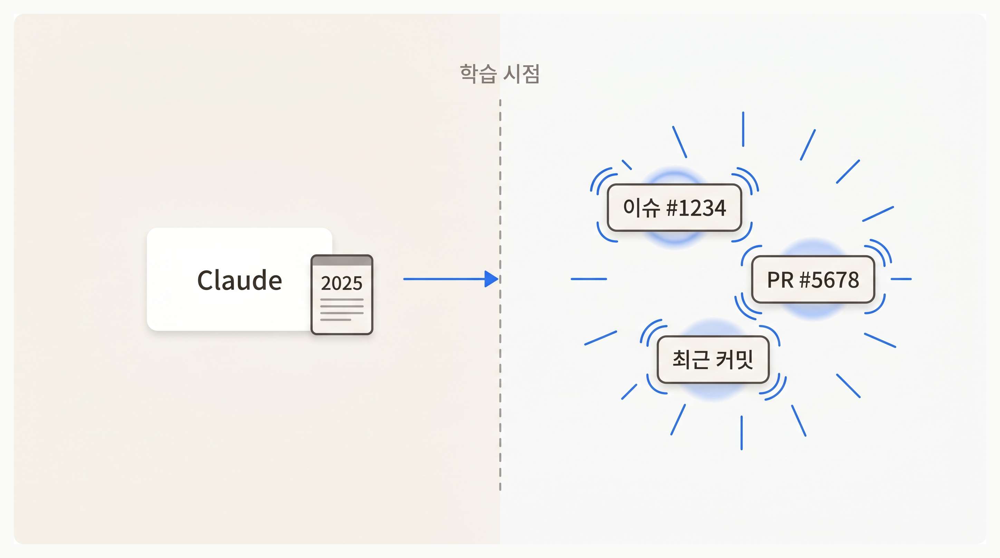

import { Lesson01CliSharedTool } from '@/components/diagrams/lesson-01-cli-shared-tool';

## Overview

앞 Chapter 에서 Rules·Command·Skill 로 Claude 에게 지식을 더했습니다. 하지만 이 도구들이 넓힌 것은 Claude 의 **지식** 이지, **접근 범위** 가 아닙니다. Claude 는 여전히 학습 데이터 시점의 세상만 알고, 지금 이 순간의 GitHub 이슈나 사내 API 에는 닿지 못합니다.

이번 레슨은 개발자가 이미 쓰던 **gh CLI** 를 Claude 에게 그대로 빌려줘서, Claude 도 같은 명령어로 실시간 외부 데이터를 가져오게 만드는 방법을 배웁니다.

### 학습 목표

- Claude 의 학습 데이터 경계와 외부 접근의 차이를 이해합니다
- CLI 를 Claude 에게 "빌려주는" 방식을 체험합니다
- Claude 가 실행한 명령어를 터미널에서 직접 재현해 결과를 검증합니다

### 시작하기 전 확인사항

- GitHub 계정이 있어야 합니다
- 실습 프로젝트 시작 브랜치로 전환합니다 — `git checkout ch07-01`

## Claude 가 모르는 것이 너무 많다



Claude 에게 실시간 정보를 물어보면 벽에 부딪힙니다.

> vercel/next.js 저장소의 최근 이슈 5 개를 가져와서 요약해줘

Claude 는 학습 시점까지의 이슈만 압니다. 오늘 열린 이슈 목록은 학습 데이터 바깥입니다. 답변은 "이 시점에는 대략 이런 이슈들이 있었습니다" 정도로 흐려지거나, 아예 "실시간 정보에는 접근할 수 없습니다" 로 막힙니다.

이 불편함은 GitHub 에만 있지 않습니다. 사내 Jira 티켓, AWS S3 버킷 목록, 배포 중인 서버 상태 — 전부 Claude 의 학습 데이터 바깥입니다. 내장 도구 (파일 읽기·Bash·웹 검색) 만으로는 이런 실시간 상태에 닿지 못합니다.

## gh CLI: 개발자 도구를 Claude 에게 빌려주기

<Lesson01CliSharedTool />

개발자는 같은 GitHub 에 터미널에서 닿습니다 — `gh issue list` 를 치면 실시간 이슈가 JSON 으로 돌아옵니다. **이 도구를 Claude 에게 그대로 쓰게 해주면, Claude 도 같은 실시간 데이터를 가져옵니다.**

CLI 는 개발자만의 도구가 아닙니다. 설치되어 있고 인증이 끝난 CLI 는 누가 실행하든 같은 명령어로 같은 결과를 돌려줍니다. **Claude Code 는 Bash 도구로 셸 명령을 실행하므로, 터미널에 설치된 gh 를 Claude 도 바로 호출할 수 있습니다.**

"개발자와 Claude 가 같은 도구함을 공유한다" — 이것이 CLI 연결의 본질입니다. 새로 만드는 게 없습니다. 이미 있는 도구를 Claude 에게도 쓰게 해주는 것뿐입니다.

## 왜 CLI 가 AI 와 잘 맞는가

Claude 가 CLI 를 잘 쓰는 데는 네 가지 구조적 이유가 있습니다.

### AI 가 이미 CLI 를 안다

Claude 는 수많은 man page·Stack Overflow 답변·GitHub 의 셸 스크립트로 학습되었습니다. `gh pr list`·`aws s3 ls`·`kubectl get pods` 같은 흔한 명령어는 학습 데이터에 이미 포함돼 있습니다.

새 도구를 쓰려면 AI 가 그 도구의 문법을 새로 배워야 합니다. CLI 는 **이미 아는 형식** 이라 별도 학습 없이 바로 정확하게 호출합니다.

### 사용법을 물어볼 수 있다

옵션이 헷갈리면 Claude 는 `--help` 를 먼저 실행해서 사용법을 확인합니다.

```shell
gh issue list --help
```

**필요할 때만 사용법을 확인** 하므로 Context 를 조금씩만 소비합니다. 모든 사용 설명서를 미리 로드해두는 방식이 아닙니다.

### 결과를 가공할 수 있다

CLI 결과는 파이프로 다른 명령어에 전달할 수 있습니다.

```shell
gh issue list --repo vercel/next.js --json number,title,state -L 10 | jq '.[].title'
```

필요한 부분만 추려서 대화창에 가져오면, Claude 의 Context 에 불필요한 텍스트가 쌓이지 않습니다.

### 실행하고 끝난다

CLI 명령어는 실행 → 결과 반환 → 종료의 흐름입니다. 백그라운드에서 계속 떠 있을 프로세스가 없으므로, 멈추거나 충돌할 일도 없습니다.

## [실습] gh CLI 로 실시간 GitHub 데이터 가져오기

이제 직접 연결해봅니다.

### Step 1: gh CLI 설치

| OS | 설치 명령어 |
|------|------|
| macOS | `brew install gh` |
| Windows | `winget install GitHub.cli` |

설치가 끝나면 버전을 확인합니다.

```shell
gh --version
```

### Step 2: GitHub 인증

```shell
gh auth login
```

GitHub.com 선택 → HTTPS → 브라우저 인증을 따라갑니다. 승인하면 터미널에 성공 메시지가 표시됩니다.

상태를 확인합니다.

```shell
gh auth status
```

"Logged in" 이 뜨면 성공입니다.

<Callout type="info" title="인증은 한 번만">
`gh auth login` 은 OS 의 자격증명 저장소에 토큰을 저장합니다. 새 세션을 열거나 Claude Code 를 재시작해도 인증 상태가 유지됩니다. 토큰이 만료되면 `gh auth status` 가 실패하므로 같은 명령어로 재로그인하면 됩니다.
</Callout>

### Step 3: CLI 를 직접 돌려보기

먼저 터미널에서 직접 실행해서 결과를 확인합니다.

```shell
gh issue list --repo vercel/next.js --json number,title,state,labels -L 5
```

JSON 형식의 이슈 목록이 출력됩니다. **Claude 도 같은 명령어를 돌릴 것이므로, 여기서 돌아가는 게 확인되면 Claude 쪽에서도 똑같이 돌아갑니다.**

### Step 4: Claude 에게 요청

Claude Code 를 시작하고 같은 작업을 요청합니다.

```plain text
vercel/next.js 저장소의 최근 이슈 5 개를 가져와서 어떤 버그가 많은지 요약해줘
```

Claude 는 `gh issue list ...` 를 Bash 로 실행하고, 돌아온 JSON 을 해석해서 요약합니다. Claude 가 실행한 명령어가 대화창에 그대로 노출됩니다.

### Step 5: 같은 명령어를 직접 재현

Claude 가 쓴 명령어를 복사해서 터미널에 붙여넣어 봅니다. 같은 결과가 나옵니다. **Claude 의 행동이 블랙박스가 아니라, 개발자가 직접 재현 가능한 명령어** 라는 점이 CLI 연결의 강점입니다.

## CLI 만으론 닿지 않는 영역

CLI 는 많은 외부 접근 문제를 해결합니다. 하지만 모든 영역을 덮지는 못합니다.

- **지금 열려 있는 브라우저 탭의 콘솔 에러나 DOM 상태** — CLI 는 새 프로세스를 시작할 뿐, 이미 떠 있는 내 크롬 탭에는 붙지 못합니다
- **Figma 같은 데스크톱 앱 안의 실시간 상태** — 공식 CLI 자체가 없는 서비스도 있습니다
- **OAuth 가 복잡한 서비스** — CLI 로 가능하긴 하지만 인증 플로우가 번거로운 경우

이런 영역은 **실행 중인 앱이나 서비스에 실시간으로 붙는 다른 연결 방식** 이 필요합니다. 다음 레슨에서 이를 해결하는 **MCP** 를 배웁니다.

## 핵심 포인트 정리

1. **Claude 의 지식은 학습 시점에 고정, 실시간 외부 정보에는 닿지 못함**: Rules·Skill 로 지식을 더해도 접근 범위는 그대로입니다. CLI 연결이 이 경계를 넘습니다
2. **CLI 는 개발자와 Claude 가 공유하는 도구**: 이미 설치된 gh·aws·kubectl 같은 CLI 를 Claude 가 그대로 호출합니다. Claude 가 쓴 명령어를 터미널에 붙여넣으면 같은 결과를 재현할 수 있습니다
3. **CLI 가 AI 와 잘 맞는 네 가지 구조적 이유**: 이미 아는 형식 / `--help` 로 필요할 때만 사용법 확인 / 파이프로 결과 가공 / 실행 후 종료

## FAQ

- **Q: gh 외에 어떤 CLI 를 Claude 가 쓸 수 있나요?**
  - A: `aws`·`gcloud`·`kubectl`·`vercel`·`supabase`·`stripe` — 대부분의 주요 서비스가 공식 CLI 를 제공합니다. Claude 는 유명 CLI 를 학습 데이터에서 만난 적이 있으므로 별도 설정 없이 바로 씁니다

- **Q: CLI 를 내가 직접 실행하는 것과 Claude 가 실행하는 것의 차이는?**
  - A: 결과는 같습니다. 차이는 Claude 가 "언제 어떤 CLI 를 어떻게 조합할지" 를 판단한다는 점입니다. 개발자는 작업을 설명하고, Claude 가 CLI 를 조립합니다

- **Q: gh CLI 로 브라우저를 열지 않고 인증할 수 있나요?**
  - A: 가능합니다. `gh auth login --with-token < token.txt` 로 Personal Access Token 을 파이프로 전달하면 브라우저 없이 인증됩니다. CI 환경이나 서버에서 유용합니다

## 이어서 배울 내용

CLI 는 실시간 외부 데이터를 잘 가져옵니다. 하지만 **지금 내가 보고 있는 크롬 탭의 콘솔 에러** 나 **Figma 에서 편집 중인 디자인 파일** 처럼, 이미 실행 중인 앱 안쪽을 들여다봐야 할 때가 있습니다. 다음 레슨에서는 이런 경우를 위한 **MCP** 를 배웁니다.

- MCP 의 정체와 동작 방식
- CLI 가 다 되는데 왜 MCP 를 배워야 하는가
- Chrome DevTools MCP 로 내 크롬 탭을 Claude 에게 보여주기
