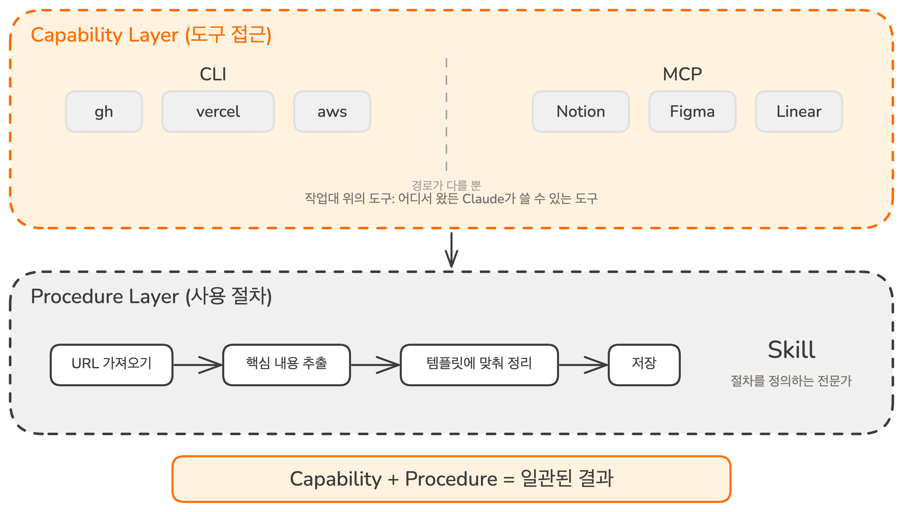

# 도구 연결 + 사용 설명서 | 외부 도구와 Skills의 시너지

## Overview

이전 세 레슨에서 외부 시스템에 연결하는 방법을 배웠습니다. MCP로 연결하고, CLI로 연결하고, 직접 MCP 서버를 만들기도 했습니다. 이제 Claude가 gh CLI로 GitHub 이슈를 조회하고, 날씨 API에서 데이터를 조회할 수 있습니다.

하지만 "이 웹 페이지를 가져와"와 "이 웹 페이지를 가져와서, 핵심 내용을 추출하고, 우리 팀 템플릿에 맞춰 정리하고, Notion에 저장해"는 전혀 다른 수준의 요청입니다. **도구에 접근할 수 있는 것과, 그 도구를 팀의 워크플로우에 맞게 사용하는 것은 다릅니다.** 이 간극을 채우는 것이 Skills입니다.

### 학습 목표

- 외부 도구(MCP/CLI)와 Skill의 역할 차이를 설명할 수 있습니다
- 도구 접근(Capability)과 사용 절차(Procedure)의 구분을 이해합니다
- 외부 도구와 Skill을 결합한 실전 워크플로우를 이해합니다
- CLI vs MCP vs Skill vs 결합을 판단하는 기준을 사용할 수 있습니다

## 도구와 절차: 두 개의 층

망가진 캐비닛을 고치러 철물점에 들어갔다고 상상해 보세요. 작업대 위에 필요한 도구가 전부 놓여 있습니다. 접착제, 클램프, 경첩, 전동 드릴.

**도구가 어디서 왔는지는 중요하지 않습니다.** 어떤 것은 매대에서 새로 사 온 것이고, 어떤 것은 집에서 가져온 것입니다. 작업대 위에 올라오면 둘 다 그냥 도구입니다.

하지만 도구가 아무리 많아도, 어떤 순서로 써야 하는지 모르면 캐비닛은 고쳐지지 않습니다. **옆에 있는 숙련된 직원이 순서를 안내해야 비로소 작업이 시작됩니다.**

이것이 이 레슨의 핵심 구분입니다.

**도구(Capability Layer)**: CLI와 MCP 모두 여기에 속합니다. 매대에서 사 온 것(MCP)이든 집에서 가져온 것(CLI)이든, Claude가 외부 시스템에 접근할 수 있게 해주는 도구입니다.

**절차(Procedure Layer)**: Skill이 담당합니다. 도구를 어떤 순서로, 어떤 기준으로, 어떤 형식으로 사용할지 정의합니다.

도구 없이는 작업을 시작할 수 없고, 절차 없이는 매번 결과가 달라집니다.

## 외부 도구 vs Skill: 구조적 차이

| | CLI | MCP | Skill |
|---|---|---|---|
| **본질** | 개발자+AI 공용 도구 | AI 전용 도구 연결 | 사용 설명서 |
| **역할** | 외부 서비스 실행 | 외부 시스템 접근 권한 | 도구를 효과적으로 사용하는 방법 |
| **포함하는 것** | 명령어, 옵션, 파이프 | 도구 정의, API 스키마 | 지침, 워크플로우, 템플릿 |
| **로드 시점** | 실행할 때만 | 연결 시 로드 | 호출 시에만 로드 |
| **대화창 영향** | 명령어 한 줄만 | 도구 수에 비례하여 소비 | 필요할 때만 소비 |
| **적합한 용도** | 데이터 가져오기, 파일 처리 | CLI 없는 서비스 접근 | 워크플로우, 기준, 방법론 |

핵심 구분은 두 개의 층입니다.

**도구 접근(Capability Layer)**: CLI와 MCP가 담당합니다. Claude가 외부 시스템에서 무엇을 할 수 있는지 결정합니다. "gh로 GitHub 이슈를 조회할 수 있다", "Notion에서 문서를 검색할 수 있다".

**사용 절차(Procedure Layer)**: Skill이 담당합니다. Claude가 도구를 어떻게 사용해야 하는지 정의합니다. "웹 페이지를 가져온 후 핵심 내용을 추출하고, 이 템플릿에 맞춰 정리하고, Notion의 이 폴더에 저장한다".

## 언제 무엇을 써야 하는가

| 상황 | 사용 |
|------|------|
| 외부 서비스에 연결 (CLI 존재) | CLI |
| 외부 서비스에 연결 (CLI 없음) | MCP |
| 워크플로우나 방법론 가르치기 | Skill |
| 단순 데이터 접근 (한 번의 호출로 끝남) | CLI 또는 MCP 단독 |
| 다단계 워크플로우 (여러 도구, 특정 순서, 품질 기준) | 외부 도구 + Skill 결합 |

**판단 기준은 한 문장으로 정리됩니다.** 무언가에 접근해야 하면 CLI 또는 MCP입니다. 어떻게 접근할지 가르쳐야 하면 Skill입니다.

"Linear에서 이슈 목록 가져와"는 CLI(`linear` CLI) 또는 MCP(Linear MCP) 단독으로 충분합니다. "매주 월요일 이슈를 분류하고, 우선순위를 재정렬하고, 보고서를 이 형식으로 만들어"는 Skill로 절차를 정의해야 일관된 결과를 얻습니다.

## 결합의 시너지: 1 + 1 > 2

가장 강력한 워크플로우는 외부 도구와 Skill을 함께 사용합니다. 외부 도구가 접근을 제공하고, Skill이 그 도구를 **어떤 순서로, 어떤 기준으로, 어떤 형식으로** 사용할지 정의합니다.

### 결합이 만드는 세 가지 효과

**명확한 탐색**: Claude가 어디를 봐야 하는지 추측하지 않습니다. Skill이 "이 URL을 먼저 가져오고, 그 다음 관련 페이지를 확인하고, 마지막으로 이전 기록과 비교한다"는 순서를 지정합니다.

**신뢰할 수 있는 조율**: 다단계 워크플로우가 예측 가능해집니다. Skill 없이 Claude는 데이터를 가져와서 바로 포맷해 버릴 수 있습니다. Skill이 있으면 "모든 데이터를 먼저 수집하고, 교차 검증한 후, 포맷한다"는 순서를 매번 따릅니다.

**일관된 품질**: 출력물이 팀의 기준을 만족합니다. 올바른 구조, 적절한 세부 수준, 대상에 맞는 톤.

### 실제 사례 1: CLI + Skill

`gh` CLI로 PR 정보를 가져오고, Skill이 팀 코딩 컨벤션에 따라 리뷰하는 워크플로우입니다.

**CLI**: `gh` -- PR diff 조회, 파일 목록 확인, 리뷰 코멘트 작성

**Skill**: code-review -- 검사 항목(네이밍 규칙, 에러 처리, 테스트 커버리지), 리뷰 형식, 심각도 기준 정의

**워크플로우**:

1. Skill이 리뷰 대상 PR을 확인하고 검사 항목을 로드 (탐색)
2. CLI가 `gh pr diff`로 변경 사항을 가져옴 (접근)
3. Skill이 팀 컨벤션 기준으로 코드를 분석하고 피드백을 구조화 (조율)
4. CLI가 `gh pr review`로 구조화된 리뷰 코멘트를 등록 (실행)

Skill 없이 CLI만 있으면 diff를 볼 수 있지만, **무엇을 기준으로 리뷰할지** 매번 달라집니다. CLI 없이 Skill만 있으면 기준은 완벽하지만 PR에 접근할 수 없습니다.

### 실제 사례 2: MCP + Skill

Linear MCP로 이슈에 접근하고, Skill이 이슈 선택부터 구현까지의 절차를 정의하는 워크플로우입니다.

**MCP 서버**: Linear 연결 -- 이슈 목록 조회, 상태 변경, 코멘트 작성

**Skill**: implement-issue -- 이슈 필터링 기준, 브랜치 네이밍, 구현 절차, 상태 업데이트 규칙 정의

**워크플로우**:

1. MCP가 나에게 할당된 이슈 목록을 가져옴 (접근)
2. Skill이 우선순위 기준으로 정렬하고 사용자에게 선택을 요청 (조율)
3. Skill이 이슈 ID로 브랜치를 생성하고 구현을 시작 (실행)
4. MCP가 이슈 상태를 "In Progress"로 변경하고 진행 코멘트를 작성 (접근)

**패턴은 동일합니다.** CLI든 MCP든 도구가 접근을 제공하고, Skill이 절차를 정의합니다.

## 핵심 포인트 정리

1. **도구 접근(Capability)과 사용 절차(Procedure)는 보완 관계입니다**: CLI와 MCP는 도구 접근권을, Skill은 사용 방법을 제공합니다. 하나만으로는 절반만 해결됩니다
2. **CLI가 있으면 CLI + Skill, 없으면 MCP + Skill**: 어떤 외부 도구든 Skill과 결합하면 다단계 워크플로우를 일관되게 실행할 수 있습니다
3. **관심사 분리가 유연성을 만듭니다**: 도구를 바꿔도 Skill이 유지되고, Skill을 개선해도 도구 연결이 유지됩니다. 같은 Skill에 CLI를 쓰다가 MCP로 바꿔도 절차는 그대로입니다

## FAQ

- **Q: MCP 서버에도 지침을 넣을 수 있다고 들었는데, 그러면 Skill이 필요 없는 거 아닌가요?**
  - A: MCP 서버는 도구 사용 힌트나 일반적인 프롬프트를 포함할 수 있습니다. 하지만 이 지침은 해당 서버의 도구를 올바르게 호출하는 방법에 한정됩니다. "Salesforce API는 이 쿼리 문법을 써야 한다"는 MCP 수준의 지침입니다. "파이프라인 리뷰를 위해 Salesforce에서 이 레코드를 먼저 확인하고, Slack 대화와 교차 참조한 후, 이 형식으로 보고하라"는 Skill 수준의 지침입니다. 범위가 다릅니다

- **Q: 하나의 Skill이 여러 외부 도구를 사용할 수 있나요?**
  - A: 가능합니다. 하나의 Skill이 CLI와 MCP를 동시에 조율할 수 있습니다. 리서치 Skill이 gh CLI로 PR 목록을 가져오고, Linear MCP로 관련 이슈를 검색하고, Jira CLI로 티켓을 확인하는 식입니다. 반대로 하나의 외부 도구가 여러 Skill에서 사용될 수도 있습니다

- **Q: CLI + Skill 조합이 MCP + Skill 조합보다 항상 좋나요?**
  - A: 개발자 워크플로우에서는 CLI가 대화창 효율과 안정성에서 우세합니다. 하지만 비개발자가 사용하는 AI 도구(Claude Desktop 등)에서는 MCP가 더 적합합니다. 또한 Notion, Figma처럼 CLI가 없는 서비스도 있습니다. 도구 선택은 상황에 따라 달라집니다

- **Q: 이미 외부 도구를 연결했는데 Skill 없이도 잘 되는 것 같은데요?**
  - A: 간단한 작업은 외부 도구만으로 충분합니다. "이 URL 스크래핑해줘"처럼 한 번의 호출로 끝나는 경우입니다. Skill이 필요한 순간은 워크플로우가 여러 단계로 이루어지고, 매번 같은 기준으로 결과를 내야 할 때입니다

## 다음 단계

Chapter 07에서 외부 시스템 연결의 세 가지 방법(MCP, CLI, 직접 제작)과, 도구와 절차를 결합하는 패턴을 배웠습니다. 하지만 Context에 들어오는 데이터 자체를 통제하지는 못합니다. 테스트를 실행하면 2,000줄의 로그가 그대로 대화창에 쌓입니다.

다음 레슨 보기: [AI가 코드 고칠 때마다 자동 검증](../execution-control/hooks)
