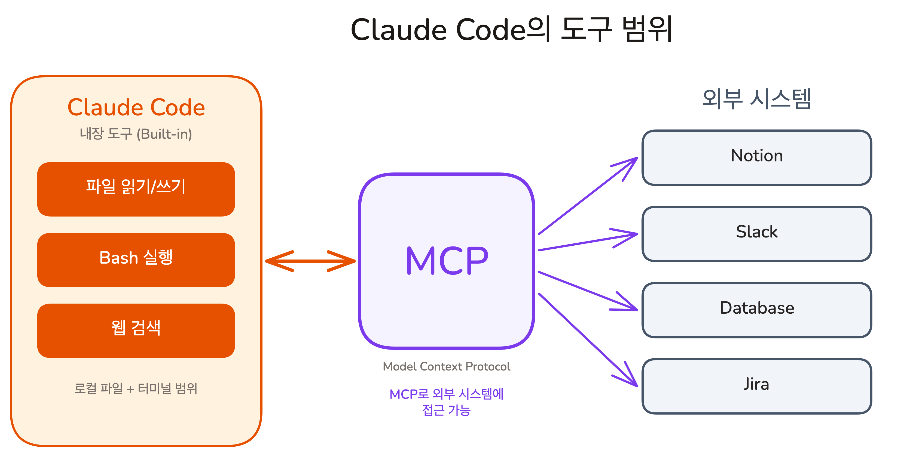
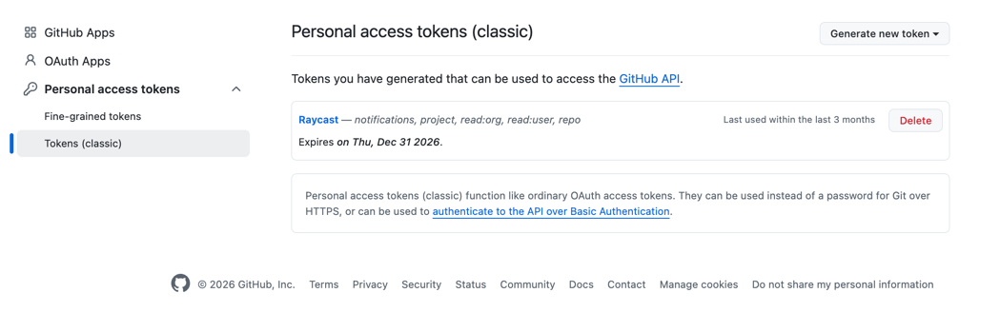

## Overview

이전 Chapter에서 Rules, Commands, Skills로 Claude에게 지식을 추가하는 방법을 배웠습니다. 하지만 이 도구들이 확장하는 것은 Claude의 '지식'입니다. Claude가 접근할 수 있는 범위 자체는 여전히 로컬 파일과 내장 도구에 묶여 있습니다. Notion, Slack, 사내 데이터베이스처럼 외부 시스템에 닿으려면 MCP가 필요합니다. 이번 레슨에서는 MCP의 개념과 표준 프로토콜로서의 장점을 이해하고, 실제로 설치하여 사용합니다.

### 학습 목표

- MCP가 무엇이고, Claude의 내장 Tool과 어떤 관계인지 설명할 수 있습니다
- MCP가 표준 프로토콜인 이유와 그 장점을 설명할 수 있습니다
- MCP를 Claude Code에 설치하고 사용할 수 있습니다

### 시작하기 전 확인사항

- Claude Code가 설치되어 있고 정상 작동하는 상태여야 합니다
- 실습 프로젝트의 시작 브랜치로 전환합니다 (`git checkout ch07-01`)

`ch07-01` 브랜치는 이 레슨의 시작점입니다. Todo 앱이 동작하고, `.claude/` 폴더에 기본 설정이 있는 상태입니다.

## 내장 도구의 경계

Claude Code에는 파일 읽기/쓰기, Bash 실행, 웹 검색이 내장되어 있습니다. 이 도구들로 코드 개발 작업 대부분을 처리할 수 있습니다.

하지만 내장 도구의 범위에는 한계가 있습니다. Notion에서 프로젝트 문서를 검색하거나, Slack 채널의 최근 논의를 읽거나, 데이터베이스에서 사용자 데이터를 쿼리하는 것은 내장 도구만으로는 불가능합니다.

주방에 칼, 도마, 프라이팬이 있으면 기본적인 요리는 가능합니다. 하지만 주방 안에 있는 식자재만으로는 만들 수 있는 메뉴가 제한됩니다. 외부 납품업체에서 재료를 조달받아야 다양한 요리가 가능합니다.

**Claude Code의 내장 도구는 주방의 기본 조리도구이고, MCP는 외부에서 식자재를 조달하는 납품업체입니다.**



## MCP란: 외부 시스템을 Tool로 바꾸는 표준 프로토콜

**MCP(Model Context Protocol)**는 Claude가 외부 시스템에 접근할 수 있게 해주는 표준 프로토콜입니다. Notion, Slack, 데이터베이스 같은 외부 서비스를 Claude가 사용할 수 있는 Tool로 변환합니다.

MCP는 Tool Use의 확장입니다. 내장 Tool은 Claude Code가 미리 갖고 있는 도구이고, MCP Tool은 외부에서 추가로 연결하는 도구입니다. 동작 방식은 동일합니다. Claude가 Tool을 호출하고, 결과를 받아서 답변을 생성합니다.

#### 왜 "표준 프로토콜"이 중요한가?

과거에는 프린터에는 프린터 케이블, 카메라에는 카메라 케이블이 필요했습니다. USB가 등장하면서 하나의 표준으로 모든 장치를 연결할 수 있게 되었습니다.

MCP는 AI 세계의 USB입니다. MCP가 없다면 Notion용 플러그인, Slack용 플러그인, Jira용 플러그인을 각각 따로 만들어야 합니다. MCP 표준 하나로 어떤 서비스든 같은 방식으로 연결할 수 있습니다.

**MCP 서버를 한 번 만들면, Claude Code뿐 아니라 Claude Desktop, Cursor, Windsurf 등 MCP를 지원하는 모든 AI 도구에서 사용할 수 있습니다.** Anthropic이 주도하고 있지만 오픈 표준이므로, AI 도구 제작사 누구나 MCP Client를 구현할 수 있습니다.

## MCP의 동작 방식

MCP 서버는 외부 시스템을 감싸는 프로그램입니다. Claude Code가 MCP 서버에 연결하면, 해당 서버가 제공하는 Tool을 내장 Tool처럼 사용할 수 있습니다.

동작 방식은 내장 Tool과 동일합니다. 사용자가 요청하면 Claude가 어떤 Tool을 호출할지 판단하고, MCP 서버를 통해 외부 시스템에 접근하여 결과를 가져온 뒤, 그 결과를 바탕으로 답변을 생성합니다. 사용자 입장에서는 내장 Tool과 MCP Tool의 차이를 느끼지 못합니다.

한 가지 주의할 점이 있습니다. MCP를 연결하면 해당 서버가 제공하는 도구 설명이 Context Window에 추가됩니다. 서버 하나가 보통 수백 토큰을 차지하므로, 많이 연결할수록 Context가 소비됩니다. **현재 작업에 필요한 MCP만 연결하는 것이 기본 원칙입니다.** 프로젝트별로 `.mcp.json` 파일에 필요한 MCP만 설정하면, 다른 프로젝트에는 영향을 주지 않습니다.

<Callout type="info" title="MCP의 내부 구조는?">
MCP는 서버/클라이언트 구조로 이루어져 있고, Tool 외에도 Resource, Prompt 같은 요소를 제공합니다. Claude Code는 MCP Client 역할을 하며, 외부 MCP 서버가 제공하는 Tool을 내장 Tool과 동일한 방식으로 호출합니다.
</Callout>

## 자주 쓰는 MCP 추천

| MCP | 하는 일 | 활용 예시 |
|-----|---------|-----------|
| GitHub | 저장소, 이슈, PR 관리 | "이 저장소의 최근 이슈 목록 가져와줘" |
| Jira | 프로젝트/이슈 관리 | "이 버그를 Jira 티켓으로 만들어줘" |
| Notion | 문서 검색/생성 | "프로젝트 회의록을 Notion에 저장해줘" |
| Slack | 채널 메시지 검색/읽기 | "deploy 채널의 최근 메시지를 요약해줘" |
| Supabase | 데이터베이스 쿼리 | "users 테이블에서 최근 가입자 조회해줘" |

<Callout type="info" title="MCP 생태계는 계속 확장되고 있습니다">
[MCP 서버 공식 디렉토리](https://github.com/modelcontextprotocol/servers)에서 사용 가능한 MCP 서버 목록을 확인하세요. 필요한 서비스가 있다면 이미 누군가 만들어 놓았을 가능성이 높습니다.
</Callout>

## 직접 써보기: GitHub MCP 설치 및 사용

**GitHub MCP**를 연결하면 Claude가 GitHub의 저장소, 이슈, PR 데이터에 직접 접근할 수 있습니다. Claude Code에 GitHub MCP를 연결하고 실시간 데이터를 가져와 봅니다.

실습 프로젝트의 시작 브랜치로 전환합니다.

```shell
git checkout ch07-01
```

### Step 1: Personal Access Token 발급

GitHub MCP는 인증을 위해 **Personal Access Token(PAT)**이 필요합니다. https://github.com/settings/tokens 에 접속하여 Generate new token (classic)을 클릭합니다.




Note에 `claude-code-mcp`를 입력하고, Scope에서 `repo`를 선택한 뒤 Generate token을 누르면 `ghp_`로 시작하는 토큰이 발급됩니다. 이 토큰을 복사해 둡니다.

### Step 2: MCP 서버 추가

`claude mcp add` 명령어로 MCP 서버를 등록합니다.

```shell
claude mcp add github -s project -e GITHUB_PERSONAL_ACCESS_TOKEN=ghp_YOUR_TOKEN -- npx -y @modelcontextprotocol/server-github
```

| 부분 | 의미 |
|------|------|
| `github` | MCP 서버 이름. `/mcp`에서 이 이름으로 표시됩니다 |
| `-s project` | 스코프 설정. `project`는 현재 프로젝트(`.mcp.json`)에만 저장됩니다 |
| `-e GITHUB_PERSONAL_ACCESS_TOKEN=...` | 환경 변수 설정. MCP 서버에 토큰을 전달합니다 |
| `--` | 구분자. 이 뒤의 내용이 MCP 서버 실행 명령어입니다 |
| `npx -y @modelcontextprotocol/server-github` | 실행 명령어. GitHub MCP 서버를 실행합니다 |

<Callout type="info" title=".mcp.json이란?">
`-s project`로 추가하면 프로젝트 루트에 `.mcp.json` 파일이 생성됩니다. 이 파일에 MCP 서버 설정이 JSON 형식으로 저장되며, 토큰 같은 환경 변수(`env`)도 포함됩니다. Claude Code가 시작될 때 이 파일을 읽고 MCP 서버를 자동으로 실행합니다.
</Callout>

### Step 3: Claude Code 재시작

MCP 설정은 Claude Code가 시작될 때 읽습니다. MCP 서버를 추가한 후 새 세션을 시작합니다.

### Step 4: MCP 연결 확인

`/mcp` 명령어로 현재 연결된 MCP 서버 목록을 확인합니다.

```shell
/mcp
```

github 서버가 "Connected" 상태로 표시되면 성공입니다.

### Step 5: GitHub MCP 사용해보기

Claude에게 GitHub 데이터를 가져오도록 요청합니다.

> vercel/next.js 저장소의 최근 이슈 5개를 가져와서 요약해줘

Claude가 GitHub MCP를 통해 저장소에 직접 접근하고, 이슈 데이터를 가져와서 요약합니다. MCP가 없었다면 Claude는 학습 데이터에 있는 과거 시점의 정보로 답변했을 것입니다. **MCP가 연결되어 있으므로 실시간 GitHub 데이터를 직접 가져옵니다.**

## 핵심 포인트 정리

1. **MCP는 Claude의 Tool을 확장하는 표준 프로토콜입니다**: 내장 Tool만으로 접근할 수 없는 외부 시스템을 Claude에 연결합니다. 하나의 표준으로 어떤 서비스든, 어떤 AI 도구에서든 연결할 수 있습니다
2. **MCP를 연결하면 Context Window를 소비합니다**: 도구 설명이 Context에 추가되므로, 현재 작업에 필요한 MCP만 연결하는 것이 기본 원칙입니다
3. **설치는 CLI 명령어 하나로 끝납니다**: `claude mcp add`로 MCP 서버를 등록하면, Claude Code가 시작 시 자동으로 서버를 실행하고 연결합니다

## FAQ

- **Q: MCP를 많이 연결할수록 Claude가 더 똑똑해지나요?**
  - A: 아닙니다. MCP는 Claude가 접근할 수 있는 범위를 넓힐 뿐, 추론 능력을 향상시키지 않습니다. 오히려 많이 연결하면 Tool 정의가 Context Window를 소비하여 성능이 떨어질 수 있습니다. 현재 작업에 필요한 MCP만 연결하는 것이 좋습니다

- **Q: MCP 서버는 별도로 실행해야 하나요?**
  - A: 아닙니다. `claude mcp add`로 등록하면 Claude Code가 시작될 때 자동으로 MCP 서버 프로세스를 실행합니다. 별도로 서버를 관리할 필요가 없습니다

- **Q: Skills과 MCP는 어떤 관계인가요?**
  - A: Lesson 04에서 자세히 다룹니다. 간단히 말하면, MCP는 Claude에게 도구 접근권을 주고, Skills는 그 도구를 어떻게 사용할지 가르칩니다

- **Q: MCP 없이도 외부 도구를 쓸 수 있나요?**
  - A: 가능합니다. CLI(Command Line Interface)라는 대안이 있습니다. 다음 레슨에서 같은 GitHub을 gh CLI로 사용하면서 MCP와 비교합니다

- **Q: MCP는 Claude Code에서만 쓸 수 있나요?**
  - A: 아닙니다. MCP는 오픈 표준이므로, Claude Desktop, Cursor, Windsurf 등 MCP를 지원하는 AI 도구에서도 같은 MCP 서버를 사용할 수 있습니다. 한 번 만든 MCP 서버는 여러 AI 도구에서 재사용 가능합니다

## 이어서 배울 내용

MCP로 외부 시스템에 접근할 수 있게 되었습니다. 그런데 같은 GitHub을 MCP가 아닌 다른 방식으로 사용하면 어떨까요?
