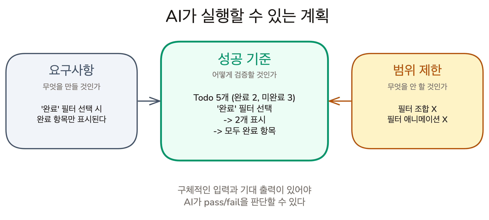
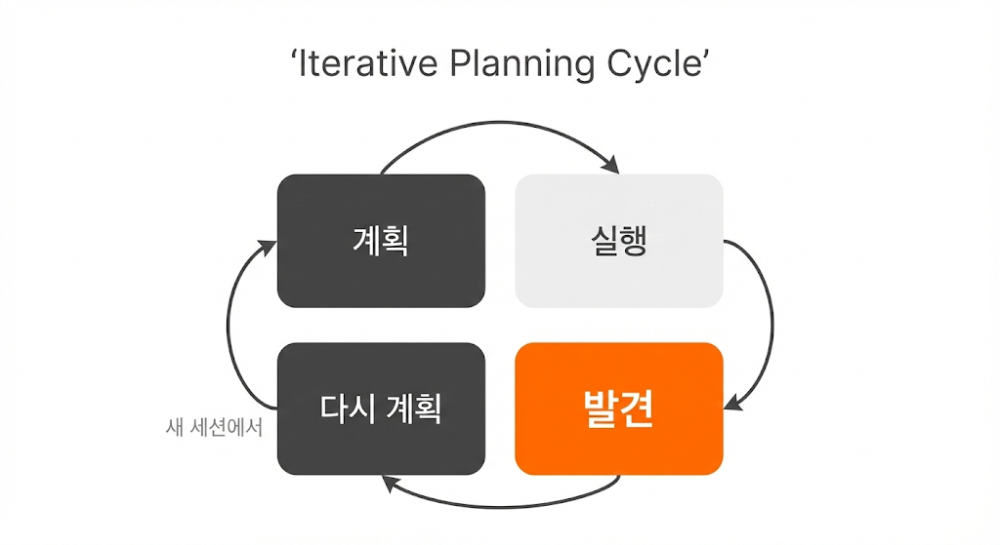

# 성공 기준에서 검증된 코드까지 | Red Green Refactor

## Overview

테스트가 있으면 AI가 자율 루프를 돌 수 있습니다. 하지만 새 기능을 만들 때는 테스트가 아직 없습니다. 계획 단계부터 "이것이 되면 완료"라는 기준을 포함시키고, 그 기준을 테스트로 먼저 변환하면, AI가 처음 코드를 작성하는 순간부터 정답지를 보고 일할 수 있습니다.

이번 레슨에서는 성공 기준 작성부터 Red Green Refactor 실행까지 전체 흐름을 배웁니다.

### 학습 목표

- **검증 가능한 성공 기준(Acceptance Criteria)**의 역할과 작성법을 설명할 수 있습니다
- 성공 기준을 테스트로 먼저 작성해야 하는 이유를 설명할 수 있습니다
- Red Green Refactor 사이클을 실천할 수 있습니다
- Plan → Execute → Discover → Replan 사이클을 설명할 수 있습니다

### 시작하기 전 확인사항

- 실습 프로젝트의 시작 브랜치로 전환합니다 (`git checkout ch05-03`)

`ch05-03` 브랜치는 이 레슨의 시작점입니다. Lesson 02에서 테스트 환경이 셋업된 상태입니다.

## 검증 가능한 성공 기준

"필터링 기능을 추가하라"라는 계획을 받은 AI는 코드를 작성할 수 있지만, 완성 후 할 수 있는 것은 "추가했습니다"라고 보고하는 것뿐입니다. **실제로 동작하는지는 AI도 모릅니다.**

계획에 "이것이 충족되면 완료"라는 조건을 포함시키면, AI는 코드 작성 후 그 조건을 직접 확인하고 스스로 루프를 돌 수 있습니다. 이것이 **검증 가능한 성공 기준(Acceptance Criteria)** -- "이 조건이 충족되면 이 작업은 완료된 것이다"라는 구체적인 체크리스트입니다.

### 좋은 성공 기준 vs 나쁜 성공 기준

> 나쁜 예: "필터링이 잘 동작해야 한다"

AI는 "잘"이 무엇인지 판단할 수 없습니다. 코드를 작성하고 "잘 동작할 것으로 보입니다"라고 보고할 뿐입니다.

> 좋은 예: "Todo 5개 (완료 2, 미완료 3) 상태에서 '완료' 선택 -> 2개 표시, 모두 완료 항목"

초기 상태(5개, 완료 2/미완료 3), 액션('완료' 선택), 기대 출력(2개, 모두 완료)이 모두 숫자로 특정되어 있습니다. **구체적인 입력과 기대 출력이 있어야 AI가 검증 루프를 돌 수 있습니다.**

### 계획의 세 요소

요구사항 형식("사용자가 ~하면, 시스템이 ~한다")과 범위 제한에 **성공 기준**을 붙입니다.



**요구사항(무엇을), 성공 기준(어떻게 검증할지), 범위 제한(무엇을 안 할지) -- 이 세 가지를 갖춘 계획이 AI가 가장 잘 실행하는 계획입니다.** 성공 기준 하나를 구체적으로 쓰는 3분이 AI가 생성할 코드 수십 줄의 방향을 결정합니다.

## 성공 기준을 언제 테스트로 바꾸는가


여행 짐을 싸는 상황을 떠올려 보세요. 짐을 다 싸고 나서 "뭘 쌌지?" 목록을 만들면, 여권을 안 넣었어도 목록에 여권이 없으니 "다 쌌네!"가 됩니다. 반대로 출발 전에 "가져갈 것 목록"을 먼저 만들면, 짐을 싸고 대조할 때 여권이 빠진 게 바로 보입니다.

**목록을 짐 싼 후에 만들면, 빠뜨린 것도 같이 빠집니다.** 테스트도 마찬가지입니다.

### Test-Last

AI가 코드를 먼저 쓰고, 자기가 쓴 코드를 보고 테스트를 만듭니다. 코드에서 빈 배열 처리를 빠뜨렸다면, 테스트에도 빈 배열 케이스가 없습니다. 테스트는 전부 통과하지만, 실제로는 빈 배열에서 에러가 발생합니다. 이것을 **자기 확인 편향** -- 자기가 쓴 코드에 맞춰 테스트를 만들어 실수를 놓치는 현상이라고 합니다.

### Test-First

성공 기준에서 테스트를 먼저 만듭니다. "빈 배열이면 메시지 표시" 테스트가 이미 존재하니, AI는 그 테스트를 통과시키기 위해 빈 배열 처리를 반드시 구현합니다. **테스트가 코드보다 먼저 존재하면, AI가 자기 실수를 가릴 수 없습니다.**

> [!NOTE] "처음 실행하면 당연히 실패하는데, 토큰 낭비 아닌가요?"
> 이 실패는 낭비가 아니라 **테스트가 실제로 무언가를 검증하고 있다는 증거**입니다. 처음부터 통과하는 테스트는 아무것도 검증하지 않을 수 있습니다.

## Red Green Refactor: 한 번에 하나씩

이 Test-First 워크플로우에는 이름이 있습니다. **Red Green Refactor** -- TDD(Test-Driven Development)의 핵심 사이클입니다.

1. **Red**: 실패하는 테스트를 작성합니다 (테스트 실행 -> 빨간색)
2. **Green**: 테스트를 통과시키는 최소한의 구현을 작성합니다 (테스트 실행 -> 초록색)
3. **Refactor**: 테스트가 통과하는 상태에서 코드를 정리합니다

AI와 함께 쓸 때 가장 중요한 규칙이 하나 있습니다. **한 번에 하나의 테스트만 작성하는 것**입니다. AI는 성공 기준 6개를 받으면 테스트 6개를 한꺼번에 만들고, 한 번의 구현으로 전부 통과시키려는 경향이 있습니다. 이렇게 하면 테스트가 구현을 이끄는 것이 아니라, 구현에 맞춰진 테스트가 됩니다.

대신 성공 기준 하나 -> 테스트 하나 -> Red 확인 -> 구현 -> Green 확인 -> 다음 성공 기준으로 넘어가는 점진적 루프를 따릅니다.

## [데모] Todo 앱 필터링 기능

`Shift+Tab`으로 Plan Mode에 진입하고 아래 프롬프트를 전달합니다.

```
아래 요구사항대로 필터링 기능을 추가해줘.
Red Green Refactor 사이클을 따라줘: 성공 기준을 하나씩 테스트로 작성하고, 각 테스트가 통과하면 다음으로 넘어가줘.

## 기능: Todo 필터링

### 요구사항
1. 사용자가 '전체' 필터를 선택하면, 모든 항목이 표시된다
2. 사용자가 '진행중' 필터를 선택하면, 미완료 항목만 표시된다
3. 사용자가 '완료' 필터를 선택하면, 완료 항목만 표시된다
4. 현재 선택된 필터가 시각적으로 구분된다

### 성공 기준
- Todo 5개 (완료 2, 미완료 3) 상태에서 '전체' 선택 -> 5개 표시
- 같은 상태에서 '진행중' 선택 -> 3개 표시, 모두 미완료 항목
- 같은 상태에서 '완료' 선택 -> 2개 표시, 모두 완료 항목
- Todo가 0개일 때 '진행중' 선택 -> '할 일이 없습니다' 메시지 표시
- '완료' 필터 선택 중 Todo를 미완료로 변경 -> 해당 항목이 목록에서 사라짐
- 현재 필터 버튼에 active 스타일 적용

### 범위 제한
- 필터 상태는 URL 파라미터로 저장하지 않는다
- 필터 조합(완료 + 특정 카테고리)은 구현하지 않는다
- 필터 애니메이션은 구현하지 않는다
```

AI가 코드베이스를 탐색한 뒤 구현 계획을 제안합니다. 이때 AI의 계획이 **성공 기준과 연결되어 있는지** 확인합니다. "FilterBar 컴포넌트를 만든다"만 있다면, "성공 기준의 어떤 항목을 이 컴포넌트가 충족하는지 매핑해줘"라고 요청합니다.

AI의 계획을 검토할 때 확인할 사항은 다음과 같습니다.

- 성공 기준의 모든 항목이 계획에 반영되었는가
- 범위 제한을 넘어서는 구현이 포함되지 않았는가
- AI가 미해결 질문을 던졌다면 답변

계획을 승인하면 AI가 성공 기준 항목을 하나씩 테스트로 변환하고, 각 테스트가 통과할 때까지 코드를 작성합니다. 모든 성공 기준이 통과하면 커밋합니다.

## 실행 후 발견, 그리고 다시 계획




필터링 기능을 만들고 직접 사용해 봅니다. 필터 버튼을 눌러야 각 상태의 항목이 몇 개인지 알 수 있습니다. "전체(5), 진행중(3), 완료(2)처럼 버튼에 개수가 보이면 좋겠다." 이것은 처음 계획에는 없던 요구사항입니다.

이때 해야 할 일은 **새 세션을 열고 Plan Mode로 다시 들어가는 것**입니다. "필터 버튼에 개수 배지 표시" 기능에 대한 요구사항과 성공 기준을 추가하고, 새 계획을 세웁니다.

**계획은 만들고, 실행하고, 발견하고, 다시 만드는 반복 과정입니다.** 아는 것은 모두 계획에 넣고, 모르는 것은 넣지 않고, 실행 후 발견된 것은 새 세션에서 추가합니다.

## 핵심 포인트 정리

1. **성공 기준의 핵심은 구체적인 입력과 기대 출력입니다.** "잘 동작한다"가 아니라 "5개 중 완료 2개 -> '완료' 필터 -> 2개 표시"처럼 AI가 pass/fail을 판단할 수 있는 형태로 작성합니다
2. **테스트를 먼저 쓰면 AI가 자기 실수를 가릴 수 없습니다.** 코드 후에 테스트를 쓰면 빠뜨린 케이스도 같이 빠집니다. 성공 기준에서 테스트를 먼저 만들면, AI는 그 테스트를 통과시키기 위해 누락 없이 구현합니다
3. **한 번에 하나의 테스트만 작성합니다.** 성공 기준 하나 -> 테스트 하나 -> Red(실패) -> 구현 -> Green(통과) -> 다음 기준. 이 점진적 루프가 테스트가 구현을 이끄는 Red Green Refactor 사이클입니다
4. **계획은 반복입니다.** 실행하면 계획 단계에서 보이지 않던 것이 보입니다. 발견된 요구사항은 새 세션에서 새 계획으로 추가합니다

> **Tip**: 매번 "테스트를 먼저 작성해줘"라고 프롬프트에 쓰는 대신, CLAUDE.md에 한 번 명세하면 모든 세션에 자동 적용됩니다.
>
> ```markdown
> ## Development Workflow
>
> - Red Green Refactor 사이클을 따른다
> - 한 번에 하나의 테스트만 작성하고, 통과 후 다음 테스트로 넘어간다
> - 테스트가 실패하는 것을 확인한 뒤(Red), 테스트를 통과하도록 구현한다(Green)
> - 하나의 기능이 끝날 때마다 커밋한다
> ```

> **Tip**: Plan Mode에서 AI가 세운 계획은 `~/.claude/plans`에 자동 저장됩니다. 프로젝트 폴더 안에 저장하고 싶다면, `.claude/settings.json`에 아래 설정을 추가하세요.
>
> ```json
> "plansDirectory": "./.claude/plans"
> ```
>
> 이렇게 하면 계획 파일이 프로젝트에 포함되어 Git으로 팀과 공유할 수 있습니다.

## FAQ

- Q: 성공 기준을 몇 개나 써야 하나요?
  - A: 요구사항 하나당 2-3개의 성공 기준이 적당합니다. 정상 동작 1개, 경계 케이스 1-2개 정도입니다. 너무 많으면 계획이 길어져서 검토가 어려워지고, 너무 적으면 검증 기준이 부족해집니다

- Q: 성공 기준을 개발자가 다 써야 하나요? AI에게 시키면 안 되나요?
  - A: AI에게 초안을 요청할 수 있습니다. Plan Mode에서 "이 요구사항의 성공 기준을 만들어줘"라고 하면 AI가 제안합니다. 개발자는 그 제안을 검토하고, 빠진 케이스를 추가하거나 불필요한 것을 제거합니다. 성공 기준의 품질은 결국 개발자가 보장하지만, 작성 부담을 AI와 나눌 수 있습니다

- Q: 테스트 코드를 직접 작성하지 않고 왜 성공 기준만 자연어로 쓰나요?
  - A: 성공 기준은 자연어로 빠르게 작성할 수 있고, AI가 구현 방식에 맞는 테스트 코드를 생성합니다. 테스트 코드는 지속적으로 유지되는 회귀 테스트로 남지만, 성공 기준은 해당 작업 세션에서만 검증 용도로 사용됩니다

- Q: Plan -> 실행 사이클을 몇 번이나 반복해야 하나요?
  - A: 기능의 복잡도에 따라 다릅니다. 간단한 기능(필터링, 정렬)은 1-2 사이클, 복잡한 기능(드래그 앤 드롭 캘린더)은 3-5 사이클 정도입니다. 핵심은 횟수가 아니라 모르는 것을 억지로 넣지 않는 것입니다

## 다음 단계

성공 기준이 포함된 계획을 세우고 Red Green Refactor로 실행하는 워크플로우가 완성되었습니다. 하지만 계획에 기능이 7개, 10개씩 들어가면 context window가 가득 차고, auto-compact가 구조 정보를 유실합니다. 다음 레슨에서는 이 문제를 해결하는 Task 시스템을 배웁니다.

- auto-compact에도 유실되지 않는 Task 시스템
- blockedBy/blocks로 작업 순서 관리하기

다음 레슨 보기: [대화가 끊겨도 이어서 일하기](./task-basics)
