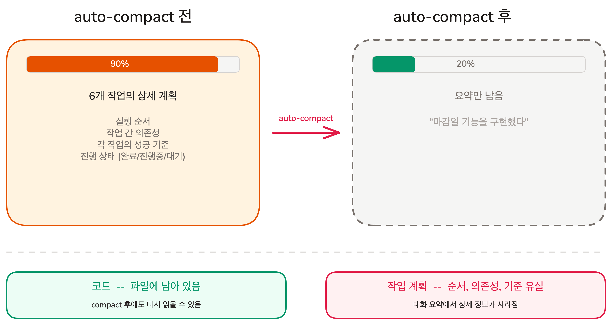
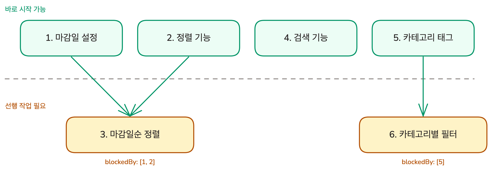

# 대화가 끊겨도 이어서 일하기 | Task 기본

## Overview

이전 레슨에서 성공 기준이 포함된 계획을 세우고 반복적으로 다듬는 사이클을 배웠습니다. 그런데 계획이 크면 대화가 길어지고, context window가 가득 차면 auto-compact가 오래된 대화를 요약합니다. 요약 과정에서 의존성 그래프나 작업별 진행 상태 같은 구조 정보가 유실됩니다. 이번 레슨에서는 계획 구조를 context 밖 파일로 저장하고 작업 간 의존 관계를 명시하는 Task 시스템을 배웁니다.

### 학습 목표

- context overflow 시 auto-compact가 유실하는 정보와 보존하는 정보를 구분할 수 있습니다
- Task 시스템의 핵심 구조(JSON 파일 저장, 상태 추적)를 설명할 수 있습니다
- blockedBy/blocks로 작업 간 의존성을 설정하고, 실행 순서를 설명할 수 있습니다

### 시작하기 전 확인사항

- Claude Code 설치 및 인증 완료
- Lesson 03에서 성공 기준 작성과 Red Green Refactor 사이클을 익힌 상태
- 실습용 Todo 앱 프로젝트 준비
- 실습 프로젝트의 시작 브랜치로 전환합니다 (`git checkout ch05-04`)

`ch05-04` 브랜치는 이 레슨의 시작점입니다.

## 계획이 커지면 생기는 일

Lesson 03에서는 필터링 하나를 계획하고 실행했습니다. 필터링은 한 세션에서 충분히 끝낼 수 있는 크기였습니다.

이제 Todo 앱을 본격적으로 확장한다고 가정합니다. Lesson 03에서 배운 대로, 성공 기준이 포함된 계획을 세웁니다.

```plain text
## Todo 앱 확장 계획

### 기능 목록
1. 마감일 설정 - 각 Todo에 마감일 지정
2. 정렬 기능 - 이름순, 생성일순으로 정렬
3. 마감일순 정렬 - 마감일 가까운 순으로 정렬 (마감일 설정 + 정렬 기능 필요)
4. 검색 기능 - 제목으로 Todo 검색
5. 카테고리 태그 - 업무/개인/쇼핑 태그 추가
6. 카테고리별 필터 - 특정 카테고리만 보기 (카테고리 태그 필요)
```

여섯 가지 기능, 각각 성공 기준까지 포함하면 상당한 작업량입니다. **이 계획을 하나의 context에서 전부 실행할 수 있을까요?**

기능 하나를 구현할 때마다 코드 읽기, 테스트 실행, 도구 응답이 context window에 쌓입니다. 두세 기능을 넘기면 context window가 가득 찹니다.

context window가 가득 차면 무슨 일이 일어나는지 살펴보겠습니다.

## context가 넘치면 뭉개지는 것



첫 번째 기능(마감일 설정)을 구현하면서 context window가 가득 찼습니다. Claude Code는 **auto-compact**를 실행합니다. 오래된 대화를 요약하여 context에 여유를 만듭니다.

auto-compact 후에 AI가 파악할 수 있는 것과 놓칠 수 있는 것을 비교합니다.

**AI가 파악할 수 있는 것:**

- 코드: 파일 시스템에 그대로 있으므로 읽으면 됩니다
- 커밋 기록: git log로 무엇을 했는지 확인할 수 있습니다
- 대화 흐름: "마감일 설정 기능을 구현하고 테스트를 통과시켰다"처럼 요약이 남습니다

**AI가 놓칠 수 있는 것:**

- 6개 기능 중 어디까지 끝났고, 다음에 뭘 해야 하는지
- 마감일순 정렬을 하려면 마감일 설정과 정렬이 둘 다 먼저 끝나야 한다는 선후 관계
- 검색 기능의 성공 기준이 "'회의' 검색 시 '회의' 포함 항목만 표시"라는 구체적 내용

코드를 읽으면 "지금 뭐가 있는지"는 알 수 있습니다. **하지만 "앞으로 뭘 해야 하고, 어떤 순서로 해야 하는지"는 코드에도, 요약에도 정확하게 남아 있지 않을 수 있습니다.** 이 문제를 해결하려면 계획 자체를 context 밖 파일에 저장해야 합니다.

## Task 시스템: auto-compact에도 유실되지 않는 계획

**Task**는 계획을 구성하는 하나의 작업 단위입니다. 제목(subject), 상세 설명(description), 상태(status), 의존성(blockedBy/blocks) 정보를 가지며, `~/.claude/tasks/` 폴더에 JSON 파일로 저장됩니다. JSON 파일은 context window 밖에 존재하므로 auto-compact의 영향을 받지 않습니다. context가 요약되어도 AI가 이 파일을 읽으면 진행 상황을 정확하게 파악합니다.

### Task의 생명주기

각 Task는 세 가지 상태를 거칩니다.

- **pending**: 아직 시작하지 않은 작업
- **in_progress**: 현재 진행 중인 작업
- **completed**: 완료된 작업

`Ctrl+T`를 누르면 현재 Task 목록과 각 상태를 한눈에 확인할 수 있습니다. AI가 작업을 시작하면 `in_progress`로 바꾸고, 끝나면 `completed`로 표시합니다.

### Task 생성을 요청하는 방법

Claude는 작업이 크다고 판단하면 자동으로 Task를 만들기도 하지만, 항상 그렇지는 않습니다. **확실한 방법은 프롬프트에서 직접 요청하는 것입니다.**

- "각 기능을 Task로 등록하고, blockedBy로 의존성을 설정해줘"
- "기능별로 Task를 나눠서 진행해줘"

Plan Mode에서 계획을 승인할 때 Task 등록을 함께 요청하면, 계획에서 Task로의 전환이 자연스럽게 이어집니다.

## blockedBy/blocks: 작업 순서를 AI에게 알려주는 방법

작업이 여러 개일 때, 순서가 중요한 경우가 있습니다. 마감일 데이터가 없으면 마감일순 정렬을 만들 수 없고, 정렬 UI가 없으면 마감일순 옵션을 추가할 곳이 없습니다.

**blockedBy**는 "이 작업은 다른 작업이 끝나야 시작할 수 있다"는 의존 관계를 명시합니다. 반대 방향인 **blocks**는 "이 작업이 끝나야 다른 작업을 시작할 수 있다"를 의미합니다. 같은 관계를 양쪽에서 표현한 것입니다.

```json
{
  "tasks": [
    { "id": "1", "subject": "마감일 설정", "status": "pending" },
    { "id": "2", "subject": "정렬 기능 (이름순, 생성일순)", "status": "pending" },
    { "id": "3", "subject": "마감일순 정렬", "status": "pending", "blockedBy": ["1", "2"] },
    { "id": "4", "subject": "검색 기능", "status": "pending" },
    { "id": "5", "subject": "카테고리 태그", "status": "pending" },
    { "id": "6", "subject": "카테고리별 필터", "status": "pending", "blockedBy": ["5"] }
  ]
}
```

이 구조에서 AI는 세 가지를 즉시 판단합니다.

- Task 1, 2, 4, 5는 blockedBy가 없으므로 바로 시작할 수 있습니다
- Task 3은 Task 1과 Task 2가 모두 완료되어야 시작할 수 있습니다
- Task 6은 Task 5가 완료되어야 시작할 수 있습니다



## 직접 만들어보기: Plan에서 Task로 이어지는 흐름

Todo 앱 확장 계획의 여섯 가지 기능을 Plan Mode로 계획하고, 승인 시 Task로 등록하여 context overflow에도 계획이 유지되는 흐름을 체험합니다.

실습 프로젝트의 시작 브랜치로 전환합니다.

```bash
git checkout ch05-04
```

### Step 1: Plan Mode 진입 + 요구사항 전달

`Shift+Tab`으로 Plan Mode에 진입한 뒤 성공 기준이 포함된 요구사항을 전달합니다.

```plain text
Todo 앱에 아래 기능을 추가하려고 해.
각 기능을 Task로 등록하고, 순서대로 구현해줘.
성공 기준을 테스트로 먼저 작성한 뒤, 테스트가 통과하도록 구현해줘.

## 기능

1. 마감일 설정 - Todo에 마감일 지정 (없이도 추가 가능)
2. 정렬 - 이름순, 생성일순 선택
3. 마감일순 정렬 - 마감일 가까운 순 (1, 2 완료 후)
4. 검색 - 제목으로 검색
5. 카테고리 태그 - 업무/개인/쇼핑 태그 지정
6. 카테고리별 필터 - 특정 카테고리만 보기 (5 완료 후)

## 성공 기준

### 마감일 설정
- 마감일 없는 Todo 추가 -> 정상 추가, 마감일 칸 비어 있음
- 마감일 있는 Todo 추가 -> 목록에 마감일 표시

### 정렬
- Todo 5개에서 '이름순' 선택 -> 가나다순 정렬
- Todo 5개에서 '생성일순' 선택 -> 최신순 정렬
- 현재 정렬 기준이 버튼에 표시됨

### 마감일순 정렬
- '마감일순' 선택 -> 마감일 가까운 항목부터 표시
- 마감일 없는 항목 2개 + 있는 항목 3개 -> 없는 항목은 맨 뒤

### 검색
- '회의' 검색 -> '회의' 포함 항목만 표시
- 검색어 지우기 -> 전체 목록 복원

### 카테고리 태그
- '업무' 태그 지정 후 저장 -> 목록에 태그 표시

### 카테고리별 필터
- '업무' 필터 선택 -> 업무 태그 항목만 표시
- '전체' 선택 -> 필터 해제, 전체 목록 표시

## 범위 제한
- 필터링과 정렬 조합은 구현하지 않는다
- 마감일 알림 기능은 구현하지 않는다
```

Claude가 구현 계획을 제시합니다.

### Step 2: 플랜 리뷰 + 승인

Lesson 03에서 배운 체크리스트로 플랜을 확인합니다. 성공 기준이 모두 반영되었고, 범위를 넘지 않았다면 터미널에서 플랜을 승인합니다.

프롬프트에 Task 등록 요청이 포함되어 있으므로, Claude가 계획을 Task로 등록하고 의존성을 설정합니다. `Ctrl+T`로 확인합니다.

```plain text
Tasks:
[1] [ ] 마감일 설정
[2] [ ] 정렬 기능 (이름순, 생성일순)
[3] [ ] 마감일순 정렬                    blockedBy: [1, 2]
[4] [ ] 검색 기능
[5] [ ] 카테고리 태그
[6] [ ] 카테고리별 필터                  blockedBy: [5]
```

Task 1, 2, 4, 5는 독립이므로 어느 것부터 해도 됩니다. Task 3은 1과 2가, Task 6은 5가 끝나야 시작할 수 있습니다. Plan Mode에서 세운 계획이 Task 시스템에 저장된 것입니다.

### Step 3: 첫 Task 실행과 완료

Claude가 바로 Task 1(마감일 설정) 작업을 시작합니다. 마감일 입력 UI를 추가하고, 성공 기준을 검증한 뒤, `completed`로 표시합니다.

Task 1 완료 후 `/compact`를 실행해도 `Ctrl+T`의 Task 목록은 그대로입니다. **JSON 파일은 context window 밖에 있으므로 auto-compact의 영향을 받지 않습니다.**

이어서 Claude가 Task 2(정렬 기능)를 시작합니다. Task 2가 완료되면 Task 3(마감일순 정렬)의 blockedBy [1, 2]가 모두 해소되어 Claude가 자동으로 Task 3을 시작합니다. Task 1만 끝나고 Task 2가 아직이라면, Claude는 Task 3을 건너뛰고 Task 2를 먼저 진행합니다. **blockedBy가 설정되어 있으면 AI가 순서를 지킵니다.**

## 핵심 포인트 정리

1. **auto-compact는 구조 정보를 유실합니다**: 코드는 파일에, 대화 흐름은 요약에 남지만, 의존성 그래프, 진행 상태, 작업별 상세 설명은 요약 과정에서 정확도를 잃습니다
2. **Task는 `~/.claude/tasks/`에 JSON으로 저장됩니다**: context window 밖 파일이므로 auto-compact의 영향을 받지 않습니다. AI가 이 파일을 읽으면 진행 상황을 정확하게 파악합니다
3. **blockedBy/blocks로 작업 순서를 명시합니다**: 의존성이 있는 작업은 순서대로, 독립적인 작업은 바로 시작할 수 있습니다

## FAQ

- **Q: Task를 꼭 사용해야 하나요? 간단한 작업도요?**
  - A: 1~2단계로 끝나는 단순한 작업에는 Task가 필요 없습니다. 여러 기능을 나눠서 진행하거나, context overflow가 예상되는 큰 작업에 Task가 유용합니다. Claude가 자동으로 Task를 만들기도 하지만, 확실한 방법은 프롬프트에서 "각 기능을 Task로 등록해줘"처럼 직접 요청하는 것입니다

- **Q: Task와 git commit은 어떤 관계인가요?**
  - A: Task 하나가 commit 하나에 대응하는 것이 이상적입니다. Task Sizing에서 배운 "수정 -> 테스트 -> 커밋" 사이클과 같은 원리입니다. Task 완료 = 커밋 완료가 자연스러운 단위입니다

- **Q: AI가 Task 순서를 무시하고 건너뛰면 어떻게 하나요?**
  - A: blockedBy가 설정되어 있으면 AI는 선행 Task가 완료되지 않은 작업을 시작하지 않습니다. 의존성을 정확히 설정하는 것이 중요합니다

- **Q: auto-compact 후에도 Plan의 맥락이 유지되나요?**
  - A: Plan Mode에서 논의한 대화 맥락(왜 이 방식을 선택했는지 등)은 auto-compact 시 요약으로 압축되어 뉘앙스를 잃을 수 있습니다. 하지만 Plan의 결과물인 Task 목록(subject, description, 의존성)이 `~/.claude/tasks/`에 JSON으로 남아 있으므로, AI는 "무엇을 해야 하는지"를 정확하게 파악합니다. Task의 description이 구체적일수록 auto-compact에 대한 복원력이 높아집니다

## 다음 단계

Task 시스템으로 context overflow 시에도 계획의 정확성을 유지하는 방법을 배웠습니다. 이제 Plan Mode와 Task를 함께 사용하는 워크플로우가 완성되었습니다. 이어지는 Chapter 06-08에서는 CLAUDE.md에 쌓인 규칙을 경로별로 분리하는 것부터 시작해서, Context 품질을 지키는 다양한 도구를 배웁니다.

- CLAUDE.md의 규칙을 주제별 파일로 분리하고 경로별로 적용하기 (Rules)
- 반복 프롬프트를 한 단어로 호출하는 Custom Commands

다음 레슨 보기: [규칙을 필요한 곳에만 적용하기](../adding-knowledge/rules)
