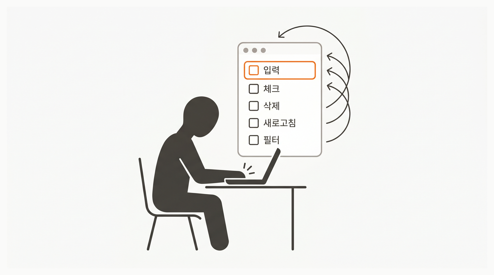
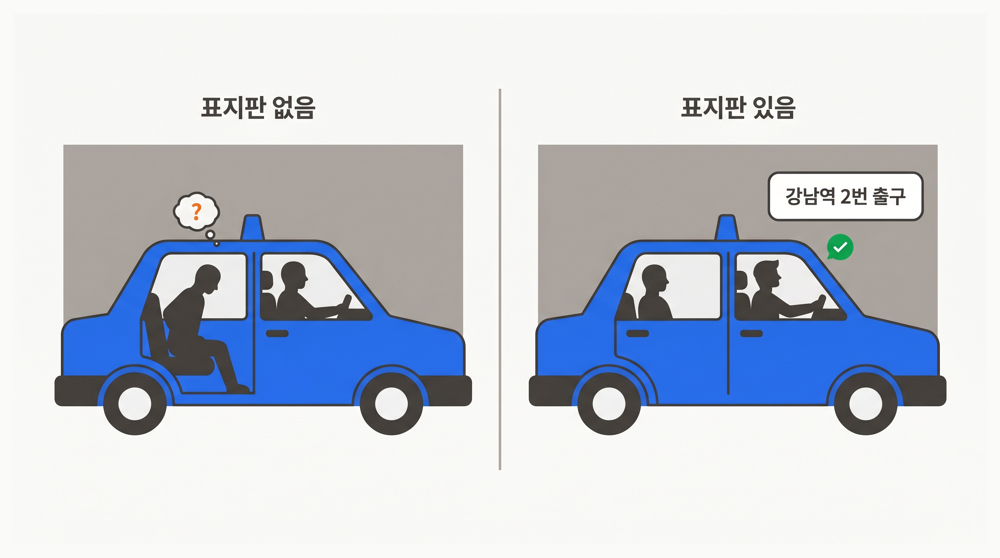

import { Lesson02RegressionSafetyNet } from '@/components/diagrams/lesson-02-regression-safety-net';

## Overview

이전 레슨에서 What 방식으로 목적지만 알려주면 AI가 경로를 알아서 찾는다고 배웠습니다. 그런데 AI가 도착한 곳이 제가 원하던 곳인지는 여전히 브라우저를 열고 사람이 확인해야 했습니다. 자율 루프의 **확인** 단계가 비어 있었던 셈입니다.

이번 레슨에서는 수동 체크리스트를 테스트 코드로 바꿔, 이 확인 단계까지 AI가 스스로 돌게 만드는 방법을 배웁니다.

### 학습 목표

- 수동 체크리스트를 테스트 코드로 변환하는 과정을 체험합니다
- 테스트가 있을 때 AI 자율 루프가 어떻게 완성되는지 이해합니다
- 새 기능을 추가해도 기존 테스트가 회귀를 자동으로 잡는 것을 관찰합니다

### 시작하기 전 확인사항

- Chapter 04에서 만든 Todo 앱이 정상 동작하는 상태
- `bun --version` 으로 Bun 설치 확인
- 실습 프로젝트의 시작 브랜치로 전환합니다 (`git checkout ch05-02`)

`ch05-02` 브랜치는 이 레슨의 시작점입니다. Chapter 04에서 만든 Todo 앱이 동작하는 상태입니다.

## 브라우저 클릭은 확장되지 않는다



Chapter 04 Lesson 03에서 Todo 앱을 만들고 브라우저에서 직접 검증했습니다. 입력 필드에 "장보기"를 쳐서 Enter, 체크박스 클릭으로 완료 표시, 삭제 버튼, 새로고침 — 5개 항목을 하나씩 눌러 확인했습니다.

앞 레슨에서는 What 방식으로 AI에게 기능 추가를 맡기면서 자율 루프를 열었습니다. AI가 파일을 탐색하고, 기존 패턴을 읽고, 코드를 짭니다. 그런데 이 루프에 아직 비어 있는 자리가 하나 있습니다. **확인** 단계입니다.

기능 1개가 늘 때마다 체크리스트 5개를 다시 눌러야 합니다. 기능이 5개면 25번, 10개면 50번. 코드 작성 속도는 AI 덕에 빨라졌는데, 검증 속도는 그대로입니다. **쓰는 사람과 확인하는 사람이 분리된 셈**이고, 이 비대칭이 기능을 늘릴수록 더 커집니다.

이 체크리스트를 AI가 대신 확인할 수 있다면 어떨까요?

## 테스트: AI가 스스로 채점하는 정답지



앞 레슨에서 기사(AI)에게 "강남역 2번 출구"라고 목적지만 말해도 공사 구간을 만나면 알아서 우회한다고 했습니다. 그런데 기사가 **정말 도착했는지는 어떻게 알까요**?

창밖에 '강남역 2번 출구' 표지판이 보이면 기사가 스스로 확인할 수 있습니다. 표지판이 없다면 손님이 매번 창밖을 내다보며 "여기 맞아요?"를 대신 해줘야 합니다.

**테스트 코드는 이 표지판에 해당합니다.** "이 입력을 넣으면 이 출력이 나와야 한다"가 코드로 적혀 있어서, AI가 자기가 쓴 코드가 그 출력을 만드는지 스스로 읽고 판단합니다. 사람이 매번 브라우저를 열 필요가 없어집니다.

### 정답지가 있으면 자율 루프가 완성됩니다

표지판(테스트)이 있을 때 AI는 다음 루프를 스스로 반복합니다.

1. 코드를 작성합니다
2. 테스트를 실행합니다 (`bun run test`)
3. 실패한 항목이 있으면 메시지를 읽고 코드를 수정합니다
4. 다시 테스트를 실행합니다
5. 전부 통과하면 완료를 보고합니다

**정답지 없이는 이 루프가 완성되지 않습니다.** AI가 코드를 작성해도 그 코드가 맞는지 판단할 기준이 자기 안에 없기 때문입니다. 앞 레슨 끝에 남겨둔 "의도 검증은 사람 몫"이라는 한계가 여기서 풀립니다.

## [데모] 수동 체크리스트를 테스트로 변환하기

Chapter 04에서 브라우저로 확인하던 체크리스트를 테스트 코드로 바꿉니다.

### Step 1: 테스트 환경 셋업

**Vitest**는 빠른 JavaScript 테스트 러너, **React Testing Library**는 사용자 관점에서 컴포넌트를 테스트하는 도구입니다. 설치와 설정 파일 생성은 AI에게 맡깁니다.

```plain text
이 Next.js 프로젝트에 Vitest 와 React Testing Library 테스트 환경을 셋업해줘.
샘플 테스트를 하나 작성해서 `bun run test` 로 동작을 검증해줘.
```

AI가 패키지 설치, 설정 파일 생성, 샘플 테스트 실행까지 처리합니다.

### Step 2: AI에게 체크리스트 전달

Chapter 04 Lesson 03의 검증 체크리스트를 그대로 AI에게 건네고, 테스트 코드로 변환해 달라고 요청합니다.

```plain text
아래 검증 체크리스트를 테스트 코드로 만들어줘.

1. 입력 필드에 "장보기" 입력 후 Enter -> 목록에 추가됨
2. 빈 입력 상태에서 Enter -> Todo 가 추가되지 않음
3. 체크박스 클릭 -> 완료 표시 (취소선)
4. 삭제 버튼 클릭 -> 해당 항목 제거
5. 페이지 새로고침 -> 기존 목록 유지
```

### Step 3: 생성된 테스트 확인

AI가 테스트 5개를 생성합니다. 각 테스트가 체크리스트의 어떤 항목에 대응하는지 한 번 훑어봅니다. 표현만 다를 뿐 "이 입력 → 이 기대 결과"라는 구조는 체크리스트 그대로입니다.

### Step 4: 전 항목 통과 — 기준선 확보

```shell
bun run test
```

<Callout type="warn">
**`bun test` 가 아닙니다**

`bun test` 는 Bun 내장 테스트 러너를 실행합니다. `bun run test` 는 `package.json` 의 `test` 스크립트(Vitest)를 실행합니다. 이 레슨에서는 Vitest를 사용하므로 `bun run test` 가 맞습니다.
</Callout>

5개 테스트가 모두 통과합니다. 이 통과 상태가 **기준선**입니다. 지금 이 시점의 코드가 체크리스트의 모든 항목을 만족한다는 증거이자, 앞으로 코드가 바뀌어도 이 5개 항목은 지켜져야 한다는 약속입니다.

## [데모] 기능을 추가해도 기존 기능은 테스트가 지킵니다

<Lesson02RegressionSafetyNet />

테스트의 진짜 가치는 **코드가 바뀔 때** 드러납니다. Todo 앱에 새 기능을 붙여 보면서 관찰합니다.

### Step 5: 우선순위 기능 추가 지시

Todo 항목에 우선순위(높음/보통/낮음)를 설정할 수 있게 합니다.

```plain text
Todo 항목에 우선순위(높음/보통/낮음) 를 설정할 수 있게 해줘.
새 Todo 추가 시 우선순위를 선택할 수 있어야 하고, 목록에서 우선순위가 표시되어야 해.
```

AI가 관련 코드를 수정합니다.

### Step 6: 테스트가 자동 검증하는 과정 관찰

AI가 우선순위 기능을 추가한 뒤 `bun run test` 를 실행합니다. 두 가지 중 하나가 일어납니다.

**테스트가 실패하는 경우**: 기존 5개 테스트 중 일부가 실패합니다. AI는 실패 메시지를 읽고 원인을 파악합니다. 코드를 수정해 다시 테스트를 돌리면 5개가 전부 통과합니다.

**테스트가 전부 통과하는 경우**: AI가 기존 테스트를 미리 읽고 호환을 맞춰 코드를 작성한 경우입니다.

어떤 경우든, 기준선 5개가 깨지지 않았다는 사실을 **사람이 브라우저에서 한 번도 클릭하지 않고** 확인했습니다. 이것이 회귀 보호입니다.

### Step 7: 새 기능의 테스트도 추가

기존 5개 테스트가 기존 기능을 지켰으니, 이제 새로 추가한 우선순위 기능도 같은 방식으로 보호할 차례입니다.

```plain text
우선순위 기능에 대한 테스트도 만들어줘.
```

AI가 우선순위 선택·목록 표시 등 관련 테스트를 추가합니다. `bun run test` 를 돌리면 기존 5개 + 새 테스트가 모두 통과합니다.

다음에 또 기능을 추가해도, 이제는 우선순위 기능까지 테스트가 자동으로 지킵니다. **테스트가 쌓일수록 보호 범위가 넓어집니다.**

## 기능 뒤에 붙이는 테스트의 빈틈

Step 7을 다시 떠올려 보겠습니다. 우선순위 기능을 먼저 만들고, **그 뒤에** 테스트를 붙였습니다. 그리고 새로 만든 테스트가 한 번에 통과했습니다. 이게 꼭 좋은 신호일까요?

이 순서에서는 **출제자와 수험자가 같은 사람**입니다. AI가 자기가 쓴 코드를 보면서 테스트를 만들었기 때문에, 코드가 놓친 케이스는 테스트도 놓칠 가능성이 높습니다. 코드의 빈틈과 테스트의 빈틈이 같은 모양으로 생깁니다.

예를 들어 AI가 "우선순위를 선택하지 않았을 때" 처리를 빠뜨렸다면, 생성된 테스트에도 그 케이스가 들어있지 않습니다. 테스트는 전부 초록색인데 버그는 살아 있습니다. 수동으로 앱을 써보기 전에는 아무도 모릅니다.

그럼 **순서를 뒤집으면** 어떻게 될까요? 테스트를 먼저 써두고 AI가 그 테스트를 통과시키도록 코드를 작성하게 하면, AI가 자기 실수를 가릴 수 없어집니다.

## 핵심 포인트 정리

1. **테스트 = 자동화된 체크리스트**: 브라우저에서 수동 확인하던 항목 하나가 테스트 한 개에 대응합니다. AI에게 체크리스트를 주면 테스트 코드로 변환합니다
2. **자율 루프의 완성**: 앞 레슨에서 열어둔 자율 루프의 마지막 단계(확인)를 테스트가 채웁니다. AI는 "코드 작성 → 테스트 실행 → 실패 → 수정"을 사람 개입 없이 반복합니다
3. **회귀 보호**: 새 기능을 추가해도 기존 테스트가 깨지면 AI가 즉시 감지합니다. `bun run test` 한 번이 브라우저 5번 클릭을 대체합니다
4. **기능 뒤 테스트의 함정**: 자기 코드를 보고 쓴 테스트는 자기 코드의 빈틈을 덮기 쉽습니다. 이 허점이 다음 레슨의 출발점입니다

## FAQ

- **Q: 테스트 코드를 직접 작성해야 하나요?**
  - A: AI에게 수동 체크리스트를 주고 변환시킬 수 있습니다. 다만 생성된 테스트가 체크리스트의 의도를 정확히 반영하는지는 개발자가 확인합니다

- **Q: 모든 기능에 테스트가 필요한가요?**
  - A: 반복 검증이 필요한 핵심 기능 위주로 씁니다. 색상·간격 같은 시각적 디테일이나 "이 플로우가 자연스러운가" 같은 UX 판단은 테스트로 잡기 어렵습니다. "이게 깨지면 사용자에게 바로 영향이 가는가?"를 기준으로 판단합니다

## 이어서 배울 내용

방금은 기능을 다 만든 뒤에 테스트를 붙였습니다. 다음 레슨에서는 순서를 뒤집어, **계획 단계에서 성공 기준을 적고 그걸 테스트로 먼저 쓰는** 방식을 배웁니다. 이 순서 전환이 기능 뒤 테스트의 함정을 어떻게 해결하는지 체험합니다.

- 검증 가능한 성공 기준(Acceptance Criteria) 작성법
- 테스트를 먼저 쓰는 이유와 Red Green Refactor 사이클
