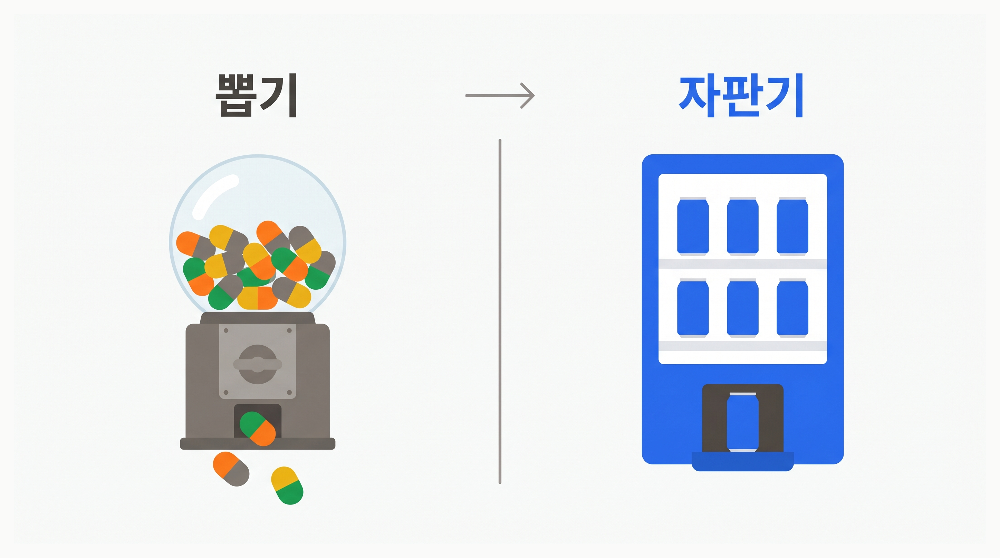
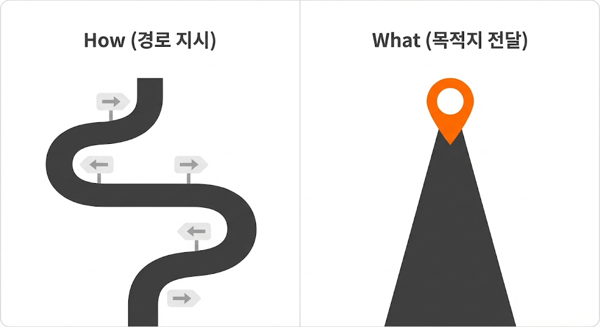
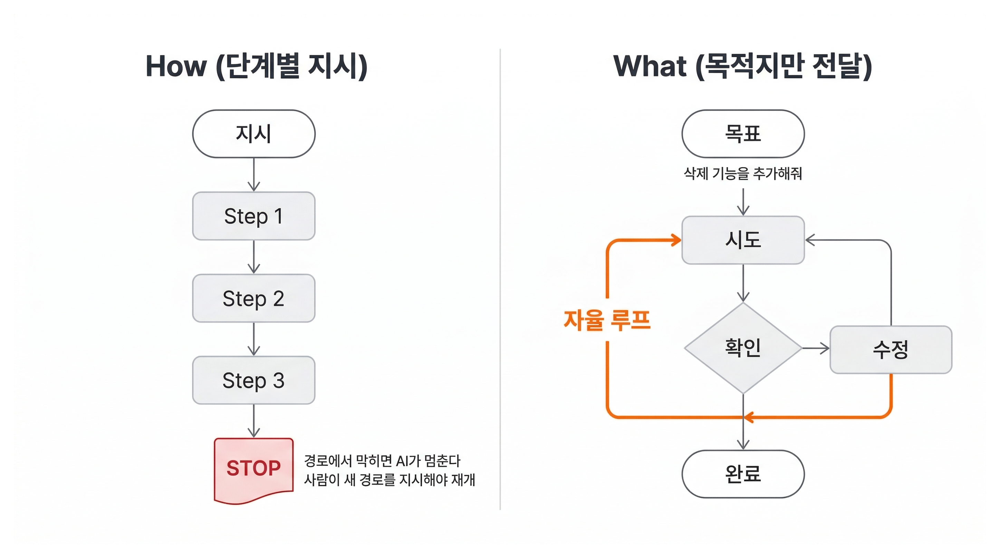

# What vs How | AI에게 일 시키는 두 가지 방법

## Overview

Part 1에서 같은 프롬프트를 넣어도 어떤 때는 깔끔한 코드가, 어떤 때는 엉뚱한 코드가 나오는 경험을 했을 것입니다.

LLM은 본질적으로 **뽑기 기계**입니다. 버튼을 누르면 매번 다른 결과가 나옵니다. Part 2의 목표는 이 뽑기를 **자판기**로 바꾸는 것입니다. 버튼을 누르면 매번 원하는 결과가 나오도록.

그 첫 번째 전환점이 AI에게 일을 맡기는 방식입니다.

### 학습 목표

- What vs How의 차이와 What 방식이 유리한 이유를 설명할 수 있습니다
- What 방식으로 AI에게 기능 추가를 맡기고 How 방식과 비교합니다

### 시작하기 전 확인사항

- Chapter 04에서 만든 Todo 앱 프로젝트가 있어야 합니다

## What vs How: AI에게 일 시키는 두 가지 방법

택시를 타고 강남역에 가야 한다고 생각해 보겠습니다.

**How(어떻게) 방식**은 경로를 단계별로 지시합니다.

> "여기서 좌회전하고, 두 번째 신호에서 우회전하고, 고가도로 타고 3km 직진하세요."

**What(무엇) 방식**은 목적지만 말합니다.

> "강남역 2번 출구요."

How 방식에서는 공사 중인 도로가 나오면 기사가 멈추고, 내가 새 경로를 알려줘야 합니다. What 방식에서는 기사가 알아서 우회합니다.

**도착이라는 결과만 같으면 어떤 경로든 상관없습니다.**

AI에게 코드를 맡길 때도 같은 차이가 있습니다. 방법을 지정하면 **AI가 더 나은 대안을 찾지 않습니다.** "useReducer로 바꿔"라고 지시하면, 커스텀 훅으로 분리하는 게 더 나은 상황에서도 useReducer에 끌려갑니다. 언급된 방법이 AI의 사고를 점유해버리기 때문입니다.

### What이 AI에게 유리한 이유

**What 방식은 AI에게 자율적 루프를 허용합니다.** How 방식에서 AI가 막히면 멈춥니다. What 방식에서 AI가 막히면 다른 방법을 시도합니다. 목표(원하는 동작)는 변하지 않으므로, AI는 경로를 자유롭게 바꿀 수 있습니다.

코드이기 때문에 이것이 가능합니다. 코드는 실행하면 동작/에러가 바로 나옵니다. AI는 이 피드백을 보고 **"시도 -> 확인 -> 수정"을 스스로 반복**할 수 있습니다. 이것을 **자율 루프(Autonomous Loop)**라고 합니다.

단, **AI가 스스로 확인할 수 있는 것은 "코드가 에러 없이 실행되는가"까지입니다.** "이 기능이 사용자가 원하는 대로 동작하는가"는 아직 사람이 판단해야 합니다. 이 한계를 극복하는 방법은 다음 레슨에서 배웁니다.

## 직접 비교하기: How vs What

Chapter 04에서 만든 Todo 앱에 새 기능을 추가합니다. 같은 기능을 How와 What 두 가지 방식으로 지시해보고, 차이를 직접 체험합니다.

### Step 1: How 방식으로 지시해보기

Todo 앱에 "남은 항목 수 표시" 기능을 추가합니다. 먼저 How 방식으로 지시합니다.

Claude Code에 다음과 같이 입력합니다.

> "TodoApp 컴포넌트를 열어서 todos 배열에서 completed가 false인 항목 수를 계산하는 변수를 만들어. 목록 아래에 p 태그를 추가하고, '\{count\}개 남음' 텍스트를 넣어. 클래스는 text-sm text-gray-500으로 해."

AI가 지시대로 작업합니다. 결과를 확인합니다.

이 지시를 쓰려면 미리 알아야 하는 것들이 있습니다.

- 컴포넌트 이름이 `TodoApp`인지, `TodoList`인지, `App`인지
- state가 `todos` 배열인지, 다른 구조인지
- `completed`라는 필드명이 맞는지
- `text-sm text-gray-500`이 프로젝트의 스타일 컨벤션에 맞는지

프로젝트를 직접 살펴보지 않으면 이 지시를 쓸 수 없습니다. **그걸 다 파악할 시간에 차라리 직접 코드를 쓰는 게 빠릅니다.**

### Step 2: What 방식으로 같은 기능 지시하기

이번에는 같은 기능을 What 방식으로 지시합니다.

> "Todo 목록에 남은 항목 수를 보여줘. 완료하지 않은 할 일이 몇 개인지 한눈에 보고 싶어."

AI가 하는 일을 관찰합니다.

1. 프로젝트의 파일 구조를 탐색합니다
2. 기존 컴포넌트를 읽고 state 구조를 파악합니다
3. 적절한 위치에 코드를 추가합니다
4. 프로젝트의 스타일 컨벤션에 맞게 작성합니다

파일 이름, state 구조, CSS 클래스를 내가 몰라도 됩니다. AI가 프로젝트를 직접 파악하고 판단합니다.

이것이 가능한 이유가 있습니다. Claude Code 같은 AI 코딩 에이전트는 파일 탐색, 코드 읽기, 명령어 실행을 스스로 할 수 있습니다. `package.json`을 보고 프로젝트의 의존성과 스크립트를 파악하고, 기존 코드를 읽어 패턴을 이해합니다. 내가 설명하는 것보다 AI가 직접 보는 게 더 정확합니다.

### Step 3: 비교하기

| | How 방식 | What 방식 |
|--|---------|----------|
| 지시 시간 | 길다 (프로젝트 파악 필요) | 짧다 (한 문장) |
| 필요 지식 | 파일 구조, state, CSS | 원하는 동작만 |
| AI 자율성 | 없음 (지시대로만) | 높음 (경로 탐색) |
| 결과 품질 | 기존 코드와 안 맞을 수 있음 | 기존 코드에 맞춤 |

### Step 4: 남은 질문

What 방식이 편하고, AI가 기존 코드에 맞춰 더 나은 결과를 만드는 것도 확인했습니다.

그런데 이 결과가 정말 내가 원한 동작인지, AI는 모릅니다. 남은 항목 수가 정확한지, 완료하면 줄어드는지, 0개일 때는 어떻게 표시되는지. 브라우저를 열어 직접 확인하기 전까지는 알 수 없습니다. **AI는 코드를 잘 만들었지만, 그것이 "맞는" 결과인지는 판단하지 못합니다.**

이 문제를 다음 레슨에서 해결합니다.

## 핵심 포인트 정리

1. **What 방식과 자율 루프**: How는 단계를 지시하고, What은 목적지만 알려줍니다. What 방식에서 AI가 막히면 스스로 다른 경로를 찾습니다. 코드는 실행 결과가 즉시 나오므로 "시도 -> 확인 -> 수정"을 자율적으로 반복할 수 있습니다
2. **남은 과제**: AI가 스스로 검증할 수 있는 것은 코드 에러까지입니다. 사용자 의도에 맞는지는 다음 레슨에서 해결합니다

## FAQ

- **Q: What으로 시키면 원하는 결과가 안 나올 수도 있지 않나요?**
  - A: 네, 그래서 결과를 검증하는 방법이 필요합니다. 지금은 브라우저에서 직접 확인하고 있지만, 다음 레슨에서 배우는 성공 기준을 사용하면 AI가 스스로 검증할 수 있습니다

- **Q: How 방식은 아예 쓰면 안 되나요?**
  - A: 두 가지 상황에서 How가 적절합니다. 첫째, "이 변수 이름을 todoList에서 tasks로 바꿔줘"처럼 변경 대상이 명확하고 AI가 판단할 여지가 없는 경우. 둘째, AI가 같은 실수를 반복할 때 교정하는 경우입니다. 예를 들어 AI가 변경 후 타입 체크를 계속 빼먹는다면 "코드 변경 후 반드시 타입 체크를 실행해"라고 지시할 수 있습니다. 핵심은 **AI가 판단해야 할 것이 많을수록 What이 유리하고, How는 AI가 스스로 알 수 없는 것에만 쓴다**는 것입니다

## 다음 단계

다음 레슨에서는 수동 체크리스트를 테스트 코드로 변환합니다. AI가 스스로 '됐다/안 됐다'를 판단할 수 있게 됩니다.

- 수동 체크리스트를 테스트 코드로 변환하기
- 코드 변경 시 테스트가 기존 기능을 자동으로 확인하는 과정 체험

다음 레슨 보기: [수동 검증에서 벗어나기](./test-based-verification)
