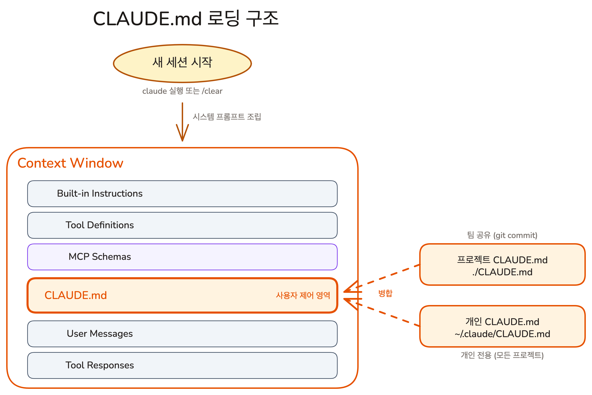

## Overview

이전 레슨에서 Context가 길어질수록 AI 품질이 떨어진다는 것을 배웠습니다. 그런데 AI는 매 대화를 백지 상태에서 시작하기 때문에, 프로젝트 정보를 매번 처음부터 설명하면 그 자체가 Context 낭비입니다. CLAUDE.md는 프로젝트 핵심 정보를 한 번만 작성해두면 매 대화 시작 시 자동으로 로드하여 이 문제를 해결합니다.

### 학습 목표

- CLAUDE.md가 무엇이고, 매 대화에서 어떻게 로드되는지 설명할 수 있습니다
- "모델이 코드에서 찾을 수 없는 정보만 넣는다"는 원칙으로 CLAUDE.md에 넣을 내용과 뺄 내용을 판단할 수 있습니다

## CLAUDE.md: 신입 사원에게 주는 업무 매뉴얼

실력 좋은 개발자가 오늘 처음 출근했다고 상상해 보세요. 면접을 통과할 만큼 뛰어나지만, 이 회사의 아키텍처 결정 이유, 코딩 컨벤션, 브랜치 규칙은 전혀 모릅니다. 다만 사무실 구조는 직접 둘러보면 파악할 수 있고, 장비 사용법은 장비에 적혀 있습니다. **CLAUDE.md**는 이 신입 사원에게 첫 출근날 건네는 **업무 매뉴얼**입니다. 매뉴얼에는 사무실 지도나 장비 사용법이 아니라, **돌아다녀서는 알 수 없는 것** -- 왜 이 도구를 선택했는지, 팀의 합의 사항이 무엇인지 -- 만 적습니다. 한 번 작성해두면, 출근마다 자동으로 전달됩니다.

### LLM은 매 대화를 백지에서 시작한다

Claude Code에서 새 세션을 시작하거나 `/clear`를 실행하면, AI는 이전 대화를 전혀 기억하지 못합니다. 직전 대화에서 프로젝트 구조를 설명하고 아키텍처 결정 이유까지 알려줬더라도, 새 대화에서는 모두 사라집니다. **LLM**(Large Language Model)은 **무상태(Stateless)** 시스템이기 때문입니다.

매번 같은 설명을 반복하면 시간이 낭비되고, 반복할 때마다 **Context Window**를 소비합니다. CLAUDE.md도 Context를 사용하지만, 한 번 정리해둔 문서이므로 같은 정보를 훨씬 적은 공간으로 전달합니다. 매 대화가 시작될 때 **System Prompt**의 일부로 자동 주입되어, AI가 프로젝트를 이해한 상태에서 대화를 시작할 수 있게 합니다.

#### CLAUDE.md는 어디에 저장하는가?

CLAUDE.md는 두 곳에 저장할 수 있으며, 각각 용도가 다릅니다.



| 위치 | 범위 | 예시 |
|------|------|------|
| 프로젝트 루트 `CLAUDE.md` | 팀 전체 (git 커밋) | "Next.js 15 + TypeScript", "커밋은 Conventional Commits", `bun test --watch` |
| `~/.claude/CLAUDE.md` | 개인 전용 (모든 프로젝트 적용) | "한국어로 응답", "커밋 메시지는 영어로", "코드 리뷰 시 보안 항목 우선 확인" |

업무 매뉴얼 비유로 돌아가면, 프로젝트 루트의 CLAUDE.md는 회사 공식 매뉴얼이고, `~/.claude/CLAUDE.md`는 개인이 직장을 옮겨도 가지고 다니는 업무 노하우입니다.

#### 모든 설정 파일에 적용되는 2-tier 구조

이 프로젝트/개인 구분은 CLAUDE.md만의 특성이 아닙니다. **Claude Code의 모든 설정 파일이 같은 2-tier 구조를 따릅니다.**

| 설정 파일 | 프로젝트 레벨 (팀 공유, git 커밋) | 사용자 레벨 (개인 전용, 모든 프로젝트) |
|-----------|----------------------------------|--------------------------------------|
| CLAUDE.md | 프로젝트 루트 `CLAUDE.md` | `~/.claude/CLAUDE.md` |
| Commands | `.claude/commands/` | `~/.claude/commands/` |
| Skills | `.claude/skills/` | `~/.claude/skills/` |
| Agents | `.claude/agents/` | `~/.claude/agents/` |
| MCP | `.mcp.json` (`-s project`) | `~/.claude/.mcp.json` (`-s user`) |

원칙은 하나입니다. **프로젝트 폴더 안(`.claude/`)에 넣으면 git으로 팀이 공유하고, 홈 디렉토리(`~/.claude/`)에 넣으면 개인 전용으로 모든 프로젝트에 적용됩니다.** Part 2에서 배울 Commands, Skills, Agents, MCP 모두 이 패턴을 따르므로, 여기서 한 번만 기억해 두면 됩니다.

## [실습] CLAUDE.md에 규칙 추가해보기

CLAUDE.md가 어떻게 동작하는지 직접 체험해 봅시다. 가장 간단한 규칙 하나를 추가하고, AI가 그 규칙을 따르는지 확인합니다.

### Step 1: CLAUDE.md 열기

프로젝트 루트의 `CLAUDE.md` 파일을 열고, 맨 아래에 다음 한 줄을 추가합니다.

```markdown
- 모든 대화에서 한글로만 대답한다
```

### Step 2: 새 세션에서 확인

CLAUDE.md는 새 세션이 시작될 때 로드됩니다. `/clear`로 세션을 초기화하거나 새 터미널에서 `claude`를 실행한 뒤, 영어로 질문해 보세요.

> What does this project do?

Claude가 한글로 답변하면 CLAUDE.md가 정상적으로 동작하는 것입니다. 이제 이 한 줄의 규칙이 어떤 카테고리에 속하는지, CLAUDE.md에 어떤 내용을 넣어야 하는지 구체적으로 알아봅시다.

## CLAUDE.md에 넣어야 하는 것: 한 가지 원칙

### 분홍 코끼리 효과

"분홍 코끼리를 생각하지 마세요." 이 문장을 읽는 순간, 분홍 코끼리를 떠올리지 않을 수 없습니다. LLM도 같은 방식으로 작동합니다. **Context에 넣은 정보는 모델의 출력에 반드시 영향을 줍니다.** 기술 스택을 상세히 적어두면, AI는 코드를 작성할 때마다 그 정보를 의식합니다 -- 이미 알고 있는 정보라 해도.

Lesson 01에서 지침이 많아질수록 각 지침의 준수율이 떨어지는 **지침의 저주**를 배웠습니다. CLAUDE.md는 매 대화마다 로드되므로, 불필요한 정보가 한 줄 추가될 때마다 나머지 모든 규칙의 영향력이 조금씩 희석됩니다.

### 판단 기준: 모델이 코드에서 찾을 수 있는가?

판단 기준은 하나입니다. **"이 정보를 모델이 `package.json`이나 코드 구조에서 스스로 찾을 수 있는가?"** 찾을 수 있다면 CLAUDE.md에 넣지 않습니다. 찾을 수 없다면 넣습니다.

| 정보 유형 | 예시 | 코드에서 찾을 수 있는가? | CLAUDE.md에 |
|-----------|------|------------------------|------------|
| 기술 스택 | "Next.js 15 + TypeScript" | `package.json`에 명시 | 빼기 |
| 디렉토리 구조 | "`app/` - 라우트, `lib/` - 유틸리티" | 파일 시스템을 직접 탐색 가능 | 빼기 |
| 빌드/테스트 명령어 | "`bun run dev`", "`bun test`" | `package.json` scripts에 명시 | 빼기 |
| 아키텍처 결정 이유 | "Server Components 우선, 상태는 Zustand" | 코드에 이유가 적혀있지 않음 | **넣기** |
| 팀 워크플로우 | "커밋은 Conventional Commits" | 코드에 규칙이 없음 | **넣기** |
| 제약사항 | "Shadcn 컴포넌트 원본 수정 금지" | 코드에 금지 규칙이 없음 | **넣기** |

기술 스택, 디렉토리 구조, 실행 명령어는 모델이 `package.json`과 파일 시스템에서 직접 읽을 수 있습니다. 이런 정보를 CLAUDE.md에 다시 적으면, 모델이 이미 아는 내용을 한 번 더 처리하면서 Context만 소비합니다. 반면 아키텍처 결정의 이유, 팀 워크플로우, 제약사항은 코드 어디에도 적혀있지 않습니다. 이것이 CLAUDE.md에 넣어야 하는 정보입니다.

### 아키텍처 결정 이유

"Server Components를 사용한다"는 코드에서 보이지만, "왜 Server Components를 우선하는가"는 보이지 않습니다. 결정의 이유를 명시하면, AI가 새 기능을 만들 때도 같은 원칙을 따릅니다.

```markdown
## Architecture
Server Components 우선, 클라이언트 상태는 최소화. 상태 관리가 필요하면 Zustand 사용.
```

### 팀 워크플로우

커밋 메시지 형식, 브랜치 명명 규칙, PR 요구사항 같은 팀 협업 규칙입니다. 코드에서 추론할 수 없는 팀의 합의 사항이므로 CLAUDE.md에 넣습니다.

```markdown
## Workflow
- 커밋 메시지: Conventional Commits (feat:, fix:, refactor:)
- 브랜치: feature/<name>, fix/<name>
- PR 전 lint + test 통과 필수
```

### 프로젝트 제약사항

절대 하면 안 되는 것, 반드시 지켜야 하는 것 등 프로젝트의 경계선입니다. **NEVER**, **IMPORTANT** 같은 키워드를 붙이면 AI가 더 잘 따릅니다.

```markdown
## Rules
- **NEVER** Shadcn 컴포넌트 원본 수정
- 모든 대화에서 한글만 사용
- 새 라이브러리 설치 시 팀 확인
```

### 넣지 않아야 하는 것

- **코드베이스에서 찾을 수 있는 정보**: 기술 스택, 디렉토리 구조, 빌드/테스트 명령어. 모델은 `package.json`과 파일 시스템을 직접 읽을 수 있습니다. 같은 정보를 CLAUDE.md에 다시 적으면 Context만 소비하고, 정작 중요한 규칙의 영향력을 희석합니다
- **AI가 이미 아는 것**: "변수 이름은 의미 있게", "함수는 작게 유지" 같은 일반적인 프로그래밍 원칙은 넣을 필요가 없습니다. "에러를 적절히 처리하라"가 아니라 "에러는 Sentry로 보내고, 로깅은 winston만 사용한다"처럼 프로젝트만의 규칙을 넣으세요
- **민감한 정보**: API 키, 비밀번호, 데이터베이스 접속 정보. CLAUDE.md는 git에 커밋되므로 팀 전체가 볼 수 있습니다. 민감한 정보는 환경 변수로 관리합니다
- **자주 바뀌는 정보**: 특정 티켓 번호, 임시 해결책 같은 일시적 내용. CLAUDE.md는 안정적인 규칙을 담는 곳입니다

## 잘 쓴 CLAUDE.md의 원칙

### 300줄 미만: 짧을수록 좋다

Lesson 01에서 배운 원리를 떠올려 보겠습니다. 지침이 많아질수록 AI가 각 지침을 따르는 비율이 떨어집니다. 규칙 10개를 한꺼번에 주면 앞의 몇 개는 잘 따르다가 나머지는 슬쩍 무시하기 시작합니다. CLAUDE.md는 매 대화마다 로드되므로, 길어지면 이 현상이 매 메시지마다 발생합니다.

300줄 미만을 권장합니다. 첫 출근한 사원에게 500페이지짜리 매뉴얼을 건네면 아무도 읽지 않는 것과 같습니다. 실제로 반복되는 마찰을 해결하는 내용만 포함하고, 아직 겪지 않은 문제에 대한 규칙은 넣지 마세요.

<Callout type="info" title="CLAUDE.md가 300줄을 넘어갈 때">
전문 지침이 많아지면 Chapter 06에서 배울 **Skills**로 분리할 수 있습니다. Skills는 호출할 때만 로드되므로, CLAUDE.md에는 핵심만 남기고 나머지를 Skills로 옮기면 됩니다.
</Callout>

<Callout type="idea" title="중요한 규칙을 강조하는 방법">
규칙이 많아지면 중요도가 묻힐 수 있습니다. 절대 지켜야 하는 규칙에는 **NEVER**, **IMPORTANT** 같은 키워드를 붙이면 AI가 더 잘 따릅니다. 예: `**NEVER** .env 파일 커밋`
</Callout>

### 전체 예시

```markdown
# Todo App

## Architecture
Server Components 우선, 클라이언트 상태는 최소화.
상태 관리가 필요하면 Zustand 사용.

## Workflow
- 커밋 메시지: Conventional Commits (feat:, fix:, refactor:)
- 브랜치: feature/<name>, fix/<name>
- PR 전 lint + test 통과 필수

## Rules
- 한글로만 대답
- **NEVER** Shadcn 컴포넌트 원본 수정
- 커밋 전 테스트 실행, 컴포넌트는 components/ 아래에 생성
- 새 라이브러리 설치 시 팀 확인
```

기술 스택과 디렉토리 구조, 실행 명령어가 빠졌습니다. 모델은 이미 `package.json`과 파일 시스템에서 이 정보를 알고 있습니다.

## 핵심 포인트 정리

1. **CLAUDE.md는 자동 로드 시스템 프롬프트입니다**: LLM은 매 대화를 백지에서 시작하지만, CLAUDE.md는 매번 자동으로 주입되어 프로젝트의 핵심 정보를 제공합니다
2. **모델이 코드에서 찾을 수 없는 것만 넣으세요**: 기술 스택, 디렉토리 구조, 실행 명령어는 모델이 직접 찾을 수 있습니다. 아키텍처 결정 이유, 팀 워크플로우, 제약사항만 CLAUDE.md에 넣습니다

## FAQ

- **Q: CLAUDE.md를 언제 업데이트해야 하나요?**
  - A: AI에게 같은 설명을 두 번 이상 반복하고 있다면 그때가 업데이트할 시점입니다. 작업 중에 `#` 키를 눌러 메모를 남길 수 있고, 이런 메모가 쌓이면 CLAUDE.md에 추가하세요

- **Q: `/init` 명령어로 CLAUDE.md를 자동 생성할 수 있다던데요?**
  - A: `/init`은 프로젝트를 분석해 CLAUDE.md 초안을 생성하지만, 결과물 대부분이 기술 스택, 디렉토리 구조, 실행 명령어 -- 모델이 이미 찾을 수 있는 정보입니다. 빈 파일에서 아키텍처 결정 이유, 팀 워크플로우, 제약사항 세 가지만 직접 적는 것이 더 효과적입니다

- **Q: 프로젝트 CLAUDE.md와 개인 CLAUDE.md가 충돌하면 어떻게 되나요?**
  - A: 두 파일 모두 로드됩니다. 같은 주제에 대해 다른 지침이 있으면 AI가 혼란스러워할 수 있으므로, 프로젝트 파일에는 팀 규칙을, 개인 파일에는 팀 규칙과 겹치지 않는 개인 선호만 넣는 것이 좋습니다

## 다음 단계

CLAUDE.md가 "매 대화 시작 시 핵심 정보를 자동 제공"하는 문제를 해결했다면, 다음 질문은 "대화 중에 배운 것은 어떻게 유지하는가"입니다. CLAUDE.md는 사용자가 직접 작성하는 팀 규칙이지만, 대화 중에 Claude가 배운 선호와 패턴은 세션이 끝나면 사라집니다.

- 세션 간 학습을 자동으로 유지하는 Memory
- CLAUDE.md와 Memory의 역할 차이

다음 레슨 보기: [대화가 끊겨도 기억되는 것](./memory)
