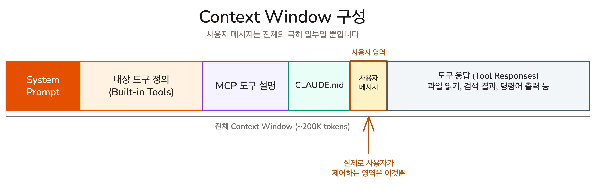
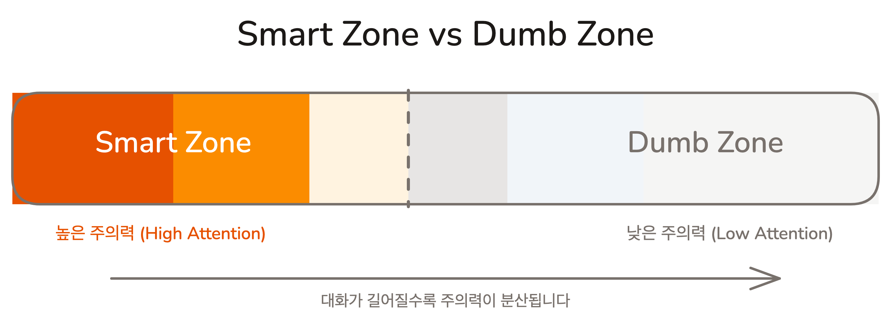

# 왜 대화가 길어지면 AI가 멍청해지나 | Context Window

## Overview

Chapter 02에서 Claude Code로 파일을 수정하고 커밋까지 자연어로 수행했습니다. 그런데 대화가 길어질수록 AI의 응답 품질이 눈에 띄게 떨어지는 현상이 생깁니다. 이 레슨에서는 그 원인인 Context Window를 이해하고, 품질을 유지하는 구조적 접근법을 배웁니다.

### 학습 목표

- Context Window가 무엇이고, 어떤 요소들로 구성되는지 설명할 수 있습니다
- Context가 길어지면 품질이 떨어지는 두 가지 측면(위치 편향, 지침의 저주)을 설명할 수 있습니다
- 모듈형 프롬프트의 핵심 원칙과 4가지 전략을 설명할 수 있습니다

## Context Window: AI가 한 번에 볼 수 있는 범위

프로젝트 문서를 펼쳐놓고 작업하는 책상을 상상해 보겠습니다. 책상이 넓을수록 더 많은 문서를 동시에 볼 수 있지만, 책상 크기에는 한계가 있습니다. 문서가 쌓일수록 처음에 올려둔 자료는 구석으로 밀려나고 잘 보이지 않게 됩니다. **Context Window**가 바로 이 책상입니다. AI가 한 번에 볼 수 있는 정보의 전체 범위이며, **Token(토큰)**이라는 단위로 크기를 측정합니다.

> [!NOTE] Token이란?
> 영어에서는 대략 단어 하나가 1-2 토큰, 한국어에서는 한 글자가 1-2 토큰 정도입니다. 토큰이 많을수록 비용이 올라가고 처리 속도가 느려집니다.

## Context Window의 구성: 보이지 않는 곳에서 일어나는 일

"내가 입력한 메시지만 Context Window를 차지하겠지"라고 생각하기 쉽습니다. 실제로는 사용자가 보지 못하는 곳에서 이미 상당량이 소비되고 있습니다.

- **System Prompt**: Claude의 기본 행동을 정의하는 지침. 사용자에게는 보이지 않지만 항상 존재합니다
- **내장 도구 정의**: 파일 읽기, 쓰기, 검색, bash 실행 등 Claude Code가 사용할 수 있는 도구들의 사용 설명서
- **MCP 도구 설명**: 외부 도구(Slack, Jira, GitHub 등) 연결 시 각 도구의 사용법 정의

> [!NOTE] MCP란?
> MCP(Model Context Protocol)는 외부 서비스를 Claude Code에 연결하는 플러그인 시스템입니다. Part 2에서 자세히 다룹니다.

- **CLAUDE.md**: 프로젝트 규칙 파일. 매 대화마다 자동으로 로드됩니다 (다음 Lesson에서 자세히)
- **사용자 메시지**: 대화창에 입력한 내용
- **도구 응답**: Claude가 파일을 읽거나 명령을 실행한 결과

사용자 메시지는 이 모든 요소 중 하나일 뿐입니다. MCP를 여러 개 연결하면 도구 설명만으로도 수천 토큰이 소비됩니다. Claude가 파일을 읽을 때마다 그 내용이 도구 응답으로 쌓입니다. 대화 몇 번 주고받았을 뿐인데 Context Window의 절반 이상이 차 있을 수 있습니다.

> `/context` 명령어로 현재 세션의 토큰 사용량을 직접 확인할 수 있습니다. 대화 중간에 실행해서 숫자가 얼마나 빠르게 증가하는지 관찰해 보세요.

## 왜 짧을수록 좋은가

Context Window에 이렇게 많은 것이 들어간다면, 그 양이 늘어날수록 어떤 일이 벌어질까요? AI의 **주의력 총량은 고정**되어 있습니다. Context가 길어지면 같은 주의력을 더 많은 토큰에 나눠야 하므로, 토큰당 주의력이 줄어듭니다. 이 현상은 두 가지 측면에서 나타납니다.

**첫째, 위치에 따른 주의력 편향(Lost in the Middle).** Context Window의 모든 구간이 동일한 품질로 처리되지 않습니다. 초반부에서 AI의 주의력이 가장 높고, 뒤로 갈수록 떨어집니다. 이것을 **Smart Zone**과 **Dumb Zone**이라 부릅니다.

특히 앞부분과 뒷부분은 비교적 잘 처리하지만, 중간에 있는 정보를 놓치는 경향이 강합니다.

**둘째, 지침 수에 따른 준수율 하락(지침의 저주).** 회의에서 상사가 업무 지시를 합니다. 3가지를 말하면 다 기억합니다. 10가지를 말하면 8-9개 정도 기억합니다. 20가지를 한꺼번에 쏟아부으면 전체적으로 빠뜨리는 것이 생기기 시작합니다.

LLM도 비슷한 경향을 보입니다. 지침이 많아질수록 개별 지침에 대한 준수율이 점진적으로 떨어집니다. 20개 지침도 대부분 따르지만, 충돌하는 규칙이나 맥락에서 먼 지침부터 놓치기 시작합니다.

두 현상의 근본 원인은 같습니다. **고정된 주의력을 더 많은 대상에 나누면, 각각이 받는 주의력이 줄어듭니다.** 위치 편향은 "어디에 있느냐"의 문제이고, 지침의 저주는 "얼마나 많으냐"의 문제입니다. 결론은 동일합니다: **Context를 적게 사용할수록 더 나은 결과를 얻습니다.**

| 접근법 | 문제 | 대안 |
|--------|------|------|
| 50개 규칙을 한 프롬프트에 | 후반부 규칙의 준수율 저하 | 작업별로 5-7개 관련 규칙만 제공 |
| 전체 스펙을 매번 포함 | 주의력 분산으로 정확도 하락 | 해당 작업에 관련된 섹션만 발췌 |
| "모든 것을 한 번에" 방식 | 충돌/누락 발생 확률 증가 | 순차적으로 한 작업씩 처리 |

직관과 반대이지만, 더 자세히 알려주는 것이 아니라 **지침의 구조를 개선**하는 것이 해법입니다.

## 모듈형 프롬프트: 지금 이 작업에 필요한 것만 줘라

지침의 구조를 개선하는 방법이 **모듈형 프롬프트**입니다. **컨텍스트 품질 > 컨텍스트 양.** 5,000 토큰의 정확히 관련된 정보가 20,000 토큰의 "혹시 필요할까봐" 포함한 정보보다 낫습니다.

4가지 전략이 있습니다.

1. **조건부 전달**: 전체 스펙이 아니라, 지금 작업하는 영역의 스펙만 제공
2. **요약본 활용**: 전체 문서 대신 목차만 들고 다니다가, 필요한 부분만 전달. Claude Code의 **Skills**가 이 전략의 대표적 구현입니다. 평소에는 이름과 설명(~30 토큰)만 Context에 존재하다가, 호출 시에만 전체 내용이 로드됩니다.
3. **서브에이전트 위임**: 조사를 별도 Context Window에서 실행하고, 메인에는 요약만 반환. **서브에이전트(Sub-agent)**란 별도의 Context Window에서 독립적으로 작업을 수행하는 AI 에이전트입니다.
4. **작업별 컨텍스트 갱신**: 작업이 바뀌면 이전 맥락을 정리하고 새 스펙만 전달

### Claude Code가 이 원칙을 구현하는 도구들

| 전략 | 도구 | 로드 시점 | 역할 |
|------|------|-----------|------|
| 조건부 전달 | **Rules** | 특정 파일 경로 작업 시 | 조건부 컨텍스트 |
| 요약본 활용 | **Skills** | `/skill` 호출 시에만 | 지연 로드 (~30 토큰 요약만 존재) |
| 서브에이전트 위임 | **Sub-agents** | 위임 시 별도 Context Window | 메인 컨텍스트 오염 방지 |
| 작업별 컨텍스트 갱신 | **CLAUDE.md** | 매 대화 시작 시 자동 | 상시 필요한 핵심 규칙 |

구체적인 사용법은 Part 2에서 실습합니다.

## 핵심 포인트 정리

1. **Context Window**: AI가 한 번에 볼 수 있는 범위입니다. 사용자 메시지는 전체의 일부일 뿐이며, System Prompt, 도구 정의, MCP 도구 설명, CLAUDE.md, 도구 응답이 보이지 않는 곳에서 컨텍스트를 소비합니다
2. **짧을수록 좋다**: AI의 주의력 총량은 고정이며, 두 가지 측면에서 품질이 떨어집니다. 위치 편향(Smart/Dumb Zone)으로 중간 정보를 놓치고, 지침의 저주로 규칙이 많을수록 각 규칙의 준수율이 하락합니다. 양이 아니라 구조가 중요합니다
3. **모듈형 프롬프트**: 전체를 한 번에 주지 말고, 지금 이 작업에 필요한 것만 주는 것이 해법입니다. 조건부 전달, 요약본 활용, 서브에이전트, 작업별 컨텍스트 갱신의 4가지 전략이 있습니다

## FAQ

- **Q: Context Window의 크기는 얼마나 되나요?**
  - A: Claude의 Context Window는 200K 토큰입니다. 하지만 Smart Zone을 고려하면, 좋은 품질을 유지할 수 있는 범위는 그보다 훨씬 좁습니다. `/context` 명령어로 현재 세션의 사용량을 확인할 수 있습니다

- **Q: MCP를 여러 개 연결하면 성능이 떨어지나요?**
  - A: MCP마다 도구 설명이 Context Window에 추가됩니다. 사용하지 않는 MCP는 연결을 해제하는 것이 좋습니다. 도구가 많아지면 AI의 주의력이 분산되어 지침의 저주와 같은 효과가 발생합니다

- **Q: 당장 실천할 수 있는 가장 쉬운 방법은 무엇인가요?**
  - A: "대화 끊기"입니다. 하나의 작업이 끝나면 새 대화를 시작하는 것만으로도 Context를 Smart Zone으로 리셋할 수 있습니다. 도구 없이 실천할 수 있는 가장 효과적인 방법이며, Lesson 03에서 자세히 다룹니다

## 다음 단계

Context를 적게 사용하는 것이 중요하다는 걸 배웠습니다. 하지만 한 가지 문제가 있습니다. **AI는 매 대화를 백지 상태에서 시작합니다.** 프로젝트가 무엇인지, 어떤 기술을 쓰는지, 빌드 명령어가 뭔지 매번 처음부터 설명해야 합니다. 이 반복 설명 자체가 Context 낭비입니다.

CLAUDE.md가 이 문제를 해결합니다. 프로젝트 핵심 정보를 한 번만 정리해두면, 매 대화 시작 시 자동으로 로드됩니다. 반복 설명을 제거하면서도, AI가 프로젝트를 이해한 상태에서 대화를 시작할 수 있습니다.

- CLAUDE.md: 프로젝트 규칙을 한 번만 작성하고 매번 자동 제공하는 방법
- 잘 쓴 CLAUDE.md의 원칙과 4가지 카테고리

다음 레슨 보기: [Lesson 02: 프로젝트 규칙, 한 번만 설명하기 | CLAUDE.md](./claude-md)
