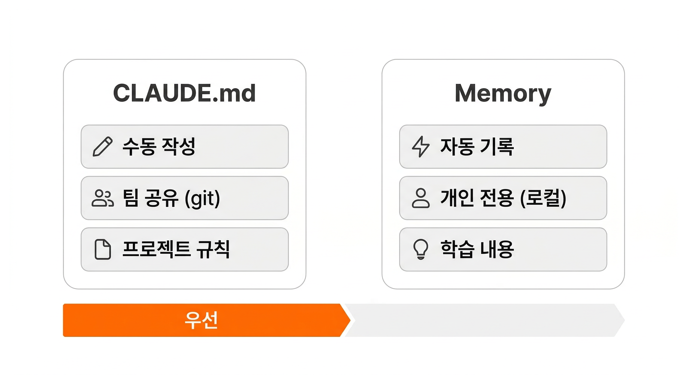
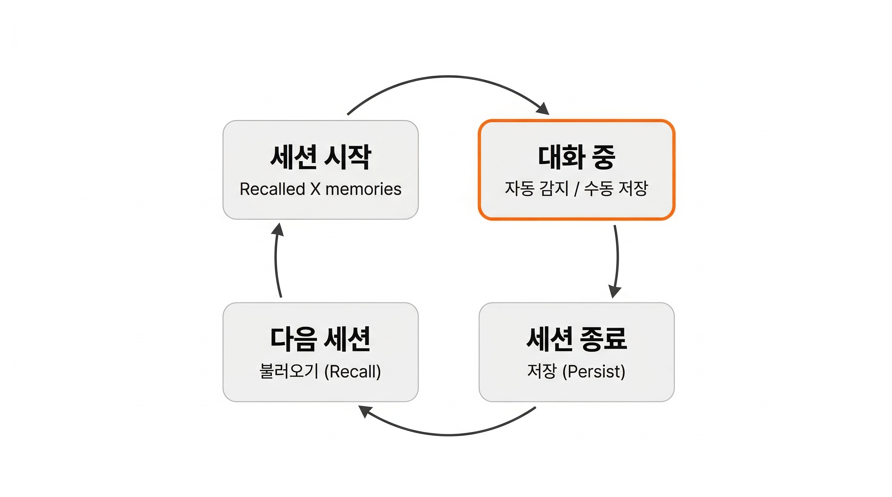
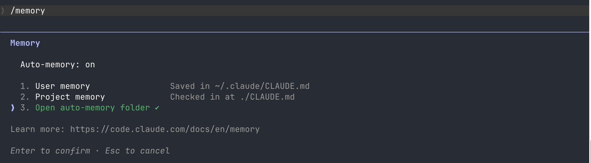

## Overview

CLAUDE.md는 프로젝트 규칙을 매 세션에 전달합니다. 하지만 대화 중에 Claude가 배운 것 -- 사용자의 선호, 교정 내용, 작업 패턴 -- 은 세션이 끝나면 사라집니다. **Memory**는 이런 학습 내용을 자동으로 저장하고, 다음 세션에서 불러오는 시스템입니다.

### 학습 목표

- Memory가 세션 간 학습을 유지하는 원리를 설명할 수 있습니다
- CLAUDE.md와 Memory의 역할 차이를 구분할 수 있습니다
- Memory에 저장된 내용을 확인하고 관리할 수 있습니다

## 매번 같은 말을 반복하고 있다면

새 세션을 시작할 때마다 같은 교정을 반복하고 있다면, 먼저 **"이 교정을 팀원도 따라야 하는가?"**를 판단합니다.

- **Yes -> CLAUDE.md**: "npm 말고 bun 써", "커밋 메시지는 영어로" 같은 팀 규칙은 CLAUDE.md에 넣습니다
- **No -> Memory**: "비유 쓰지 말고 정의만 간결하게 써줘", "나는 React는 잘 아는데 CSS는 약해", "코드 리뷰할 때 보안 이슈를 먼저 짚어줘" 같은 개인적 선호는 Memory의 영역입니다

CLAUDE.md에 모든 교정을 적는 것은 현실적이지 않습니다. 팀 규칙이 아닌 개인 맥락까지 CLAUDE.md에 넣으면 팀 전체의 Context가 낭비됩니다.

**Memory**는 이 문제를 해결합니다. 대화 중에 Claude가 사용자의 교정이나 선호를 감지하면, 자동으로 저장합니다. 다음 세션에서 Claude는 이 내용을 불러와서, 같은 교정 없이도 사용자의 스타일에 맞춰 작업합니다.

## CLAUDE.md와 Memory: 역할이 다르다



| | CLAUDE.md | Memory |
|---|-----------|--------|
| **저장 방식** | 사용자가 직접 작성 | Claude가 자동 기록 |
| **범위** | 팀 전체 (git 커밋) | 개인 전용 (로컬) |
| **내용** | 프로젝트 규칙, 아키텍처 결정 | 사용자 선호, 교정 내용, 작업 패턴 |
| **우선순위** | 높음 | 낮음 |

CLAUDE.md는 팀이 합의한 공식 규칙입니다. Memory는 Claude가 대화 중에 배운 개인적 학습입니다. **CLAUDE.md와 Memory가 충돌하면, CLAUDE.md가 항상 이깁니다.** Memory는 CLAUDE.md가 다루지 않는 빈칸을 채우는 역할입니다.

## Memory는 어디에 저장되는가

Memory는 `~/.claude/projects/` 아래에 프로젝트별로 저장됩니다. 프로젝트 경로를 기준으로 폴더가 생성되고, 그 안에 `MEMORY.md`(인덱스)와 주제별 파일이 들어갑니다.

```
~/.claude/projects/
  -Users-username-my-project/    # 프로젝트 경로 기반
    memory/
      MEMORY.md                  # 인덱스 (200줄 제한)
      user_preferences.md        # 주제별 파일
      feedback_testing.md
```

`MEMORY.md`는 매 세션 시작 시 자동으로 로드됩니다. 200줄이 넘으면 뒤쪽이 잘리므로, 간결하게 유지하는 것이 중요합니다.

Memory는 **로컬 전용**입니다. git에 커밋되지 않고, 다른 팀원에게 공유되지 않습니다. CLAUDE.md가 팀의 공식 매뉴얼이라면, Memory는 개인 메모장입니다.

## Memory가 동작하는 순간



Memory는 세 가지 시점에 동작합니다.

- **세션 시작**: Claude가 저장된 Memory를 불러옵니다. 터미널에 "Recalled X memories"가 표시됩니다


- **대화 중 자동 감지**: Claude가 사용자의 교정이나 선호 패턴을 감지하면 자동으로 저장합니다. "비유 쓰지 말고 정의만 간결하게 써줘"라고 교정하면, 다음 세션부터 비유 없이 간결하게 설명합니다
- **수동 저장**: "이것을 기억해"라고 명시적으로 지시하면 즉시 저장합니다. 반대로 "이것을 잊어"라고 하면 해당 내용을 삭제합니다

## [실습] Memory 직접 체험하기

Memory가 실제로 동작하는지 직접 확인합니다.

### Step 1: /memory 화면 확인

Claude Code에서 `/memory`를 입력합니다.



세 가지 항목이 표시됩니다.

- **User memory** (`~/.claude/CLAUDE.md`): 모든 프로젝트에 적용되는 사용자 전역 설정
- **Project memory** (`./CLAUDE.md`): 현재 프로젝트의 CLAUDE.md
- **Open auto-memory folder**: Claude가 대화 중 자동으로 저장한 Memory 파일들

1번이나 2번을 선택하면 터미널 에디터(vim, nano 등)에서 해당 CLAUDE.md 파일이 열립니다. 3번을 선택하면 Finder에서 자동 Memory 폴더가 열립니다.

**3번 "Open auto-memory folder"가 이 레슨에서 다루는 자동 Memory입니다.**

### Step 2: Memory에 저장 요청

Claude Code에 다음과 같이 입력합니다.

```
설명할 때 비유 쓰지 말고 정의만 간결하게 써줘. 기억해
```

Claude가 이 선호를 Memory에 저장했다는 메시지를 확인합니다.

### Step 3: 새 세션에서 확인

`/clear`로 세션을 초기화하거나 새 터미널에서 `claude`를 실행합니다. 세션이 시작되면 "Recalled X memories"가 표시되는지 확인합니다.

### Step 4: 검증

개념 하나를 설명해 달라고 요청합니다.

```
Context Window가 뭐야?
```

Claude가 비유 없이 정의만 간결하게 설명하면 Memory가 정상 동작하는 것입니다. Claude는 기본적으로 비유를 활용해 설명하므로, 비유가 빠져 있다면 Memory가 작동한 결과입니다.

## Memory에 저장하면 안 되는 것

- **비밀 정보(API 키, 비밀번호)**: Memory는 평문으로 저장됩니다. 민감한 정보는 환경 변수로 관리합니다
- **팀 규칙**: 팀 전체가 따라야 하는 규칙은 CLAUDE.md에 넣어야 합니다. Memory는 개인 전용이므로, 다른 팀원의 세션에는 적용되지 않습니다
- **코드에서 읽을 수 있는 정보**: CLAUDE.md와 같은 원칙입니다. 모델이 직접 찾을 수 있는 정보를 Memory에 저장하면 불필요한 중복입니다

## 핵심 포인트 정리

1. **Memory는 세션 간 학습을 유지합니다**: CLAUDE.md가 팀 규칙이라면 Memory는 개인 노트입니다. 대화 중 배운 선호와 패턴을 자동으로 저장하고, 다음 세션에서 불러옵니다
2. **CLAUDE.md가 항상 우선합니다**: 충돌 시 CLAUDE.md의 지시를 따릅니다. Memory는 CLAUDE.md가 다루지 않는 빈칸을 채우는 역할입니다

## FAQ

- **Q: Memory가 너무 많아지면 어떻게 되나요?**
  - A: MEMORY.md 인덱스는 200줄이 넘으면 뒤쪽이 잘립니다. `/memory`로 확인하고, 더 이상 필요 없는 내용은 "이것을 잊어"로 삭제합니다

- **Q: 팀원과 Memory를 공유할 수 있나요?**
  - A: Memory는 로컬 전용이므로 직접 공유할 수 없습니다. 팀 전체가 따라야 하는 규칙이라면 CLAUDE.md에 넣는 것이 맞습니다

- **Q: Memory를 직접 파일로 편집해도 되나요?**
  - A: 가능합니다. `~/.claude/projects/` 아래의 파일을 직접 수정하거나 삭제할 수 있습니다. 다만, Claude에게 "기억해" / "잊어"로 요청하는 것이 더 편리합니다

## 다음 단계

CLAUDE.md와 Memory로 "무엇을 기억하는가"를 해결했습니다. CLAUDE.md는 팀 규칙을, Memory는 개인 학습을 세션을 넘어 유지합니다. 남은 질문은 "하나의 대화를 얼마나 길게 이어가야 하는가"입니다. 대화가 길어질수록 Context Window가 소모되고 품질이 떨어집니다. 가장 효과적인 Context 관리는 대화를 적절한 시점에 끊는 것입니다.

- 새 대화를 시작해야 하는 시점과 신호
- `/clear`와 `/compact`의 차이

다음 레슨 보기: [대화를 잘 끊는 기술](./task-sizing)
