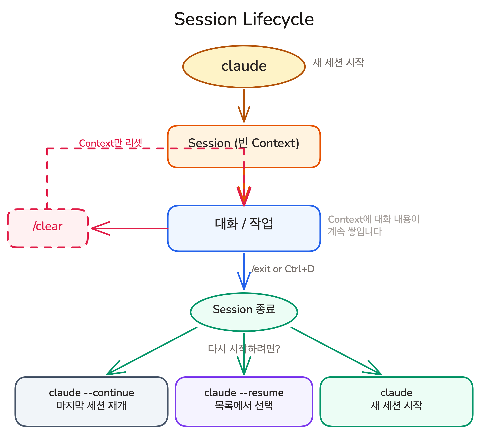
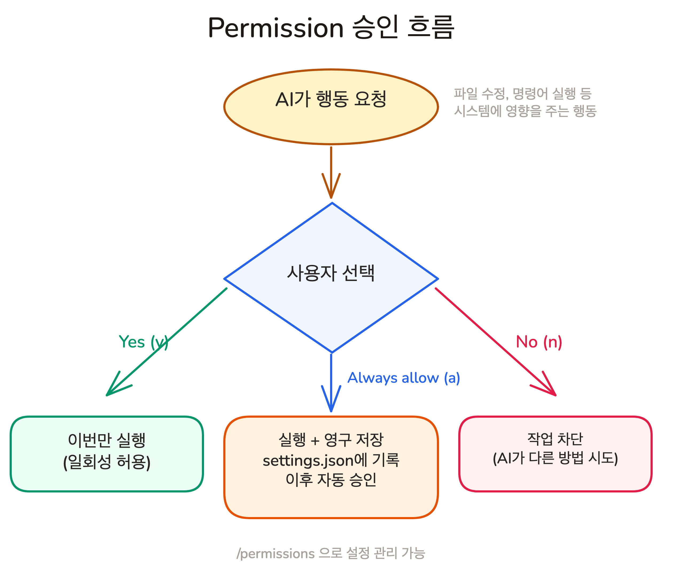

## Overview

설치와 첫 실행을 완료했습니다. 세션 관리, 권한 통제, 변경 되돌리기를 모르면 첫 대화에서 당황하게 됩니다. 이번 레슨에서는 Claude Code를 매일 쓰면서 반드시 마주치는 인터페이스 요소들을 실제 동작 방식과 함께 익힙니다.

### 학습 목표

- 세션을 시작하고, 이어가고, 종료하는 명령어를 익힙니다
- 특수 접두어(!, @, /)와 단축키로 효율적으로 입력합니다
- 권한 관리 시스템을 이해하고 적절한 수준을 설정합니다
- AI의 변경사항을 되돌리는 방법을 익힙니다

## 세션 관리: 대화의 시작과 끝

Claude Code에서 **세션(Session)**은 하나의 대화 단위입니다. 세션 안에서 주고받은 모든 대화가 AI의 **Context**(맥락)에 쌓이고, 세션을 어떻게 관리하느냐에 따라 AI의 응답 품질이 달라집니다.

### 이전 세션 이어가기

작업을 중단했다가 이어갈 때 두 가지 방법이 있습니다.

```shell
claude --continue   # 마지막 세션을 바로 이어갑니다
claude --resume     # 이전 세션 목록에서 선택합니다
```

### 세션 종료와 초기화



- `/exit`: 세션을 종료합니다. `Ctrl+D`도 같은 동작입니다
- `/clear`: 대화 내용만 초기화합니다. Context가 리셋되지만 세션은 유지됩니다
- `/help`: 사용 가능한 명령어 목록을 표시합니다

두 번 수정을 요청해도 고쳐지지 않으면, `/clear`로 초기화하고 다시 요청하는 것이 더 효과적입니다.

## 입력 모드와 단축키

Claude Code의 입력창은 일반 터미널과 다릅니다. 프롬프트를 입력하는 것 외에도, 특수 접두어와 단축키로 다양한 동작을 빠르게 실행할 수 있습니다.

### 특수 접두어: !, @, /

입력창에서 세 가지 특수 문자가 각각 다른 모드를 활성화합니다.

| 접두어 | 모드 | 동작 |
|--------|------|------|
| `!` | Bash 모드 | Claude를 거치지 않고 셸 명령어를 직접 실행합니다 |
| `@` | 파일 참조 | 파일을 AI의 Context에 포함시킵니다 (탭 자동 완성 지원) |
| `/` | 명령어 | Claude Code 내장 명령어나 Custom Command를 호출합니다 |

> ! git status

> @src/index.ts 이 파일에서 에러 처리를 개선해줘

### 편집 및 제어 단축키

| 단축키 | 동작 |
|--------|------|
| `Ctrl+C` | AI 응답을 중단합니다 |
| `Shift+Tab` | 입력 모드를 전환합니다 (Plan Mode 등) |
| `\` + `Enter` | 여러 줄 입력을 시작합니다 |
| `Ctrl+V` | 이미지를 붙여넣습니다 |
| `Esc` + `Esc` | 되돌리기 (Rewind) |

**Shift+Tab**은 기본 모드에서 **Plan Mode**(계획 모드)로 전환합니다. AI가 코드를 직접 수정하지 않고, 무엇을 어떻게 할지 계획만 세우는 모드입니다 (Chapter 04에서 상세 설명).

`Enter`는 메시지를 바로 전송하지만, **`\` + Enter**는 줄바꿈으로 처리됩니다. 긴 프롬프트를 여러 줄로 작성할 때 사용합니다.

## 권한 관리: AI의 행동을 통제하는 방법

Claude Code는 파일 수정이나 셸 명령어 실행 전에 사용자의 승인을 요청합니다.

### Allow/Deny 승인 흐름



- **Yes (y)**: 이번 한 번만 허용합니다
- **Always allow (a)**: 이 도구를 항상 허용합니다. 같은 종류의 작업에 대해 더 이상 묻지 않습니다
- **No (n)**: 거부합니다. 해당 작업이 차단되고, AI가 다른 방법을 시도하거나 다음 지시를 기다립니다

> [!NOTE] 승인 설정은 되돌릴 수 있습니다
> Always allow로 설정한 도구 목록은 settings.json에 저장됩니다. 실수로 잘못 허용한 도구가 있다면 Claude Code에서 `/permissions` 명령으로 관리할 수 있습니다.

### --dangerously-skip-permissions

```shell
claude --dangerously-skip-permissions
```

모든 권한 확인을 건너뜁니다. AI가 묻지 않고 파일을 수정하고 명령어를 실행합니다. 편리하지만, 예상치 못한 파일 삭제나 잘못된 명령어 실행이 일어날 수 있으므로 주의해서 사용해야 합니다.

## 되돌리기와 복구

### Rewind와 Checkpoint

AI가 코드를 잘못 수정했을 때, **`Esc`를 빠르게 두 번** 누르면 **Rewind** 기능이 동작합니다. AI가 마지막으로 수행한 변경사항을 되돌리는 기능으로, AI의 행동 단위로 undo하는 것입니다. AI가 여러 단계에 걸쳐 작업한 경우, **Checkpoint**를 선택하면 특정 시점까지 되돌릴 수 있습니다.

## 핵심 포인트 정리

1. **세션 관리**: `claude`로 새 세션을 시작하고, `--continue`/`--resume`으로 이전 세션을 이어갑니다. `/clear`는 Context만 초기화하고, `/exit`은 세션을 종료합니다
2. **특수 접두어**: `!`(Bash 실행), `@`(파일 참조), `/`(명령어)로 입력 모드를 전환합니다
3. **권한 관리**: AI의 시스템 행동에 대해 Yes/Always/No로 통제합니다. 익숙한 도구는 Always allow로, 나머지는 매번 확인합니다
4. **되돌리기**: `Esc+Esc`로 AI의 마지막 변경을 되돌립니다. 여러 단계를 되돌리려면 Checkpoint를 선택합니다

## FAQ

- **Q: /clear와 /exit의 차이가 뭔가요?**
  - A: `/clear`는 대화 내용만 초기화하고 세션은 유지합니다. `/exit`은 세션 자체를 종료합니다. 응답 품질이 떨어졌다면 `/clear`로 Context를 리셋하는 것이 효과적입니다

- **Q: --dangerously-skip-permissions를 개발 중에 사용해도 되나요?**
  - A: 사용할 수 있지만 주의가 필요합니다. AI가 예상치 못한 파일을 삭제하거나 잘못된 명령어를 실행할 수 있습니다. 자주 쓰는 도구만 Always allow로 설정하는 것이 더 안전합니다

- **Q: Rewind로 되돌린 후 다시 원래 상태로 갈 수 있나요?**
  - A: Rewind는 되돌리기만 가능합니다. 되돌린 후에는 새로운 지시를 내려서 다른 방향으로 진행합니다

## 다음 단계

Claude Code의 인터페이스를 익혔습니다. 다음 레슨에서는 이 인터페이스를 사용해서 Claude Code와 첫 번째 실제 대화를 나눕니다.

- "이 프로젝트가 뭐하는 프로젝트야?" -- 코드베이스 이해 시키기
- "README에 내 이름 추가해줘" -- 파일 수정과 Permission 승인 체험
- "변경사항 커밋해줘" -- git 연동 체험

다음 레슨 보기: [첫 번째 대화](./first-conversation)
