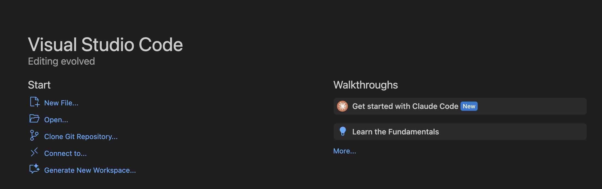
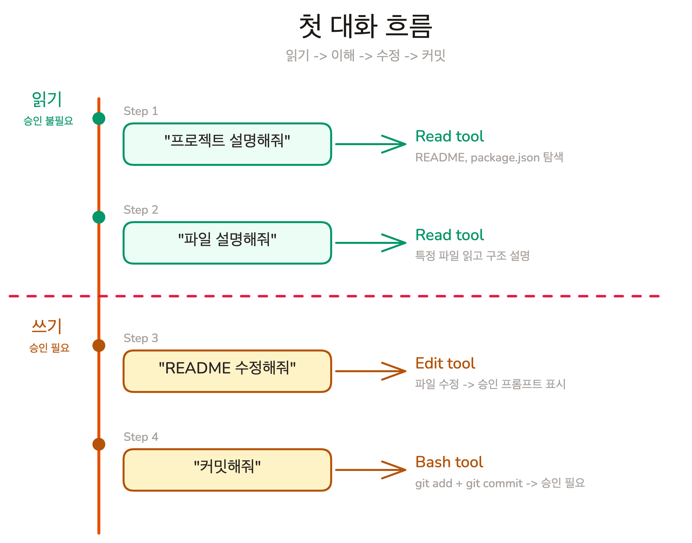

# 첫 번째 대화

## Overview

인터페이스를 익혔지만, 실제 대화가 어떻게 흘러가는지는 직접 해보기 전까지 막연합니다. 이번 레슨에서는 코드 읽기, 파일 수정, git 커밋까지 기본 개발 사이클을 네 번의 대화로 직접 수행합니다.

### 학습 목표

- Claude Code에게 프로젝트 전체와 특정 파일의 설명을 요청하고, AI가 코드베이스를 탐색하는 과정을 관찰합니다
- 파일 수정을 요청하고, Permission 승인 흐름을 직접 체험합니다
- git 커밋을 지시하고, 자연어로 개발 워크플로우를 수행합니다

### 시작하기 전 확인사항

- Claude Code 설치 및 인증 완료 (`claude --version`)
- 실습용 프로젝트 clone 완료

이번 실습에서는 강의에서 제공하는 Todo 앱 프로젝트를 사용합니다.



VS Code를 열고 Welcome 탭에서 **Clone Git Repository...**를 클릭합니다. 상단 입력창에 다음 URL을 붙여넣고 Enter를 누릅니다.

```
https://github.com/toy-crane/claude-code-for-lge-2.git
```

저장 위치를 선택하면 VS Code가 자동으로 클론하고 폴더를 열어줍니다. 통합 터미널을 열고(`` Ctrl+` ``) 실습 브랜치로 전환합니다.

```shell
git checkout ch02-03
```

이번 실습은 네 가지 대화로 진행됩니다. 읽기에서 쓰기로, 각 단계에서 Claude가 어떤 도구를 사용하고 어떤 권한이 필요한지 관찰합니다.



## 코드베이스 이해시키기

VS Code에서 프로젝트 폴더를 열고, 내장 터미널에서 Claude Code를 실행합니다.

```shell
claude
```

VS Code가 프로젝트 폴더에서 터미널을 열기 때문에 `cd`는 필요 없습니다.

### Step 1: 프로젝트 전체 파악

Claude Code 입력창에 다음을 입력합니다.

> 이 프로젝트가 뭐하는 프로젝트야?

Enter를 누르고 Claude가 어떻게 반응하는지 관찰하세요. Claude는 답을 추측하지 않고, README.md, package.json, 주요 소스 파일들을 직접 읽습니다. 터미널에서 Claude가 어떤 파일을 열어보는지 실시간으로 확인할 수 있습니다.

Chapter 01에서 배운 **Tool Use**가 실제로 작동하는 모습입니다. 읽기 작업은 승인 없이 자유롭게 수행됩니다.

> [!NOTE] 프로젝트 규모에 따라 탐색 시간이 다릅니다
> 작은 프로젝트는 몇 초면 충분하지만, 대규모 프로젝트는 더 많은 파일을 읽어야 합니다. Claude가 파일을 읽는 중이라면 Ctrl+C로 중단하지 말고 기다리세요.

### Step 2: 특정 파일 설명 요청

프로젝트의 메인 페이지 파일을 지정해서 설명을 요청합니다.

> app/page.tsx 설명해줘

Step 1에서 Claude가 전체 구조를 훑었다면, 이번에는 하나의 파일에 집중합니다. 함수의 역할, 데이터 흐름, 다른 파일과의 관계를 설명합니다.

Lesson 02에서 배운 `@` 접두어를 사용해도 됩니다.

> @app/page.tsx 이 파일이 하는 일을 설명해줘

`@`는 파일을 Claude의 Context에 직접 포함시키며, 탭 자동 완성으로 경로를 정확하게 입력할 수 있습니다.

## 코드 수정시키기

여기서부터 Claude가 파일을 **수정**합니다. 읽기와 달리 쓰기 작업에는 승인이 필요합니다.

### Step 3: README 수정 요청

> README에 내 이름 추가해줘

Claude가 README.md를 수정하려고 하면, 승인 프롬프트가 나타납니다.

```
Claude wants to edit README.md

Allow?  [y] Yes  [a] Always allow  [n] No
```

`y`를 눌러 이번 한 번만 허용합니다. Claude가 파일을 수정하면, 변경 내용이 diff 형태로 표시됩니다. 추가된 줄은 초록색, 삭제된 줄은 빨간색으로 나타납니다.

수정 결과가 마음에 들지 않으면 `Esc+Esc`로 되돌린 후 더 구체적으로 요청합니다.

> README의 Contributors 섹션에 "김철수 - Frontend Developer"를 추가해줘

구체적인 지시일수록 원하는 결과에 가깝습니다.

## 변경사항 저장하기

### Step 4: git 커밋

> 변경사항 커밋해줘

Claude는 `git add`와 `git commit`을 실행합니다. 셸 명령어 실행에도 승인이 필요합니다.

```
Claude wants to run: git add README.md

Allow?  [y] Yes  [a] Always allow  [n] No
```

`y`를 눌러 허용하면, Claude가 변경 내용을 분석해서 커밋 메시지를 자동으로 작성합니다.

커밋이 완료되면 결과를 확인합니다. `!`는 Bash 모드로, Claude를 거치지 않고 명령어를 직접 실행합니다.

> ! git log --oneline -1

```
a1b2c3d docs: add contributor to README
```

네 번의 대화만으로 프로젝트 이해, 파일 수정, git 커밋까지 완료했습니다.

## 핵심 포인트 정리

1. **코드베이스 탐색**: Claude는 답을 추측하지 않고 파일을 직접 읽어서 파악하며, Chapter 01에서 배운 Tool Use가 실제로 동작합니다
2. **읽기 vs 쓰기**: 읽기 작업은 자유롭게, 수정과 명령어 실행은 승인이 필요하며 diff로 변경 내용을 확인하고 `Esc+Esc`로 되돌릴 수 있습니다
3. **자연어 워크플로우**: 읽기 -> 이해 -> 수정 -> 커밋 순서로 개발자가 매일 하는 사이클을 자연어로 수행합니다

> [!TIP] Claude Code에 대해 모르는 게 있으면 Claude Code에게 물어보세요
> Claude Code 사용법이나 기능에 대해 궁금한 점이 있을 때, 외부 ChatGPT나 Claude 웹에 물어보지 마세요. Claude Code 안에서 직접 질문하면 됩니다. Claude Code는 현재 프로젝트에 접근할 수 있어서 상황을 파악하고 직접 조치까지 할 수 있습니다. 내부적으로 `claude-code-guide`라는 전문 서브에이전트가 Claude Code의 기능, 설정, 단축키 등에 대해 정확하게 답변합니다.

## FAQ

- **Q: Claude가 파일을 너무 많이 읽어서 시간이 오래 걸리면?**
  - A: 탐색 범위를 좁혀주면 됩니다. "src/api 폴더만 설명해줘"처럼 범위를 지정하면 빠르게 답변합니다

- **Q: 커밋 메시지를 직접 지정하고 싶으면요?**
  - A: 구체적으로 지시합니다. "변경사항을 'feat: add contributor section' 메시지로 커밋해줘"라고 하면 해당 메시지를 사용합니다. 매번 지정하는 것이 번거롭다면, 반복 작업은 자동화할 수 있습니다 (Chapter 03에서 다룹니다)

- **Q: Claude가 잘못된 파일을 수정하려 하면 어떻게 하나요?**
  - A: 승인 단계에서 `n`을 눌러 거부합니다. 해당 작업이 차단되고, AI가 다른 방법을 시도하거나 다음 지시를 기다립니다. 이미 승인한 후라면 `Esc+Esc`로 되돌립니다

## 다음 단계

네 번의 대화만으로 기본 개발 워크플로우를 수행했습니다. 하지만 대화가 이렇게 짧을 때만 잘 동작합니다. 대화가 길어지면 Claude의 응답 품질이 눈에 띄게 떨어지는 현상을 경험하게 됩니다. 다음 Chapter에서는 이 현상의 원인과 해결 방법을 배웁니다.

- Context Window: AI가 한 번에 볼 수 있는 범위와 그 한계
- CLAUDE.md: 프로젝트 정보를 한 번만 작성하고 매번 자동 제공하는 방법
- Memory: 대화가 끊겨도 학습 내용을 유지하는 시스템
- Task Sizing: 대화를 효과적으로 끊어 품질을 유지하는 기술

다음 레슨 보기: [왜 대화가 길어지면 AI가 멍청해지나](../context-management/context-window)
