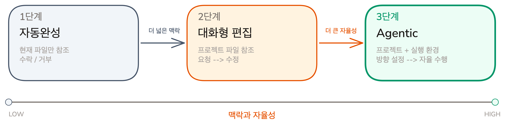

# 코딩 도구의 다음 단계 | Agentic 코딩과 Claude Code

## Overview

코딩 도구는 한 줄 제안에서 파일 탐색·수정·테스트 실행까지 자율 처리하는 방향으로 진화하고 있습니다. 이 레슨에서는 코딩 도구의 세 가지 진화 단계를 정리하고, Agentic 코딩을 본격 구현한 Claude Code의 핵심 특성을 살펴봅니다.

### 학습 목표
- 코딩 도구의 세 가지 진화 단계(자동완성, 대화형 편집, Agentic)의 차이를 이해합니다
- Claude Code의 핵심 특성(Terminal-native, Agentic, 프로그래밍 가능)을 이해합니다

## 코딩 도구의 진화: 자동완성에서 Agentic으로

코딩에 AI를 활용하는 접근 방식은 세 단계를 거쳐 진화하고 있습니다. 각 단계는 AI에게 더 넓은 맥락과 더 큰 자율성을 부여합니다.

### 1단계: 자동완성 -- 지금 쓰고 있는 줄의 다음 단어

**자동완성(Autocomplete)**은 현재 파일의 맥락을 보고 다음에 올 코드를 제안합니다.

- **맥락**: 현재 파일, 많아야 열려 있는 탭 몇 개
- **도구**: 코드 제안 (수락/거부)
- **대표 도구**: GitHub Copilot, Tabnine, Codeium

### 2단계: 대화형 편집 -- 에디터 안에서 AI와 대화

**대화형 편집(Chat-based Editing)**은 에디터에 AI 채팅 패널이 내장된 형태입니다. "이 함수에 에러 핸들링 추가해줘"라고 말하면 AI가 코드를 수정합니다.

- **맥락**: 프로젝트의 여러 파일. 터미널 명령어 실행은 제한적
- **도구**: 코드 편집 (요청 -> 수정)
- **대표 도구**: Cursor, Windsurf, GitHub Copilot Chat

### 3단계: Agentic -- 읽고, 쓰고, 실행하고, 확인을 자율적으로 반복

**Agentic 코딩**은 "이 Todo 앱에 완료된 할일을 숨기는 필터 기능을 추가해줘"라고 방향만 제시하면, AI가 관련 파일을 찾고, 수정하고, 테스트까지 자율적으로 처리하는 방식입니다.

- **맥락**: 프로젝트 전체 + 실행 환경
- **도구**: 파일 읽기/쓰기 + 명령어 실행 (방향 설정 -> 자율 수행)
- **대표 도구**: Claude Code, Codex, Gemini CLI

> [!NOTE] 세 가지 접근은 대체가 아니라 공존
> Agentic이 등장했다고 자동완성이나 대화형 편집이 사라지는 것은 아닙니다. 간단한 코드 완성에는 자동완성이, 빠른 수정에는 대화형 편집이 여전히 효율적입니다.

## Claude Code가 다른 점

Claude Code는 Agentic 코딩을 본격적으로 구현한 도구입니다.

### Terminal-native: IDE 없이 독립 작동

터미널이 있는 곳이면 어디서든 동작합니다. CI/CD 파이프라인, 스크립트, Docker 컨테이너 안에서도 호출할 수 있습니다.

### Agentic: 파일 읽기/쓰기/실행을 자율적으로 반복

"완료된 할일을 숨기는 필터를 추가해줘"라고 요청하면, Claude Code가 파일 탐색부터 테스트 실행까지 자율적으로 진행합니다.

### 프로그래밍 가능: 동작 방식 자체를 설계할 수 있음

다른 코딩 도구는 정해진 기능만 쓸 수 있지만, Claude Code는 동작 규칙 자체를 코드로 정의할 수 있습니다.

- **CLAUDE.md**: 프로젝트 지침서
- **Hooks**: 작업할 때마다 자동으로 검사를 실행하는 장치
- **Skills**: 반복 작업을 정리해둔 매뉴얼
- **Custom Agent**: "테스트 담당", "리뷰 담당"처럼 역할을 나눈 전문 AI
- **MCP**: 데이터베이스, 외부 API 등 외부 시스템 연결 통로

각 도구의 사용법은 Chapter 03과 Chapter 06-08에서 배웁니다.

## 핵심 포인트 정리

1. **맥락과 자율성의 확대**: 자동완성 -> 대화형 편집 -> Agentic으로 진화하며, AI가 볼 수 있는 범위와 자율성이 모두 커집니다
2. **프로그래밍 가능한 Agentic 도구**: Claude Code는 Terminal-native로 어디서든 실행되고, 코드를 자율적으로 읽고/쓰고/실행하며, CLAUDE.md, Hooks, Skills, MCP로 동작 방식 자체를 설계할 수 있습니다

## FAQ

- **Q: Agentic 코딩이면 개발자가 필요 없어지는 건 아닌가요?**
  - A: 코드를 생성하는 비용은 낮아졌지만, 무엇을 만들어야 하는지 파악하는 것은 여전히 어렵습니다. 아키텍처 선택, 에지 케이스 처리 같은 판단은 엔지니어링 경험이 있어야 가능합니다

- **Q: 기존에 쓰던 IDE의 자동완성과 함께 쓸 수 있나요?**
  - A: 네. Claude Code는 독립 실행 도구이므로 기존 IDE의 자동완성과 충돌하지 않습니다. VS Code 확장으로도 제공되어 에디터 안에서 실행할 수도 있습니다

- **Q: 대화형 편집 도구를 이미 쓰고 있는데, 굳이 Agentic으로 넘어가야 하나요?**
  - A: 꼭 넘어갈 필요는 없습니다. 간단한 수정이나 빠른 반복에는 대화형 편집이 더 효율적입니다. Agentic 코딩은 여러 파일을 탐색하고 테스트까지 자동으로 돌리는 복잡한 작업에서 강점을 발휘합니다

- **Q: CLAUDE.md, Hooks, Skills 같은 개념이 낯선데, 다 알아야 시작할 수 있나요?**
  - A: 아닙니다. Claude Code는 아무런 설정 없이도 바로 사용할 수 있고, 필요에 따라 하나씩 추가하면 됩니다

## 다음 단계

Agentic 코딩의 개념과 Claude Code의 핵심 특성을 배웠습니다. 다음 챕터에서는 Claude Code를 직접 설치하고 첫 대화를 나눠봅니다.

- Claude Code 설치 방법과 비용 구조
- 작업별 모델 선택 가이드 (Opus, Sonnet, Haiku)
- 설치 확인과 첫 실행

다음 레슨 보기: [설치와 첫 실행](../getting-started/setup-and-first-run)
