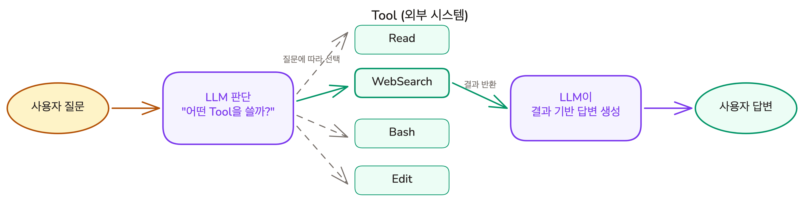
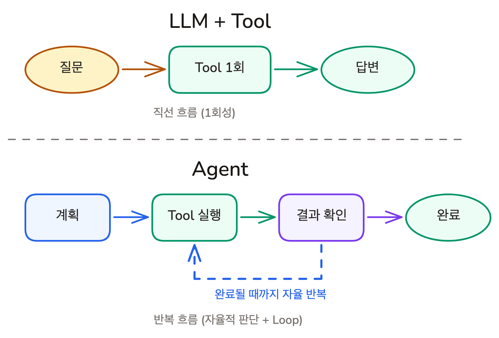

# 도구를 쥐어주면 달라지는 것들 | Tool Use & Agent

## Overview

앞선 레슨에서 LLM은 "그럴듯한 다음 단어"를 예측하는 확률 시스템이며, Hallucination과 Knowledge Cutoff는 이 구조에서 생기는 피할 수 없는 한계임을 배웠습니다. 그렇다면 LLM은 영원히 추측만 할 수밖에 없을까요? Tool을 연결하면 달라집니다. 이 레슨에서는 Tool이 LLM에게 "직접 확인하는 능력"을 어떻게 부여하는지, 그리고 Tool을 자율적으로 반복 사용하는 구조가 Agent가 되는 원리를 살펴봅니다.

### 학습 목표

- Tool이 LLM에게 추측 대신 직접 확인할 수 있는 능력을 부여한다는 것을 이해합니다
- Tool이 LLM의 구조적 한계(Hallucination, Knowledge Cutoff)를 어떻게 보완하는지 이해합니다
- LLM과 Agent의 차이를 이해합니다

## Tool이란: 추측 대신 직접 확인하게 해주는 것

**Tool(도구)**은 LLM이 텍스트 생성 외의 행동을 할 수 있게 해주는 수단입니다.

파일 읽기, 웹 검색, 명령어 실행 등 LLM 혼자서는 할 수 없는 것들을 가능하게 합니다.

예를 들어:

- **Read**: 프로젝트의 소스 코드 파일을 열어서 읽기
- **WebSearch**: 최신 라이브러리 문서를 인터넷에서 검색
- **Bash**: 터미널 명령어를 실행해서 테스트 결과 확인
- **Edit**: 코드 파일의 특정 부분을 수정

앞선 레슨의 실험을 떠올려 봅시다. 존재하지 않는 `react-smooth-virtual-grid` 패키지에 대해 물었을 때, LLM은 설치 명령어와 사용법을 자신있게 지어냈습니다. 하지만 npm 레지스트리 검색 Tool이 있었다면? 검색 결과가 없다는 사실을 직접 확인하고, "이 패키지는 존재하지 않습니다"라고 답했을 것입니다.

**Tool이 없으면 추측, Tool이 있으면 확인.** 이것이 핵심입니다.

#### Tool은 어떻게 동작하는가?

1. 사용자가 질문합니다
2. LLM이 어떤 Tool을 사용할지 판단합니다
3. Tool을 선택하고, 입력값을 만들어 호출합니다
4. Tool이 실행되고 결과가 돌아옵니다
5. LLM이 결과를 바탕으로 답변을 생성합니다

LLM이 Tool을 "직접 실행"하는 것은 아닙니다. LLM은 "이 Tool을 이 입력값으로 호출해 주세요"라는 요청을 텍스트로 생성하고, 실제 실행은 외부 시스템이 담당합니다.

## Tool이 LLM의 한계를 바꾸는 방법

### Knowledge Cutoff: 웹 검색으로 최신 정보 확인

> "Next.js 15의 새로운 기능이 뭐야?"

Knowledge Cutoff 이전에 학습된 모델은 과거 정보로 추측하거나 지어냅니다. 웹 검색 Tool이 있다면 공식 문서를 직접 검색해서 최신 정보를 가져옵니다. 기억 대신 확인입니다.

### Hallucination: 파일을 직접 읽어서 추측하지 않음

> "이 프로젝트의 인증 로직을 설명해줘"

Tool이 없으면 일반적인 인증 패턴을 기반으로 추측합니다. 파일 읽기 Tool이 있다면 `auth.ts`를 직접 열어서 실제 구현을 읽고 설명합니다.

**Tool은 LLM을 "더 똑똑하게" 만드는 것이 아니라, "직접 확인할 수 있게" 만듭니다.**

## LLM vs Agent: 도구를 한 번 쓰는 것과 자율적으로 반복하는 것

실제 개발 작업은 Tool 한 번으로 끝나지 않습니다.

> "로그인 페이지에서 비밀번호 찾기 링크를 눌러도 아무 반응이 없어. 고쳐줘."

파일 탐색, 원인 파악, 수정, 테스트까지 여러 Tool을 **반복** 사용하면서 다음 행동을 **스스로 판단**해야 합니다.

이것이 **Agent(에이전트)**입니다.

**Agent = Tool + Loop + 자율적 판단**

| | LLM + Tool | Agent |
|---|---|---|
| Tool 사용 횟수 | 보통 1번 | 여러 번 반복 |
| 실행 흐름 | 질문 -> Tool -> 답변 | 계획 -> 실행 -> 확인 -> 수정 -> ... |
| 의사결정 | 사용자가 다음 단계를 지시 | 스스로 다음 단계를 판단 |
| 적합한 작업 | 단순한 조회, 변환, 요약 | 여러 단계가 필요한 복잡한 작업 |

#### Agent가 "더 똑똑한 AI"인가?

아닙니다. Agent 내부의 LLM은 동일합니다. 차이는 구조에 있습니다. Tool을 한 번 쓰고 끝나는 것이 LLM + Tool이라면, 결과를 보고 다음 행동을 스스로 판단하며 반복하는 것이 Agent입니다.

"아메리카노 한 잔 주세요"처럼 단순한 요청에는 Agent가 오히려 비효율적입니다. **단순한 작업에는 LLM, 복잡한 작업에는 Agent** -- 이것이 핵심 판단 기준입니다.

개발 작업은 읽고, 수정하고, 실행하고, 확인하는 반복이기에 Agent가 특히 강력합니다. 다음 레슨에서 배울 Claude Code는 이 Agent 개념이 코딩에 적용된 도구입니다.

## 핵심 포인트 정리

1. **Tool은 LLM에게 "행동"을 부여합니다**: 텍스트 생성만 가능하던 LLM이 파일 읽기, 웹 검색, 명령어 실행 같은 외부 행동을 할 수 있게 됩니다
2. **Tool은 LLM을 똑똑하게 만드는 것이 아니라, 확인할 수 있게 만듭니다**: 추론 능력은 그대로이지만, 추측 대신 사실에 기반해서 추론합니다
3. **Agent = Tool + Loop + 자율적 판단입니다**: 도구를 한 번 쓰는 것이 LLM + Tool, 반복하며 자율적으로 작업을 완수하는 것이 Agent입니다
4. **단순한 작업에는 LLM, 복잡한 작업에는 Agent입니다**: Agent가 항상 더 나은 것은 아닙니다. 작업의 복잡도에 따라 판단합니다

## FAQ

- **Q: Tool이 있으면 Hallucination이 완전히 사라지나요?**
  - A: 아닙니다. LLM이 Tool을 사용하지 않기로 판단하거나, Tool의 결과를 잘못 해석할 수 있습니다. Tool은 "확인할 수 있는 수단"을 제공하는 것이지, 모든 답변이 자동으로 정확해지는 것은 아닙니다

- **Q: Agent가 자율적으로 판단한다면, 위험하지 않나요?**
  - A: 자율적이라는 것이 통제 불가능하다는 뜻은 아닙니다. 잘 설계된 Agent에는 사용자 확인 단계, 행동 제한 규칙 등 안전장치가 있습니다. Claude Code는 파일 수정이나 명령어 실행 전에 사용자 승인을 요청합니다

- **Q: ChatGPT나 Claude 같은 대화형 AI도 Agent인가요?**
  - A: 도구 없이 대화만 하면 Agent가 아닙니다. 웹 검색이나 파일 분석 등 Tool을 사용하며 여러 단계를 수행하면 Agent처럼 동작합니다. 같은 AI가 상황에 따라 LLM으로도, Agent로도 동작합니다

- **Q: 모든 작업에 Agent를 사용하는 것이 좋나요?**
  - A: 아닙니다. 단순한 질문에는 LLM만으로 충분합니다. Agent는 여러 단계가 필요한 복잡한 작업에 적합하며, 단순한 작업에 쓰면 오히려 느리고 비용이 더 듭니다

## 다음 단계

Tool이 추측을 확인으로 바꾸고, Agent가 복잡한 작업을 자율적으로 수행한다는 것을 배웠습니다. 다음 레슨에서는 이 Agent 개념이 코딩 도구에 어떻게 적용되는지 알아봅니다.

- 코딩 도구의 진화: 자동완성 -> 대화형 편집 -> Agentic
- Claude Code의 핵심 특성과 차별점

다음 레슨 보기: [코딩 도구의 다음 단계](./agentic-coding-and-claude-code)
