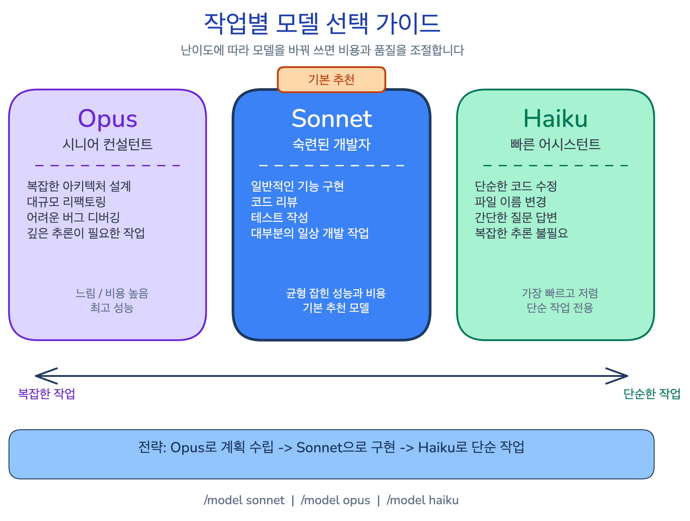
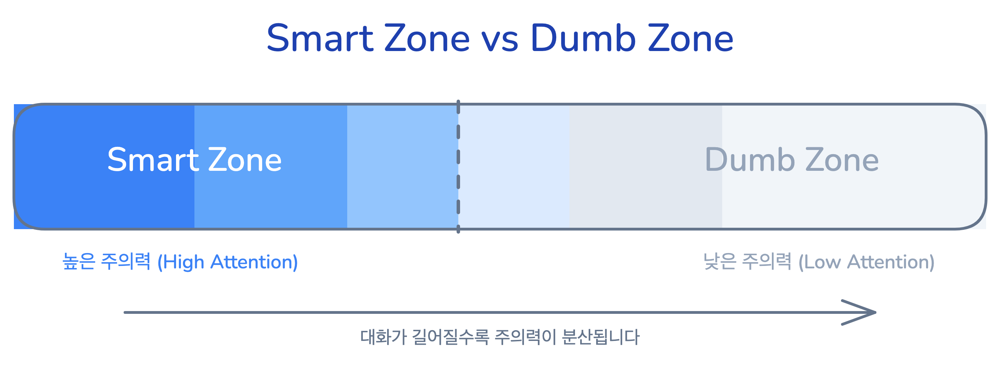
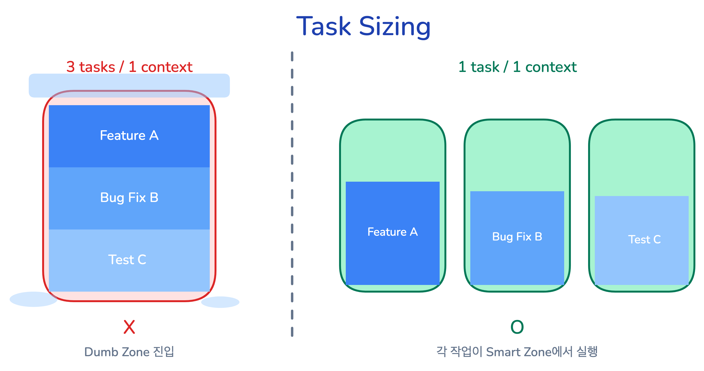
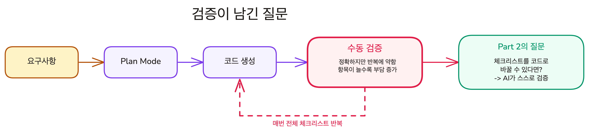

## 학습 목표

- Part 1에서 배운 핵심 개념을 정리하고, LLM 원리부터 실전 적용까지의 흐름을 되짚어봅니다

## LLM이라는 기계의 본질

### 확률 예측의 두 가지 구조적 한계

LLM은 "맞는 답"이 아니라 "그럴듯한 답"을 만드는 시스템입니다. 이 차이에서 두 가지 한계가 따라옵니다.

- **Hallucination**: 줄일 수 있지만 없앨 수 없는 구조적 한계입니다. 정확한 답과 틀린 답이 똑같은 자신감으로 나오므로, 겉모습만으로는 구별할 수 없습니다
- **Knowledge Cutoff**: 학습 시점 이후 정보는 구조적으로 모릅니다. "모릅니다"라고 말하지 않고 과거 정보로 추측하거나 지어냅니다

이 둘은 고칠 수 있는 버그가 아닙니다. 원리 자체의 부산물이므로, 대응 전략은 "없애기"가 아니라 "검증하기"입니다.

### Tool, Agent, 그리고 Agentic 코딩

도구를 연결하면 LLM이 추측 대신 직접 확인할 수 있게 됩니다. 한 번 쓰면 Tool, 반복하며 자율적으로 작업을 완수하면 Agent입니다.

- **Tool**: AI를 똑똑하게 만드는 것이 아니라, **검증 가능하게** 만듭니다. 파일을 직접 읽고, 코드를 실행하고, 웹을 검색합니다
- **Agent**: Tool + Loop + 자율적 판단. 막히면 스스로 다른 방법을 시도하고, 결과를 확인하며, 완료될 때까지 반복합니다
- **코딩 도구 3단계 진화**: Autocomplete(현재 파일만) -> Chat(프로젝트 파일) -> Agentic(프로젝트 전체를 자율 반복). Claude Code는 세 번째 단계입니다
- **Claude Code의 세 가지 특성**: Terminal-native(터미널에서 직접 실행), Agentic(자율 반복), Programmable(CLAUDE.md, Hooks, Skills 등으로 동작을 설정). Programmable은 Part 2에서 본격적으로 다룹니다

## Claude Code 사용법 한눈에 보기

### 세 가지 조절 장치: 모델, 세션, 권한

- **모델 선택**: Opus(복잡한 설계), Sonnet(일반 구현), Haiku(간단한 수정). 작업 난이도에 따라 `/model`로 전환합니다
- **세션 관리**: `--continue`(마지막 세션 이어가기), `--resume`(이전 세션 목록에서 선택), `/clear`(대화 초기화), `/exit`(세션 종료)
- **권한 관리**: 파일 수정/명령 실행 전 Yes/Always allow/No 선택. `Esc+Esc`로 AI의 마지막 변경을 되돌리고, Checkpoint로 여러 단계를 한 번에 복구합니다

입력창 단축키: `!`(셸 명령어), `@`(파일 Context 포함), `/`(내장 명령어), `Shift+Tab`(Plan Mode 전환).

### 첫 번째 대화의 흐름

AI와의 대화에는 반복되는 패턴이 있습니다. 읽기에서 시작해서 쓰기로 확장합니다.

- **탐색 -> 설명 -> 수정 -> 커밋**: "이 프로젝트가 뭐야?"(읽기만, 권한 불필요) -> "이 파일 설명해줘"(`@`로 파일 지정) -> "이름 추가해줘"(파일 수정, 권한 필요) -> "커밋해줘"(git 명령, 권한 필요). 읽기부터 시작하면 AI가 프로젝트를 이해한 상태에서 수정합니다

## Context라는 병목

### Context Window와 지침의 저주

Context Window의 한계가 Part 1 전반의 설계 원칙을 관통합니다.

- **Context Window**: 사용자 메시지는 전체의 일부일 뿐입니다. System Prompt, 도구 정의, CLAUDE.md가 보이지 않는 곳에서 이미 상당량을 소비합니다
- **Smart Zone / Dumb Zone**: 초반부에서 AI의 주의력이 가장 높고, 뒤로 갈수록 떨어집니다. 대화가 길어지면 AI가 멍청해지는 건 기분 탓이 아니라 측정된 현상입니다
- **지침의 저주**: 지침이 많아질수록 각 지침의 준수율이 떨어집니다. 해법은 더 자세히 알려주는 것이 아니라 **지금 이 작업에 필요한 것만 주는 것**입니다. 조건부 전달, 요약 활성화, 위임, 새 대화 시작 -- 네 가지 전략이 이를 실현합니다

### CLAUDE.md: 한 번만 설명하기

매번 같은 지시를 반복하면 Context를 낭비합니다. CLAUDE.md는 이 반복을 제거합니다.

- **CLAUDE.md**: 프로젝트 루트에 두면 **매 세션 자동 로드**되는 프로젝트 규칙입니다. 아키텍처 결정, 팀 워크플로우, 코딩 컨벤션처럼 코드만으로는 알 수 없는 정보를 담습니다
- **포함/제외 기준**: "AI가 코드에서 직접 찾을 수 있는가?" -- 찾을 수 있으면 제외, 없으면 포함합니다. 기술 스택, 디렉토리 구조, 빌드 명령은 코드에서 읽을 수 있으므로 넣지 않습니다
- **Programmable의 첫 단계**: CLAUDE.md는 Claude Code를 프로그래밍하는 가장 기본적인 도구입니다. Part 2에서 Rules, Commands, Skills로 확장됩니다

### Memory: 세션을 넘어 기억하기

CLAUDE.md가 팀 규칙을 전달한다면, Memory는 대화 중 배운 것을 자동으로 저장합니다.

- **Memory**: Claude가 대화 중 발견한 패턴과 교정 내용을 자동 저장합니다. 다음 세션에서 "Recalled X memories"로 불러옵니다
- **CLAUDE.md vs Memory**: CLAUDE.md는 팀 규칙(수동, git 공유), Memory는 개인 학습(자동, 로컬). CLAUDE.md가 항상 우선합니다

### Task Sizing: 가장 효과적인 Context 관리

스펙 최적화, 도구 조정보다 **작업 크기를 줄이는 것이 가장 효과적**입니다.

- **좋은 단위**: 수정 -> 테스트 -> 커밋 한 사이클
- **새 대화 시작 신호**: 다른 종류의 작업 전환, AI 응답 품질 저하, 커밋 완료 직후, 확신이 없을 때
- **/clear 우선**: `/compact`는 요약 과정에서 뉘앙스를 잃습니다. Smart Zone에서의 첫 시도가 Dumb Zone에서의 세 번째 시도보다 성공 확률이 높습니다

## Plan Mode에서 검증까지

### 탐색, 계획, 실행

AI에게 바로 "코드 작성해"라고 시키면 추측으로 코드를 작성합니다. Plan Mode가 이를 방지합니다.

- **Plan Mode**: `Shift+Tab`으로 진입하면 AI는 파일을 수정하지 않고 탐색과 계획만 합니다. 개발자가 검토하고 승인한 뒤에 실행합니다
- **요구사항 = 기능 목록 + 범위 제한**: 기능 목록만 주면 AI가 요청하지 않은 기능까지 추가합니다. "무엇을 하지 않는지"까지 명시해야 범위가 고정됩니다
- **AI 친화적 기술 스택**: Shadcn은 컴포넌트 소스 코드가 프로젝트에 복사됩니다. AI가 npm 패키지 문서를 추측하지 않고 소스를 직접 읽을 수 있으므로, 정확도가 높아집니다

### 검증이 남긴 질문

Todo 앱을 구현한 뒤 10개 시나리오를 브라우저에서 직접 확인했습니다. 정확하지만 반복에 약합니다. 항목이 늘어나면 집중력이 흐려지고 확인을 건너뛰는 순간이 생깁니다.

이 체크리스트를 코드로 바꿀 수 있다면, AI가 스스로 "통과/실패"를 판단하고 자율적으로 루프를 돌 수 있지 않을까요?

## 다음 단계

Part 2는 이 질문에서 시작합니다. 체크리스트를 테스트 코드로 바꾸면, AI가 스스로 "됐다/안 됐다"를 판단하며 자율적으로 루프를 돌 수 있습니다. 개발자는 단계를 하나하나 지시하는 대신, 성공 기준만 주고 방법은 AI에게 맡깁니다.

- What vs How: AI에게 일을 시키는 두 가지 방법
- 테스트 기반 검증: 수동 체크리스트를 테스트로 자동화하기
- Red Green Refactor: 성공 기준을 테스트로 먼저 변환하고 한 번에 하나씩 구현하기
- Task 시스템: 대화가 끊겨도 작업 진행 상황을 이어가기

다음 레슨 보기: [What vs How](../../extending-claude/plan-task/what-vs-how)
