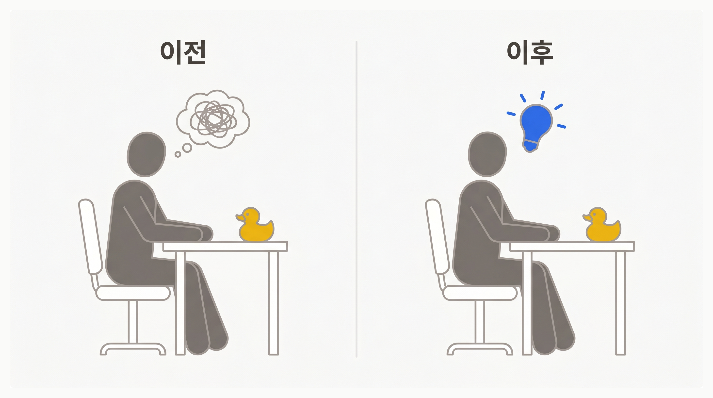
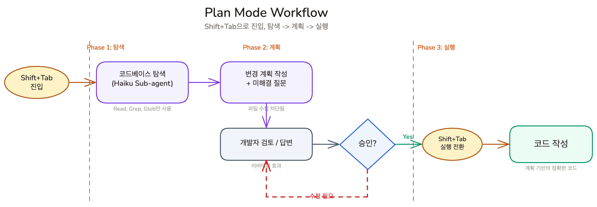

import { ExploreVsExecute } from '@/components/diagrams/explore-vs-execute';

## Overview

Chapter 03에서 Context 관리의 네 가지 기둥을 배웠습니다. Context Window의 원리, CLAUDE.md로 프로젝트 규칙을 자동 제공하는 방법, Memory로 세션을 넘어 학습을 유지하는 방법, 그리고 대화를 적절히 끊는 Task Sizing입니다. Context를 잘 관리해도 해결되지 않는 문제가 하나 남아 있습니다. AI가 코드베이스를 처음 보는 상태에서 바로 코드를 작성하면, 추측에 기반한 결과가 나옵니다. 이 레슨에서는 AI가 추측 대신 코드베이스를 탐색하고 계획을 먼저 세우도록 유도하는 Plan Mode를 배웁니다.

### 학습 목표

- AI에게 바로 코드를 시키면 안 되는 두 가지 이유를 설명할 수 있습니다
- Plan Mode의 탐색 -> 계획 -> 실행 워크플로우를 설명할 수 있습니다

## AI에게 바로 코딩을 시키면 안 되는 이유

#### AI는 매 세션마다 처음 출근한다

<ExploreVsExecute />

오늘 첫 출근한 동료에게 "로그인 기능 고쳐줘"라고 말한다면 어떻게 될까요? 프로젝트 구조도 모르고, 코드 컨벤션도 모르고, 어제까지의 논의 내용도 모릅니다. 먼저 코드베이스를 둘러보고, 기존 패턴을 파악한 후에 수정을 시작하게 할 것입니다.

AI도 같은 상황입니다. Chapter 03에서 배운 것처럼, **LLM은 매 세션마다 프로젝트를 처음 보는 것과 같습니다.** CLAUDE.md가 기본적인 프로젝트 정보를 전달하지만, 지금 수정해야 할 코드의 구체적인 맥락까지 담고 있지는 않습니다.

바로 "코드 작성해"라고 시키면, AI는 **정보가 부족한 상태에서 추측으로 코드를 작성합니다.** 코드베이스에서 실제로 사용되지 않는 패턴을 적용하거나, 이미 존재하는 유틸리티를 모른 채 새로 만들 수 있습니다.

**Plan Mode(플랜 모드)**는 이 문제를 해결합니다. Plan Mode에서 AI는 파일을 수정할 수 없습니다. 쓰기 기능이 비활성화되어 있기 때문입니다. 대신 코드베이스를 탐색하고, 필요한 정보를 수집한 뒤, 변경 계획을 작성합니다. 첫 출근한 동료에게 "먼저 코드를 읽어보고, 어떻게 수정할지 계획을 세워와"라고 하는 것과 같습니다.

#### 개발자도 원하는 것을 처음부터 모른다

AI만 정보가 부족한 게 아닙니다. **개발자도 자신이 원하는 것을 처음부터 정확히 알지 못합니다.**

한 번 생각해 보세요. `user.name`을 `user.firstName`과 `user.lastName`으로 분리한다면?

- 프론트엔드 컴포넌트 몇 개를 수정해야 하는가?
- 테스트 파일은? 타입 정의는?
- DB 마이그레이션은 어떻게?
- API 응답 형식이 바뀌면 연동된 다른 서비스는?
- 하위 호환성을 유지하면서 점진적으로 바꿀 수 있는가?

"필드 하나 바꾸는 건데"라고 생각했지만, 실제로는 **변경의 범위조차 파악하지 못한 상태**입니다. 이런 상황에서 AI에게 바로 "코드 수정해"라고 시키면, AI도 같은 불확실성 속에서 추측으로 코드를 작성합니다.

프로그래밍에서 이 문제를 해결하는 전통적인 방법은 **러버덕킹(Rubber Ducking)**입니다. 고무 오리나 동료에게 문제를 설명하다 보면 생각이 정리됩니다. **Plan Mode는 AI를 러버덕 상대로 만듭니다.** AI가 계획을 제안하면 "음, 그건 아닌데"라고 피드백하고, AI가 수정된 계획을 보여주면 또 검토합니다. 이 과정을 반복하면, 개발자와 AI 모두 무엇을 해야 하는지 훨씬 명확해집니다.

이 과정에서 AI가 질문을 하기도 합니다. "firstName과 lastName의 최대 길이를 각각 몇 자로 제한할까요?"처럼, 개발자가 미처 생각하지 못한 세부사항을 물어봅니다. **AI가 질문하는 것은 한계가 아니라 계획 과정의 핵심 가치입니다.** 코드를 작성한 후에 "이건 원한 게 아닌데"라고 되돌리는 것보다, 계획 단계에서 방향을 잡는 것이 훨씬 효율적입니다.

## Plan Mode 워크플로우: 탐색, 계획, 실행

`Shift+Tab`을 누르면 Plan Mode에 진입합니다. 이 상태에서 AI는 파일 읽기, 웹 접근, bash 실행은 가능하지만, 파일 수정은 차단됩니다. 쓰기가 차단되어 있으므로 AI는 자연스럽게 코드베이스 탐색 모드로 들어갑니다.

작업을 설명하면 AI가 관련 파일을 읽고 현재 구조를 파악합니다. 이 탐색에는 빠르고 저렴한 모델(Haiku)이 서브 에이전트로 사용되므로, 수만 토큰을 소모하더라도 비용 부담이 크지 않습니다.

탐색이 끝나면 AI가 변경 계획을 제안하고, 미해결 질문을 함께 제시합니다. 질문에 답하면 AI가 계획을 수정합니다. 만족스러운 계획이 나올 때까지 이 과정을 반복합니다. 최종 계획은 파일 시스템에 저장되므로 나중에 다시 참조할 수 있습니다.

계획을 승인한 후 `Shift+Tab`으로 실행 모드로 전환하면, AI가 계획에 따라 코드를 작성합니다. 탐색 단계에서 수집한 컨텍스트가 이미 있으므로, 바로 코딩을 시켰을 때보다 정확한 코드가 나옵니다.

### [데모] Plan Mode 실행 흐름

강사가 Plan Mode의 전체 사이클을 시연합니다. 시연을 보면서 다음 세 가지에 주목하세요.

1. **AI가 파일을 읽기만 한다**: Plan Mode에서는 코드를 수정하지 않습니다. 터미널에 Read, Grep, Glob 같은 탐색 도구만 표시되는 것을 확인하세요
2. **AI가 질문한다**: 계획 도중 AI가 개발자에게 세부사항을 물어봅니다. 이것이 위에서 설명한 러버덕킹의 실제 모습입니다
3. **계획이 수정된다**: 질문과 피드백을 주고받으며 계획이 구체화되는 과정을 지켜보세요. 처음 계획과 최종 계획이 어떻게 다른지 비교해 봅니다

## 핵심 포인트 정리

1. **AI에게 바로 코드를 시키면 안 됩니다**: AI는 매 세션마다 프로젝트를 처음 봅니다. 먼저 코드베이스를 탐색하고 이해한 후에 수정해야 정확한 코드가 나옵니다
2. **계획은 개발자를 위한 것이기도 합니다**: 개발자도 원하는 것을 처음부터 정확히 모릅니다. AI와 계획을 주고받으며 요구사항이 명확해집니다
3. **Plan Mode는 탐색, 계획, 실행 세 단계입니다**: `Shift+Tab`으로 진입하면 AI가 코드베이스를 탐색하고 변경 계획을 제안합니다. 계획을 승인하면 계획에 따라 코드를 작성합니다

## FAQ

- **Q: 계획 세우는 시간이 오히려 낭비 아닌가요?**
  - A: 코드를 작성한 후 "이건 원한 게 아닌데"라고 되돌리는 비용이 계획 검토 비용보다 훨씬 큽니다. 계획이 짧으면 검토도 빠릅니다

## 이어서 배울 내용

Plan Mode로 계획을 세우는 방법을 배웠습니다. 다음 레슨에서는 AI에게 무엇을 만들지 알려주는 방법을 배웁니다. AI 협업에 유리한 기술 스택의 선택 기준과, AI가 추측하지 않는 요구사항의 작성법을 다룹니다.

- AI 협업에 유리한 기술 스택 선택 기준
- 자연어로 스펙 작성하는 방법
