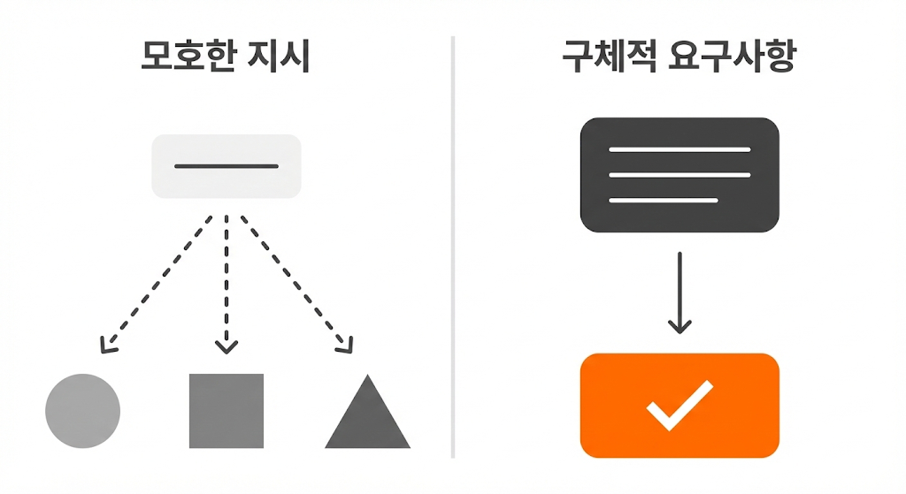
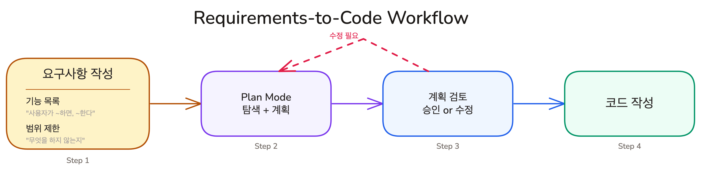
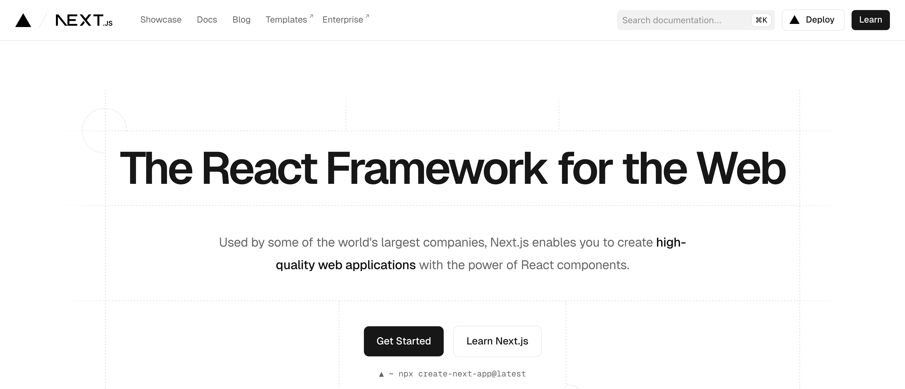
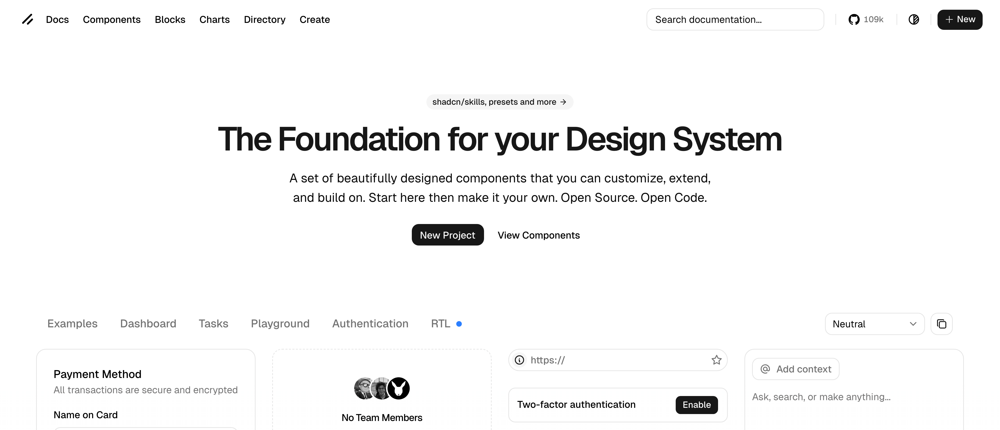

## Overview

이전 레슨에서 Plan Mode로 AI가 코드베이스를 먼저 탐색하게 만드는 방법을 배웠습니다. Plan Mode에 진입하기 전에 한 단계가 더 있는데, AI에게 무엇을 만들지 알려주는 것입니다. 이 레슨에서는 AI가 추측 대신 계획을 세울 수 있는 요구사항 작성법과 AI 협업에 유리한 기술 스택 선택 기준을 배웁니다.

### 학습 목표

- 두 가지 조건(구체적 행동, 경계 명시)을 갖춘 요구사항을 작성할 수 있습니다
- AI 협업에 유리한 기술 스택의 선택 기준을 설명할 수 있습니다

### 시작하기 전 확인사항

- Lesson 01에서 Plan Mode의 기본 사용법을 익힌 상태여야 합니다
- Claude Code가 설치되어 있고 정상 작동하는 상태여야 합니다

## 요구사항이 중요한 이유

Plan Mode에 진입하기 전에 한 단계가 더 있습니다. AI에게 **무엇을** 만들지 알려주는 것입니다.

음식점에서 주문하는 상황을 생각해 보겠습니다. "맛있는 거 주세요"라고 하면 셰프가 알아서 만들어 줍니다. 결과가 내 입맛에 맞을 수도 있고, 전혀 다를 수도 있습니다. "소고기 된장찌개인데, 두부는 넣고 호박은 빼 주세요"라고 하면 원하는 음식이 나올 확률이 훨씬 높습니다.



AI도 마찬가지입니다. **"Todo 앱 만들어줘"라고 하면 AI가 세부사항을 임의로 정합니다.** 완료 표시를 체크박스로 할지 스와이프로 할지, 정렬은 생성순인지 마감일순인지, 삭제 시 확인 창을 띄울지 바로 삭제할지. AI가 이 결정들을 대신 내리면, 결과를 본 뒤 "이건 내가 원한 게 아닌데"라고 할 확률이 높아집니다.

### AI가 추측하지 않는 요구사항의 두 가지 조건

좋은 요구사항은 AI가 판단을 대신하지 않아도 되게 만듭니다.

- **구체적 행동**: "사용자가 할 일을 입력하고 Enter를 누르면, 목록 맨 위에 추가된다"처럼 동작을 명시합니다. "할 일을 추가할 수 있다"는 AI에게 10가지 다른 구현을 열어 놓습니다
- **경계 명시**: 무엇을 하지 **않는지**도 적습니다. "이 단계에서는 로그인 없이 로컬 상태만 사용한다"처럼 범위를 한정하면, AI가 "혹시 필요할까 봐" 인증 시스템을 추가하는 일을 막습니다

> 좋은 예: "사용자가 빈 입력 상태에서 Enter를 누르면, Todo가 추가되지 않고 입력 필드에 빨간색 border가 표시된다"

> 나쁜 예: "빈 입력 처리를 해줘"

## 자연어 스펙 작성법

요구사항을 쓸 때 특별한 형식이 필요하지 않습니다. 핵심은 구조가 있는 자연어입니다. 다음 두 가지 섹션으로 정리하면 AI가 이해하기 좋은 요구사항이 됩니다.

### 1. 기능 목록: 무엇을 만드는가

각 기능을 "사용자가 ~하면, ~한다" 형식으로 적습니다. 한 줄에 하나의 기능입니다.

```plain text
## 기능 목록

1. 사용자가 텍스트를 입력하고 Enter를 누르면, 새 Todo가 목록 맨 위에 추가된다
2. 사용자가 Todo 항목의 체크박스를 클릭하면, 완료 상태로 표시되고 텍스트에 취소선이 그어진다
3. 사용자가 Todo 항목의 삭제 버튼을 클릭하면, 해당 항목이 목록에서 제거된다
4. 사용자가 Todo 항목의 텍스트를 더블클릭하면, 인라인 편집 모드로 전환된다
5. 페이지를 새로고침하면, 이전에 추가한 Todo 목록이 유지된다 (localStorage)
```

### 2. 범위 제한: 무엇을 만들지 않는가

AI가 "좋을 것 같아서" 추가하는 기능을 막습니다.

```plain text
## 범위 제한

- 사용자 인증/로그인
- 서버 사이드 데이터 저장 (localStorage만 사용)
- 드래그 앤 드롭 정렬
- 카테고리/태그 시스템
- 다크 모드
```

<Callout type="info" title="범위 제한이 필요한 이유">
AI는 사용자에게 유용해지도록 훈련되어 있습니다. 범위를 명시하지 않으면, "이것도 추가하면 좋을 것 같습니다"라며 요청하지 않은 기능을 구현하기 시작합니다. 범위 제한은 AI에게 "여기까지만"이라는 울타리를 만들어 줍니다.
</Callout>



요구사항을 작성하고 나면, Plan Mode에서 계획을 수립하고, 검토를 거쳐 코드 작성으로 넘어갑니다.

## 실습 프로젝트 소개: Next.js + Shadcn Todo 앱


이번 Chapter부터 직접 Todo 앱을 만들며 배운 개념을 실전에 적용합니다. 기술 스택으로 **Next.js**와 **Shadcn**을 사용합니다.

#### 왜 이 조합인가?

AI에게 코드를 맡길 때 AI가 해당 기술을 얼마나 잘 아는지가 결과 품질에 직접 영향을 미칩니다. LLM은 인터넷의 텍스트로 학습했으므로, 학습 데이터에 많이 등장하는 기술일수록 더 정확한 코드를 생성합니다.



**Next.js**는 React 기반의 full-stack 프레임워크입니다. React 자체가 가장 널리 사용되는 프론트엔드 라이브러리이고, Next.js는 그 위에서 가장 풍부한 학습 데이터를 가진 프레임워크입니다. AI에게 Next.js 코드를 요청하면, 다른 프레임워크보다 최신 패턴에 가까운 코드가 나올 확률이 높습니다.



**Shadcn**은 UI 컴포넌트 라이브러리이지만, 일반적인 라이브러리와 작동 방식이 다릅니다. 일반적인 UI 라이브러리는 `node_modules`에 설치되어 블랙박스처럼 동작합니다. AI가 컴포넌트의 내부 구조를 보려면 문서에 의존해야 합니다. Shadcn은 컴포넌트의 소스 코드를 프로젝트 안에 직접 복사합니다. `components/ui/button.tsx`처럼 내 코드가 됩니다. AI가 파일을 열어서 구조를 직접 읽고, 필요하면 바로 수정할 수 있습니다. 코드가 프로젝트 안에 있으므로 AI가 추측 대신 직접 보고 판단할 수 있다는 점이 핵심입니다.

Shadcn 컴포넌트는 내부적으로 **Tailwind CSS**로 스타일링되어 있습니다. Tailwind는 스타일을 별도의 CSS 파일이 아니라 HTML 클래스에 직접 작성하는 방식입니다. 덕분에 AI가 컴포넌트 파일 하나만 읽으면 구조와 스타일을 동시에 파악할 수 있습니다. Shadcn을 선택하면 Tailwind는 자연스럽게 따라오므로, 별도로 고민할 부분이 아닙니다.

### 프로젝트 생성

Shadcn CLI가 Next.js 프로젝트 생성부터 UI 설정까지 한 번에 처리합니다. 구체적인 생성 방법은 다음 레슨에서 다룹니다.

## 핵심 포인트 정리

1. **요구사항의 두 가지 섹션**: 기능 목록(무엇을), 범위 제한(무엇을 안 하는지). 이 두 가지가 갖춰지면 AI가 추측 대신 질문을 합니다
2. **Next.js + Shadcn은 AI 협업에 유리한 조합입니다**: Next.js는 학습 데이터가 풍부하고, Shadcn은 소스 코드가 프로젝트 안에 있어서 AI가 직접 읽고 수정할 수 있습니다

## FAQ

- **Q: 요구사항을 영어로 써야 더 좋은 결과가 나오나요?**
  - A: Claude는 한국어 요구사항을 잘 이해합니다. 영어로 쓸 때 약간의 정확도 향상이 있을 수 있지만, 요구사항의 구체성이 언어보다 훨씬 큰 영향을 미칩니다. 편한 언어로 구체적으로 쓰는 것이 최선입니다
- **Q: Next.js와 Shadcn 외에 다른 기술 스택은 AI와 잘 안 맞나요?**
  - A: 그렇지 않습니다. 핵심은 AI 학습 데이터에 충분히 등장하는 기술을 고르는 것입니다. Amplifying.ai의 리서치에 따르면, Claude Code에 2,430개 프롬프트를 던졌을 때 shadcn/ui(90%), Tailwind CSS, PostgreSQL, Zustand 등을 일관되게 선택했습니다. 이 강의에서 Next.js + Shadcn을 선택한 이유도 같은 맥락입니다. 자세한 데이터는 [What Claude Code Actually Chooses](https://amplifying.ai/research/claude-code-picks)에서 확인할 수 있습니다

## 이어서 배울 내용

요구사항 작성법과 기술 스택을 배웠습니다. 다음 레슨에서는 이 개념들을 실전에 적용합니다. 프로젝트 생성부터 CLAUDE.md 설정, 요구사항 작성, Plan Mode 계획 수립, 구현, 검증까지 전체 사이클을 한 번에 경험합니다.

- bun 설치와 프로젝트 생성
- CLAUDE.md 설정
- 요구사항 작성과 Plan Mode 계획 수립
- Todo 앱 구현과 검증
