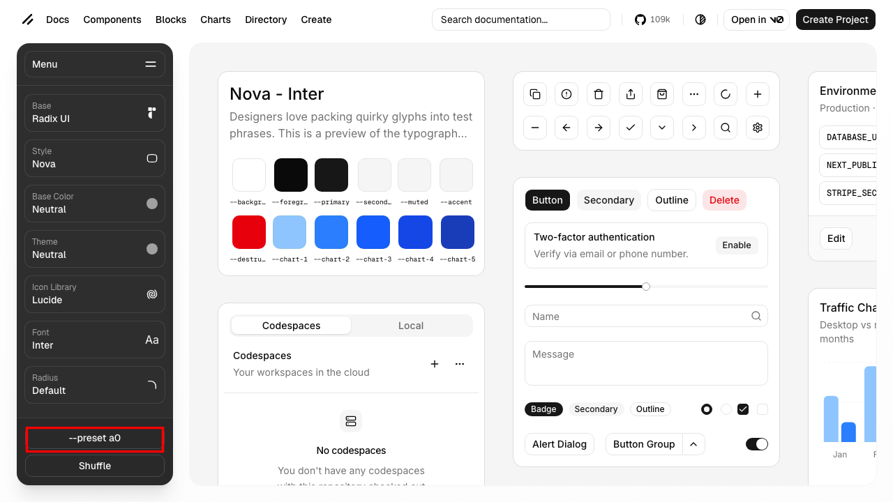
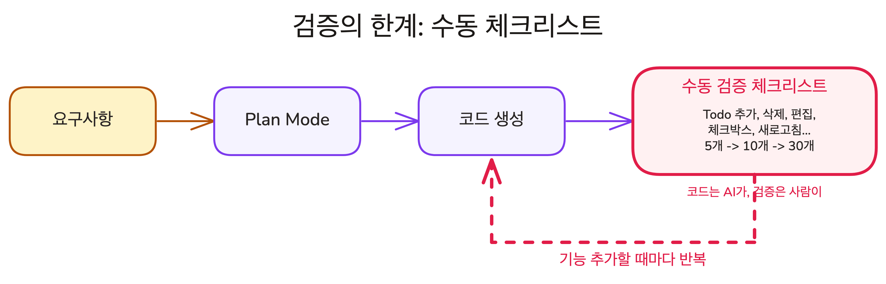

## Overview

이전 레슨에서 기능 목록과 범위 제한 두 섹션으로 요구사항을 작성하는 방법을 배웠습니다. 이제 배운 개념들을 한 사이클로 이어서 실행할 차례입니다. 프로젝트 생성부터 구현, 브라우저 검증까지 전체 흐름을 직접 경험하며 검증의 한계를 체험합니다.

### 학습 목표

- Shadcn preset으로 디자인 토큰을 설정하고, CLAUDE.md를 작성할 수 있습니다
- 요구사항을 작성하고 Plan Mode로 계획을 수립하여 Todo 앱을 구현할 수 있습니다
- 검증의 한계를 직접 체험합니다

### 시작하기 전 확인사항

- Lesson 01에서 Plan Mode의 기본 사용법을 익힌 상태여야 합니다
- Lesson 02에서 배운 요구사항 작성법(기능 목록, 범위 제한)을 이해한 상태여야 합니다
- Claude Code가 설치되어 있고 정상 작동하는 상태여야 합니다
- 실습 프로젝트를 클론한 상태여야 합니다 (Chapter 02 Lesson 03 참고)
- 실습 브랜치로 전환합니다

```shell
git checkout ch04-03
```

## Step 1: bun 설치

이 강의에서는 패키지 매니저로 **bun**을 사용합니다. bun은 빠른 JavaScript 런타임으로, npm보다 설치 속도가 빠르고 TypeScript를 별도 빌드 없이 바로 실행할 수 있습니다.

<Callout type="idea">
사전 준비에서 이미 설치했다면 `bun --version`으로 확인하고 Step 2로 건너뛰세요.
</Callout>

**macOS (Homebrew):**

```shell
brew install oven-sh/bun/bun
```

**Windows (PowerShell):**

```shell
powershell -c "irm bun.sh/install.ps1|iex"
```

<Callout type="warn" title="Windows에서 설치가 안 되나요?">
사전 준비사항 문서의 Bun 항목에서 트러블슈팅 방법을 확인하세요.
</Callout>

설치가 완료되면 버전을 확인합니다.

```shell
bun --version
```

## Step 2: Shadcn UI 디자인 설정

**Shadcn**은 복사-붙여넣기 방식의 UI 컴포넌트 라이브러리입니다. 디자인 토큰(색상, 테마, 폰트, 아이콘, 모서리 반경)을 웹에서 시각적으로 설정하고, 그 설정을 **preset**이라는 짧은 코드로 내보냅니다. preset을 프로젝트에 적용하면 Shadcn 컴포넌트가 선택한 스타일로 렌더링됩니다.

브라우저에서 [ui.shadcn.com/create](https://ui.shadcn.com/create)에 접속합니다.



왼쪽 사이드바에서 Style, Base Color, Font 등 디자인 설정을 자유롭게 선택합니다. 오른쪽 미리보기 화면에서 선택한 스타일이 적용된 컴포넌트를 바로 확인할 수 있습니다. 사이드바 하단의 **`--preset` 버튼**(예: `--preset a0`)을 클릭하면 현재 설정의 preset ID가 클립보드에 복사됩니다.

터미널에서 복사한 preset ID를 사용하여 프로젝트에 적용합니다.

```shell
bunx shadcn@latest init --preset {preset_id} --force --reinstall
```

`--force`는 기존 설정을 덮어쓰고, `--reinstall`은 이미 설치된 컴포넌트를 새 디자인 토큰으로 다시 설치합니다. `ch04-03` 브랜치에 Next.js + TypeScript + Tailwind CSS 프로젝트가 이미 준비되어 있으므로, 이 명령어로 Shadcn 디자인 토큰만 추가하면 됩니다.

## Step 3: CLAUDE.md 설정

Chapter 03에서 CLAUDE.md가 매 대화 시작 시 자동으로 로드되는 프로젝트 매뉴얼이라고 배웠습니다. 핵심 원칙은 **모델이 코드에서 찾을 수 없는 정보만 넣는 것**입니다. 이제 직접 만들어 봅니다.

프로젝트 루트에 `CLAUDE.md` 파일을 만들고 다음과 같이 작성합니다.

```markdown
# Todo App

## Architecture
Server Components 우선, 클라이언트 상태는 최소화.

## Workflow
- 패키지 매니저: bun
- 커밋 메시지: Conventional Commits (feat:, fix:, refactor:)

## Plan Mode
- 계획 끝에 미해결 질문을 포함하세요

## Rules
- 모든 대화에서 한글만 사용
```

기술 스택(Next.js, TypeScript, Tailwind CSS)이나 실행 명령어(`bun run dev`)는 넣지 않습니다. 모델은 `package.json`과 설정 파일에서 이 정보를 직접 읽을 수 있습니다.

## Step 4: 요구사항 문서 작성

Lesson 02에서 배운 두 가지 섹션(기능 목록, 범위 제한)을 사용해 요구사항을 작성합니다.

`todo-requirements.md`를 다음과 같이 작성합니다.

```plain text
# Todo 앱 요구사항

## 프로젝트 정보
- 프레임워크: Next.js (App Router)
- UI: Shadcn
- 상태 저장: localStorage
- 스타일: Tailwind CSS

## 기능 목록
1. 사용자가 텍스트를 입력하고 Enter를 누르면, 새 Todo가 목록 맨 위에 추가된다
2. 사용자가 Todo 항목의 체크박스를 클릭하면, 완료 상태로 표시된다
3. 사용자가 Todo 항목의 삭제 버튼을 클릭하면, 해당 항목이 제거된다
4. 사용자가 Todo 항목을 더블클릭하면, 인라인 편집이 가능하다
5. 페이지 새로고침 후에도 Todo 목록이 유지된다 (localStorage)

## 범위 제한
- 인증/로그인 없음
- 서버 저장 없음 (localStorage만)
- 드래그 앤 드롭 없음
- 카테고리/태그 없음
```

## Step 5: Plan Mode로 계획 수립

`Shift+Tab`을 눌러 Plan Mode로 진입합니다. 요구사항 문서를 전달하는 방법은 두 가지입니다.

**방법 A: 파일 참조**

```
@todo-requirements.md 이 요구사항대로 Todo 앱을 만들어줘
```

`@` 기호로 파일을 직접 참조하면 AI가 파일 내용을 Context에 로드합니다.

**방법 B: 직접 붙여넣기**

요구사항이 짧다면 메시지에 바로 붙여넣어도 됩니다. 파일로 관리하면 나중에 수정하거나 재사용하기 편리합니다.

Plan Mode에서 AI는 코드를 작성하지 않고, 프로젝트 구조를 탐색한 뒤 구현 계획을 제안합니다. 이 계획을 읽고, 의도와 다른 부분이 있으면 수정을 요청합니다.

## Step 6: 계획 검토와 승인

AI가 제시한 계획에서 확인해야 할 항목입니다.

- **파일 구조**: 어떤 파일을 만들고 어디에 배치하는지
- **컴포넌트 분리**: 하나의 거대한 파일 vs 기능별 분리
- **상태 관리 방식**: useState, useReducer, 또는 외부 라이브러리
- **범위 준수**: 요구사항에 없는 기능이 계획에 포함되어 있지 않은지

<Callout type="info" title="계획에서 질문이 올 수 있습니다">
"Todo의 최대 글자 수에 제한이 있나요?", "완료된 항목을 목록 아래로 보낼까요?" 같은 질문이 올 수 있습니다. 이것은 AI가 요구사항의 빈틈을 발견한 것이므로, 답변해 주면 됩니다. 질문이 온다는 것은 요구사항이 잘 작성되었다는 신호입니다. 모호한 요구사항에는 질문 대신 추측이 옵니다.
</Callout>

### [데모] 계획 승인과 구현

계획이 마음에 들면 승인합니다. AI가 Plan Mode를 종료하고 코드 작성을 시작합니다. 파일을 생성하고, 컴포넌트를 작성하고, Shadcn UI 컴포넌트를 설치하는 과정이 터미널에 표시됩니다.

AI가 구현을 마치면 "완료했습니다"라고 알립니다. 개발 서버를 시작하고 브라우저에서 결과를 확인합니다.

```shell
bun run dev
```

브라우저에서 `http://localhost:3000`에 접속합니다. Todo 앱의 UI가 보이면 구현이 완료된 것입니다. 하지만 화면이 보인다고 해서 모든 기능이 올바르게 동작한다는 뜻은 아닙니다. **실제로 동작하는지는 직접 확인해야 합니다.**

## 검증 체크리스트

브라우저에서 직접 확인하는 시간입니다. 요구사항에 적은 기능이 실제로 동작하는지 하나씩 확인합니다.

| # | 시나리오 | 예상 결과 |
|---|---------|----------|
| 1 | 입력 필드에 "장보기" 입력 후 Enter | 목록에 추가됨 |
| 2 | 빈 입력 상태에서 Enter | Todo가 추가되지 않음 |
| 3 | 체크박스 클릭 | 완료 표시 (취소선) |
| 4 | 삭제 버튼 클릭 | 해당 항목 제거 |
| 5 | 페이지 새로고침 | 기존 목록 유지 |

통과하지 못한 항목이 있다면, AI에게 수정을 요청합니다. "삭제 버튼을 클릭해도 항목이 사라지지 않아. 클릭하면 목록에서 제거되어야 해"처럼 **현재 동작과 기대 동작을 함께** 알려주면 됩니다.

<Callout type="idea" title="에러가 나면 Claude Code에게 직접 고치게 하세요">
브라우저에서 에러를 발견했을 때, 에러 메시지를 복사해서 Claude 웹(claude.ai)에 붙여넣지 마세요. Claude Code는 로컬 파일에 직접 접근할 수 있어서, 코드를 읽고 원인을 파악하고 수정까지 한 번에 처리합니다. "브라우저에서 에러가 났어"라고만 말해도 충분합니다.
</Callout>

## 검증, 이대로 괜찮은가?



모든 항목을 통과했습니다. Todo 앱이 요구사항대로 동작합니다.

이제 **필터링 기능**을 추가한다고 합시다. "전체", "진행중", "완료" 탭을 만듭니다. AI가 필터링 코드를 추가하면, 위의 체크리스트를 처음부터 다시 확인해야 합니다. 필터링 코드가 기존 기능을 건드렸을 수 있기 때문입니다.

기능이 하나 추가될 때마다, 체크리스트 전체를 반복합니다. 지금은 5개지만, 기능이 늘어나면 10개, 30개가 됩니다. 코드는 AI가 작성하는데, 검증은 사람이 브라우저에서 하나씩 클릭하고 있습니다. Part 2에서는 이 검증을 자동화하는 방법을 배웁니다.

## 핵심 포인트 정리

1. **CLAUDE.md부터 설정합니다**: 모델이 코드에서 찾을 수 없는 정보(아키텍처 결정, 워크플로우, 제약사항)만 넣으면 AI가 프로젝트를 이해한 상태에서 시작합니다
2. **요구사항 -> Plan Mode -> 계획 검토 -> 구현**: 이 흐름을 거치면 AI가 추측 대신 계획에 따라 코드를 작성합니다
3. **검증의 책임**: AI가 완료를 알려도 실제 동작 확인은 개발자의 몫입니다
4. **검증도 반복 작업입니다**: 기능이 늘어날수록 확인 항목도 늘어납니다

## FAQ

- **Q: AI가 만든 코드에 버그가 있으면 어떻게 하나요?**
  - A: 체크리스트에서 실패한 항목이 있다면, AI에게 해당 시나리오를 설명하고 수정을 요청합니다. "입력 필드에 공백만 넣고 Enter를 누르면 Todo가 추가돼. 빈 입력은 추가되지 않아야 해"처럼 구체적으로 알려주면 됩니다

- **Q: 모든 기능을 한 번에 구현해도 되나요?**
  - A: 가능하지만, 한 번에 많은 코드를 생성하면 문제가 생겼을 때 원인을 찾기 어렵습니다. Chapter 03에서 배운 Task Sizing 원칙을 기억하면 좋습니다

## 다음 단계

Todo 앱을 직접 만들고 검증하며, Plan Mode 기반 워크플로우의 첫 사이클을 완주했습니다. Part 1에서 배운 내용을 정리합니다.

다음 레슨 보기: [Part 1 Wrap-up](./part-1-wrap-up)
