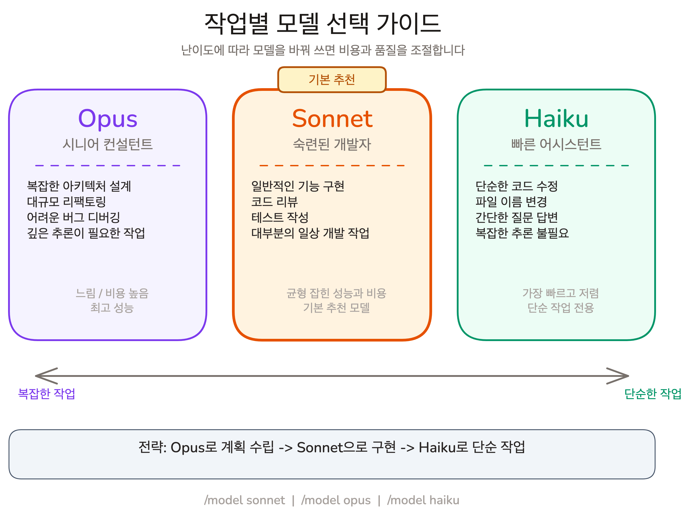

# 설치와 첫 실행

## Overview

Claude Code가 Terminal-native Agentic 도구라는 개념을 이해했습니다. 이제 직접 설치하고 실행해볼 차례입니다. 모델 선택을 모르면 맞지 않는 모델을 쓰게 되므로, 설치부터 인증·요금제·모델 선택까지 첫 실행에 필요한 모든 것을 다룹니다.

### 학습 목표

- Claude Code를 설치하고 정상 동작을 확인합니다
- Team 요금제의 특성과 사용량 제한을 이해합니다
- Opus, Sonnet, Haiku 세 모델의 특성을 이해하고, 작업에 따라 모델을 선택합니다

### 시작하기 전 확인사항

- VS Code 설치 (https://code.visualstudio.com)
- 터미널 (macOS Terminal, Windows PowerShell, Linux Terminal)
- 지원 OS: macOS 13.0+, Ubuntu 20.04+, Windows 10 1809+
- Anthropic 계정 (Team 요금제 초대 완료, [[prerequisites|사전 준비사항]] 참조)

## Claude Code 사용 방식 선택

Claude Code는 **Terminal CLI**와 **VS Code Extension** 두 가지 방식으로 사용할 수 있습니다. 둘 다 같은 기능을 제공하므로, 편한 방식을 선택하면 됩니다.

- **Terminal CLI**: VS Code 내장 터미널이나 시스템 터미널에서 `claude` 명령으로 실행합니다
- **VS Code Extension**: VS Code 마켓플레이스에서 "Claude Code"를 검색하여 설치합니다. 사이드바에서 바로 사용할 수 있습니다

이 강의의 예시는 Terminal CLI 기준으로 작성되어 있지만, Extension에서도 동일하게 동작합니다.

### VS Code 터미널 열기

Terminal CLI를 사용하려면 VS Code에서 통합 터미널을 엽니다.

- **macOS**: `` Ctrl+` `` 또는 메뉴 Terminal > New Terminal
- **Windows**: `` Ctrl+` `` 또는 메뉴 Terminal > New Terminal

## Claude Code 설치하기

Chapter 01에서 Agentic 코딩의 개념과 Claude Code의 핵심 특성을 배웠습니다. 이제 직접 설치하고 실행해볼 차례입니다.

### Step 1: 설치 명령어 실행

VS Code 터미널에서 운영체제에 맞는 설치 명령어를 입력합니다.

**macOS / Linux / WSL:**

```shell
curl -fsSL https://claude.ai/install.sh | bash
```

**Windows PowerShell:**

```shell
irm https://claude.ai/install.ps1 | iex
```

패키지 매니저를 사용할 수도 있습니다.

```shell
# macOS/Linux - Homebrew
brew install --cask claude-code

# Windows - WinGet
winget install Anthropic.ClaudeCode
```

설치가 완료되면 버전을 확인합니다.

```shell
claude --version
```

### Step 2: 인증 설정

Claude Code를 처음 실행하면 인증이 필요합니다. 터미널을 열고 `claude` 명령을 실행합니다.

```shell
claude
```

브라우저가 열리면 Anthropic 계정으로 로그인합니다. 이 과정은 처음 한 번만 필요합니다.

사전 준비에서 등록한 **Claude Team** 계정으로 로그인합니다. 별도 설정 없이 로그인만 하면 됩니다.

### Step 3: 설치 확인

Claude Code 세션 안에서 `/status`로 현재 모델과 계정 정보를 확인합니다.

```
/status
```

이 화면이 정상적으로 나타나면 설치가 완료된 것입니다.

## 비용 구조와 요금제

이 강의에서는 **Claude Team 요금제**를 사용합니다. 회사에서 제공하는 Team 계정으로 별도 비용 부담 없이 실습할 수 있습니다.

### Team 요금제

Team은 조직 단위로 사용하는 요금제입니다. 관리자가 멤버를 초대하고, 멤버별 사용량을 관리합니다.

- claude.ai와 Claude Code를 모두 사용할 수 있습니다
- 사용량 제한(rate limit)이 있으며, 한도 초과 시 일시적으로 대기합니다
- 개인 구독(Pro, Max)과 달리 개인 비용이 발생하지 않습니다

> [!warning] 사용량 제한에 주의하세요
> Team 요금제에도 사용량 제한이 있습니다. 병렬 실행은 토큰을 빠르게 소모하므로, 실습 중 한도에 도달하면 잠시 대기해야 합니다. 불필요한 반복 실행을 줄이는 것이 좋습니다.

### /status로 사용량 확인하기

Claude Code 세션 안에서 `/status` 명령으로 현재 구독 상태와 남은 사용량을 확인할 수 있습니다. 남은 한도를 확인하는 습관을 들이면 좋습니다.

### 개인 구독 (Pro)

대부분의 수강생이 **Pro 요금제**를 사용하고 있습니다. Pro 요금제에서는 **Opus + Plan Mode** 조합을 권장합니다. Opus는 가장 강력한 모델이고, Plan Mode는 코드를 바로 작성하지 않고 계획을 먼저 세우는 모드입니다. 이 조합을 사용하면 복잡한 작업에서도 높은 품질의 결과를 얻을 수 있습니다.

```shell
claude --model opus
```

세션이 시작되면 `Shift+Tab`으로 Plan Mode를 활성화합니다. Plan Mode의 사용법은 Chapter 04에서 자세히 배웁니다.

## 작업별 모델 선택 가이드



Claude Code에서는 작업에 따라 세 가지 모델을 선택할 수 있습니다. 모든 작업에 가장 비싼 모델을 쓸 필요는 없습니다. 작업의 난이도에 따라 모델을 바꿔 쓰면 비용과 품질을 모두 조절할 수 있습니다.

### Opus: 최고 성능

**Opus**는 가장 강력한 모델입니다. 복잡한 아키텍처 설계, 대규모 리팩토링, 여러 파일에 걸친 어려운 버그 디버깅처럼 깊은 추론이 필요한 작업에 적합합니다. 처리 속도가 느리고 비용이 높으므로, 단순한 작업에는 적합하지 않습니다.

### Sonnet: 균형

**Sonnet**은 성능과 비용의 균형이 잡힌 모델입니다. 일반적인 기능 구현, 코드 리뷰, 테스트 작성 등 대부분의 일상 개발 작업에 적합합니다. 기본 모델로 사용하기 가장 무난한 선택입니다.

### Haiku: 빠르고 저렴

**Haiku**는 가장 빠르고 저렴한 모델입니다. 단순한 코드 수정, 파일 이름 변경, 간단한 질문처럼 복잡한 추론이 필요 없는 작업에 적합합니다. 응답 속도가 매우 빠르지만, 복잡한 작업에서는 품질이 떨어집니다.

| | Opus | Sonnet | Haiku |
|---|---|---|---|
| 강점 | 복잡한 추론, 장문 코드 | 일반 개발 작업 전반 | 빠른 응답, 단순 작업 |
| 약점 | 느림, 비용 높음 | 극도로 복잡한 작업 | 복잡한 추론 부족 |
| 적합한 작업 | 아키텍처 설계, 대규모 리팩토링 | 기능 구현, 테스트 작성, 코드 리뷰 | 간단한 수정, 빠른 질문 |
| 비유 | 시니어 컨설턴트 | 숙련된 개발자 | 빠른 어시스턴트 |

### 모델 전환 방법

Claude Code 세션 안에서 `/model` 명령으로 모델을 전환합니다.

```
/model sonnet
/model opus
/model haiku
```

시작할 때 모델을 지정할 수도 있습니다.

```shell
claude --model opus
```

**Opus로 시작**해서 문제를 정확히 파악하고 계획을 세운 뒤, 구현 단계에서 Sonnet으로 전환하는 것이 좋은 전략입니다. 단순한 작업에는 Haiku를 사용합니다.

## FAQ

- **Q: 사용량 제한에 걸리면 어떻게 되나요?**
  - A: 일시적으로 대기 상태가 됩니다. 일정 시간이 지나면 다시 사용할 수 있습니다. 제한에 자주 걸린다면 작업 방식을 점검해 볼 필요가 있습니다. Chapter 03에서 배울 Context 관리와 Task Sizing이 사용량을 줄이는 데 도움이 됩니다

- **Q: 모델을 대화 중간에 바꿀 수 있나요?**
  - A: 네. `/model sonnet`처럼 세션 안에서 언제든 변경할 수 있습니다. 이전 대화 맥락은 유지됩니다. 복잡한 설계는 Opus로 시작하고, 이후 구현은 Sonnet으로 전환하는 식의 활용이 가능합니다

- **Q: Terminal CLI와 VS Code Extension 중 어떤 걸 써야 하나요?**
  - A: 둘 다 같은 기능을 제공합니다. 터미널에 익숙하면 CLI가 빠르고, GUI를 선호하면 Extension이 편합니다. 둘 다 설치해두고 상황에 맞게 쓰는 것도 좋습니다

## 다음 단계

Claude Code가 설치되었습니다. 하지만 도구를 설치한 것만으로는 충분하지 않습니다. 다음 레슨에서는 Claude Code의 기본 인터페이스를 익힙니다. 세션을 관리하고, 단축키를 사용하고, 권한을 다루고, 실수를 되돌리는 방법을 배웁니다.

- 세션 관리: resume, continue, exit, clear
- 입력 단축키: !, @, /
- 권한 관리와 되돌리기 (Rewind/Checkpoint)

다음 레슨 보기: [[lesson-02-basic-interface]]
