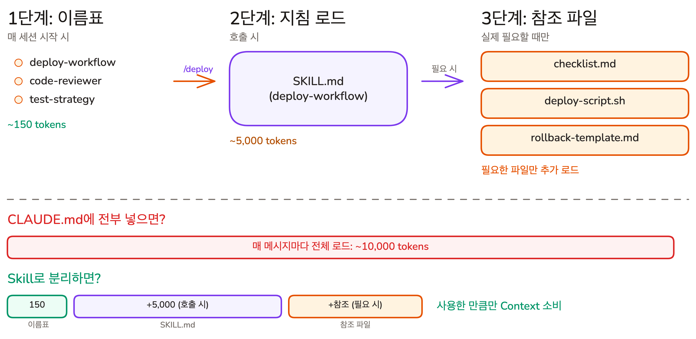

# 필요할 때만 로드하기 | Skills

## Overview

이전 레슨에서 Custom Command로 반복 프롬프트를 제거했습니다. 그런데 프로젝트가 커지면 지침도 함께 늘어나고, 지침이 많아질수록 각 지침의 준수율이 떨어지는 **지침의 저주**가 현실이 됩니다. 이번 레슨에서는 전문 지침을 별도 파일로 분리하고 해당 작업을 할 때만 로드하는 **Skill**로 이 딜레마를 해결하는 방법을 배웁니다.

### 학습 목표

- Skill이 Context를 절약하는 원리(Progressive Disclosure)를 설명할 수 있습니다
- Skill의 두 가지 유형(능력 보강, 절차 기록)을 구분할 수 있습니다
- Custom Command와 Skill의 차이점을 구분할 수 있습니다

## 지침의 저주, 그리고 해결책

**지침의 저주** -- CLAUDE.md에 지침이 많아질수록 각 지침의 준수율이 떨어지는 현상입니다. AI의 주의력 총량은 고정되어 있어서, 지침이 늘어나면 개별 지침에 할당되는 주의 가중치가 분산됩니다.

그런데 프로젝트가 커지면 배포 절차, 코드 리뷰 규칙, 테스트 전략처럼 필요한 지침도 늘어납니다. "규칙을 더 넣어야 하는데, 넣을수록 안 지킨다"는 딜레마가 생깁니다.

**Skill(스킬)**은 이 딜레마를 해결합니다. 전문 지침을 별도 파일로 분리하고, 해당 작업을 할 때만 로드하는 구조입니다. CLAUDE.md에는 핵심 규칙만 남기고, 나머지는 필요할 때 꺼내 보는 레시피처럼 관리할 수 있습니다.

#### 왜 CLAUDE.md에 전부 넣으면 안 되는가

CLAUDE.md는 **매 메시지마다** 전체 내용이 로드됩니다. 500줄짜리 CLAUDE.md를 작성하면, 단순한 변수명 수정 요청에도 배포 절차, 데이터베이스 마이그레이션 규칙, 코드 리뷰 체크리스트가 함께 로드됩니다.

| CLAUDE.md 크기 | 매 요청마다 소비 | 100번 대화 시 |
|----------------|-----------------|--------------|
| 200줄 (핵심만) | ~2,000 토큰 | 200,000 토큰 |
| 500줄 (전부 포함) | ~5,000 토큰 | 500,000 토큰 |
| 1,000줄 (과도) | ~10,000 토큰 | 1,000,000 토큰 |

토큰 낭비보다 더 심각한 문제는 **품질 저하**입니다. 지침이 많아질수록 AI의 주의력이 분산되어, 정작 지금 필요한 규칙을 놓치기 쉬워집니다.

버그 수정을 요청했는데 AI가 배포 절차에 주의력을 빼앗기는 상황이 발생합니다.

## Skill이란: 호출할 때만 불러오는 전문 지침

Skill은 `.claude/skills/` 폴더에 저장하는 전문 지침 묶음입니다. 핵심 차이는 **로드 시점**에 있습니다. CLAUDE.md가 매번 전체를 읽는 교과서라면, Skill은 필요할 때만 꺼내 보는 매뉴얼입니다.

## Skill의 두 가지 유형

Skill은 담고 있는 내용에 따라 두 가지로 나뉩니다.

**능력 보강 스킬** -- Claude가 혼자서는 잘 못 하는 작업을 가능하게 하는 Skill입니다. 요리를 전혀 못 하는 사람에게 주는 레시피와 같습니다. 레시피 없이는 요리 자체를 할 수 없습니다.

예를 들어 Excalidraw 다이어그램을 만드는 Skill이 있습니다. Claude는 기본적으로 Excalidraw JSON의 좌표 계산과 요소 배치를 일관성 있게 하지 못합니다. Skill이 정확한 레이아웃을 만드는 기법과 패턴을 알려줍니다.

**절차 기록 스킬** -- Claude가 각 단계를 이미 할 수 있지만, 우리 팀의 방식을 정해놓은 Skill입니다. 실력 좋은 요리사에게 주는 우리 식당의 표준 조리법과 같습니다. 요리사가 요리를 못 하는 게 아니라, **우리 식당만의 순서와 규칙**을 따라야 하기 때문입니다.

앞서 예로 든 커밋 Skill이 이 유형입니다. Claude는 `git commit`을 할 수 있지만, "Conventional Commit 형식으로, scope를 포함해서, 영어로" 하는 것은 우리 팀의 규칙입니다.

| | 능력 보강 스킬 | 절차 기록 스킬 |
|---|---|---|
| **핵심 질문** | Claude가 혼자 할 수 있는가? | 우리 방식대로 하는가? |
| **비유** | 요리 못 하는 사람의 레시피 | 우리 식당의 조리법 |
| **수명** | 모델이 발전하면 불필요해질 수 있음 | 팀 프로세스가 바뀌지 않는 한 유효 |

이 구분은 Skill을 테스트할 때 중요해집니다. 능력 보강 스킬은 "아직 이 Skill이 필요한가?"를 확인하고, 절차 기록 스킬은 "우리 방식대로 하고 있는가?"를 확인합니다. Lesson 05에서 Skill을 검증하는 방법을 배울 때 다시 다룹니다.

## Progressive Disclosure: 3단계 로딩



Skill은 **Progressive Disclosure(점진적 공개)** 패턴으로 동작합니다. 정보를 한 번에 전부 주지 않고, 필요한 만큼만 단계적으로 공개하는 방식입니다.

왜 처음부터 전체 지침을 주지 않을까요? 대부분의 세션에서는 등록된 Skill 중 1~2개만 사용합니다. 10개의 Skill 본문을 매번 전부 로드하면, 사용하지 않는 8개의 지침이 Context를 낭비합니다. 3단계 구조는 **실제로 사용한 만큼만 비용을 지불**하도록 설계된 것입니다.

**1단계 -- 이름표만 보여주기 (매 대화)**

세션이 시작되면 Claude는 각 Skill의 이름과 설명만 로드합니다. Skill 하나당 약 30~50 토큰입니다.

```plain text
# Claude가 세션 시작 시 보는 Skill 목록:
- deploy-workflow: Production 배포 절차와 체크리스트
- code-reviewer: PR 코드 리뷰 가이드라인
- test-strategy: 테스트 작성 규칙과 커버리지 기준
```

Skill이 10개 있어도 300~500 토큰이면 됩니다. CLAUDE.md에 전부 넣었을 때의 수만 토큰과 비교하면 극적인 차이입니다.

**2단계 -- 지침 로드 (호출 시)**

사용자가 `/deploy-workflow`를 호출하거나, Claude가 배포 관련 요청을 감지하면 해당 Skill의 `SKILL.md` 본문을 읽습니다. 보통 5,000 토큰 이내입니다.

**3단계 -- 참조 파일 로드 (필요 시)**

Skill 폴더에 포함된 참조 파일, 템플릿, 스크립트는 실제로 필요할 때만 추가로 읽습니다.

**이 구조 덕분에 Skill에 아무리 많은 참조 자료를 번들해도, 사용하기 전까지는 Context를 소비하지 않습니다.**

## Command vs Skill: 무엇이 다른가?

Custom Command와 Skill은 모두 `/`로 호출할 수 있습니다. Custom Command는 `.claude/commands/`에 마크다운 파일 하나로 저장하는 단순 프롬프트 단축 도구입니다. 차이는 **누가 호출하느냐**와 **구조의 복잡도**에 있습니다.

| | Custom Command | Skill |
|---|---|---|
| **호출 주체** | 사용자만 (`/command-name`) | 사용자 또는 Claude가 자동 판단 |
| **구조** | 마크다운 파일 1개 | 폴더 (SKILL.md + 참조 파일들) |
| **Context 로딩** | 호출 시 전체 로드 | Progressive Disclosure (3단계) |
| **용도** | 단순 프롬프트 단축 | 다단계 워크플로우, 전문 지침 |

#### 언제 Command를 쓰고 언제 Skill을 써야 하는가?

- **Command**: 한 번에 끝나는 단순 작업. "이 형식으로 커밋 메시지 작성해줘"
- **Skill**: 여러 단계가 있는 반복 워크플로우. "이 절차에 따라 배포해줘"

> [!note] Command에서 Skill로의 전환
> Claude Code 초기에는 Custom Command가 유일한 프롬프트 재사용 방법이었습니다. 이후 Skill이 도입되면서 Command의 기능을 포함하고 확장했습니다. `.claude/commands/`는 하위 호환을 위해 여전히 동작하지만, 새로 만드는 워크플로우는 Skill로 작성하는 것을 권장합니다.

## 핵심 포인트 정리

1. **Progressive Disclosure**: Skill은 이름(30토큰) -> 지침(5,000토큰) -> 참조 파일 순서로 필요한 만큼만 로드합니다. CLAUDE.md에 전부 넣는 것 대비 Context 소비를 크게 줄입니다
2. **Command vs Skill**: Command는 사용자가 수동 호출하는 단순 프롬프트이고, Skill은 Claude가 자동 판단하여 로드할 수 있는 다단계 워크플로우입니다
3. **분리 기준**: CLAUDE.md에는 매번 필요한 핵심 규칙만 남기고, 특정 작업에서만 필요한 전문 지침은 Skill로 분리합니다

## 다음 단계

Skill의 원리를 이해했으니, 다음 레슨에서 직접 Skill을 만들고 커뮤니티 Skill을 설치해 봅니다.

다음 레슨 보기: [[lesson-04-skills-in-practice]]
