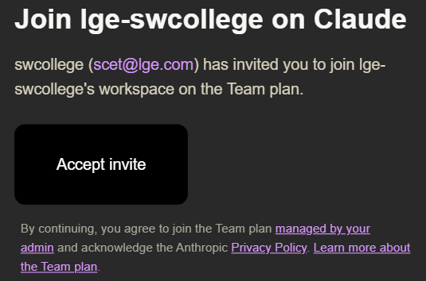

# 사전 준비사항

강의 첫날 전까지 아래 항목을 모두 준비해 주세요.

| # | 항목 | 확인 방법 |
|---|------|-----------|
| 1 | Anthropic 계정 (Team 요금제) | [claude.ai](https://claude.ai) 로그인 |
| 2 | VS Code | 실행 확인 |
| 3 | Claude Code | `claude --version` |
| 4 | Git | `git --version` |
| 5 | Node.js (npm 포함) | `node --version` |
| 6 | Bun | `bun --version` |
| 7 | GitHub CLI | `gh --version` |
| 8 | Discord | 실행 확인 |

각 항목의 설치 방법을 아래에서 안내합니다.

---

## 1. Anthropic 계정

Claude Code를 사용하려면 Anthropic 계정과 유료 구독이 필요합니다.
본 교육과정은 실습을 원활하게 진행할 수 있도록 **Claude Team 요금제**를 제공합니다.

### 계정 생성

1. 회사 이메일 계정에 접속하여 Anthropic으로부터 발송된 팀 플랜 초대 메일을 확인합니다



2. 해당 이메일의 **Accept invite** 링크를 사외에서 열어 Claude 회원가입 및 Team 등록을 완료합니다

> [!warning] 초대 메일을 수신한 LGE 도메인으로만 등록 가능합니다.

---

## 2. VS Code

VS Code는 이 강의에서 사용하는 코드 편집기입니다. Claude Code를 VS Code 내장 터미널에서 실행합니다.

### 설치

[code.visualstudio.com](https://code.visualstudio.com)에서 운영체제에 맞는 버전을 다운로드하고 설치합니다.

---

## 3. Claude Code

Claude Code는 터미널에서 실행되는 AI 코딩 도구입니다. 이 강의의 핵심 도구이므로 반드시 설치해 주세요.

공식 문서: [code.claude.com/docs/ko/overview](https://code.claude.com/docs/ko/overview)

### macOS / Linux

터미널을 열고 다음 명령어를 실행합니다.

```shell
curl -fsSL https://claude.ai/install.sh | bash
```

Homebrew를 사용한다면 이 방법도 가능합니다.

```shell
brew install --cask claude-code
```

### Windows

VS Code를 열고 터미널(`Ctrl+``)에서 실행합니다. 터미널이 **PowerShell**인지 확인하세요.

```powershell
irm https://claude.ai/install.ps1 | iex
```

### 설치 확인

터미널에서 다음 명령어를 실행합니다.

```shell
claude --version
```

아래와 같이 버전 번호가 표시되면 정상입니다.

```
1.0.33 (Claude Code)
```

> [!note] 버전 번호는 다를 수 있습니다
> 위 숫자와 정확히 같을 필요는 없습니다. 숫자가 표시되면 설치가 완료된 것입니다.

> [!tip] VS Code 확장 프로그램
> 터미널 설치 외에 VS Code 확장 프로그램으로도 Claude Code를 사용할 수 있습니다. VS Code 마켓플레이스에서 "Claude Code"를 검색하여 설치하면 됩니다.

설치 후 처음 `claude`를 실행하면 브라우저가 열리며 Anthropic 계정 인증을 요청합니다. 1번에서 만든 계정으로 로그인하면 됩니다. 인증은 처음 한 번만 필요합니다.

설치 상태를 종합 점검하려면 다음 명령어를 사용합니다.

```shell
claude doctor
```

---

## 4. Git

Git은 코드 버전 관리 도구입니다. 실습 코드를 받아오고, 작업 내용을 저장하는 데 사용합니다.

### macOS

macOS에는 Git이 기본으로 설치되어 있는 경우가 많습니다. 터미널에서 `git --version`을 실행하여 설치 여부를 확인합니다. 설치되어 있지 않으면 Xcode Command Line Tools 설치를 안내하는 팝업이 나타납니다. **Install**을 클릭하면 Git이 자동으로 설치됩니다.

### Windows

[git-scm.com/downloads](https://git-scm.com/downloads)에서 Windows 설치 파일을 다운로드하고 실행합니다. 설치 과정에서 나오는 옵션은 기본값(Next)으로 진행하면 됩니다.

### 설치 확인

터미널에서 다음 명령어를 실행합니다.

```shell
git --version
```

아래와 같이 버전 번호가 표시되면 정상입니다.

```
git version 2.47.1
```

> [!note] 설치 직후 `git`을 찾을 수 없다면
> 터미널을 닫았다가 다시 열어 보세요. 새 터미널에서 PATH가 갱신됩니다.

---

## 5. Node.js (npm 포함)

Node.js는 JavaScript 런타임이며, 설치하면 패키지 매니저인 npm이 함께 설치됩니다. 일부 실습에서 npm을 사용합니다.

공식 문서: [nodejs.org](https://nodejs.org)

### macOS

Homebrew로 설치합니다.

```shell
brew install node
```

### Windows

[nodejs.org](https://nodejs.org)에서 LTS 버전을 다운로드하고 설치합니다. 설치 과정에서 나오는 옵션은 기본값(Next)으로 진행하면 됩니다.

### 설치 확인

터미널에서 다음 명령어를 실행합니다.

```shell
node --version
npm --version
```

아래와 같이 버전 번호가 표시되면 정상입니다.

```
v22.14.0
10.9.2
```

> [!note] 설치 직후 `node`를 찾을 수 없다면
> 터미널을 닫았다가 다시 열어 보세요. 새 터미널에서 PATH가 갱신됩니다.

---

## 6. Bun

Bun은 빠른 JavaScript 런타임이자 패키지 매니저입니다. 이 강의에서 프로젝트 생성과 실행에 사용합니다.

공식 문서: [bun.com/docs/installation](https://bun.com/docs/installation)

### macOS

Homebrew로 설치합니다.

```shell
brew install oven-sh/bun/bun
```

### Windows

VS Code를 열고 터미널(`Ctrl+``)에서 실행합니다. 터미널이 **PowerShell**인지 확인하세요. 터미널 탭에 "powershell" 또는 "pwsh"가 표시되어야 합니다. 다른 셸(cmd 등)이 표시된다면 터미널 우측 상단의 `+` 옆 드롭다운에서 PowerShell을 선택합니다.

```powershell
irm bun.sh/install.ps1 | iex
```

설치가 완료되면 **VS Code 터미널을 닫았다가 다시 열어야** `bun` 명령어를 인식합니다.

> [!warning] Windows에서 설치가 안 되는 경우
>
> **"스크립트 실행이 차단되었습니다" 오류**
>
> PowerShell 보안 정책이 스크립트 실행을 막고 있습니다. 다음 명령어를 먼저 실행한 뒤 설치를 재시도합니다.
>
> ```powershell
> Set-ExecutionPolicy RemoteSigned -Scope CurrentUser
> ```
>
> **설치 후 `bun`을 찾을 수 없는 경우**
>
> PATH에 Bun이 등록되지 않은 것입니다. 다음 명령어로 수동 등록합니다.
>
> ```powershell
> [System.Environment]::SetEnvironmentVariable(
>   "Path",
>   [System.Environment]::GetEnvironmentVariable("Path", "User") + ";$env:USERPROFILE\.bun\bin",
>   [System.EnvironmentVariableTarget]::User
> )
> ```
>
> 실행 후 VS Code 터미널을 닫았다가 다시 열어야 적용됩니다.
>
> **Windows Defender가 차단하는 경우**
>
> Windows 보안 > 바이러스 및 위협 방지 > 보호 기록에서 `bun.exe`를 허용합니다.

### 설치 확인

터미널에서 다음 명령어를 실행합니다.

```shell
bun --version
```

아래와 같이 버전 번호가 표시되면 정상입니다.

```
1.2.5
```

---

## 7. GitHub CLI

GitHub CLI(`gh`)는 터미널에서 Pull Request 생성, 이슈 관리 등 GitHub 작업을 수행하는 도구입니다. Claude Code가 코드를 push한 뒤 PR을 자동으로 생성하려면 `gh`가 필요합니다.

공식 문서: [cli.github.com](https://cli.github.com)

### macOS

```shell
brew install gh
```

### Windows

VS Code를 열고 터미널(`Ctrl+``)에서 실행합니다.

```powershell
winget install --id GitHub.cli
```

### 설치 확인

터미널에서 다음 명령어를 실행합니다.

```shell
gh --version
```

아래와 같이 버전 번호가 표시되면 정상입니다.

```
gh version 2.67.0 (2025-01-13)
```

### GitHub 인증

설치 후 GitHub 계정 인증을 완료합니다.

```shell
gh auth login
```

브라우저가 열리며 GitHub 로그인을 요청합니다. 로그인하면 터미널에서 `gh` 명령어를 사용할 수 있습니다.

---

## 8. Discord

Discord는 강의 중 실시간 질문과 자료 공유에 사용하는 커뮤니케이션 도구입니다.

### 설치

[discord.com/download](https://discord.com/download)에서 운영체제에 맞는 버전을 다운로드하고 설치합니다.

---

## 설치 확인 체크리스트

모든 설치가 끝났다면, VS Code 터미널에서 아래 명령어를 한 줄씩 실행하여 최종 확인합니다.

```shell
claude --version
git --version
node --version
bun --version
gh --version
```

다섯 명령어 모두 버전 번호가 출력되면 준비 완료입니다.

```
1.0.33 (Claude Code)
git version 2.47.1
v22.14.0
1.2.5
gh version 2.67.0 (2025-01-13)
```
