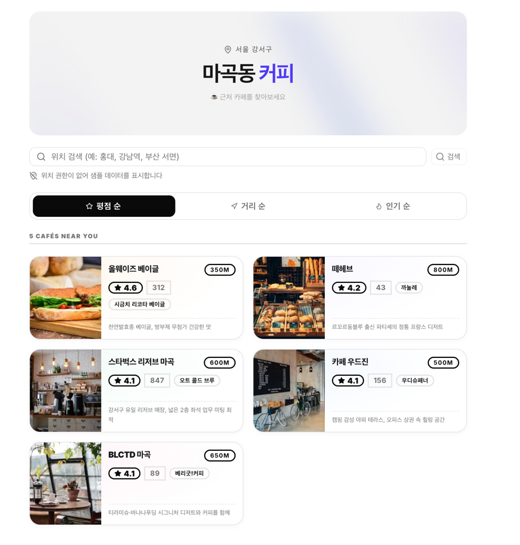
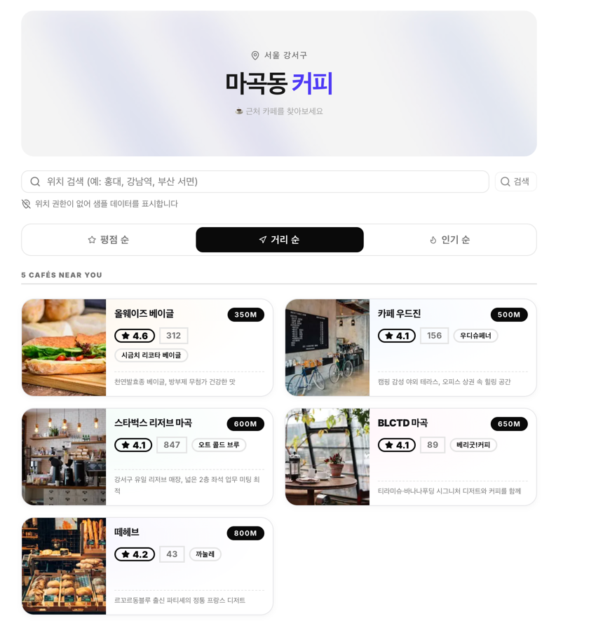
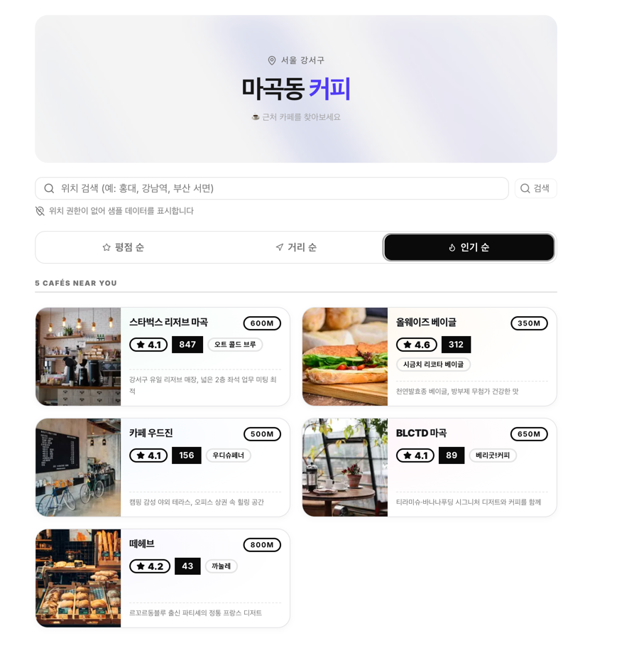

# Daily Dose of Roast

## 서비스 소개

위치 기반 근처 카페 검색 서비스입니다. 지역명으로 검색하면 주변 카페를 평점순, 거리순, 인기순으로 정렬해서 보여줍니다.

## 스크린샷

## 주요 기능

- 위치 검색: 지역명(홍대, 강남역, 부산 서면 등)으로 카페 검색
- 정렬 옵션: 평점순, 거리순, 인기순
- 카페 카드: 사진, 평점, 리뷰 수, 거리, 한줄 설명 표시
- 위치 관련 없는 샘플 데이터 기본 제공
