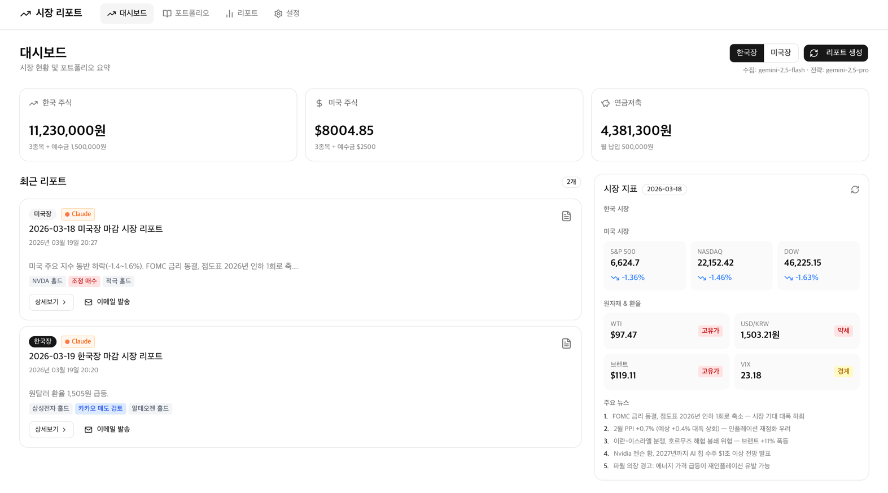
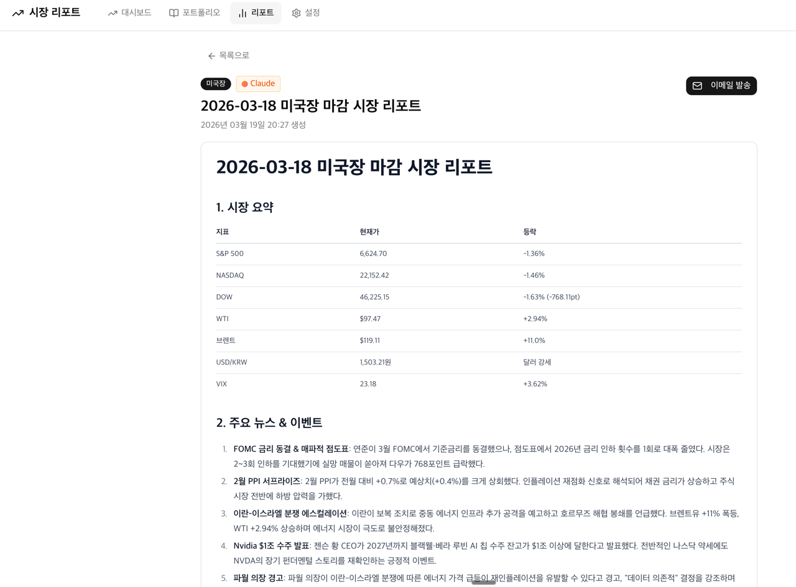
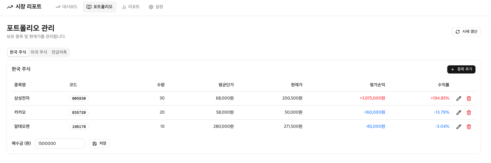

# 시장 리포트

## 서비스 소개

한국/미국 주식 포트폴리오를 관리하고, AI(Claude, Gemini)가 매일 시장 마감 리포트를 자동 생성해주는 투자 대시보드 서비스입니다.

## 스크린샷

## 주요 기능

- 대시보드: 한국 주식, 미국 주식, 연금저축 자산 현황 한눈에 확인
- 시장 지표: S&P 500, NASDAQ, DOW, WTI, USD/KRW, VIX 실시간 표시
- AI 시장 리포트 자동 생성: 한국장/미국장 마감 리포트 (Claude, Gemini 선택 가능)
- 리포트 내용: 시장 요약, 주요 뉴스 및 이벤트, 종목별 분석
- 포트폴리오 관리: 한국 주식/미국 주식/연금저축 탭별 보유 종목, 평균단가, 현재가, 평가손익, 수익률 표시
- 종목 추가/편집/삭제 및 시세 갱신
- 이메일 발송 기능으로 리포트 공유
- 리포트 생성 모델 선택: gemini-2.5-flash(수정), gemini-2.5-pro(전문)
