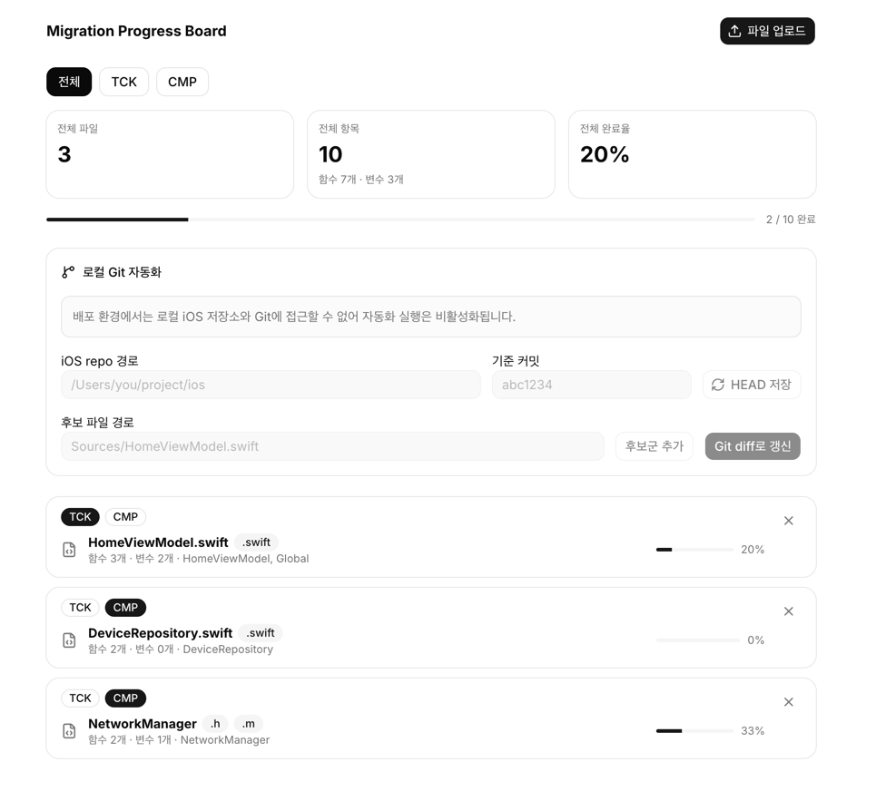
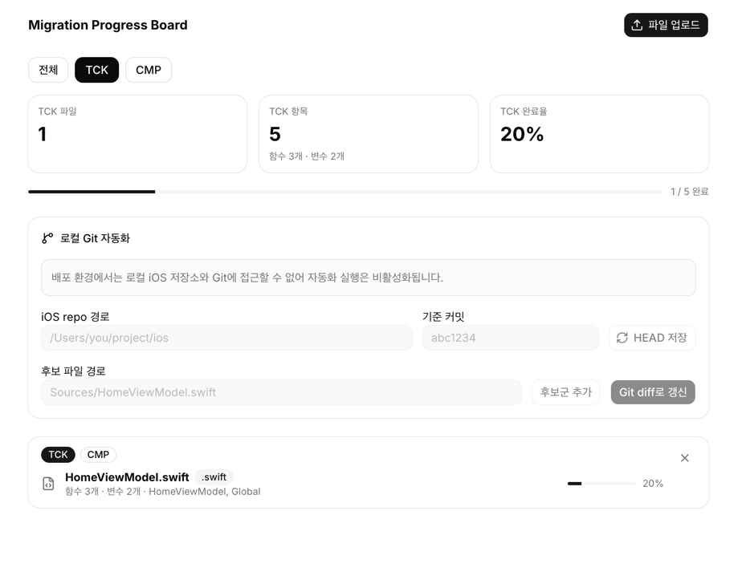
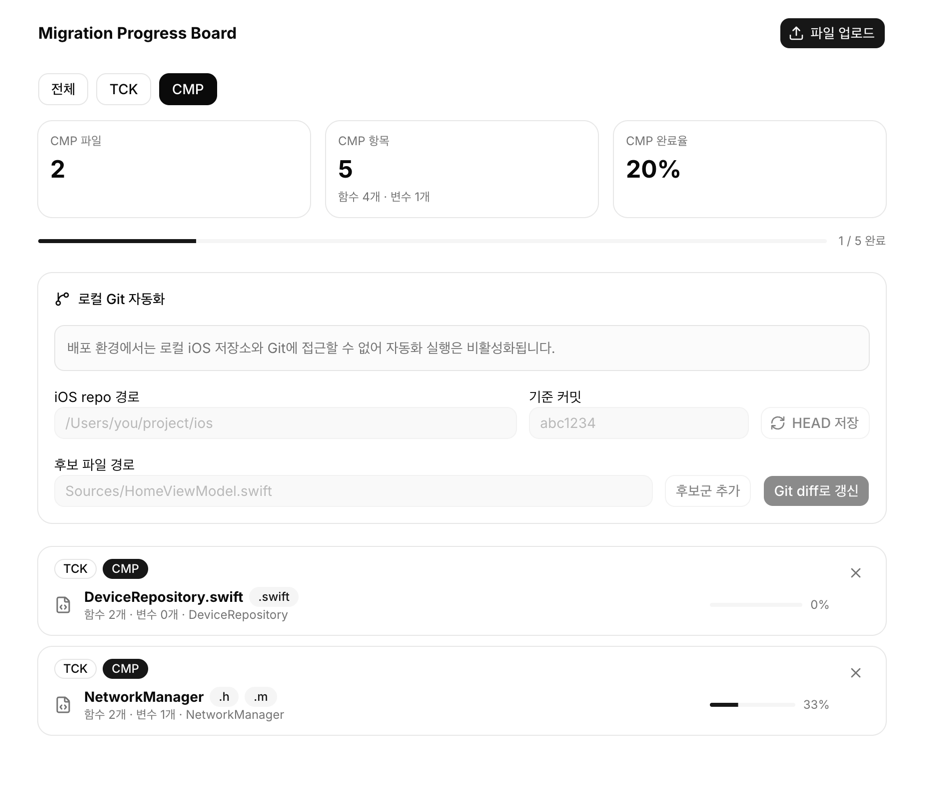

# Migration Progress Board

## 서비스 소개

iOS 프로젝트의 마이그레이션 진행 상황을 시각적으로 추적하는 대시보드입니다. 파일 단위로 함수/변수의 마이그레이션 완료율을 관리하고, 담당자(TCK/CMP)별 필터링과 Git diff 기반 자동 갱신을 지원합니다.

## 스크린샷

## 주요 기능

- 전체/담당자별(TCK, CMP) 필터링으로 진행 현황 확인
- 파일별 마이그레이션 완료율 프로그레스 바 표시
- 파일 단위 항목 수(함수, 변수) 및 소속 클래스 정보 표시
- 로컬 Git 자동화: iOS repo 경로와 기준 커밋 설정 후 Git diff로 후보 파일 자동 갱신
- 후보 파일 수동 추가 기능
- 파일 업로드를 통한 일괄 등록
