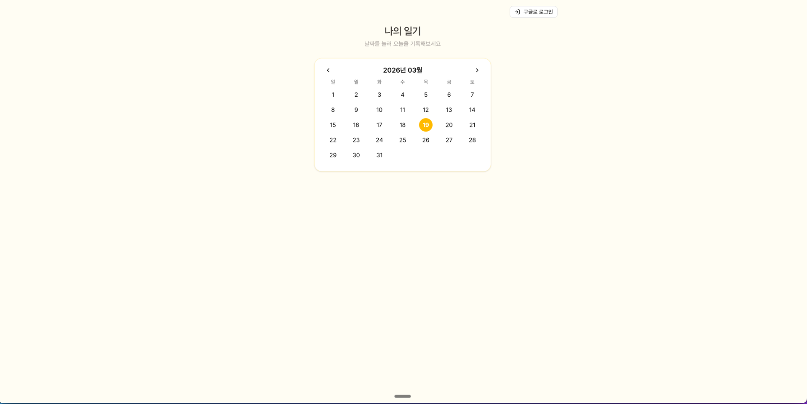
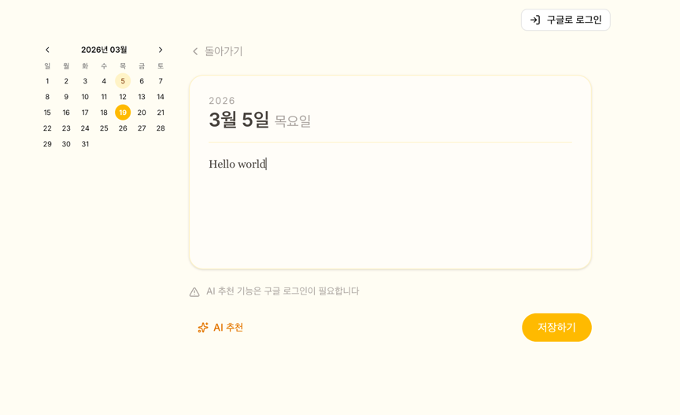

# 나의 일기

## 서비스 소개

구글 캘린더에서 일정을 가져와서, 해당 일정에 맞는 일기 초안을 AI가 자동으로 만들어주는 서비스입니다.

## 스크린샷

## 주요 기능

- 구글 로그인을 통한 캘린더 연동
- 달력에서 날짜를 선택하면 해당 날짜의 일기 작성 화면으로 이동
- AI 추천 버튼으로 캘린더 일정 기반 일기 초안 자동 생성
- 일기 저장 기능
