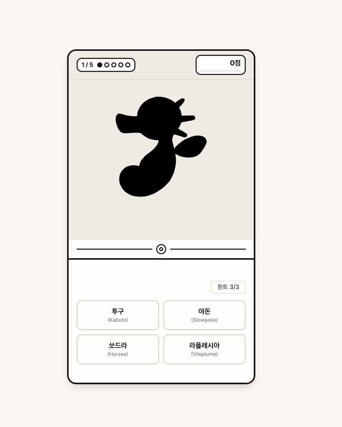
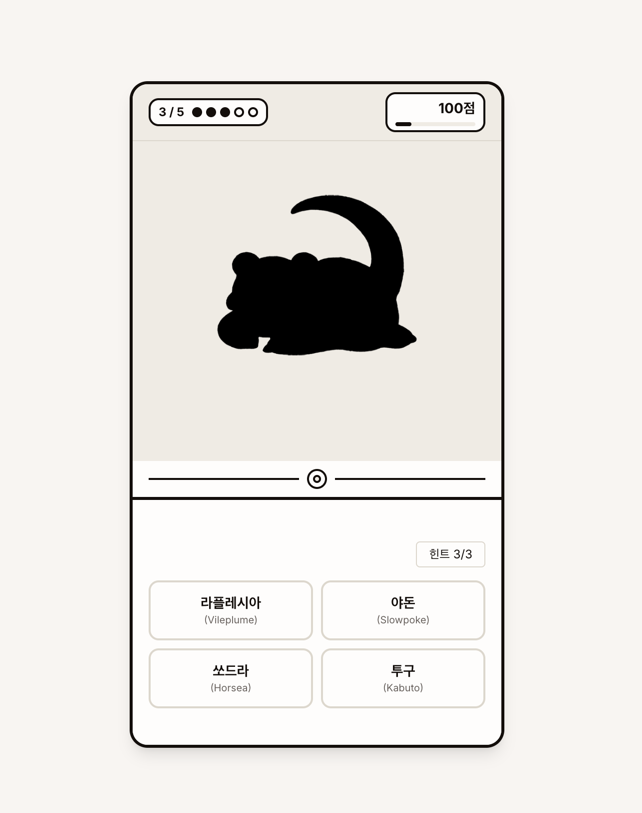
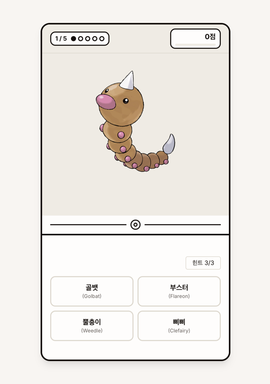
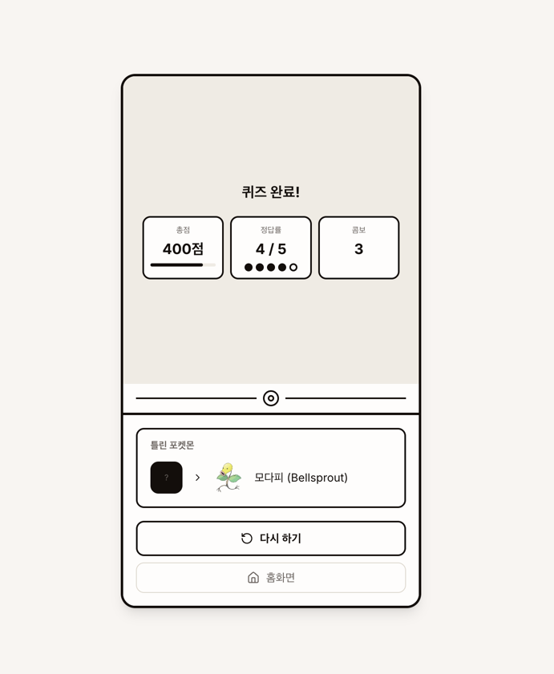

# 포켓몬 마스터 퀴즈

## 서비스 소개

1세대 포켓몬 151종의 실루엣을 보고 이름을 맞추는 4지선다 퀴즈 게임입니다. 5문제 출제, 힌트 3회 제공, 점수와 콤보 시스템으로 재미를 더합니다.

## 스크린샷

## 주요 기능

- 1세대 포켓몬 151종 실루엣 퀴즈
- 5문제 / 4지선다 / 힌트 3회 제공
- 점수 시스템 + 콤보 카운트
- 퀴즈 완료 시 총점, 정답률, 콤보 요약
- 틀린 포켓몬 정답 확인 (실루엣 -> 실제 이미지)
- 한국어/영어 포켓몬 이름 병기
