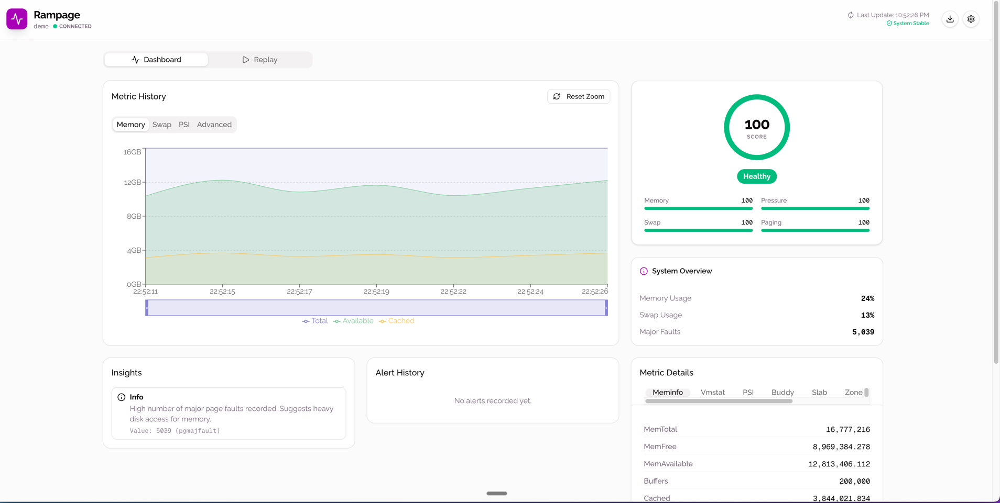
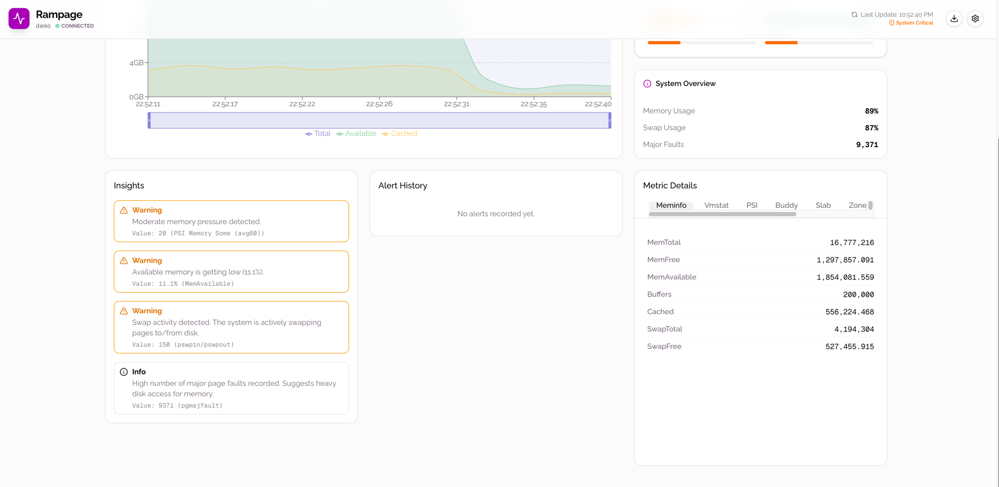
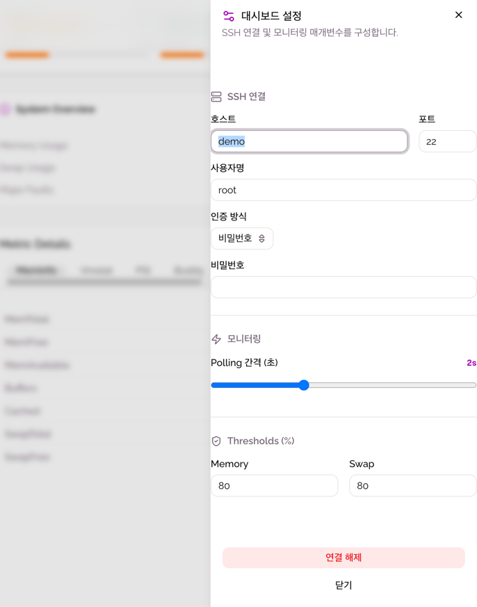

# Rampage

## 서비스 소개

SSH로 서버에 연결하여 메모리 사용량을 실시간으로 모니터링하는 대시보드 서비스입니다. 메모리, Swap, PSI 등 다양한 메트릭을 시각화하고, 임계값 초과 시 경고를 제공합니다.

## 스크린샷

## 주요 기능

- SSH 연결을 통한 원격 서버 모니터링
- 메모리 사용량 실시간 차트 (Memory, Swap, PSI, Advanced)
- 건강 점수 시스템 (100점 만점, Healthy/Warning/Critical 상태 표시)
- System Overview: Memory Usage, Swap Usage, Major Faults 요약
- Metric Details: Meminfo, Vmstat, PSI, Buddy, Slab, Zone 탭별 상세 지표
- Insights: 메모리 압박, 가용 메모리 부족, Swap 활동 등 자동 경고
- Alert History: 알림 이력 관리
- 대시보드 설정: SSH 연결 정보, Polling 간격, Memory/Swap 임계값(Threshold) 설정
- Replay 기능으로 과거 데이터 재생
