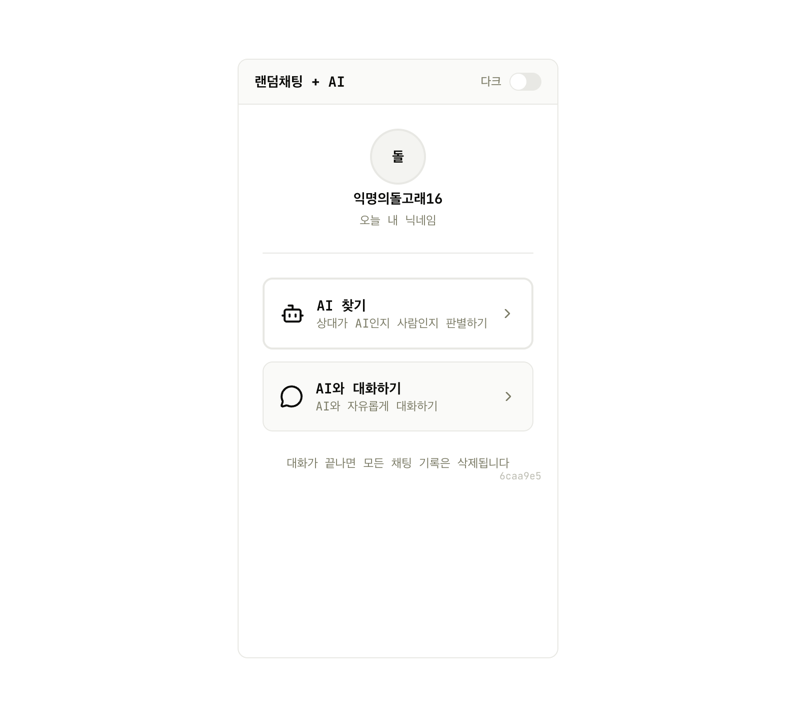
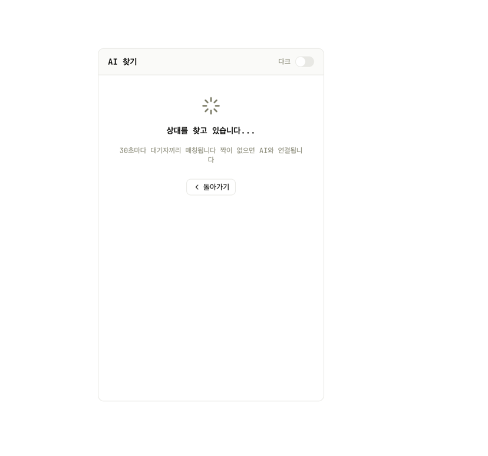
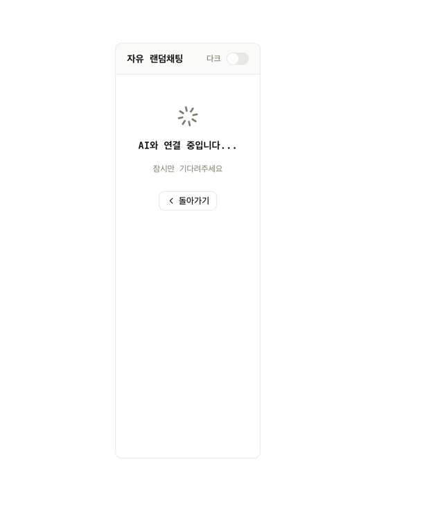

# 랜덤채팅 + AI

## 서비스 소개

익명 랜덤 채팅 서비스에 AI를 결합한 서비스입니다. 랜덤으로 매칭된 상대가 AI인지 사람인지 판별하는 게임 모드와, AI와 자유롭게 대화하는 모드를 제공합니다. 대화가 끝나면 모든 채팅 기록이 삭제됩니다.

## 스크린샷

## 주요 기능

- 익명 닉네임 자동 부여 (예: 익명의돌고래16)
- AI 찾기 모드: 30초마다 대기자끼리 매칭, 짝이 없으면 AI와 연결. 상대가 AI인지 사람인지 판별
- AI와 대화하기 모드: AI와 자유롭게 대화
- 다크 모드 지원
- 대화 종료 시 모든 채팅 기록 자동 삭제
