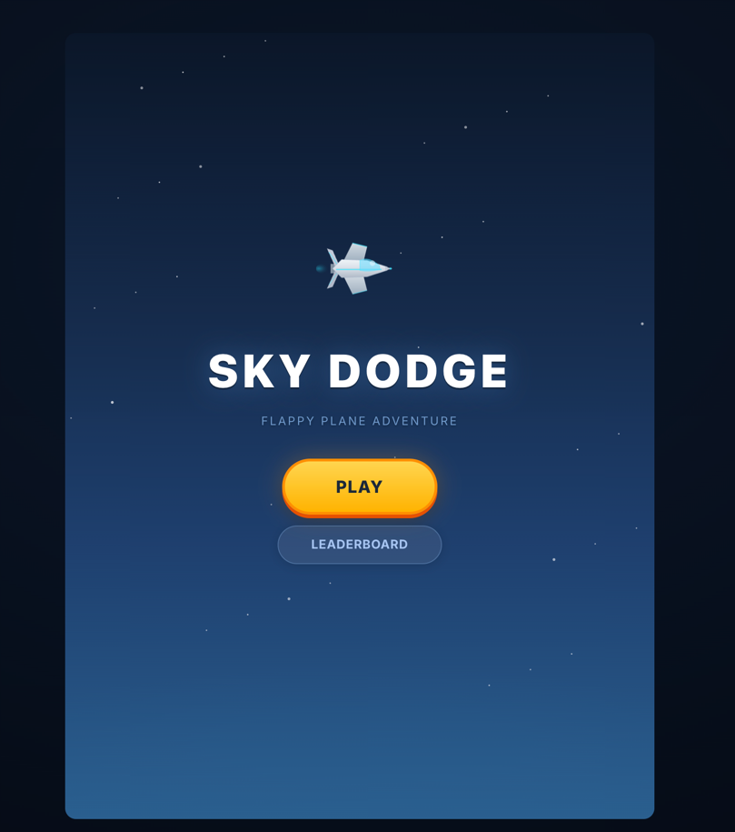
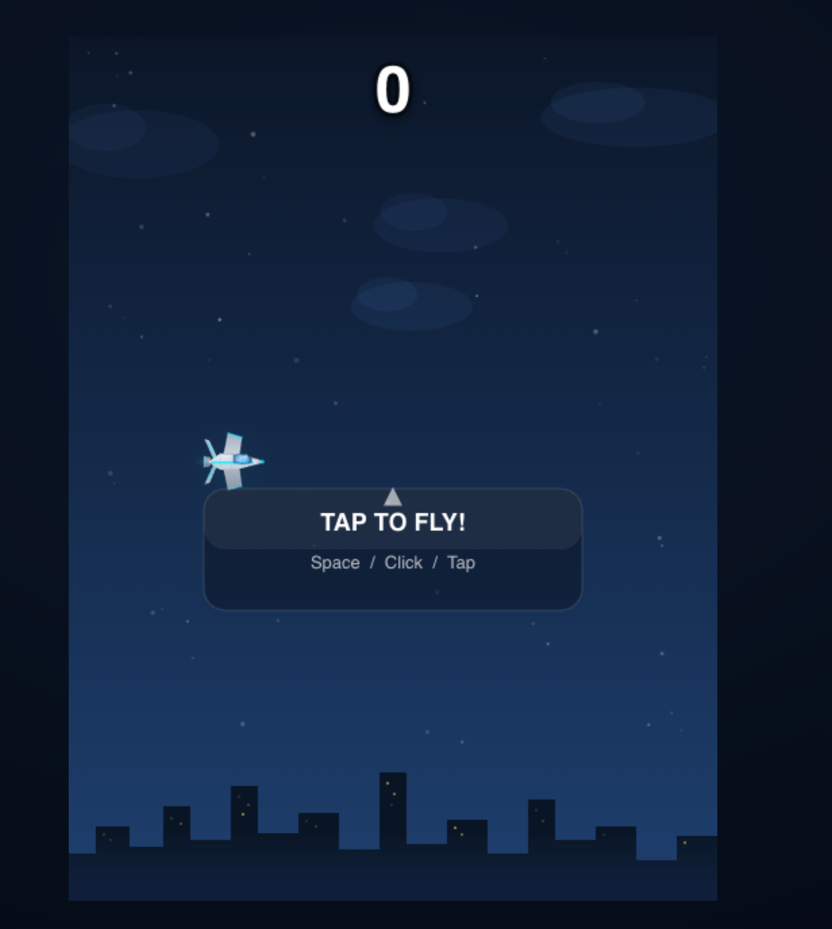
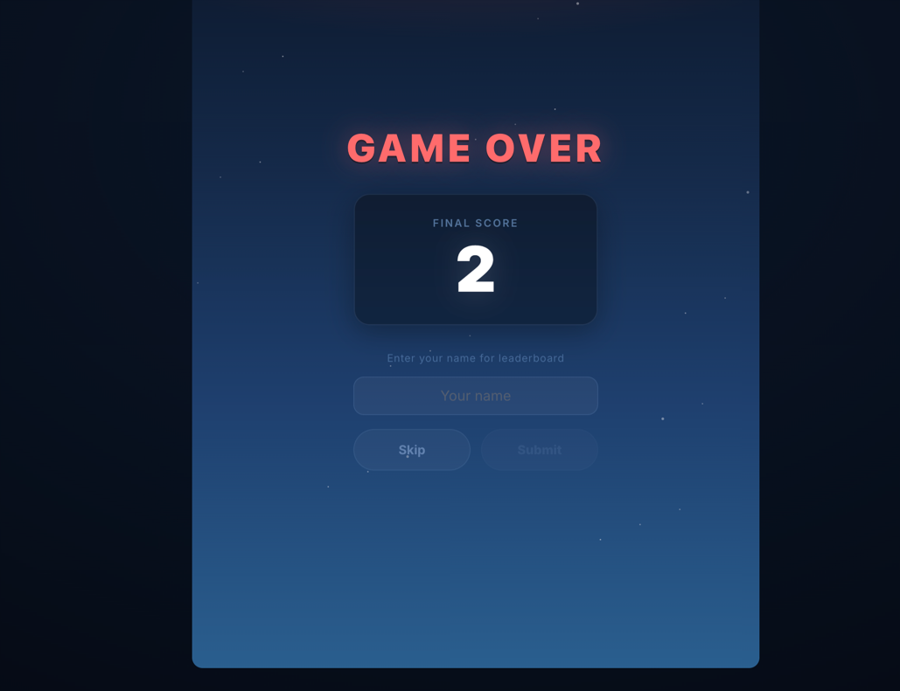

# Sky Dodge

## 서비스 소개

Flappy Bird 스타일의 비행기 장애물 회피 웹 게임입니다. 밤하늘 도시 배경에서 비행기를 조종하며 장애물을 피하고, 리더보드에 점수를 등록해 경쟁할 수 있습니다.

## 스크린샷

## 주요 기능

- Space / Click / Tap으로 비행기 조종
- 장애물(구름) 회피 게임플레이
- 점수 시스템
- Game Over 시 리더보드에 이름 등록
- 리더보드로 점수 랭킹 확인
