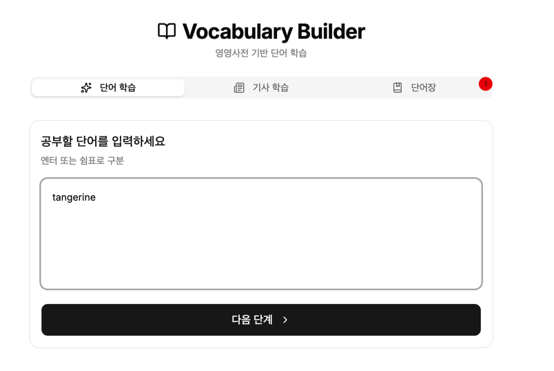
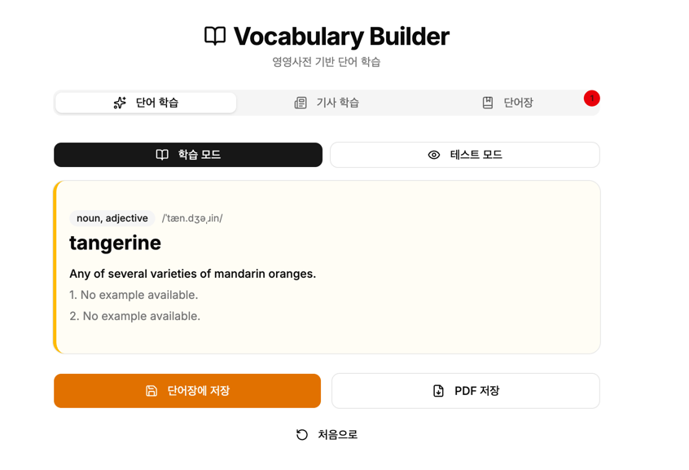
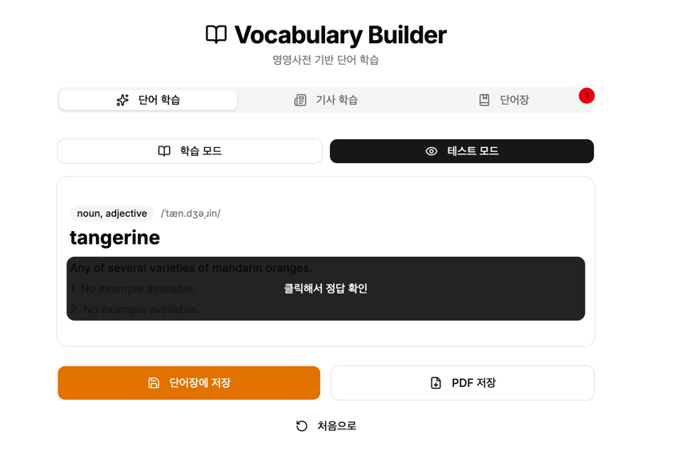
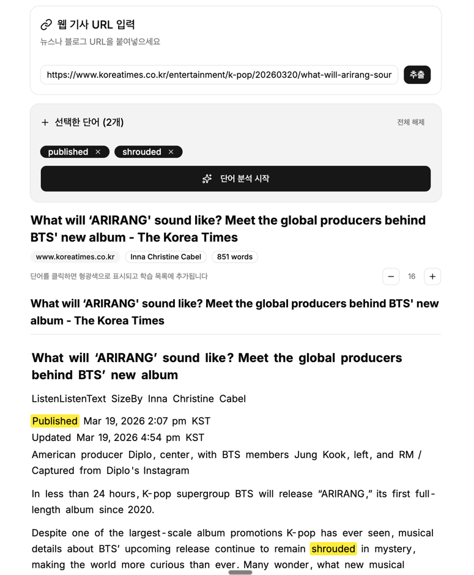
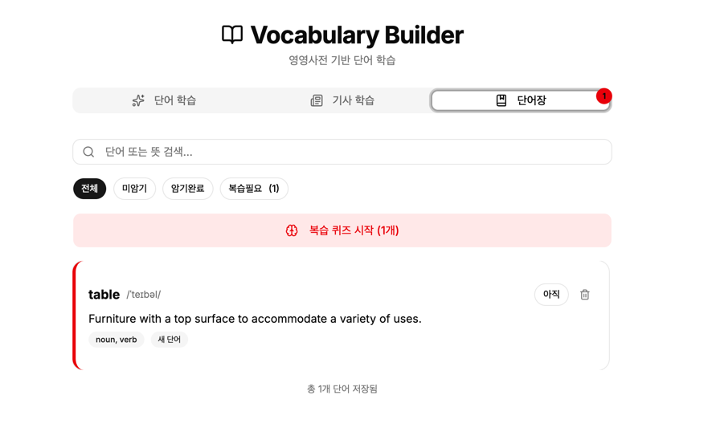

# Vocabulary Builder

## 서비스 소개

영영사전 기반 영어 단어 학습 서비스입니다. 단어를 직접 입력하거나 웹 기사 URL에서 모르는 단어를 추출해 학습하고, 단어장에 저장하여 복습 퀴즈로 암기를 관리합니다.

## 스크린샷

## 주요 기능

- 단어 학습: 단어를 입력하면 영영사전 정의, 발음, 품사, 예문 제공
- 학습 모드 / 테스트 모드 전환: 정의를 보며 학습하거나 가려서 테스트
- 기사 학습: 웹 기사 URL을 입력하면 기사 본문에서 단어를 선택해 학습 목록에 추가
- 단어장: 저장한 단어 관리 (전체/미암기/암기완료/복습필요 필터)
- 복습 퀴즈: 복습이 필요한 단어로 퀴즈 진행
- 단어장 저장 및 PDF 내보내기
